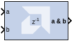
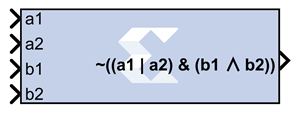

# Expression

The Expression block performs a bitwise logical expression.

## Description

The expression is specified with operators described in the table below.
The number of input ports is inferred from the expression. The input
port labels are identified from the expression, and the block is
subsequently labeled accordingly. For example, the expression:
`~((a1 | a2) & (b1 ^ b2))` results in the following block with 4 input
ports labeled `'a1'`, `'a2'`, `'b1'`, and `'b2'`.

The expression is parsed and an equivalent statement is written in VHDL
(or Verilog). Shown below, in decreasing order of precedence, are the
operators that can be used in the Expression block.

| Operator   | Symbol |
|------------|--------|
| Precedence | ()     |
| NOT        | ~      |
| AND        | &      |
| OR         | \|     |
| XOR        | ^      |

## Parameters

### Basic tab  
Parameters specific to the Basic tab are as follows.

#### Expression  
Bitwise logical expression.

#### Align Binary Point  
Specifies that the block must align binary points automatically. If not
selected, all inputs must have the same binary point position.

Other parameters used by this block are explained in the topic [Common
Options in Block Parameter Dialog
Boxes](../../GEN/common-options/README.md).

<!--
#### Provide enable port
Selecting the Provide Enable Port option activates an optional enable (en) pin on the block. When the enable signal is not asserted the block holds its current state until the enable signal is asserted again or the reset signal is asserted. Reset signal has precedence over the enable signal. The enable signal has to run at a multiple of the block 's sample rate. The signal driving the enable port must be Boolean.
-->

<!--
#### Latency
Many elements in the Xilinx blockset have a latency option. This defines the number of sample periods by which the block's output is delayed. One sample period might correspond to multiple clock cycles in the corresponding FPGA implementation (for example, when the hardware is over-clocked with respect to the Simulink model). Model Composer does not perform extensive pipelining; additional latency is usually implemented as a shift register on the output of the block.
-->

<!--
#### Precision
The fundamental computational mode in the Xilinx blockset is arbitrary precision fixed-point arithmetic. Most blocks give you the option of choosing the precision, for example, the number of bits and binary point position.
-->

<!--
#### Arithmetic type
In the Arithmetic Type field of the Block Parameters dialog box, you can choose unsigned or signed (two's complement) as the data type of the output signal.
-->

<!--
#### Number of bits
Fixed-point numbers are stored in data types characterized by their word size as specified by Number of bits, Binary point, and Arithmetic type parameters. The maximum number of bits supported is 4096.
-->

<!--
#### Binary point
The binary point is the means by which fixed-point numbers are scaled. The Binary point parameter indicates the number of bits to the right of the binary point (for example, the size of the fraction) for the output port. The binary point position must be between zero and the specified number of bits.
-->

--------------
Copyright (C) 2026 Advanced Micro Devices, Inc.
All rights reserved.

SPDX-License-Identifier: MIT
