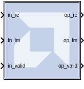
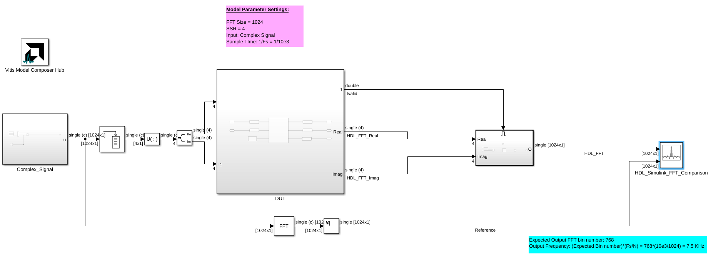
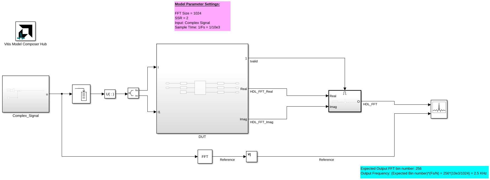

<!-- Library: hdlSSR -->

# Vector FFT Float

The Vector FFT Float block supports the FFT operation for vector 
single-precision floating-point inputs. This block only supports Versal devices.

## Description

The real part of the input data should be given to the in_re port, 
and the imaginary part should be given to the in_im port.

When the in_valid is high, it indicates that the input data is valid. 
When out_valid is high, it indicates that the output data is valid. 
The valid indicator accompanies every set of input and output samples 
(for example, R number of samples). There is no back pressure flow control 
and once an FFT transform starts, R data samples must be input into the 
core every clock for N/R consecutive clocks, where N is the FFT length. 
However, for back-to-back transforms, the valid control input can stay 
high with no gaps.

### Data Type Support

- in_valid and out_valid are of Boolean data type.

## Parameters

#### FFT length (N) 
N is the size of the transformation, and should be powers
of 2 in the range of 2^3 to 2^16. 

#### SSR (R)
R is the super sample rate, the
number of samples processed in parallel every clock. Using a typical
example with N=1024 and SSR=4, the core would compute one 1K FFT every
256 clock cycles, processing 4 input samples/clock. 

The SSR is limited to 2 and 4.

#### Block RAM_THRESHOLD 
Is an implementation parameter with no functional implications. It controls 
the use of distributed RAM vs BRAM when implementing delay lines. It can 
be used to trade utilization numbers between these two types of resources. 
The higher the value, the more distributed RAM will be used instead of 
BRAM. Typical values to try are 258, 514, and 1026.

## Examples

***Click on the images below to open each model.***

<!--
DESCRIPTION:
Model: Vector_FFT_Float_Ex1
Generated: 09-Jan-2026 13:53:14

Vitis Model Composer Configuration:
  Target Device: xcvp1552-vsva2785-1LP-e-S

Vitis Model Composer Blocks:
  - HDL: Constant
  - HDL: Gateway Out
  - HDL: Vector FFT Float
  - HDL: Vector Real Gateway In
  - HDL: Vector Real Gateway Out

Description:
This MATLAB script creates a Vitis Model Composer Simulink model that uses the AI Engine Constant, Gateway Out, Vector FFT Float, Vector Real Gateway In and Vector Real Gateway Out blocks. A 8kHz complex input signal is provided to the block,  and results are compared against a Simulink reference implementation.

-->

<!--
MATLAB CREATION SCRIPT:

% create_Vector_FFT_Float_Ex1_model.m
% Auto-generated script to recreate the Vector_FFT_Float_Ex1 Simulink model
% Generated on: 09-Jan-2026 13:53:14

%% Model Configuration
modelName = 'Vector_FFT_Float_Ex1_recreated';

%% Create New Model
if bdIsLoaded(modelName)
    close_system(modelName, 0);
end

new_system(modelName);
open_system(modelName);
fprintf('Created new model: %s\n', modelName);

%% Add Vitis Model Composer Hub Block
hubBlockPath = [modelName '/Vitis Model Composer Hub'];
add_block('vmcUtilities/Vitis Model Composer Hub', hubBlockPath, ...
    'Position', [-18 48 37 101]);

hubBlk = xmcFindHubBlock(modelName);
vmchub_set_param(hubBlk, modelName, 'SelectHardware', 'xcvp1552-vsva2785-1LP-e-S');

%% Add Top-Level Blocks
add_block('built-in/Abs', [modelName '/Abs1'], ...
    'Position', [590 410 620 440]);
set_param([modelName '/Abs1'], ...
    'ZeroCross', 'on', ...
    'SampleTime', '-1', ...
    'OutMin', '[]', ...
    'OutMax', '[]', ...
    'OutDataTypeStr', 'Inherit: Same as input', ...
    'LockScale', 'off', ...
    'RndMeth', 'Floor', ...
    'SaturateOnIntegerOverflow', 'off');
add_block('built-in/Buffer', [modelName '/Buffer'], ...
    'Position', [140 224 190 276]);
set_param([modelName '/Buffer'], ...
    'N', '4', ...
    'V', '0', ...
    'ic', '0', ...
    'OverlapPercent', '0');
add_block('built-in/ComplexToRealImag', [modelName '/Complex to Real-Imag'], ...
    'Position', [295 233 325 262]);
set_param([modelName '/Complex to Real-Imag'], ...
    'Output', 'Real and imag', ...
    'SampleTime', '-1');
add_block('dspxfrm3/FFT', [modelName '/FFT'], ...
    'Position', [490 406 530 444]);
set_param([modelName '/FFT'], ...
    'FFTImplementation', 'Auto', ...
    'CompMethod', 'Table lookup', ...
    'TableOpt', 'NEW', ...
    'TableOptActive', 'Speed', ...
    'BitRevOrder', 'off', ...
    'Normalize', 'off', ...
    'InheritFFTLength', 'on', ...
    'FFTLength', '64', ...
    'WrapInput', 'on', ...
    'roundingMode', 'Ceiling', ...
    'overflowMode', 'off', ...
    'firstCoeffMode', 'Same word length as input', ...
    'firstCoeffWordLength', '16', ...
    'firstCoeffFracLength', '15', ...
    'firstCoeffDataTypeStr', 'Inherit: Same word length as input', ...
    'firstCoeffLastDataTypeStr', 'Inherit: Same word length as input', ...
    'prodOutputMode', 'Inherit via internal rule', ...
    'prodOutputWordLength', '32', ...
    'prodOutputFracLength', '30', ...
    'prodOutputDataTypeStr', 'Inherit: Inherit via internal rule', ...
    'prodOutputLastDataTypeStr', 'Inherit: Inherit via internal rule', ...
    'accumMode', 'Inherit via internal rule', ...
    'accumWordLength', '32', ...
    'accumFracLength', '30', ...
    'accumDataTypeStr', 'Inherit: Inherit via internal rule', ...
    'accumLastDataTypeStr', 'Inherit: Inherit via internal rule', ...
    'outputMode', 'Inherit via internal rule', ...
    'outputWordLength', '16', ...
    'outputFracLength', '15', ...
    'outputDataTypeStr', 'Inherit: Inherit via internal rule', ...
    'outputMin', '[]', ...
    'outputMax', '[]', ...
    'outputLastDataTypeStr', 'Inherit: Inherit via internal rule', ...
    'LockScale', 'off');
add_block('built-in/ArrayPlot', [modelName '/HDL_Simulink_FFT_Comparison'], ...
    'Position', [1265 257 1310 308]);
set_param([modelName '/HDL_Simulink_FFT_Comparison'], ...
    'NumInputPorts', '2', ...
    'OpenAtSimulationStart', 'on', ...
    'WindowPosition', '[1.000000,1.000000,1920.000000,1149.000000,]', ...
    'XDataMode', 'Sample increment and X-offset', ...
    'SampleIncrement', '1', ...
    'XOffset', '0', ...
    'CustomXData', '[]', ...
    'XScale', 'Linear', ...
    'YScale', 'Linear', ...
    'PlotType', 'Line', ...
    'PlotBaseValue', '0', ...
    'AxesScaling', 'OnceAtStop', ...
    'AxesScalingNumUpdates', '100', ...
    'MaximizeAxes', 'Auto', ...
    'LayoutDimensions', '[1,1]', ...
    'ActiveDisplay', '1', ...
    'PlotAsMagnitudePhase', 'off', ...
    'YLabel', 'Amplitude', ...
    'YLimits', '[-2.3479 24.476]', ...
    'ShowGrid', 'on', ...
    'ShowLegend', 'on', ...
    'ChannelNames', '[]');
add_block('built-in/Reshape', [modelName '/Reshape'], ...
    'Position', [230 238 260 262]);
set_param([modelName '/Reshape'], ...
    'OutputDimensionality', '1-D array', ...
    'OutputDimensions', '[1,1]');
add_block('vmcUtilities/Vitis Model Composer Hub', [modelName '/Vitis Model Composer Hub'], ...
    'Position', [-18 48 37 101]);
set_param([modelName '/Vitis Model Composer Hub'], ...
    'CodeGeneration', 'off', ...
    'SubsystemName', 'DUT', ...
    'CompilationType', 'HDLCompilation', ...
    'SubsystemType', 'HDLNode', ...
    'ExportTypeV2', 'IP Catalog', ...
    'StartColumn', '1', ...
    'NumberOfColumns', '1', ...
    'TargetDirectory', './netlist', ...
    'exportDesign', 'off', ...
    'analyzeDesign', 'on', ...
    'validateDesignOnHw', 'off', ...
    'ExportType', 'HW Code', ...
    'IpVendor', 'xilinx.com', ...
    'IpLibrary', 'hls', ...
    'IpVersion', '1.0', ...
    'IpHWLanguage', 'Verilog', ...
    'AieCompilerOptions', '{}', ...
    'CreateTestbench', 'on', ...
    'TestbenchStackSize', '10', ...
    'RunRtlSim', 'off', ...
    'RunCSim', 'off', ...
    'RunAieSim', 'on', ...
    'AieSimTimeout', '50000', ...
    'RunAieSimProfiling', 'off', ...
    'LaunchVitisAnalyzer', 'off', ...
    'PlotOutput', 'off', ...
    'GenHwImage', 'off', ...
    'GenLibadfXo', 'on', ...
    'GenHwValidationCode', 'off', ...
    'PlatformType', 'Not Specified', ...
    'HwSystemType', 'Baremetal', ...
    'HwValidationTarget', 'hw', ...
    'ProjDevice', 'xcvp1552-vsva2785-1LP-e-S', ...
    'SamplePeriod', '-1', ...
    'ClockFrequency', '200', ...
    'DataPathParallelism', '1', ...
    'xilinxfamily', 'versalpremium', ...
    'part', 'xcvp1552', ...
    'speed', '-1LP-e-S', ...
    'package', 'vsva2785', ...
    'directory', './netlist/ip/DUT/src', ...
    'testbench', 'off', ...
    'incr_netlist', 'off', ...
    'synthesis_tool', 'Vivado', ...
    'clock_wrapper', 'Clock Enables', ...
    'dbl_ovrd', 'According to Block Masks', ...
    'dcm_input_clock_period', '10', ...
    'sysclk_period', '10', ...
    'simulink_period', '1/10e3', ...
    'eval_field', '0', ...
    'LogFileName', '/proj/xhdhdstaff5/sdegala/Head1/HEAD/2025_1_newBlocks/netlist/model_composer.log', ...
    'NThreads', '4');

%% Create Complex_Signal Subsystem
add_block('built-in/SubSystem', [modelName '/Complex_Signal'], ...
    'Position', [-55 199 75 301]);

% Remove default blocks
defaultBlocks = find_system([modelName '/Complex_Signal'], 'SearchDepth', 1, 'Type', 'block');
for i = 1:length(defaultBlocks)
    if ~strcmp(defaultBlocks{i}, [modelName '/Complex_Signal'])
        delete_block(defaultBlocks{i});
    end
end

add_block('built-in/Constant', [[modelName '/Complex_Signal'] '/Constant5'], ...
    'Position', [-120 -240 -35 -210]);
set_param([[modelName '/Complex_Signal'] '/Constant5'], ...
    'Value', 'rand(1,1024)', ...
    'VectorParams1D', 'on', ...
    'OutMin', '[]', ...
    'OutMax', '[]', ...
    'OutDataTypeStr', 'single', ...
    'LockScale', 'off', ...
    'SampleTime', '-1', ...
    'FramePeriod', 'inf');
add_block('built-in/Constant', [[modelName '/Complex_Signal'] '/Constant6'], ...
    'Position', [-120 -195 -35 -165]);
set_param([[modelName '/Complex_Signal'] '/Constant6'], ...
    'Value', 'rand(1,1024)', ...
    'VectorParams1D', 'on', ...
    'OutMin', '[]', ...
    'OutMax', '[]', ...
    'OutDataTypeStr', 'single', ...
    'LockScale', 'off', ...
    'SampleTime', '-1', ...
    'FramePeriod', 'inf');
add_block('built-in/ManualSwitch', [[modelName '/Complex_Signal'] '/Manual Switch'], ...
    'Position', [195 -208 225 -172]);
set_param([[modelName '/Complex_Signal'] '/Manual Switch'], ...
    'varsize', 'off', ...
    'SampleTime', '-1');
add_block('built-in/RealImagToComplex', [[modelName '/Complex_Signal'] '/Real-Imag to Complex1'], ...
    'Position', [30 -246 60 -159]);
set_param([[modelName '/Complex_Signal'] '/Real-Imag to Complex1'], ...
    'Input', 'Real and imag', ...
    'ConstantPart', '0', ...
    'SampleTime', '-1');
add_block('dspsrcs4/Sine Wave', [[modelName '/Complex_Signal'] '/Sine Wave_7.5KHz'], ...
    'Position', [-100 -37 -55 7]);
set_param([[modelName '/Complex_Signal'] '/Sine Wave_7.5KHz'], ...
    'Amplitude', '1', ...
    'Frequency', '7.5e3', ...
    'Phase', '0', ...
    'SampleMode', 'Discrete', ...
    'OutComplex', 'Complex', ...
    'CompMethod', 'Trigonometric fcn', ...
    'TableSize', 'Speed', ...
    'SampleTime', '1/10e3', ...
    'SamplesPerFrame', '1024', ...
    'ResetState', 'Restart at time zero', ...
    'OutputFrames', 'off', ...
    'additionalParams', 'off', ...
    'allowOverrides', 'on', ...
    'dataType', 'single', ...
    'wordLen', '16', ...
    'udDataType', 'sfix(16)', ...
    'fracBitsMode', 'Best precision', ...
    'numFracBits', '15', ...
    'OutDataTypeStr', 'single', ...
    'LastOutDataTypeStr', 'single');
add_block('built-in/Outport', [[modelName '/Complex_Signal'] '/u'], ...
    'Position', [770 -197 800 -183]);
set_param([[modelName '/Complex_Signal'] '/u'], ...
    'Port', '1', ...
    'StorageClass', 'Auto', ...
    'IconDisplay', 'Port number', ...
    'OutputFunctionCall', 'off', ...
    'OutMin', '[]', ...
    'OutMax', '[]', ...
    'OutDataTypeStr', 'Inherit: auto', ...
    'LockScale', 'off', ...
    'BusOutputAsStruct', 'off', ...
    'BusVirtuality', 'inherit', ...
    'DataMode', 'inherit', ...
    'Unit', 'inherit', ...
    'PortDimensions', '-1', ...
    'VarSizeSig', 'Inherit', ...
    'SampleTime', '-1', ...
    'SignalType', 'auto', ...
    'EnsureOutportIsVirtual', 'off', ...
    'OutputWhenDisabled', 'held', ...
    'InitialOutput', '[]', ...
    'MustResolveToSignalObject', 'off', ...
    'OutputWhenUnConnected', 'off', ...
    'OutputWhenUnconnectedValue', '0', ...
    'VectorParamsAs1DForOutWhenUnconnected', 'on');

% Connect blocks in Complex_Signal
add_line([modelName '/Complex_Signal'], 'Manual Switch/2', 'u/2', 'autorouting', 'on');
add_line([modelName '/Complex_Signal'], 'Sine Wave_7.5KHz/2', 'Manual Switch/3', 'autorouting', 'on');
add_line([modelName '/Complex_Signal'], 'Real-Imag to Complex1/2', 'Manual Switch/2', 'autorouting', 'on');
add_line([modelName '/Complex_Signal'], 'Constant6/2', 'Real-Imag to Complex1/3', 'autorouting', 'on');
add_line([modelName '/Complex_Signal'], 'Constant5/2', 'Real-Imag to Complex1/2', 'autorouting', 'on');

%% Create DUT Subsystem
add_block('built-in/SubSystem', [modelName '/DUT'], ...
    'Position', [375 110 630 360]);

% Remove default blocks
defaultBlocks = find_system([modelName '/DUT'], 'SearchDepth', 1, 'Type', 'block');
for i = 1:length(defaultBlocks)
    if ~strcmp(defaultBlocks{i}, [modelName '/DUT'])
        delete_block(defaultBlocks{i});
    end
end

add_block('built-in/Inport', [[modelName '/DUT'] '/I'], ...
    'Position', [35 -22 65 -8]);
set_param([[modelName '/DUT'] '/I'], ...
    'Port', '1', ...
    'IconDisplay', 'Port number', ...
    'OutputFunctionCall', 'off', ...
    'OutMin', '[]', ...
    'OutMax', '[]', ...
    'OutDataTypeStr', 'Inherit: auto', ...
    'LockScale', 'off', ...
    'BusOutputAsStruct', 'off', ...
    'BusVirtuality', 'inherit', ...
    'Unit', 'inherit', ...
    'PortDimensions', '-1', ...
    'VarSizeSig', 'Inherit', ...
    'SampleTime', '-1', ...
    'SignalType', 'auto', ...
    'LatchByDelayingOutsideSignal', 'off', ...
    'LatchInputForFeedbackSignals', 'off', ...
    'Interpolate', 'on', ...
    'DataMode', 'inherit', ...
    'MessageQueueUseDefaultAttributes', 'on', ...
    'MessageQueueCapacity', '1', ...
    'MessageQueueType', 'LIFO', ...
    'MessageQueueOverwriting', 'on');
add_block('built-in/Inport', [[modelName '/DUT'] '/I1'], ...
    'Position', [35 33 65 47]);
set_param([[modelName '/DUT'] '/I1'], ...
    'Port', '2', ...
    'IconDisplay', 'Port number', ...
    'OutputFunctionCall', 'off', ...
    'OutMin', '[]', ...
    'OutMax', '[]', ...
    'OutDataTypeStr', 'Inherit: auto', ...
    'LockScale', 'off', ...
    'BusOutputAsStruct', 'off', ...
    'BusVirtuality', 'inherit', ...
    'Unit', 'inherit', ...
    'PortDimensions', '-1', ...
    'VarSizeSig', 'Inherit', ...
    'SampleTime', '-1', ...
    'SignalType', 'auto', ...
    'LatchByDelayingOutsideSignal', 'off', ...
    'LatchInputForFeedbackSignals', 'off', ...
    'Interpolate', 'on', ...
    'DataMode', 'inherit', ...
    'MessageQueueUseDefaultAttributes', 'on', ...
    'MessageQueueCapacity', '1', ...
    'MessageQueueType', 'LIFO', ...
    'MessageQueueOverwriting', 'on');
add_block('hdlBasic/Constant', [[modelName '/DUT'] '/Constant'], ...
    'Position', [155 82 210 108]);
set_param([[modelName '/DUT'] '/Constant'], ...
    'const', '1.0', ...
    'gui_display_data_type', 'Boolean', ...
    'arith_type', 'Boolean', ...
    'n_bits', '16', ...
    'bin_pt', '14', ...
    'preci_type', 'Single', ...
    'exp_width', '8', ...
    'frac_width', '24', ...
    'explicit_period', 'on', ...
    'period', '1/10e3');
add_block('hdlBasic/Gateway Out', [[modelName '/DUT'] '/Gateway Out1'], ...
    'Position', [505 85 565 105]);
set_param([[modelName '/DUT'] '/Gateway Out1'], ...
    'inherit_from_input', 'off', ...
    'bool_to_boolean', 'off', ...
    'hdl_port', 'on', ...
    'rows', '1', ...
    'columns', '1', ...
    'UseAsDAC', 'off', ...
    'DACChannel', '''1''', ...
    'interface', 'None', ...
    'automatic_assignment', 'on', ...
    'address_offset', 'hex2dec(''00'')', ...
    'intf_name', '''''', ...
    'intf_description', '''''', ...
    'timing_constraint', 'None', ...
    'locs_specified', 'off', ...
    'LOCs', '{}', ...
    'io_standard', '{}');
add_block('hdlSSR/Vector FFT Float', [[modelName '/DUT'] '/Vector FFT Float1'], ...
    'Position', [290 -41 415 121]);
set_param([[modelName '/DUT'] '/Vector FFT Float1'], ...
    'N', '1024', ...
    'sg_ssr', '4', ...
    'bram_threshold', '258');
add_block('hdlSSR/Vector Real Gateway In', [[modelName '/DUT'] '/Vector Real Gateway In'], ...
    'Position', [165 -25 225 -5]);
set_param([[modelName '/DUT'] '/Vector Real Gateway In'], ...
    'gui_display_data_type', 'Floating-point', ...
    'arith_type', 'Floating-point', ...
    'n_bits', '16', ...
    'bin_pt', '14', ...
    'preci_type', 'Single', ...
    'exp_width', '8', ...
    'frac_width', '24', ...
    'quantization', 'Round  (unbiased: +/- Inf)', ...
    'overflow', 'Saturate', ...
    'period', '1/10e3', ...
    'sg_ssr', '4', ...
    'UseAsADC', 'off', ...
    'ADCChannel', '''1''', ...
    'interface', 'None', ...
    'automatic_assignment', 'on', ...
    'address_offset', 'hex2dec(''00'')', ...
    'intf_name', '''''', ...
    'intf_description', '''''', ...
    'default_value', '0', ...
    'timing_constraint', 'None', ...
    'locs_specified', 'off', ...
    'LOCs', '{}', ...
    'io_standard', '{}', ...
    'inherit_from_input', 'off');
add_block('hdlSSR/Vector Real Gateway In', [[modelName '/DUT'] '/Vector Real Gateway In1'], ...
    'Position', [165 30 225 50]);
set_param([[modelName '/DUT'] '/Vector Real Gateway In1'], ...
    'gui_display_data_type', 'Floating-point', ...
    'arith_type', 'Floating-point', ...
    'n_bits', '16', ...
    'bin_pt', '14', ...
    'preci_type', 'Single', ...
    'exp_width', '8', ...
    'frac_width', '24', ...
    'quantization', 'Round  (unbiased: +/- Inf)', ...
    'overflow', 'Saturate', ...
    'period', '1/10e3', ...
    'sg_ssr', '4', ...
    'UseAsADC', 'off', ...
    'ADCChannel', '''1''', ...
    'interface', 'None', ...
    'automatic_assignment', 'on', ...
    'address_offset', 'hex2dec(''00'')', ...
    'intf_name', '''''', ...
    'intf_description', '''''', ...
    'default_value', '0', ...
    'timing_constraint', 'None', ...
    'locs_specified', 'off', ...
    'LOCs', '{}', ...
    'io_standard', '{}', ...
    'inherit_from_input', 'off');
add_block('hdlSSR/Vector Real Gateway Out', [[modelName '/DUT'] '/Vector Real Gateway Out'], ...
    'Position', [510 -25 570 -5]);
set_param([[modelName '/DUT'] '/Vector Real Gateway Out'], ...
    'inherit_from_input', 'on', ...
    'hdl_port', 'on', ...
    'sg_ssr', '4', ...
    'rows', '1', ...
    'columns', '1', ...
    'UseAsDAC', 'off', ...
    'DACChannel', '''1''', ...
    'interface', 'None', ...
    'automatic_assignment', 'on', ...
    'address_offset', 'hex2dec(''00'')', ...
    'intf_name', '''''', ...
    'intf_description', '''''', ...
    'timing_constraint', 'None', ...
    'locs_specified', 'off', ...
    'LOCs', '{}', ...
    'io_standard', '{}');
add_block('hdlSSR/Vector Real Gateway Out', [[modelName '/DUT'] '/Vector Real Gateway Out1'], ...
    'Position', [510 30 570 50]);
set_param([[modelName '/DUT'] '/Vector Real Gateway Out1'], ...
    'inherit_from_input', 'on', ...
    'hdl_port', 'on', ...
    'sg_ssr', '4', ...
    'rows', '1', ...
    'columns', '1', ...
    'UseAsDAC', 'off', ...
    'DACChannel', '''1''', ...
    'interface', 'None', ...
    'automatic_assignment', 'on', ...
    'address_offset', 'hex2dec(''00'')', ...
    'intf_name', '''''', ...
    'intf_description', '''''', ...
    'timing_constraint', 'None', ...
    'locs_specified', 'off', ...
    'LOCs', '{}', ...
    'io_standard', '{}');
add_block('built-in/Outport', [[modelName '/DUT'] '/Out2'], ...
    'Position', [665 88 695 102]);
set_param([[modelName '/DUT'] '/Out2'], ...
    'Port', '1', ...
    'StorageClass', 'Auto', ...
    'IconDisplay', 'Port number', ...
    'OutputFunctionCall', 'off', ...
    'OutMin', '[]', ...
    'OutMax', '[]', ...
    'OutDataTypeStr', 'Inherit: auto', ...
    'LockScale', 'off', ...
    'BusOutputAsStruct', 'off', ...
    'BusVirtuality', 'inherit', ...
    'DataMode', 'inherit', ...
    'Unit', 'inherit', ...
    'PortDimensions', '-1', ...
    'VarSizeSig', 'Inherit', ...
    'SampleTime', '-1', ...
    'SignalType', 'auto', ...
    'EnsureOutportIsVirtual', 'off', ...
    'OutputWhenDisabled', 'held', ...
    'InitialOutput', '[]', ...
    'MustResolveToSignalObject', 'off', ...
    'OutputWhenUnConnected', 'off', ...
    'OutputWhenUnconnectedValue', '0', ...
    'VectorParamsAs1DForOutWhenUnconnected', 'on');
add_block('built-in/Outport', [[modelName '/DUT'] '/Real'], ...
    'Position', [665 -22 695 -8]);
set_param([[modelName '/DUT'] '/Real'], ...
    'Port', '2', ...
    'StorageClass', 'Auto', ...
    'IconDisplay', 'Port number', ...
    'OutputFunctionCall', 'off', ...
    'OutMin', '[]', ...
    'OutMax', '[]', ...
    'OutDataTypeStr', 'Inherit: auto', ...
    'LockScale', 'off', ...
    'BusOutputAsStruct', 'off', ...
    'BusVirtuality', 'inherit', ...
    'DataMode', 'inherit', ...
    'Unit', 'inherit', ...
    'PortDimensions', '-1', ...
    'VarSizeSig', 'Inherit', ...
    'SampleTime', '-1', ...
    'SignalType', 'auto', ...
    'EnsureOutportIsVirtual', 'off', ...
    'OutputWhenDisabled', 'held', ...
    'InitialOutput', '[]', ...
    'MustResolveToSignalObject', 'off', ...
    'OutputWhenUnConnected', 'off', ...
    'OutputWhenUnconnectedValue', '0', ...
    'VectorParamsAs1DForOutWhenUnconnected', 'on');
add_block('built-in/Outport', [[modelName '/DUT'] '/Imag'], ...
    'Position', [665 33 695 47]);
set_param([[modelName '/DUT'] '/Imag'], ...
    'Port', '3', ...
    'StorageClass', 'Auto', ...
    'IconDisplay', 'Port number', ...
    'OutputFunctionCall', 'off', ...
    'OutMin', '[]', ...
    'OutMax', '[]', ...
    'OutDataTypeStr', 'Inherit: auto', ...
    'LockScale', 'off', ...
    'BusOutputAsStruct', 'off', ...
    'BusVirtuality', 'inherit', ...
    'DataMode', 'inherit', ...
    'Unit', 'inherit', ...
    'PortDimensions', '-1', ...
    'VarSizeSig', 'Inherit', ...
    'SampleTime', '-1', ...
    'SignalType', 'auto', ...
    'EnsureOutportIsVirtual', 'off', ...
    'OutputWhenDisabled', 'held', ...
    'InitialOutput', '[]', ...
    'MustResolveToSignalObject', 'off', ...
    'OutputWhenUnConnected', 'off', ...
    'OutputWhenUnconnectedValue', '0', ...
    'VectorParamsAs1DForOutWhenUnconnected', 'on');

% Connect blocks in DUT
add_line([modelName '/DUT'], 'Vector Real Gateway In1/2', 'Vector FFT Float1/3', 'autorouting', 'on');
add_line([modelName '/DUT'], 'Vector Real Gateway In/2', 'Vector FFT Float1/2', 'autorouting', 'on');
add_line([modelName '/DUT'], 'Vector FFT Float1/3', 'Vector Real Gateway Out1/2', 'autorouting', 'on');
add_line([modelName '/DUT'], 'Vector FFT Float1/2', 'Vector Real Gateway Out/2', 'autorouting', 'on');
add_line([modelName '/DUT'], 'Vector Real Gateway Out1/2', 'Imag/2', 'autorouting', 'on');
add_line([modelName '/DUT'], 'I1/2', 'Vector Real Gateway In1/2', 'autorouting', 'on');
add_line([modelName '/DUT'], 'Gateway Out1/2', 'Out2/2', 'autorouting', 'on');
add_line([modelName '/DUT'], 'Vector FFT Float1/4', 'Gateway Out1/2', 'autorouting', 'on');
add_line([modelName '/DUT'], 'Vector Real Gateway Out/2', 'Real/2', 'autorouting', 'on');
add_line([modelName '/DUT'], 'I/2', 'Vector Real Gateway In/2', 'autorouting', 'on');
add_line([modelName '/DUT'], 'Constant/2', 'Vector FFT Float1/4', 'autorouting', 'on');

%% Create Subsystem1 Subsystem
add_block('built-in/SubSystem', [modelName '/Subsystem1'], ...
    'Position', [895 232 1010 303]);

% Remove default blocks
defaultBlocks = find_system([modelName '/Subsystem1'], 'SearchDepth', 1, 'Type', 'block');
for i = 1:length(defaultBlocks)
    if ~strcmp(defaultBlocks{i}, [modelName '/Subsystem1'])
        delete_block(defaultBlocks{i});
    end
end

add_block('built-in/Inport', [[modelName '/Subsystem1'] '/Real'], ...
    'Position', [-95 3 -65 17]);
set_param([[modelName '/Subsystem1'] '/Real'], ...
    'Port', '1', ...
    'IconDisplay', 'Port number', ...
    'OutputFunctionCall', 'off', ...
    'OutMin', '[]', ...
    'OutMax', '[]', ...
    'OutDataTypeStr', 'Inherit: auto', ...
    'LockScale', 'off', ...
    'BusOutputAsStruct', 'off', ...
    'BusVirtuality', 'inherit', ...
    'Unit', 'inherit', ...
    'PortDimensions', '-1', ...
    'VarSizeSig', 'Inherit', ...
    'SampleTime', '-1', ...
    'SignalType', 'auto', ...
    'LatchByDelayingOutsideSignal', 'off', ...
    'LatchInputForFeedbackSignals', 'off', ...
    'Interpolate', 'on', ...
    'DataMode', 'inherit', ...
    'MessageQueueUseDefaultAttributes', 'on', ...
    'MessageQueueCapacity', '1', ...
    'MessageQueueType', 'LIFO', ...
    'MessageQueueOverwriting', 'on');
add_block('built-in/Inport', [[modelName '/Subsystem1'] '/Imag'], ...
    'Position', [-95 48 -65 62]);
set_param([[modelName '/Subsystem1'] '/Imag'], ...
    'Port', '2', ...
    'IconDisplay', 'Port number', ...
    'OutputFunctionCall', 'off', ...
    'OutMin', '[]', ...
    'OutMax', '[]', ...
    'OutDataTypeStr', 'Inherit: auto', ...
    'LockScale', 'off', ...
    'BusOutputAsStruct', 'off', ...
    'BusVirtuality', 'inherit', ...
    'Unit', 'inherit', ...
    'PortDimensions', '-1', ...
    'VarSizeSig', 'Inherit', ...
    'SampleTime', '-1', ...
    'SignalType', 'auto', ...
    'LatchByDelayingOutsideSignal', 'off', ...
    'LatchInputForFeedbackSignals', 'off', ...
    'Interpolate', 'on', ...
    'DataMode', 'inherit', ...
    'MessageQueueUseDefaultAttributes', 'on', ...
    'MessageQueueCapacity', '1', ...
    'MessageQueueType', 'LIFO', ...
    'MessageQueueOverwriting', 'on');
add_block('built-in/EnablePort', [[modelName '/Subsystem1'] '/Enable'], ...
    'Position', [210 -50 230 -30]);
set_param([[modelName '/Subsystem1'] '/Enable'], ...
    'StatesWhenEnabling', 'held', ...
    'PropagateVarSize', 'Only when enabling', ...
    'ShowOutputPort', 'off', ...
    'ZeroCross', 'on', ...
    'PortDimensions', '1', ...
    'SampleTime', '-1', ...
    'OutMin', '[]', ...
    'OutMax', '[]', ...
    'OutDataTypeStr', 'double', ...
    'Interpolate', 'on');
add_block('built-in/Abs', [[modelName '/Subsystem1'] '/Abs'], ...
    'Position', [380 35 410 65]);
set_param([[modelName '/Subsystem1'] '/Abs'], ...
    'ZeroCross', 'on', ...
    'SampleTime', '-1', ...
    'OutMin', '[]', ...
    'OutMax', '[]', ...
    'OutDataTypeStr', 'Inherit: Same as input', ...
    'LockScale', 'off', ...
    'RndMeth', 'Floor', ...
    'SaturateOnIntegerOverflow', 'off');
add_block('built-in/Buffer', [[modelName '/Subsystem1'] '/Buffer'], ...
    'Position', [210 24 260 76]);
set_param([[modelName '/Subsystem1'] '/Buffer'], ...
    'N', '1024', ...
    'V', '0', ...
    'ic', '0', ...
    'OverlapPercent', '0');
add_block('built-in/RealImagToComplex', [[modelName '/Subsystem1'] '/Real-Imag to Complex'], ...
    'Position', [60 33 90 62]);
set_param([[modelName '/Subsystem1'] '/Real-Imag to Complex'], ...
    'Input', 'Real and imag', ...
    'ConstantPart', '0', ...
    'SampleTime', '-1');
add_block('built-in/Outport', [[modelName '/Subsystem1'] '/O'], ...
    'Position', [545 43 575 57]);
set_param([[modelName '/Subsystem1'] '/O'], ...
    'Port', '1', ...
    'StorageClass', 'Auto', ...
    'IconDisplay', 'Port number', ...
    'OutputFunctionCall', 'off', ...
    'OutMin', '[]', ...
    'OutMax', '[]', ...
    'OutDataTypeStr', 'Inherit: auto', ...
    'LockScale', 'off', ...
    'BusOutputAsStruct', 'off', ...
    'BusVirtuality', 'inherit', ...
    'DataMode', 'inherit', ...
    'Unit', 'inherit', ...
    'PortDimensions', '-1', ...
    'VarSizeSig', 'Inherit', ...
    'SampleTime', '-1', ...
    'SignalType', 'auto', ...
    'EnsureOutportIsVirtual', 'off', ...
    'OutputWhenDisabled', 'held', ...
    'InitialOutput', '[]', ...
    'MustResolveToSignalObject', 'off', ...
    'OutputWhenUnConnected', 'off', ...
    'OutputWhenUnconnectedValue', '0', ...
    'VectorParamsAs1DForOutWhenUnconnected', 'on');

% Connect blocks in Subsystem1
add_line([modelName '/Subsystem1'], 'Abs/2', 'O/2', 'autorouting', 'on');
add_line([modelName '/Subsystem1'], 'Real/2', 'Real-Imag to Complex/2', 'autorouting', 'on');
add_line([modelName '/Subsystem1'], 'Imag/2', 'Real-Imag to Complex/3', 'autorouting', 'on');
add_line([modelName '/Subsystem1'], 'Real-Imag to Complex/2', 'Buffer/2', 'autorouting', 'on');
add_line([modelName '/Subsystem1'], 'Buffer/2', 'Abs/2', 'autorouting', 'on');

%% Connect Top-Level Blocks
add_line(modelName, 'Abs1/2', 'HDL_Simulink_FFT_Comparison/3', 'autorouting', 'on');
add_line(modelName, 'DUT/4', 'Subsystem1/3', 'autorouting', 'on');
add_line(modelName, 'DUT/3', 'Subsystem1/2', 'autorouting', 'on');
add_line(modelName, 'Complex to Real-Imag/3', 'DUT/3', 'autorouting', 'on');
add_line(modelName, 'Complex to Real-Imag/2', 'DUT/2', 'autorouting', 'on');
add_line(modelName, 'Reshape/2', 'Complex to Real-Imag/2', 'autorouting', 'on');
add_line(modelName, 'Buffer/2', 'Reshape/2', 'autorouting', 'on');
add_line(modelName, 'Subsystem1/2', 'HDL_Simulink_FFT_Comparison/2', 'autorouting', 'on');
add_line(modelName, 'FFT/2', 'Abs1/2', 'autorouting', 'on');
add_line(modelName, 'DUT/2', 'Subsystem1/4', 'autorouting', 'on');
add_line(modelName, 'Complex_Signal/2', 'Buffer/2', 'autorouting', 'on');
add_line(modelName, 'Complex_Signal/2', 'FFT/2', 'autorouting', 'on');
add_line(modelName, 'Complex_Signal/2', 'FFT/2', 'autorouting', 'on');

%% Save Model
save_system(modelName);
fprintf('\nModel saved: %s.slx\n', modelName);
-->

<!--
DESCRIPTION:
Model: Vector_FFT_Float_Ex2
Generated: 09-Jan-2026 13:53:15

Vitis Model Composer Configuration:
  Target Device: xcvp1552-vsva2785-1LP-e-S

Vitis Model Composer Blocks:
  - HDL: Constant
  - HDL: Gateway Out
  - HDL: Vector FFT Float
  - HDL: Vector Real Gateway In
  - HDL: Vector Real Gateway Out

Description:
This MATLAB script creates a Vitis Model Composer Simulink model that uses the AI Engine Constant, Gateway Out, Vector FFT Float, Vector Real Gateway In and Vector Real Gateway Out blocks. A 2kHz complex input signal is provided to the block,  and results are compared against a Simulink reference implementation.

-->

<!--
MATLAB CREATION SCRIPT:

% create_Vector_FFT_Float_Ex2_model.m
% Auto-generated script to recreate the Vector_FFT_Float_Ex2 Simulink model
% Generated on: 09-Jan-2026 13:53:15

%% Model Configuration
modelName = 'Vector_FFT_Float_Ex2_recreated';

%% Create New Model
if bdIsLoaded(modelName)
    close_system(modelName, 0);
end

new_system(modelName);
open_system(modelName);
fprintf('Created new model: %s\n', modelName);

%% Add Vitis Model Composer Hub Block
hubBlockPath = [modelName '/Vitis Model Composer Hub'];
add_block('vmcUtilities/Vitis Model Composer Hub', hubBlockPath, ...
    'Position', [-18 48 37 101]);

hubBlk = xmcFindHubBlock(modelName);
vmchub_set_param(hubBlk, modelName, 'SelectHardware', 'xcvp1552-vsva2785-1LP-e-S');

%% Add Top-Level Blocks
add_block('built-in/Abs', [modelName '/Abs1'], ...
    'Position', [625 410 655 440]);
set_param([modelName '/Abs1'], ...
    'ZeroCross', 'on', ...
    'SampleTime', '-1', ...
    'OutMin', '[]', ...
    'OutMax', '[]', ...
    'OutDataTypeStr', 'Inherit: Same as input', ...
    'LockScale', 'off', ...
    'RndMeth', 'Floor', ...
    'SaturateOnIntegerOverflow', 'off');
add_block('built-in/ArrayPlot', [modelName '/Array Plot'], ...
    'Position', [1140 267 1185 318]);
set_param([modelName '/Array Plot'], ...
    'NumInputPorts', '2', ...
    'OpenAtSimulationStart', 'on', ...
    'WindowPosition', '[1.000000,1.000000,1920.000000,1149.000000,]', ...
    'XDataMode', 'Sample increment and X-offset', ...
    'SampleIncrement', '1', ...
    'XOffset', '0', ...
    'CustomXData', '[]', ...
    'XScale', 'Linear', ...
    'YScale', 'Linear', ...
    'PlotType', 'Line', ...
    'PlotBaseValue', '0', ...
    'AxesScaling', 'OnceAtStop', ...
    'AxesScalingNumUpdates', '100', ...
    'MaximizeAxes', 'Auto', ...
    'LayoutDimensions', '[1,1]', ...
    'ActiveDisplay', '1', ...
    'PlotAsMagnitudePhase', 'off', ...
    'YLabel', 'Amplitude', ...
    'YLimits', '[-2.3479 24.476]', ...
    'ShowGrid', 'on', ...
    'ShowLegend', 'on', ...
    'ChannelNames', '[]');
add_block('built-in/Buffer', [modelName '/Buffer'], ...
    'Position', [140 224 190 276]);
set_param([modelName '/Buffer'], ...
    'N', '2', ...
    'V', '0', ...
    'ic', '0', ...
    'OverlapPercent', '0');
add_block('built-in/ComplexToRealImag', [modelName '/Complex to Real-Imag'], ...
    'Position', [295 233 325 262]);
set_param([modelName '/Complex to Real-Imag'], ...
    'Output', 'Real and imag', ...
    'SampleTime', '-1');
add_block('dspxfrm3/FFT', [modelName '/FFT'], ...
    'Position', [490 406 530 444]);
set_param([modelName '/FFT'], ...
    'FFTImplementation', 'Auto', ...
    'CompMethod', 'Table lookup', ...
    'TableOpt', 'NEW', ...
    'TableOptActive', 'Speed', ...
    'BitRevOrder', 'off', ...
    'Normalize', 'off', ...
    'InheritFFTLength', 'on', ...
    'FFTLength', '64', ...
    'WrapInput', 'on', ...
    'roundingMode', 'Ceiling', ...
    'overflowMode', 'off', ...
    'firstCoeffMode', 'Same word length as input', ...
    'firstCoeffWordLength', '16', ...
    'firstCoeffFracLength', '15', ...
    'firstCoeffDataTypeStr', 'Inherit: Same word length as input', ...
    'firstCoeffLastDataTypeStr', 'Inherit: Same word length as input', ...
    'prodOutputMode', 'Inherit via internal rule', ...
    'prodOutputWordLength', '32', ...
    'prodOutputFracLength', '30', ...
    'prodOutputDataTypeStr', 'Inherit: Inherit via internal rule', ...
    'prodOutputLastDataTypeStr', 'Inherit: Inherit via internal rule', ...
    'accumMode', 'Inherit via internal rule', ...
    'accumWordLength', '32', ...
    'accumFracLength', '30', ...
    'accumDataTypeStr', 'Inherit: Inherit via internal rule', ...
    'accumLastDataTypeStr', 'Inherit: Inherit via internal rule', ...
    'outputMode', 'Inherit via internal rule', ...
    'outputWordLength', '16', ...
    'outputFracLength', '15', ...
    'outputDataTypeStr', 'Inherit: Inherit via internal rule', ...
    'outputMin', '[]', ...
    'outputMax', '[]', ...
    'outputLastDataTypeStr', 'Inherit: Inherit via internal rule', ...
    'LockScale', 'off');
add_block('built-in/Reshape', [modelName '/Reshape'], ...
    'Position', [230 238 260 262]);
set_param([modelName '/Reshape'], ...
    'OutputDimensionality', '1-D array', ...
    'OutputDimensions', '[1,1]');
add_block('vmcUtilities/Vitis Model Composer Hub', [modelName '/Vitis Model Composer Hub'], ...
    'Position', [-18 48 37 101]);
set_param([modelName '/Vitis Model Composer Hub'], ...
    'CodeGeneration', 'off', ...
    'SubsystemName', 'DUT', ...
    'CompilationType', 'HDLCompilation', ...
    'SubsystemType', 'HDLNode', ...
    'ExportTypeV2', 'IP Catalog', ...
    'StartColumn', '1', ...
    'NumberOfColumns', '1', ...
    'TargetDirectory', './netlist', ...
    'exportDesign', 'off', ...
    'analyzeDesign', 'on', ...
    'validateDesignOnHw', 'off', ...
    'ExportType', 'HW Code', ...
    'IpVendor', 'xilinx.com', ...
    'IpLibrary', 'hls', ...
    'IpVersion', '1.0', ...
    'IpHWLanguage', 'Verilog', ...
    'AieCompilerOptions', '{}', ...
    'CreateTestbench', 'on', ...
    'TestbenchStackSize', '10', ...
    'RunRtlSim', 'off', ...
    'RunCSim', 'off', ...
    'RunAieSim', 'on', ...
    'AieSimTimeout', '50000', ...
    'RunAieSimProfiling', 'off', ...
    'LaunchVitisAnalyzer', 'off', ...
    'PlotOutput', 'off', ...
    'GenHwImage', 'off', ...
    'GenLibadfXo', 'on', ...
    'GenHwValidationCode', 'off', ...
    'PlatformType', 'Not Specified', ...
    'HwSystemType', 'Baremetal', ...
    'HwValidationTarget', 'hw', ...
    'ProjDevice', 'xcvp1552-vsva2785-1LP-e-S', ...
    'SamplePeriod', '-1', ...
    'ClockFrequency', '200', ...
    'DataPathParallelism', '1', ...
    'xilinxfamily', 'versalpremium', ...
    'part', 'xcvp1552', ...
    'speed', '-1LP-e-S', ...
    'package', 'vsva2785', ...
    'directory', './netlist/ip/DUT/src', ...
    'testbench', 'off', ...
    'incr_netlist', 'off', ...
    'synthesis_tool', 'Vivado', ...
    'clock_wrapper', 'Clock Enables', ...
    'dbl_ovrd', 'According to Block Masks', ...
    'dcm_input_clock_period', '10', ...
    'sysclk_period', '10', ...
    'simulink_period', '1/10e3', ...
    'eval_field', '0', ...
    'LogFileName', '/proj/xhdhdstaff5/sdegala/Head1/HEAD/2025_1_newBlocks/netlist/model_composer.log', ...
    'NThreads', '4');

%% Create Complex_Signal Subsystem
add_block('built-in/SubSystem', [modelName '/Complex_Signal'], ...
    'Position', [-55 199 75 301]);

% Remove default blocks
defaultBlocks = find_system([modelName '/Complex_Signal'], 'SearchDepth', 1, 'Type', 'block');
for i = 1:length(defaultBlocks)
    if ~strcmp(defaultBlocks{i}, [modelName '/Complex_Signal'])
        delete_block(defaultBlocks{i});
    end
end

add_block('built-in/Constant', [[modelName '/Complex_Signal'] '/Constant5'], ...
    'Position', [-120 -240 -35 -210]);
set_param([[modelName '/Complex_Signal'] '/Constant5'], ...
    'Value', 'rand(1,1024)', ...
    'VectorParams1D', 'on', ...
    'OutMin', '[]', ...
    'OutMax', '[]', ...
    'OutDataTypeStr', 'single', ...
    'LockScale', 'off', ...
    'SampleTime', '-1', ...
    'FramePeriod', 'inf');
add_block('built-in/Constant', [[modelName '/Complex_Signal'] '/Constant6'], ...
    'Position', [-120 -195 -35 -165]);
set_param([[modelName '/Complex_Signal'] '/Constant6'], ...
    'Value', 'rand(1,1024)', ...
    'VectorParams1D', 'on', ...
    'OutMin', '[]', ...
    'OutMax', '[]', ...
    'OutDataTypeStr', 'single', ...
    'LockScale', 'off', ...
    'SampleTime', '-1', ...
    'FramePeriod', 'inf');
add_block('built-in/ManualSwitch', [[modelName '/Complex_Signal'] '/Manual Switch'], ...
    'Position', [195 -208 225 -172]);
set_param([[modelName '/Complex_Signal'] '/Manual Switch'], ...
    'varsize', 'off', ...
    'SampleTime', '-1');
add_block('built-in/RealImagToComplex', [[modelName '/Complex_Signal'] '/Real-Imag to Complex1'], ...
    'Position', [30 -246 60 -159]);
set_param([[modelName '/Complex_Signal'] '/Real-Imag to Complex1'], ...
    'Input', 'Real and imag', ...
    'ConstantPart', '0', ...
    'SampleTime', '-1');
add_block('dspsrcs4/Sine Wave', [[modelName '/Complex_Signal'] '/Sine Wave_7.5KHz'], ...
    'Position', [-100 -37 -55 7]);
set_param([[modelName '/Complex_Signal'] '/Sine Wave_7.5KHz'], ...
    'Amplitude', '1', ...
    'Frequency', '2.5e3', ...
    'Phase', '0', ...
    'SampleMode', 'Discrete', ...
    'OutComplex', 'Complex', ...
    'CompMethod', 'Trigonometric fcn', ...
    'TableSize', 'Speed', ...
    'SampleTime', '1/10e3', ...
    'SamplesPerFrame', '1024', ...
    'ResetState', 'Restart at time zero', ...
    'OutputFrames', 'off', ...
    'additionalParams', 'off', ...
    'allowOverrides', 'on', ...
    'dataType', 'single', ...
    'wordLen', '16', ...
    'udDataType', 'sfix(16)', ...
    'fracBitsMode', 'Best precision', ...
    'numFracBits', '15', ...
    'OutDataTypeStr', 'single', ...
    'LastOutDataTypeStr', 'single');
add_block('built-in/Outport', [[modelName '/Complex_Signal'] '/u'], ...
    'Position', [770 -197 800 -183]);
set_param([[modelName '/Complex_Signal'] '/u'], ...
    'Port', '1', ...
    'StorageClass', 'Auto', ...
    'IconDisplay', 'Port number', ...
    'OutputFunctionCall', 'off', ...
    'OutMin', '[]', ...
    'OutMax', '[]', ...
    'OutDataTypeStr', 'Inherit: auto', ...
    'LockScale', 'off', ...
    'BusOutputAsStruct', 'off', ...
    'BusVirtuality', 'inherit', ...
    'DataMode', 'inherit', ...
    'Unit', 'inherit', ...
    'PortDimensions', '-1', ...
    'VarSizeSig', 'Inherit', ...
    'SampleTime', '-1', ...
    'SignalType', 'auto', ...
    'EnsureOutportIsVirtual', 'off', ...
    'OutputWhenDisabled', 'held', ...
    'InitialOutput', '[]', ...
    'MustResolveToSignalObject', 'off', ...
    'OutputWhenUnConnected', 'off', ...
    'OutputWhenUnconnectedValue', '0', ...
    'VectorParamsAs1DForOutWhenUnconnected', 'on');

% Connect blocks in Complex_Signal
add_line([modelName '/Complex_Signal'], 'Manual Switch/2', 'u/2', 'autorouting', 'on');
add_line([modelName '/Complex_Signal'], 'Sine Wave_7.5KHz/2', 'Manual Switch/3', 'autorouting', 'on');
add_line([modelName '/Complex_Signal'], 'Real-Imag to Complex1/2', 'Manual Switch/2', 'autorouting', 'on');
add_line([modelName '/Complex_Signal'], 'Constant6/2', 'Real-Imag to Complex1/3', 'autorouting', 'on');
add_line([modelName '/Complex_Signal'], 'Constant5/2', 'Real-Imag to Complex1/2', 'autorouting', 'on');

%% Create DUT Subsystem
add_block('built-in/SubSystem', [modelName '/DUT'], ...
    'Position', [375 110 630 360]);

% Remove default blocks
defaultBlocks = find_system([modelName '/DUT'], 'SearchDepth', 1, 'Type', 'block');
for i = 1:length(defaultBlocks)
    if ~strcmp(defaultBlocks{i}, [modelName '/DUT'])
        delete_block(defaultBlocks{i});
    end
end

add_block('built-in/Inport', [[modelName '/DUT'] '/I'], ...
    'Position', [35 -22 65 -8]);
set_param([[modelName '/DUT'] '/I'], ...
    'Port', '1', ...
    'IconDisplay', 'Port number', ...
    'OutputFunctionCall', 'off', ...
    'OutMin', '[]', ...
    'OutMax', '[]', ...
    'OutDataTypeStr', 'Inherit: auto', ...
    'LockScale', 'off', ...
    'BusOutputAsStruct', 'off', ...
    'BusVirtuality', 'inherit', ...
    'Unit', 'inherit', ...
    'PortDimensions', '-1', ...
    'VarSizeSig', 'Inherit', ...
    'SampleTime', '-1', ...
    'SignalType', 'auto', ...
    'LatchByDelayingOutsideSignal', 'off', ...
    'LatchInputForFeedbackSignals', 'off', ...
    'Interpolate', 'on', ...
    'DataMode', 'inherit', ...
    'MessageQueueUseDefaultAttributes', 'on', ...
    'MessageQueueCapacity', '1', ...
    'MessageQueueType', 'LIFO', ...
    'MessageQueueOverwriting', 'on');
add_block('built-in/Inport', [[modelName '/DUT'] '/I1'], ...
    'Position', [35 18 65 32]);
set_param([[modelName '/DUT'] '/I1'], ...
    'Port', '2', ...
    'IconDisplay', 'Port number', ...
    'OutputFunctionCall', 'off', ...
    'OutMin', '[]', ...
    'OutMax', '[]', ...
    'OutDataTypeStr', 'Inherit: auto', ...
    'LockScale', 'off', ...
    'BusOutputAsStruct', 'off', ...
    'BusVirtuality', 'inherit', ...
    'Unit', 'inherit', ...
    'PortDimensions', '-1', ...
    'VarSizeSig', 'Inherit', ...
    'SampleTime', '-1', ...
    'SignalType', 'auto', ...
    'LatchByDelayingOutsideSignal', 'off', ...
    'LatchInputForFeedbackSignals', 'off', ...
    'Interpolate', 'on', ...
    'DataMode', 'inherit', ...
    'MessageQueueUseDefaultAttributes', 'on', ...
    'MessageQueueCapacity', '1', ...
    'MessageQueueType', 'LIFO', ...
    'MessageQueueOverwriting', 'on');
add_block('hdlBasic/Constant', [[modelName '/DUT'] '/Constant'], ...
    'Position', [165 52 220 78]);
set_param([[modelName '/DUT'] '/Constant'], ...
    'const', '1.0', ...
    'gui_display_data_type', 'Boolean', ...
    'arith_type', 'Boolean', ...
    'n_bits', '16', ...
    'bin_pt', '14', ...
    'preci_type', 'Single', ...
    'exp_width', '8', ...
    'frac_width', '24', ...
    'explicit_period', 'on', ...
    'period', '1/10e3');
add_block('hdlBasic/Gateway Out', [[modelName '/DUT'] '/Gateway Out1'], ...
    'Position', [500 55 560 75]);
set_param([[modelName '/DUT'] '/Gateway Out1'], ...
    'inherit_from_input', 'off', ...
    'bool_to_boolean', 'off', ...
    'hdl_port', 'on', ...
    'rows', '1', ...
    'columns', '1', ...
    'UseAsDAC', 'off', ...
    'DACChannel', '''1''', ...
    'interface', 'None', ...
    'automatic_assignment', 'on', ...
    'address_offset', 'hex2dec(''00'')', ...
    'intf_name', '''''', ...
    'intf_description', '''''', ...
    'timing_constraint', 'None', ...
    'locs_specified', 'off', ...
    'LOCs', '{}', ...
    'io_standard', '{}');
add_block('hdlSSR/Vector FFT Float', [[modelName '/DUT'] '/Vector FFT Float'], ...
    'Position', [295 -36 395 86]);
set_param([[modelName '/DUT'] '/Vector FFT Float'], ...
    'N', '1024', ...
    'sg_ssr', '2', ...
    'bram_threshold', '258');
add_block('hdlSSR/Vector Real Gateway In', [[modelName '/DUT'] '/Vector Real Gateway In'], ...
    'Position', [165 -25 225 -5]);
set_param([[modelName '/DUT'] '/Vector Real Gateway In'], ...
    'gui_display_data_type', 'Floating-point', ...
    'arith_type', 'Floating-point', ...
    'n_bits', '16', ...
    'bin_pt', '14', ...
    'preci_type', 'Single', ...
    'exp_width', '8', ...
    'frac_width', '24', ...
    'quantization', 'Round  (unbiased: +/- Inf)', ...
    'overflow', 'Saturate', ...
    'period', '1/10e3', ...
    'sg_ssr', '2', ...
    'UseAsADC', 'off', ...
    'ADCChannel', '''1''', ...
    'interface', 'None', ...
    'automatic_assignment', 'on', ...
    'address_offset', 'hex2dec(''00'')', ...
    'intf_name', '''''', ...
    'intf_description', '''''', ...
    'default_value', '0', ...
    'timing_constraint', 'None', ...
    'locs_specified', 'off', ...
    'LOCs', '{}', ...
    'io_standard', '{}', ...
    'inherit_from_input', 'off');
add_block('hdlSSR/Vector Real Gateway In', [[modelName '/DUT'] '/Vector Real Gateway In1'], ...
    'Position', [165 15 225 35]);
set_param([[modelName '/DUT'] '/Vector Real Gateway In1'], ...
    'gui_display_data_type', 'Floating-point', ...
    'arith_type', 'Floating-point', ...
    'n_bits', '16', ...
    'bin_pt', '14', ...
    'preci_type', 'Single', ...
    'exp_width', '8', ...
    'frac_width', '24', ...
    'quantization', 'Round  (unbiased: +/- Inf)', ...
    'overflow', 'Saturate', ...
    'period', '1/10e3', ...
    'sg_ssr', '2', ...
    'UseAsADC', 'off', ...
    'ADCChannel', '''1''', ...
    'interface', 'None', ...
    'automatic_assignment', 'on', ...
    'address_offset', 'hex2dec(''00'')', ...
    'intf_name', '''''', ...
    'intf_description', '''''', ...
    'default_value', '0', ...
    'timing_constraint', 'None', ...
    'locs_specified', 'off', ...
    'LOCs', '{}', ...
    'io_standard', '{}', ...
    'inherit_from_input', 'off');
add_block('hdlSSR/Vector Real Gateway Out', [[modelName '/DUT'] '/Vector Real Gateway Out'], ...
    'Position', [500 -25 560 -5]);
set_param([[modelName '/DUT'] '/Vector Real Gateway Out'], ...
    'inherit_from_input', 'on', ...
    'hdl_port', 'on', ...
    'sg_ssr', '2', ...
    'rows', '1', ...
    'columns', '1', ...
    'UseAsDAC', 'off', ...
    'DACChannel', '''1''', ...
    'interface', 'None', ...
    'automatic_assignment', 'on', ...
    'address_offset', 'hex2dec(''00'')', ...
    'intf_name', '''''', ...
    'intf_description', '''''', ...
    'timing_constraint', 'None', ...
    'locs_specified', 'off', ...
    'LOCs', '{}', ...
    'io_standard', '{}');
add_block('hdlSSR/Vector Real Gateway Out', [[modelName '/DUT'] '/Vector Real Gateway Out1'], ...
    'Position', [500 15 560 35]);
set_param([[modelName '/DUT'] '/Vector Real Gateway Out1'], ...
    'inherit_from_input', 'on', ...
    'hdl_port', 'on', ...
    'sg_ssr', '2', ...
    'rows', '1', ...
    'columns', '1', ...
    'UseAsDAC', 'off', ...
    'DACChannel', '''1''', ...
    'interface', 'None', ...
    'automatic_assignment', 'on', ...
    'address_offset', 'hex2dec(''00'')', ...
    'intf_name', '''''', ...
    'intf_description', '''''', ...
    'timing_constraint', 'None', ...
    'locs_specified', 'off', ...
    'LOCs', '{}', ...
    'io_standard', '{}');
add_block('built-in/Outport', [[modelName '/DUT'] '/Out2'], ...
    'Position', [665 58 695 72]);
set_param([[modelName '/DUT'] '/Out2'], ...
    'Port', '1', ...
    'StorageClass', 'Auto', ...
    'IconDisplay', 'Port number', ...
    'OutputFunctionCall', 'off', ...
    'OutMin', '[]', ...
    'OutMax', '[]', ...
    'OutDataTypeStr', 'Inherit: auto', ...
    'LockScale', 'off', ...
    'BusOutputAsStruct', 'off', ...
    'BusVirtuality', 'inherit', ...
    'DataMode', 'inherit', ...
    'Unit', 'inherit', ...
    'PortDimensions', '-1', ...
    'VarSizeSig', 'Inherit', ...
    'SampleTime', '-1', ...
    'SignalType', 'auto', ...
    'EnsureOutportIsVirtual', 'off', ...
    'OutputWhenDisabled', 'held', ...
    'InitialOutput', '[]', ...
    'MustResolveToSignalObject', 'off', ...
    'OutputWhenUnConnected', 'off', ...
    'OutputWhenUnconnectedValue', '0', ...
    'VectorParamsAs1DForOutWhenUnconnected', 'on');
add_block('built-in/Outport', [[modelName '/DUT'] '/Real'], ...
    'Position', [665 -22 695 -8]);
set_param([[modelName '/DUT'] '/Real'], ...
    'Port', '2', ...
    'StorageClass', 'Auto', ...
    'IconDisplay', 'Port number', ...
    'OutputFunctionCall', 'off', ...
    'OutMin', '[]', ...
    'OutMax', '[]', ...
    'OutDataTypeStr', 'Inherit: auto', ...
    'LockScale', 'off', ...
    'BusOutputAsStruct', 'off', ...
    'BusVirtuality', 'inherit', ...
    'DataMode', 'inherit', ...
    'Unit', 'inherit', ...
    'PortDimensions', '-1', ...
    'VarSizeSig', 'Inherit', ...
    'SampleTime', '-1', ...
    'SignalType', 'auto', ...
    'EnsureOutportIsVirtual', 'off', ...
    'OutputWhenDisabled', 'held', ...
    'InitialOutput', '[]', ...
    'MustResolveToSignalObject', 'off', ...
    'OutputWhenUnConnected', 'off', ...
    'OutputWhenUnconnectedValue', '0', ...
    'VectorParamsAs1DForOutWhenUnconnected', 'on');
add_block('built-in/Outport', [[modelName '/DUT'] '/Imag'], ...
    'Position', [665 18 695 32]);
set_param([[modelName '/DUT'] '/Imag'], ...
    'Port', '3', ...
    'StorageClass', 'Auto', ...
    'IconDisplay', 'Port number', ...
    'OutputFunctionCall', 'off', ...
    'OutMin', '[]', ...
    'OutMax', '[]', ...
    'OutDataTypeStr', 'Inherit: auto', ...
    'LockScale', 'off', ...
    'BusOutputAsStruct', 'off', ...
    'BusVirtuality', 'inherit', ...
    'DataMode', 'inherit', ...
    'Unit', 'inherit', ...
    'PortDimensions', '-1', ...
    'VarSizeSig', 'Inherit', ...
    'SampleTime', '-1', ...
    'SignalType', 'auto', ...
    'EnsureOutportIsVirtual', 'off', ...
    'OutputWhenDisabled', 'held', ...
    'InitialOutput', '[]', ...
    'MustResolveToSignalObject', 'off', ...
    'OutputWhenUnConnected', 'off', ...
    'OutputWhenUnconnectedValue', '0', ...
    'VectorParamsAs1DForOutWhenUnconnected', 'on');

% Connect blocks in DUT
add_line([modelName '/DUT'], 'Vector Real Gateway In1/2', 'Vector FFT Float/3', 'autorouting', 'on');
add_line([modelName '/DUT'], 'Vector Real Gateway In/2', 'Vector FFT Float/2', 'autorouting', 'on');
add_line([modelName '/DUT'], 'Vector FFT Float/3', 'Vector Real Gateway Out1/2', 'autorouting', 'on');
add_line([modelName '/DUT'], 'Vector FFT Float/2', 'Vector Real Gateway Out/2', 'autorouting', 'on');
add_line([modelName '/DUT'], 'Vector Real Gateway Out1/2', 'Imag/2', 'autorouting', 'on');
add_line([modelName '/DUT'], 'I1/2', 'Vector Real Gateway In1/2', 'autorouting', 'on');
add_line([modelName '/DUT'], 'Gateway Out1/2', 'Out2/2', 'autorouting', 'on');
add_line([modelName '/DUT'], 'Vector FFT Float/4', 'Gateway Out1/2', 'autorouting', 'on');
add_line([modelName '/DUT'], 'Vector Real Gateway Out/2', 'Real/2', 'autorouting', 'on');
add_line([modelName '/DUT'], 'I/2', 'Vector Real Gateway In/2', 'autorouting', 'on');
add_line([modelName '/DUT'], 'Constant/2', 'Vector FFT Float/4', 'autorouting', 'on');

%% Create Subsystem1 Subsystem
add_block('built-in/SubSystem', [modelName '/Subsystem1'], ...
    'Position', [855 240 945 300]);

% Remove default blocks
defaultBlocks = find_system([modelName '/Subsystem1'], 'SearchDepth', 1, 'Type', 'block');
for i = 1:length(defaultBlocks)
    if ~strcmp(defaultBlocks{i}, [modelName '/Subsystem1'])
        delete_block(defaultBlocks{i});
    end
end

add_block('built-in/Inport', [[modelName '/Subsystem1'] '/Real'], ...
    'Position', [-180 -2 -150 12]);
set_param([[modelName '/Subsystem1'] '/Real'], ...
    'Port', '1', ...
    'IconDisplay', 'Port number', ...
    'OutputFunctionCall', 'off', ...
    'OutMin', '[]', ...
    'OutMax', '[]', ...
    'OutDataTypeStr', 'Inherit: auto', ...
    'LockScale', 'off', ...
    'BusOutputAsStruct', 'off', ...
    'BusVirtuality', 'inherit', ...
    'Unit', 'inherit', ...
    'PortDimensions', '-1', ...
    'VarSizeSig', 'Inherit', ...
    'SampleTime', '-1', ...
    'SignalType', 'auto', ...
    'LatchByDelayingOutsideSignal', 'off', ...
    'LatchInputForFeedbackSignals', 'off', ...
    'Interpolate', 'on', ...
    'DataMode', 'inherit', ...
    'MessageQueueUseDefaultAttributes', 'on', ...
    'MessageQueueCapacity', '1', ...
    'MessageQueueType', 'LIFO', ...
    'MessageQueueOverwriting', 'on');
add_block('built-in/Inport', [[modelName '/Subsystem1'] '/Imag'], ...
    'Position', [-180 48 -150 62]);
set_param([[modelName '/Subsystem1'] '/Imag'], ...
    'Port', '2', ...
    'IconDisplay', 'Port number', ...
    'OutputFunctionCall', 'off', ...
    'OutMin', '[]', ...
    'OutMax', '[]', ...
    'OutDataTypeStr', 'Inherit: auto', ...
    'LockScale', 'off', ...
    'BusOutputAsStruct', 'off', ...
    'BusVirtuality', 'inherit', ...
    'Unit', 'inherit', ...
    'PortDimensions', '-1', ...
    'VarSizeSig', 'Inherit', ...
    'SampleTime', '-1', ...
    'SignalType', 'auto', ...
    'LatchByDelayingOutsideSignal', 'off', ...
    'LatchInputForFeedbackSignals', 'off', ...
    'Interpolate', 'on', ...
    'DataMode', 'inherit', ...
    'MessageQueueUseDefaultAttributes', 'on', ...
    'MessageQueueCapacity', '1', ...
    'MessageQueueType', 'LIFO', ...
    'MessageQueueOverwriting', 'on');
add_block('built-in/EnablePort', [[modelName '/Subsystem1'] '/Enable'], ...
    'Position', [210 -50 230 -30]);
set_param([[modelName '/Subsystem1'] '/Enable'], ...
    'StatesWhenEnabling', 'held', ...
    'PropagateVarSize', 'Only when enabling', ...
    'ShowOutputPort', 'off', ...
    'ZeroCross', 'on', ...
    'PortDimensions', '1', ...
    'SampleTime', '-1', ...
    'OutMin', '[]', ...
    'OutMax', '[]', ...
    'OutDataTypeStr', 'double', ...
    'Interpolate', 'on');
add_block('built-in/Abs', [[modelName '/Subsystem1'] '/Abs'], ...
    'Position', [345 35 375 65]);
set_param([[modelName '/Subsystem1'] '/Abs'], ...
    'ZeroCross', 'on', ...
    'SampleTime', '-1', ...
    'OutMin', '[]', ...
    'OutMax', '[]', ...
    'OutDataTypeStr', 'Inherit: Same as input', ...
    'LockScale', 'off', ...
    'RndMeth', 'Floor', ...
    'SaturateOnIntegerOverflow', 'off');
add_block('built-in/Buffer', [[modelName '/Subsystem1'] '/Buffer'], ...
    'Position', [200 24 250 76]);
set_param([[modelName '/Subsystem1'] '/Buffer'], ...
    'N', '1024', ...
    'V', '0', ...
    'ic', '0', ...
    'OverlapPercent', '0');
add_block('built-in/RealImagToComplex', [[modelName '/Subsystem1'] '/Real-Imag to Complex'], ...
    'Position', [115 33 145 62]);
set_param([[modelName '/Subsystem1'] '/Real-Imag to Complex'], ...
    'Input', 'Real and imag', ...
    'ConstantPart', '0', ...
    'SampleTime', '-1');
add_block('built-in/Outport', [[modelName '/Subsystem1'] '/O'], ...
    'Position', [580 43 610 57]);
set_param([[modelName '/Subsystem1'] '/O'], ...
    'Port', '1', ...
    'StorageClass', 'Auto', ...
    'IconDisplay', 'Port number', ...
    'OutputFunctionCall', 'off', ...
    'OutMin', '[]', ...
    'OutMax', '[]', ...
    'OutDataTypeStr', 'Inherit: auto', ...
    'LockScale', 'off', ...
    'BusOutputAsStruct', 'off', ...
    'BusVirtuality', 'inherit', ...
    'DataMode', 'inherit', ...
    'Unit', 'inherit', ...
    'PortDimensions', '-1', ...
    'VarSizeSig', 'Inherit', ...
    'SampleTime', '-1', ...
    'SignalType', 'auto', ...
    'EnsureOutportIsVirtual', 'off', ...
    'OutputWhenDisabled', 'held', ...
    'InitialOutput', '[]', ...
    'MustResolveToSignalObject', 'off', ...
    'OutputWhenUnConnected', 'off', ...
    'OutputWhenUnconnectedValue', '0', ...
    'VectorParamsAs1DForOutWhenUnconnected', 'on');

% Connect blocks in Subsystem1
add_line([modelName '/Subsystem1'], 'Real/2', 'Real-Imag to Complex/2', 'autorouting', 'on');
add_line([modelName '/Subsystem1'], 'Imag/2', 'Real-Imag to Complex/3', 'autorouting', 'on');
add_line([modelName '/Subsystem1'], 'Real-Imag to Complex/2', 'Buffer/2', 'autorouting', 'on');
add_line([modelName '/Subsystem1'], 'Abs/2', 'O/2', 'autorouting', 'on');
add_line([modelName '/Subsystem1'], 'Buffer/2', 'Abs/2', 'autorouting', 'on');

%% Connect Top-Level Blocks
add_line(modelName, 'Subsystem1/2', 'Array Plot/2', 'autorouting', 'on');
add_line(modelName, 'Abs1/2', 'Array Plot/3', 'autorouting', 'on');
add_line(modelName, 'DUT/4', 'Subsystem1/3', 'autorouting', 'on');
add_line(modelName, 'DUT/3', 'Subsystem1/2', 'autorouting', 'on');
add_line(modelName, 'Complex to Real-Imag/3', 'DUT/3', 'autorouting', 'on');
add_line(modelName, 'Complex to Real-Imag/2', 'DUT/2', 'autorouting', 'on');
add_line(modelName, 'Reshape/2', 'Complex to Real-Imag/2', 'autorouting', 'on');
add_line(modelName, 'Buffer/2', 'Reshape/2', 'autorouting', 'on');
add_line(modelName, 'FFT/2', 'Abs1/2', 'autorouting', 'on');
add_line(modelName, 'DUT/2', 'Subsystem1/4', 'autorouting', 'on');
add_line(modelName, 'Complex_Signal/2', 'Buffer/2', 'autorouting', 'on');
add_line(modelName, 'Complex_Signal/2', 'FFT/2', 'autorouting', 'on');
add_line(modelName, 'Complex_Signal/2', 'FFT/2', 'autorouting', 'on');

%% Save Model
save_system(modelName);
fprintf('\nModel saved: %s.slx\n', modelName);
-->

--------------
Copyright (C) 2025 Advanced Micro Devices, Inc.
All rights reserved.

SPDX-License-Identifier: MIT
