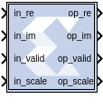

# Vector FFT

The Vector FFT block supports the FFT operation for vector type inputs.

## Description

The real part of the input data should be given to the in_re port, and
the imaginary part should be given to the in_im port.

When the in_valid is high it indicates that the input data is valid.
When out_valid is high, it indicates that the output data is valid.
The valid indicator accompanies every set of input and output samples
(for example, R number of samples). There is no back pressure flow
control and once an FFT transform starts, 'R' data samples must be input
into the core every clock for N/R consecutive clocks. Where N is the FFT
length. However, for back-to-back transforms, the valid control input
can stay high with no gaps.

The in_scale input port is used if scaling is required. And
out_scale is used in if there is an internal overflow.

### Data Type Support

- The number of in_scale bits must be equal to log2(FFT length).
- in_valid and out_valid are of Boolean data type.

## Parameters

#### FFT length (N) 
Is the size of the transformation, and should be powers
of 2 in the range of 2^3 to 2^16. SSR is the super sample rate, the
number of samples processed in parallel every clock. Using a typical
example with N=1024 and SSR=4, the core would compute one 1K FFT every
256 clock cycles, processing 4 input samples/clock.

#### Fixed-point precision 
Must be 27 bits or less, this is
limited by the DSP48 multiplier A port size.

#### Block RAM_THRESHOLD 
Is an implementation parameter with no functional
implications, it controls the use of distributed RAM vs BRAM when
implementing delay lines. It can be used to trade utilization numbers
between these two types of resources. The higher the value, the more
distributed RAM will be used instead of BRAM. Typical values to try are
258, 514, and 1026.

#### Bypass Reordering 

If Input Reorder bypassing is disabled, then the module takes N samples in 
natural input order and outputs them in natural transposed order.
If it is enabled, the output of the FFT block will be 
ordered in bit/digit reversed order.

If Output Reorder bypassing is disabled, then vector FFT Produces Natural Output Order.

#### Use Corner Bender Or Matrix Transposer

If it is enabled, the module takes N samples in natural input order and outputs them in in natural transposed order.

#### SSR
Super Sample Rate, It should be a power of 2.

## Scaling Ports  
The scaling ports are called SI and SO. Their width matches the FFT size
N, it is always log2(N). There is one SI bit for every add/subtract
stage, where internal overflows can occur. If that bit is set to zero
then no scaling happens and bit growth is addressed by increasing the
internal data sizes bit, one bit every stage. If the bit is set to 1
then the stage divides by 2, and no internal data growth is required to
prevent overflows.

Generally, if the output data size is log2(N) bits larger than the input
size, no scaling is required, and SI is set to all zeros. If the input
and output data sizes are equal, then scaling on every stage is needed
and SI should be set to all ones. In reality, scaling is data dependent
and some combination of output size growth and non-zero SI bits are
used. If partial scaling is used, the non-zero bits of SI should be the
MSB ones. SI should be static, it should not change while data is being
processed by the core (when VI is high).

Another important requirement to avoid internal overflows is to have one
MSB margin bit at the data inputs, that is the two MSBs of I.RE and I.IM
should be the same. This prevents overflows in complex multipliers. If
the two rules outlined above are followed, then internal overflows are
impossible by design.

The SO port is an indicator of internal overflows, it is not normally
used, only attach an unsigned signals of size log2(N) to it.
