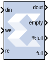

# FIFO

The FIFO block implements an FIFO memory queue.

## Description

Values presented at the module's data-input port are written to the next
available empty memory location when the write-enable input is one. By
asserting the read-enable input port, data can be read out of the FIFO
using the data output port (`dout`) in the order in which they were
written. The FIFO can be implemented using block RAM, distributed RAM,
SRL, or built-in FIFO.

The full output port is asserted to one when no unused locations
remain in the module's internal memory. The percent_full output port
indicates the percentage of the FIFO that is full, represented with
user-specified precision. When the `empty` output port is asserted the
FIFO is empty.

## Parameters

### Basic tab  
Parameters specific to the Basic tab are as follows.
#### FIFO Implementation  
* #### Memory Type  
> This block implements FIFOs built from block RAM, distributed RAM, shift
registers, or the 7 series built-in FIFOs. Memory primitives are
arranged in an optimal configuration based on the selected width and
depth of the FIFO. The following table provides best-use recommendations
for specific design requirements.

|                              | Independent Clocks | Common Clock | Small Buffering | Medium-Large Buffering | High Performance | Minimal Resources |
|:----------------------------:|:------------------:|:------------:|:---------------:|:----------------------:|:----------------:|:-----------------:|
| 7 series, with Built-In FIFO |         X          |      X       |                 |           X            |        X         |         X         |
|          Block RAM           |         X          |      X       |                 |           X            |        X         |         X         |
|        Shift Register        |                    |      X       |        X        |                        |        X         |                   |
|       Distributed RAM        |         X          |      X       |        X        |                        |        X         |                   |

* #### Performance Options  
  * #### Standard FIFO  
> > > > FIFO will operate in Standard Mode.

  * #### First Word Fall Through  
> > > > FIFO will operate in First-Word Fall-Through (FWFT) mode. The First-Word
Fall-Through feature provides the ability to look-ahead to the next word
available from the FIFO without issuing a read operation. When data is
available in the FIFO, the first word falls through the FIFO and appears
automatically on the output. FWFT is useful in applications that require
low-latency access to data and to applications that require throttling
based on the contents of the data that are read. FWFT support is
included in FIFOs created with block RAM, distributed RAM, or built-in
FIFOs in 7 series devices.

  * #### Implementation Options  
    * #### Use Embedded Registers (when possible)  
> > > > In 7 series FPGA block RAM and FIFO macros, embedded output registers
are available to increase performance and add a pipeline register to the
macros. This feature can be leveraged to add one additional cycle of
latency to the FIFO core (DOUT bus and VALID outputs) or implement the
output registers for FWFT FIFOs. The embedded registers available in 7
series FPGAs can be reset (DOUT) to a default or user programmed value
for common clock built-in FIFOs. See the topic 'Embedded Registers in
block RAM and FIFO Macros' in the FIFO Generator LogiCORE IP Product
Guide
([PG057](https://www.xilinx.com/cgi-bin/docs/ipdoc?c=fifo_generator;v=latest;d=pg057-fifo-generator.pdf)).

#### Depth  
> Specifies the number of words that can be stored. Range 16-4M.

#### Specify custom dout width  
> Allows specification of asymmetric data widths for input and output.
When this option is enabled, the input din must be of type Unsigned int.

* #### Dout Width  
> > Specifies the custom width of dout . The default value is `32`. The
ratio between width of din and dout should be one of 1:1, 1:2, 1: 4,
1:8, 2:1, 4:1, or 8:1.

> > For example, if the width of the din is `32`. Then the dout can be 4, 8,
16, 32, 64, 128, or 256.

**IMPORTANT**: Asymmetric data-widths are supported only for Versal devices
with Block RAM configuration.

**IMPORTANT**: The total size of the memory (depth\*width) should not exceed
150M.

#### Bits of precision to use for %full signal  
> > Specifies the bit width of the %full port. The binary point for this
unsigned output is always at the top of the word. Thus, if for example
precision is set to one, the output can take two values: 0.0 and 0.5,
the latter indicating the FIFO is at least 50% full.

#### Optional Ports  
> #### Provide reset port  
> > Add a reset port to the block.

   * #### Reset Latency  
> > Creates a latency on the reset by adding registers. The default is 1.

> > **Note**: For UltraScale™ devices, after the reset gets asserted, the FIFO
will remain disable for the next 20 cycles. During this 20 cycle period,
all read and write operations are ignored.

   * #### Provide enable port  
> > Add enable port to the block.

   * #### Provide data count port  
> > Add data count port to the block. Provides the number of words in the
FIFO.

   * #### Provide percent full port  
> > Add a percent full output port to the block. Indicates the percentage of
the FIFO that is full using the user-specified precision. This optional
port is turned on by default for backward compatibility reasons.

   * #### Provide almost empty port  
> > Add almost empty (ae) port to the block.

   * #### Provide almost full port  
> > Add almost efull (af) port to the block.

Following are some general guidelines to use Reset, Write enable, Read
enable for the 'built-in FIFO' Memory type:

### 7 series devices  
* Without Reset port, it is required to run at least 8 clock cycles
latency before asserting WE/RE signals.

* With Reset port, it is required to run Reset signal ON for at least
three clock cycles. During this time no WE or RE signals should be
asserted. To be consistent across all built-in FIFO configurations, it
is recommended to give reset pulse of at least five clock cycles.

* After Reset de-assertion, run at least 30 clock cycles (reset duration
+30 clock cycles duration is defined as a no access zone) before
asserting WE/RE signals.

### UltraScale devices  
* The built-in FIFO requires a reset pulse of at least one clock cycle.

### Versal Devices  
* Read enable (rd_en) and Write enable (wr_en) signals can be made high
only when rd_rst_busy and wr_rst_busy signals are low.

Other parameters used by this block are explained in the topic [Common
Options in Block Parameter Dialog
Boxes](common-options-in-block-parameter-dialog-boxes-aa1032308.html).

## LogiCORE™ Documentation

FIFO Generator LogiCORE IP Product Guide
([PG057](https://www.xilinx.com/cgi-bin/docs/ipdoc?c=fifo_generator;v=latest;d=pg057-fifo-generator.pdf))

Floating-Point Operator LogiCORE IP Product Guide
([PG060](https://www.xilinx.com/cgi-bin/docs/ipdoc?c=floating_point;v=latest;d=pg060-floating-point.pdf))
