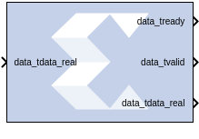
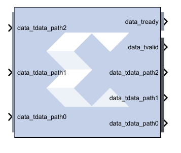
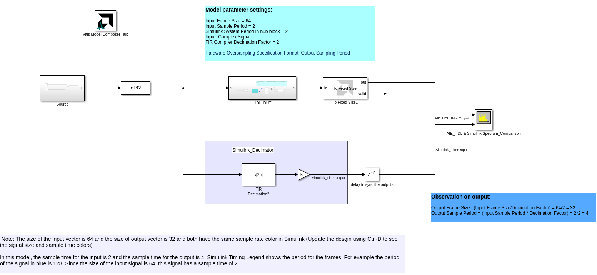
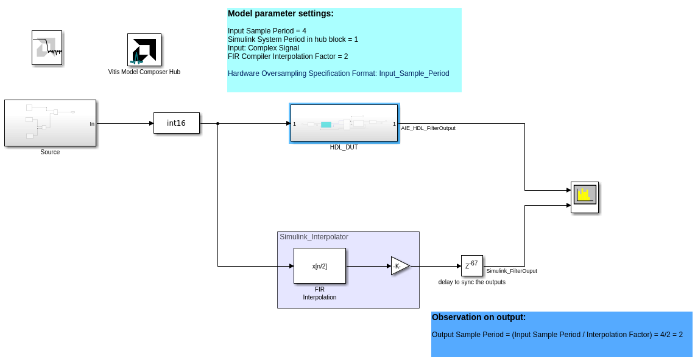

<!-- Library: hdlDSPIP -->

# FIR Compiler 7.2

## Description
The FIR Compiler block provides users with a way to generate
highly parameterizable, area-efficient, high-performance FIR filters
with an AXI4-Stream-compliant interface.

### AXI Ports that are Unique to this Block

This block exposes the AXI CONFIG channel as a group of separate ports
based on sub-field names. The sub-field ports are described as follows:

Configuration Channel Input Signals:

| Input Signal | Description |
|--------|-------------|
| config_tdata_fsel     | A sub-field port that represents the fsel field in the Configuration Channel vector. fsel is used to select the active filter set. This port is exposed when the number of coefficient sets is greater than one. Refer to the FIR Compiler LogiCORE IP Product Guide ([PG149](https://docs.xilinx.com/access/sources/framemaker/map?isLatest=true&ft:locale=en-US&url=pg149-fir-compiler)) for an explanation of the bits in this field. |

## Parameters

### Filter Specification tab  
Parameters specific to the Filter Specification tab are as follows.

#### Coefficient Vector  
Specifies the coefficient vector as a single MATLAB® row vector. The
number of taps is inferred from the length of the MATLAB® row vector. If
multiple coefficient sets are specified, then each set is appended to
the previous set in the vector. It is possible to enter these
coefficients using the [FDATool](../../UTIL/Xilinx_FDATool_Interface_Block/README.md) block as well.

#### Number of Coefficients Sets  
The number of sets of filter coefficients to be implemented. The value
specified must divide without remainder into the number of coefficients.

#### Use Reloadable Coefficients  
Check to add the coefficient reload ports to the block. The set of data
loaded into the reload channel will not take action until triggered by a
re-configuration synchronization event. Refer to the FIR Compiler LogiCORE IP Product Guide ([PG149](https://docs.xilinx.com/access/sources/framemaker/map?isLatest=true&ft:locale=en-US&url=pg149-fir-compiler))
for a more detailed explanation of the RELOAD Channel interface timing.
This block supports the xlGetReOrderedCoeff function; see Appendix A of the Vitis Model Composer User Guide (UG1483) for examples of how to use this function.

 
#### Filter Type  

> **NOTE:** See [Implement Filters using FIR Compiler Block](https://github.com/Xilinx/Vitis_Model_Composer/tree/2025.2/Tutorials/HDL_Library/Lab7) to see how to configure the FIR Compiler block as a multi-rate filter.

* **Single_Rate:** The data rate of the input and the output are the same.
* **Interpolation:** The data rate of the output is faster than the input by a factor specified by the Interpolation Rate Value.
* **Decimation:** The data rate of the output is slower than the input by a factor specified in the Decimation Rate Value.
* **Hilbert:** Filter uses the Hilbert Transform.
* **Interpolated:**
An interpolated FIR filter has a similar architecture to a conventional
FIR filter, but with the unit delay operator replaced by k-1 units of
delay. k is referred to as the zero-packing factor. The interpolated FIR
should not be confused with an interpolation filter. Interpolated
filters are single-rate systems employed to produce efficient
realizations of narrow-band filters and, with some minor enhancements,
wide-band filters can be accommodated. The data rate of the input and
the output are the same.

#### Rate Change Type  
This field is applicable to Interpolation and Decimation filter types.
Used to specify an Integer or Fixed_Fractional rate change.

#### Interpolation Rate Value  
This field is applicable to all Interpolation filter types and
Decimation filter types for Fractional Rate Change implementations. The
value provided in this field defines the up-sampling factor, or P for
Fixed Fractional Rate (P/Q) resampling filter implementations.

#### Decimation Rate Value  
This field is applicable to the all Decimation and Interpolation filter
types for Fractional Rate Change implementations. The value provided in
this field defines the down-sampling factor, or Q for Fixed Fractional
Rate (P/Q) resampling filter implementations.

### Channel Specification tab  
Parameters specific to the Channel Specification tab are as follows.
 
#### Channel Sequence  
Select Basic or Advanced. See the FIR Compiler LogiCORE IP Product Guide ([PG149](https://docs.xilinx.com/access/sources/framemaker/map?isLatest=true&ft:locale=en-US&url=pg149-fir-compiler)) 
for an explanation of the advanced channel specification feature.

#### Number of Channels  
The number of data channels to be processed by the FIR Compiler block.
The multiple channel data is passed to the core in a time-multiplexed
manner. A maximum of 64 channels is supported.

#### Sequence ID List  
A comma delimited list that specifies which channel sequences are
implemented.

#### Number of Paths  
Specifies the number of parallel data paths the filter is to process. As
shown below, when more than one path is specified, the data_tdata input
port is divided into sub-ports that represent each parallel path.  

#### Select format  

> **NOTE:** See [Implement Filters using FIR Compiler Block](https://github.com/Xilinx/Vitis_Model_Composer/tree/2025.2/Tutorials/HDL_Library/Lab7) to see how to configure the FIR Compiler block as a multi-rate filter.

* **Maximum_Possible:** Specifies that oversampling be automatically determined based on the `din` sample rate.
* **Input_Sample_Period/Output_Sample_Period:**
Activates the Sample period. Enter the Sample Period specification.
Selecting this option exposes the `s_axis_data_tvalid` port (called ND
port on earlier versions of the core). With this port exposed, no input
handshake abstraction and no rate-propagation takes place.
* **Hardware Oversampling Rate:** Activates the Hardware Oversampling Rate. 
The hardware oversampling rate determines the degree of parallelism. A
rate of one produces a fully parallel filter. A rate of n (resp., n+1)
for an n-bit input signal produces a fully serial implementation for a
non-symmetric (resp., symmetric) impulse response. Intermediate values
produce implementations with intermediate levels of parallelism.

### Implementation tab  
Parameters specific to the Implementation tab are as follows.

#### Coefficient Type  
Specify Signed or Unsigned.

#### Quantization  
Specifies the quantization method to be used for quantizing the
coefficients. This can be set to one of the following:

  - Integer_Coefficients
  - Quantize_Only
  - Maximize_Dynamic_Range
  - Normalize_to_Centre_Coefficient

#### Coefficient Width  
Specifies the number of bits used to represent the coefficients.

#### Best Precision Fractional Bits  
When selected, the coefficient fractional width is automatically set to
maximize the precision of the specified filter coefficients.

#### Coefficient Fractional Bits  
Specifies the binary point location in the coefficients datapath
options.

#### Coefficients Structure  
Specifies the coefficient structure. Depending on the coefficient
structure, optimizations are made in the core to reduce the amount of
hardware required to implement a particular filter configuration. The
selected structure can be any of the following:

  - Inferred
  - Non-Symmetric
  - Symmetric
  - Negative_Symmetric
  - Half_Band
  - Hilbert

The vector of coefficients specified must match the structure specified
unless Inferred from coefficients is selected in which case the
structure is determined automatically from these coefficients.

#### Output Rounding Mode  
  Choose one of the following:

  - Full_Precision
  - Truncate_LSBs
  - Non_Symmetric_Rounding_Down
  - Non_Symmetric_Rounding_Up
  - Symmetric_Rounding_to_Zero
  - Symmetric_Rounding_to_Infinity
  - Convergent_Rounding_to_Even
  - Convergent_Rounding_to_Odd

#### Output Width  
Specify the output width. Edit box activated only if the Rounding mode
is set to a value other than Full_Precision.

### Detailed Implementation tab  
Parameters specific to the Detailed Implementation tab are as follows.

#### Filter Architecture  
The following two filter architectures are supported:

  - Systolic_Multiply_Accumulate
  - Transpose_Multiply_Accumulate
    **Note**: When selecting the Transpose Multiply-Accumulate architecture,
  these limitations apply:

    - Symmetry is not exploited. If the Coefficient Vector specified on
    the Filter Specification tab is detected as symmetric, the FIR
    Compiler 7.2 block parameters dialog box will not allow you to
    select Transpose Multiply Accumulate.
    - Multiple interleaved channels are not supported.

#### Optimization Options  
Specifies if the core is required to operate at maximum possible speed
(“Speed” option) or minimum area (“Area” option). The “Area” option is
the recommended default and will normally achieve the best speed and
area for the design, however in certain configurations, the “Speed”
setting might be required to improve performance at the expense of
overall resource usage (this setting normally adds pipeline registers in
critical paths).

#### Goal  
  - Area
  - Speed
  - Custom

#### List
A comma delimited list that specifies which optimizations are
implemented by the block. The optimizations are as follows.

###### Data_Path_Fanout  
Adds additional pipeline registers on the data memory outputs to
minimize fan-out. Useful when implementing large data width filters
requiring multiple DSP slices per multiply-add unit.

###### Pre-Adder_Pipeline  
Pipelines the pre-adder when implemented using fabric resources. This
may occur when a large coefficient width is specified.

###### Coefficient_Fanout  
Adds additional pipeline registers on the coefficient memory outputs to
minimize fan-out. Useful for Parallel channels or large coefficient
width filters requiring multiple DSP slices per multiply-add unit.

###### Control_Path_Fanout  
Adds additional pipeline registers to control logic when Parallel
channels have been specified.

###### Control_Column_Fanout  
Adds additional pipeline registers to control logic when multiple DSP
columns are required to implement the filter.

###### Control_Broadcast_Fanout  
Adds additional pipeline registers to control logic for fully parallel
(one clock cycle per channel per input sample) symmetric filter
implementations.

###### Control_LUT_Pipeline  
Pipelines the Look-up tables required to implement the control logic for
Advanced Channel sequences.

###### No_BRAM_Read_First_Mode  
Specifies that Block RAM READ-FIRST mode should not be used.

###### Increased speed  
Multiple DSP slice columns are required for non-symmetric filter
implementations.

###### Other  
Miscellaneous optimizations.
**Note**: All optimizations may be specified but are only implemented when
relevant to the core configuration.

#### Memory Options  
The memory type for MAC implementations can either be user-selected or
chosen automatically to suit the best implementation options. Note that
a choice of “Distributed” might result in a shift register
implementation where appropriate to the filter structure. Forcing the
RAM selection to be either Block or Distributed should be used with
caution, as inappropriate use can lead to inefficient resource usage -
the default Automatic mode is recommended for most applications.

#### Data Buffer Type  
Specifies the type of memory used to store data samples.

#### Coefficient Buffer Type  
Specifies the type of memory used to store the coefficients.

#### Input Buffer Type  
Specifies the type of memory to be used to implement the data input
buffer, where present.

#### Output Buffer type  
Specifies the type of memory to be used to implement the data output
buffer, where present.

#### Preference for other storage  
Specifies the type of memory to be used to implement general storage in
the datapath.

#### Multi-Column Support  
For device families with DSP slices, implementations of large high speed
filters might require chaining of DSP slice elements across multiple
columns. Where applicable (the feature is only enabled for multi-column
devices), you can select the method of folding the filter structure
across the multiple-columns, which can be Automatic (based on the
selected device for the project) or Custom (you select the length of the
first and subsequent columns).

#### Column Configuration  
Specifies the individual column lengths in a comma delimited list. (See
the data sheet for a more detailed explanation.)

#### Inter-Column Pipe Length  
Pipeline stages are required to connect between the columns, with the
level of pipelining required being depending on the required system
clock rate, the chosen device and other system-level parameters. The
choice of this parameter is always left for you to specify.

### Interface tab  
  
#### TLAST  
TLAST can either be Not_Required, in which case the block will not have
the port, or Vector_Framing, where TLAST is expected to denote the last
sample of an interleaved cycle of data channels, or Packet_Framing,
where the block does not interpret TLAST, but passes the signal to the
output DATA channel TLAST with the same latency as the datapath.

#### Output TREADY  
This field enables the data_tready port. With this port enabled, the
block will support back-pressure. Without the port, back-pressure is not
supported, but resources are saved and performance is likely to be
higher.

#### Input FIFO  
Selects a FIFO interface for the S_AXIS_DATA channel. When the FIFO has
been selected, data can be transferred in a continuous burst up to the
size of the FIFO (default 16) or, if greater, the number of interleaved
data channels. The FIFO requires additional FPGA logic resources.

#### Input/Output
Select one of the following options for the Input and the Output.
##### Not_Required  
Neither of the uses is required; the channel in question will not have a
TUSER field.

##### User_Field  
In this mode, the block ignores the content of the TUSER field, but
passes the content untouched from the input channel to the output
channels.

##### Chan_ID_Field  
In this mode, the TUSER field identifies the time-division-multiplexed
channel for the transfer.

##### User and Chan_ID_Field  
In this mode, the TUSER field will have both a user field and a chan_id
field, with the chan_id field in the least significant bits. The minimal
number of bits required to describe the channel will determine the width
of the chan_id field, e.g. 7 channels will require 3 bits.

#### Synchronization Mode  
##### On_Vector  
Configuration packets, when available, are consumed and their contents
applied when the first sample of an interleaved data channel sequence is
processed by the block. When the block is configured to process a single
data channel configuration packets are consumed every processing cycle
of the block.

##### On_Packet  
Further qualifies the consumption of configuration packets. Packets will
only be consumed once the block has received a transaction on the
s_axis_data channel where s_axis_data_tlast has been asserted.

#### Configuration Method  
##### Single  
A single coefficient set is used to process all interleaved data
channels.

##### By_Channel  
A unique coefficient set is specified for each interleaved data channel.

#### Reload Slots  
Specifies the number of coefficient sets that can be loaded in advance.
Reloaded coefficients are only applied to the block once the
configuration packet has been consumed (Range 1 to 256).

#### ACLKEN
Active-high clock enable. Available for MAC-based FIR implementations.

#### ARESETn (active low)  
Active-low synchronous clear input that always takes priority over
ACLKEN. A minimum ARESETn active pulse of two cycles is required, since
the signal is internally registered for performance. A pulse of one
cycle resets the control and datapath of the core, but the response to
the pulse is not in the cycle immediately following.

### Advanced tab  
#### Block Icon Display  
##### Display shortened port names  
On by default. When unchecked, data_tvalid, for example, becomes
m_axis_data_tvalid.

Other parameters used by this block are explained in the topic [Common
Options in Block Parameter Dialog
Boxes](../../GEN/common-options/README.md).

## Examples

***Click on the images below to open each model.***

**Decimation Filter:**

<!--
DESCRIPTION:
Model: FIR_Compiler_Ex1
Generated: 09-Jan-2026 13:52:19

Vitis Model Composer Configuration:
  Target Device: Versal VCK190 Evaluation Platform (xcvc1902-vsva2197-2MP-e-S)

Vitis Model Composer Blocks:
  - AIE: From AXI-S
  - AIE: To AXI-S
  - AIE: To Fixed Size

Description:
This MATLAB script creates a Vitis Model Composer Simulink model that uses the AI Engine From AXI-S, To AXI-S and To Fixed Size blocks. A 0Hz complex input signal is provided to the block,  and results are compared against a Simulink reference implementation.

-->

<!--
MATLAB CREATION SCRIPT:

% create_FIR_Compiler_Ex1_model.m
% Auto-generated script to recreate the FIR_Compiler_Ex1 Simulink model
% Generated on: 09-Jan-2026 13:52:19

%% Model Configuration
modelName = 'FIR_Compiler_Ex1_recreated';

%% Create New Model
if bdIsLoaded(modelName)
    close_system(modelName, 0);
end

new_system(modelName);
open_system(modelName);
fprintf('Created new model: %s\n', modelName);

%% Add Vitis Model Composer Hub Block
hubBlockPath = [modelName '/Vitis Model Composer Hub'];
add_block('vmcUtilities/Vitis Model Composer Hub', hubBlockPath, ...
    'Position', [852 -62 907 -9]);

hubBlk = xmcFindHubBlock(modelName);
vmchub_set_param(hubBlk, modelName, 'SelectHardware', 'Versal VCK190 Evaluation Platform (xcvc1902-vsva2197-2MP-e-S)');

%% Add Top-Level Blocks
add_block('built-in/SpectrumAnalyzer', [modelName '/AIE_HDL & Simulink Specrum_Comparison'], ...
    'Position', [1840 196 1885 249]);
set_param([modelName '/AIE_HDL & Simulink Specrum_Comparison'], ...
    'NumInputPorts', '2', ...
    'OpenAtSimulationStart', 'on', ...
    'WindowPosition', '[878 430 800 500]', ...
    'InputDomain', 'Time', ...
    'SpectrumType', 'Power', ...
    'ViewType', 'Spectrum', ...
    'Method', 'Filter bank', ...
    'SampleRateSource', 'Inherited', ...
    'SampleRate', '10000', ...
    'PlotAsTwoSidedSpectrum', 'on', ...
    'FrequencyScale', 'Linear', ...
    'PlotType', 'Line', ...
    'AxesScaling', 'Auto', ...
    'AxesScalingNumUpdates', '100', ...
    'FrequencyResolutionMethod', 'RBW', ...
    'RBWSource', 'Auto', ...
    'RBW', '9.76', ...
    'WindowInvariantSamplesPerUpdate', 'off', ...
    'WindowLength', '1024', ...
    'FFTLengthSource', 'Auto', ...
    'FFTLength', '1024', ...
    'FilterSharpness', '0.3', ...
    'FrequencySpan', 'Full', ...
    'Span', '10000', ...
    'CenterFrequency', '0', ...
    'StartFrequency', '-5000', ...
    'StopFrequency', '5000', ...
    'InputUnits', 'dBm', ...
    'FrequencyVectorSource', 'Auto', ...
    'FrequencyVector', '[-5000,5000]', ...
    'Window', 'Hann', ...
    'CustomWindow', 'hann', ...
    'SidelobeAttenuation', '60', ...
    'OverlapPercent', '0', ...
    'AveragingMethod', 'Exponential', ...
    'SpectralAverages', '1', ...
    'ForgettingFactor', '0.9', ...
    'VBWSource', 'Auto', ...
    'VBW', '9.76', ...
    'SpectrumUnits', 'dBm', ...
    'FullScaleSource', 'Auto', ...
    'FullScale', '1', ...
    'ReferenceLoad', '1', ...
    'FrequencyOffset', '0', ...
    'SpectrogramChannel', '1', ...
    'TimeResolutionSource', 'Auto', ...
    'TimeResolution', '1e-3', ...
    'TimeSpanSource', 'Auto', ...
    'TimeSpan', '0.1', ...
    'MaximizeAxes', 'Auto', ...
    'PlotNormalTrace', 'on', ...
    'PlotMaxHoldTrace', 'off', ...
    'PlotMinHoldTrace', 'off', ...
    'YLimits', '[-80,20]', ...
    'ColorLimits', '[-80,20]', ...
    'Colormap', 'jet', ...
    'ShowGrid', 'on', ...
    'ShowLegend', 'on', ...
    'ShowColorbar', 'on', ...
    'ChannelNames', '[""]', ...
    'AxesLayout', 'Vertical');
add_block('built-in/DataTypeConversion', [modelName '/Data Type Conversion'], ...
    'Position', [920 123 995 157]);
set_param([modelName '/Data Type Conversion'], ...
    'OutMin', '[]', ...
    'OutMax', '[]', ...
    'OutDataTypeStr', 'int32', ...
    'LockScale', 'off', ...
    'ConvertRealWorld', 'Real World Value (RWV)', ...
    'RndMeth', 'Floor', ...
    'SaturateOnIntegerOverflow', 'off', ...
    'SampleTime', '-1');
add_block('dspmlti4/FIR Decimation', [modelName '/FIR Decimation2'], ...
    'Position', [1235 336 1320 394]);
set_param([modelName '/FIR Decimation2'], ...
    'FilterSource', 'Dialog parameters', ...
    'h', '[6,0,-4,-3,5,6,-6,-13,7,44,64,44,7,-13,-6,6,5,-3,-4,0,6]', ...
    'D', '2', ...
    'filtStruct', 'Direct form', ...
    'FilterObject', 'FDECIM', ...
    'InputProcessing', 'Columns as channels (frame based)', ...
    'framing', 'Enforce single-rate processing', ...
    'AllowArbitraryInputLength', 'off', ...
    'outputBufInitCond', '0', ...
    'roundingMode', 'Floor', ...
    'overflowMode', 'off', ...
    'firstCoeffMode', 'Same word length as input', ...
    'firstCoeffWordLength', '16', ...
    'firstCoeffFracLength', '15', ...
    'firstCoeffDataTypeStr', 'Inherit: Same word length as input', ...
    'firstCoeffMin', '[]', ...
    'firstCoeffMax', '[]', ...
    'firstCoeffLastDataTypeStr', 'Inherit: Same word length as input', ...
    'prodOutputMode', 'Same as input', ...
    'prodOutputWordLength', '32', ...
    'prodOutputFracLength', '30', ...
    'prodOutputDataTypeStr', 'Inherit: Same as input', ...
    'prodOutputLastDataTypeStr', 'Inherit: Same as input', ...
    'accumMode', 'Inherit via internal rule', ...
    'accumWordLength', '32', ...
    'accumFracLength', '30', ...
    'accumDataTypeStr', 'Inherit: Inherit via internal rule', ...
    'accumLastDataTypeStr', 'Inherit: Inherit via internal rule', ...
    'outputMode', 'Same as input', ...
    'outputWordLength', '16', ...
    'outputFracLength', '15', ...
    'outputDataTypeStr', 'Inherit: Same as input', ...
    'outputMin', '[]', ...
    'outputMax', '[]', ...
    'outputLastDataTypeStr', 'Inherit: Same as input', ...
    'LockScale', 'off');
add_block('built-in/Gain', [modelName '/Gain'], ...
    'Position', [1380 350 1410 380]);
set_param([modelName '/Gain'], ...
    'Gain', '1/256', ...
    'Multiplication', 'Element-wise(K.*u)', ...
    'ParamMin', '[]', ...
    'ParamMax', '[]', ...
    'ParamDataTypeStr', 'Inherit: Inherit via internal rule', ...
    'OutMin', '[]', ...
    'OutMax', '[]', ...
    'OutDataTypeStr', 'Inherit: Same as input', ...
    'LockScale', 'off', ...
    'RndMeth', 'Floor', ...
    'SaturateOnIntegerOverflow', 'off', ...
    'SampleTime', '-1');
add_block('built-in/Terminator', [modelName '/Terminator'], ...
    'Position', [1610 145 1630 165]);
add_block('aieUtilities/To Fixed Size', [modelName '/To Fixed Size1'], ...
    'Position', [1445 112 1560 168]);
set_param([modelName '/To Fixed Size1'], ...
    'Mode', 'Produce a valid output signal', ...
    'OutputSize', 'Inherit: Same as input', ...
    'CopyMethod', 'Buffer samples to form output', ...
    'HasStatusOutput', 'on');
add_block('vmcUtilities/Vitis Model Composer Hub', [modelName '/Vitis Model Composer Hub'], ...
    'Position', [852 -62 907 -9]);
set_param([modelName '/Vitis Model Composer Hub'], ...
    'CodeGeneration', 'off', ...
    'SubsystemName', 'filter_chain_DUT', ...
    'StartColumn', '1', ...
    'NumberOfColumns', '1', ...
    'TargetDirectory', './code_hw_emu', ...
    'exportDesign', 'off', ...
    'analyzeDesign', 'off', ...
    'validateDesignOnHw', 'off', ...
    'ExportType', 'HW Code', ...
    'IpVendor', 'xilinx.com', ...
    'IpLibrary', 'hls', ...
    'IpVersion', '1.0', ...
    'IpHWLanguage', 'Verilog', ...
    'AieCompilerOptions', '{}', ...
    'CreateTestbench', 'off', ...
    'TestbenchStackSize', '10', ...
    'RunRtlSim', 'off', ...
    'RunCSim', 'off', ...
    'RunAieSim', 'on', ...
    'AieSimTimeout', '50000', ...
    'RunAieSimProfiling', 'off', ...
    'LaunchVitisAnalyzer', 'off', ...
    'PlotOutput', 'off', ...
    'GenHwImage', 'off', ...
    'GenLibadfXo', 'off', ...
    'GenHwValidationCode', 'off', ...
    'PlatformType', 'Specify Platform', ...
    'Platform', '/proj/xbuilds/SWIP/2024.1_0306_2227/installs/lin64/Vitis/2024.1/base_platforms/xilinx_vck190_base_202410_1/xilinx_vck190_base_202410_1.xpfm', ...
    'HwSystemType', 'Baremetal', ...
    'HwValidationTarget', 'hw_emu', ...
    'ProjDevice', 'Versal VCK190 Evaluation Platform (xcvc1902-vsva2197-2MP-e-S)', ...
    'SamplePeriod', '-1', ...
    'ClockFrequency', '200', ...
    'DataPathParallelism', '1', ...
    'xilinxfamily', 'versalaicore', ...
    'part', 'xcvc1902', ...
    'speed', '-2MP-e-S', ...
    'package', 'vsva2197', ...
    'directory', './code_hw_emu/ip/PL/src', ...
    'testbench', 'on', ...
    'incr_netlist', 'off', ...
    'synthesis_tool', 'Vivado', ...
    'clock_wrapper', 'Clock Enables', ...
    'dbl_ovrd', 'According to Block Masks', ...
    'dcm_input_clock_period', '10', ...
    'sysclk_period', '5', ...
    'simulink_period', '2', ...
    'eval_field', '0', ...
    'LogFileName', '/proj/xsjhdstaff4/abehbood/vmc_examples/gitent_ws/Examples/AIENGINE_plus_PL/AIE_HDL/multirate_filter_chain/code_hw_emu/model_composer.log', ...
    'NThreads', '4');
add_block('built-in/Delay', [modelName '/delay to sync the outputs'], ...
    'Position', [1555 348 1590 382]);
set_param([modelName '/delay to sync the outputs'], ...
    'DelayLengthSource', 'Dialog', ...
    'DelayLength', '64', ...
    'DelayLengthUpperLimit', '100', ...
    'InitialConditionSource', 'Dialog', ...
    'InitialCondition', '0.0', ...
    'ExternalReset', 'None', ...
    'ShowEnablePort', 'off', ...
    'PreventDirectFeedthrough', 'off', ...
    'DiagnosticForDelayLength', 'None', ...
    'RemoveDelayLengthCheckInGeneratedCode', 'off', ...
    'InputProcessing', 'Columns as channels (frame based)', ...
    'UseCircularBuffer', 'off', ...
    'SampleTime', '-1', ...
    'StateMustResolveToSignalObject', 'off', ...
    'StateStorageClass', 'Auto');

%% Create HDL_DUT Subsystem
add_block('built-in/SubSystem', [modelName '/HDL_DUT'], ...
    'Position', [1200 110 1375 170]);

% Remove default blocks
defaultBlocks = find_system([modelName '/HDL_DUT'], 'SearchDepth', 1, 'Type', 'block');
for i = 1:length(defaultBlocks)
    if ~strcmp(defaultBlocks{i}, [modelName '/HDL_DUT'])
        delete_block(defaultBlocks{i});
    end
end

add_block('built-in/Inport', [[modelName '/HDL_DUT'] '/In1'], ...
    'Position', [300 -77 330 -63]);
set_param([[modelName '/HDL_DUT'] '/In1'], ...
    'Port', '1', ...
    'IconDisplay', 'Port number', ...
    'OutputFunctionCall', 'off', ...
    'OutMin', '[]', ...
    'OutMax', '[]', ...
    'OutDataTypeStr', 'Inherit: auto', ...
    'LockScale', 'off', ...
    'BusOutputAsStruct', 'off', ...
    'BusVirtuality', 'inherit', ...
    'Unit', 'inherit', ...
    'PortDimensions', '-1', ...
    'VarSizeSig', 'Inherit', ...
    'SampleTime', '-1', ...
    'SignalType', 'auto', ...
    'LatchByDelayingOutsideSignal', 'off', ...
    'LatchInputForFeedbackSignals', 'off', ...
    'Interpolate', 'on', ...
    'DataMode', 'inherit', ...
    'MessageQueueUseDefaultAttributes', 'on', ...
    'MessageQueueCapacity', '1', ...
    'MessageQueueType', 'LIFO', ...
    'MessageQueueOverwriting', 'on');
add_block('aieUtilities/From AXI-S', [[modelName '/HDL_DUT'] '/From AXI-S'], ...
    'Position', [1540 -121 1715 -14]);
set_param([[modelName '/HDL_DUT'] '/From AXI-S'], ...
    'InDataType', 'uint64', ...
    'OutDataType', 'int32 (c)', ...
    'OutSampleTime', 'OutSampleTime', ...
    'SamplesPerFrame', '32', ...
    'RateReduceFactor', '2', ...
    'ManuallySpecifyOutSampleTime', 'off', ...
    'TreadySampleTime', '1');
add_block('built-in/SubSystem', [[modelName '/HDL_DUT'] '/PL'], ...
    'Position', [1170 -160 1275 32]);
set_param([[modelName '/HDL_DUT'] '/PL'], ...
    'ShowPortLabels', 'FromPortIcon', ...
    'Permissions', 'ReadWrite', ...
    'PermitHierarchicalResolution', 'All', ...
    'TreatAsAtomicUnit', 'off', ...
    'ShowSubsystemReinitializePorts', 'off', ...
    'MinAlgLoopOccurrences', 'off', ...
    'ScheduleAs', 'Sample time', ...
    'SystemSampleTime', '-1', ...
    'SetExecutionDomain', 'off', ...
    'ExecutionDomainType', 'Deduce', ...
    'RTWSystemCode', 'Auto', ...
    'RTWFcnNameOpts', 'Auto', ...
    'RTWFileNameOpts', 'Auto', ...
    'FunctionInterfaceSpec', 'void_void', ...
    'FunctionWithSeparateData', 'off', ...
    'RTWMemSecFuncInitTerm', 'Inherit from model', ...
    'RTWMemSecFuncExecute', 'Inherit from model', ...
    'RTWMemSecDataConstants', 'Inherit from model', ...
    'RTWMemSecDataInternal', 'Inherit from model', ...
    'RTWMemSecDataParameters', 'Inherit from model', ...
    'IsSubsystemVirtual', 'on', ...
    'Variant', 'off', ...
    'VariantControlMode', 'expression', ...
    'VariantActivationTime', 'update diagram', ...
    'EmptyChoice', 'off', ...
    'PassThrough', 'off', ...
    'PropagateVariantConditions', 'off', ...
    'AllowFlexibleInterface', 'on', ...
    'TreatAsGroupedWhenPropagatingVariantConditions', 'on', ...
    'Latency', '0', ...
    'AutoFrameSizeCalculation', 'off');
add_block('built-in/Scope', [[modelName '/HDL_DUT'] '/Scope'], ...
    'Position', [1450 -146 1480 -114]);
set_param([[modelName '/HDL_DUT'] '/Scope'], ...
    'OpenAtSimulationStart', 'off', ...
    'DisplayFullPath', 'off', ...
    'NumInputPorts', '1', ...
    'LayoutDimensionsString', '[1 1]', ...
    'SampleTime', '-1', ...
    'FrameBasedProcessingString', 'Elements as channels (sample based)', ...
    'MaximizeAxes', 'Off', ...
    'AxesScaling', 'Manual', ...
    'AxesScalingNumUpdates', '10', ...
    'TimeSpan', 'Auto', ...
    'TimeSpanOverrunAction', 'Wrap', ...
    'TimeUnits', 'None', ...
    'TimeDisplayOffset', '0', ...
    'TimeAxisLabels', 'Bottom displays only', ...
    'ShowTimeAxisLabel', 'off', ...
    'ActiveDisplayString', '1', ...
    'Title', '%<SignalLabel>', ...
    'ShowLegend', 'off', ...
    'ShowGrid', 'on', ...
    'PlotAsMagnitudePhase', 'off', ...
    'ActiveDisplayYMinimum', '-0.125', ...
    'ActiveDisplayYMaximum', '1.125', ...
    'DataLoggingLimitDataPoints', 'off', ...
    'DataLoggingMaxPoints', '5000', ...
    'DataLoggingDecimateData', 'off', ...
    'DataLoggingDecimation', '2', ...
    'DataLogging', 'off', ...
    'DataLoggingVariableName', 'ScopeData1', ...
    'DataLoggingSaveFormat', 'Dataset');
add_block('built-in/Terminator', [[modelName '/HDL_DUT'] '/Terminator'], ...
    'Position', [695 -65 715 -45]);
add_block('aieUtilities/To AXI-S', [[modelName '/HDL_DUT'] '/To AXI-S'], ...
    'Position', [775 -108 950 -12]);
set_param([[modelName '/HDL_DUT'] '/To AXI-S'], ...
    'OutDataType', 'uint64', ...
    'OutSampleTime', 'Inherit: Same as tready');
add_block('aieUtilities/To Fixed Size', [[modelName '/HDL_DUT'] '/To Fixed Size'], ...
    'Position', [535 -98 650 -42]);
set_param([[modelName '/HDL_DUT'] '/To Fixed Size'], ...
    'Mode', 'Produce a valid output signal', ...
    'OutputSize', 'Inherit: Same as input', ...
    'CopyMethod', 'Buffer samples to form output', ...
    'HasStatusOutput', 'on');
add_block('built-in/Outport', [[modelName '/HDL_DUT'] '/Out1'], ...
    'Position', [1850 -102 1880 -88]);
set_param([[modelName '/HDL_DUT'] '/Out1'], ...
    'Port', '1', ...
    'StorageClass', 'Auto', ...
    'IconDisplay', 'Port number', ...
    'OutputFunctionCall', 'off', ...
    'OutMin', '[]', ...
    'OutMax', '[]', ...
    'OutDataTypeStr', 'Inherit: auto', ...
    'LockScale', 'off', ...
    'BusOutputAsStruct', 'off', ...
    'BusVirtuality', 'inherit', ...
    'DataMode', 'inherit', ...
    'Unit', 'inherit', ...
    'PortDimensions', '-1', ...
    'VarSizeSig', 'Inherit', ...
    'SampleTime', '-1', ...
    'SignalType', 'auto', ...
    'EnsureOutportIsVirtual', 'off', ...
    'OutputWhenDisabled', 'held', ...
    'InitialOutput', '[]', ...
    'MustResolveToSignalObject', 'off', ...
    'OutputWhenUnConnected', 'off', ...
    'OutputWhenUnconnectedValue', '0', ...
    'VectorParamsAs1DForOutWhenUnconnected', 'on');

% Connect blocks in HDL_DUT
add_line([modelName '/HDL_DUT'], 'To Fixed Size/3', 'Terminator/2', 'autorouting', 'on');
add_line([modelName '/HDL_DUT'], 'In1/2', 'To Fixed Size/2', 'autorouting', 'on');
add_line([modelName '/HDL_DUT'], 'To AXI-S/3', 'PL/3', 'autorouting', 'on');
add_line([modelName '/HDL_DUT'], 'PL/2', 'From AXI-S/2', 'autorouting', 'on');
add_line([modelName '/HDL_DUT'], 'From AXI-S/2', 'Out1/2', 'autorouting', 'on');
add_line([modelName '/HDL_DUT'], 'To Fixed Size/2', 'To AXI-S/2', 'autorouting', 'on');
add_line([modelName '/HDL_DUT'], 'From AXI-S/3', 'PL/4', 'autorouting', 'on');
add_line([modelName '/HDL_DUT'], 'PL/3', 'Scope/2', 'autorouting', 'on');
add_line([modelName '/HDL_DUT'], 'PL/3', 'From AXI-S/3', 'autorouting', 'on');
add_line([modelName '/HDL_DUT'], 'PL/3', 'From AXI-S/3', 'autorouting', 'on');
add_line([modelName '/HDL_DUT'], 'To AXI-S/2', 'PL/2', 'autorouting', 'on');
add_line([modelName '/HDL_DUT'], 'PL/4', 'To AXI-S/3', 'autorouting', 'on');

%% Create Source Subsystem
add_block('built-in/SubSystem', [modelName '/Source'], ...
    'Position', [710 107 825 173]);

% Remove default blocks
defaultBlocks = find_system([modelName '/Source'], 'SearchDepth', 1, 'Type', 'block');
for i = 1:length(defaultBlocks)
    if ~strcmp(defaultBlocks{i}, [modelName '/Source'])
        delete_block(defaultBlocks{i});
    end
end

add_block('built-in/ManualSwitch', [[modelName '/Source'] '/Manual Switch'], ...
    'Position', [115 42 145 78]);
set_param([[modelName '/Source'] '/Manual Switch'], ...
    'varsize', 'off', ...
    'SampleTime', '-1');
add_block('dspobslib/Random Source', [[modelName '/Source'] '/Random Source'], ...
    'Position', [-210 31 -175 69]);
set_param([[modelName '/Source'] '/Random Source'], ...
    'SrcType', 'Uniform', ...
    'NormMethod', 'Ziggurat', ...
    'CltLength', '12', ...
    'MinVal', '-2^15', ...
    'MaxVal', '2^15-1', ...
    'MeanVal', '0', ...
    'VarVal', '1', ...
    'RepMode', 'Not repeatable', ...
    'rawSeed', '1', ...
    'IsInherit', 'off', ...
    'SampMode', 'Discrete', ...
    'SampTime', '2', ...
    'SampFrame', '64', ...
    'DataType', 'Double', ...
    'OutComplex', 'Complex', ...
    'OutputFrames', 'off');
add_block('dspsrcs4/Sine Wave', [[modelName '/Source'] '/Sine Wave'], ...
    'Position', [-215 103 -170 147]);
set_param([[modelName '/Source'] '/Sine Wave'], ...
    'Amplitude', '100', ...
    'Frequency', '5e-3', ...
    'Phase', '0', ...
    'SampleMode', 'Discrete', ...
    'OutComplex', 'Complex', ...
    'CompMethod', 'Trigonometric fcn', ...
    'TableSize', 'Speed', ...
    'SampleTime', '2', ...
    'SamplesPerFrame', '64', ...
    'ResetState', 'Restart at time zero', ...
    'OutputFrames', 'off', ...
    'additionalParams', 'off', ...
    'allowOverrides', 'on', ...
    'dataType', 'double', ...
    'wordLen', '16', ...
    'udDataType', 'sfix(16)', ...
    'fracBitsMode', 'Best precision', ...
    'numFracBits', '15', ...
    'OutDataTypeStr', 'double', ...
    'LastOutDataTypeStr', 'double');
add_block('built-in/Outport', [[modelName '/Source'] '/In'], ...
    'Position', [285 53 315 67]);
set_param([[modelName '/Source'] '/In'], ...
    'Port', '1', ...
    'StorageClass', 'Auto', ...
    'IconDisplay', 'Port number', ...
    'OutputFunctionCall', 'off', ...
    'OutMin', '[]', ...
    'OutMax', '[]', ...
    'OutDataTypeStr', 'Inherit: auto', ...
    'LockScale', 'off', ...
    'BusOutputAsStruct', 'off', ...
    'BusVirtuality', 'inherit', ...
    'DataMode', 'inherit', ...
    'Unit', 'inherit', ...
    'PortDimensions', '-1', ...
    'VarSizeSig', 'Inherit', ...
    'SampleTime', '-1', ...
    'SignalType', 'auto', ...
    'EnsureOutportIsVirtual', 'off', ...
    'OutputWhenDisabled', 'held', ...
    'InitialOutput', '[]', ...
    'MustResolveToSignalObject', 'off', ...
    'OutputWhenUnConnected', 'off', ...
    'OutputWhenUnconnectedValue', '0', ...
    'VectorParamsAs1DForOutWhenUnconnected', 'on');

% Connect blocks in Source
add_line([modelName '/Source'], 'Manual Switch/2', 'In/2', 'autorouting', 'on');
add_line([modelName '/Source'], 'Sine Wave/2', 'Manual Switch/3', 'autorouting', 'on');
add_line([modelName '/Source'], 'Random Source/2', 'Manual Switch/2', 'autorouting', 'on');

%% Connect Top-Level Blocks
add_line(modelName, 'Source/2', 'Data Type Conversion/2', 'autorouting', 'on');
add_line(modelName, 'delay to sync the outputs/2', 'AIE_HDL & Simulink Specrum_Comparison/3', 'autorouting', 'on');
add_line(modelName, 'To Fixed Size1/2', 'AIE_HDL & Simulink Specrum_Comparison/2', 'autorouting', 'on');
add_line(modelName, 'Gain/2', 'delay to sync the outputs/2', 'autorouting', 'on');
add_line(modelName, 'To Fixed Size1/3', 'Terminator/2', 'autorouting', 'on');
add_line(modelName, 'HDL_DUT/2', 'To Fixed Size1/2', 'autorouting', 'on');
add_line(modelName, 'FIR Decimation2/2', 'Gain/2', 'autorouting', 'on');
add_line(modelName, 'Data Type Conversion/2', 'FIR Decimation2/2', 'autorouting', 'on');
add_line(modelName, 'Data Type Conversion/2', 'HDL_DUT/2', 'autorouting', 'on');
add_line(modelName, 'Data Type Conversion/2', 'HDL_DUT/2', 'autorouting', 'on');

%% Save Model
save_system(modelName);
fprintf('\nModel saved: %s.slx\n', modelName);
-->

**Interpolation Filter:**

<!--
DESCRIPTION:
Model: FIR_Compiler_Ex2
Generated: 09-Jan-2026 13:52:27

Vitis Model Composer Configuration:
  Target Device: Versal VCK190 Evaluation Platform (xcvc1902-vsva2197-2MP-e-S)

Vitis Model Composer Blocks:
  - AIE: From AXI-S
  - AIE: To AXI-S
  - AIE: To Fixed Size
  - HDL: FDATool

Description:
This MATLAB script creates a Vitis Model Composer Simulink model that uses the AI Engine From AXI-S, To AXI-S, To Fixed Size and FDATool blocks. A 0Hz complex input signal is provided to the block,  and results are compared against a Simulink reference implementation.

-->

<!--
MATLAB CREATION SCRIPT:

% create_FIR_Compiler_Ex2_model.m
% Auto-generated script to recreate the FIR_Compiler_Ex2 Simulink model
% Generated on: 09-Jan-2026 13:52:27

%% Model Configuration
modelName = 'FIR_Compiler_Ex2_recreated';

%% Create New Model
if bdIsLoaded(modelName)
    close_system(modelName, 0);
end

new_system(modelName);
open_system(modelName);
fprintf('Created new model: %s\n', modelName);

%% Add Vitis Model Composer Hub Block
hubBlockPath = [modelName '/Vitis Model Composer Hub'];
add_block('vmcUtilities/Vitis Model Composer Hub', hubBlockPath, ...
    'Position', [997 33 1052 86]);

hubBlk = xmcFindHubBlock(modelName);
vmchub_set_param(hubBlk, modelName, 'SelectHardware', 'Versal VCK190 Evaluation Platform (xcvc1902-vsva2197-2MP-e-S)');

%% Add Top-Level Blocks
add_block('built-in/DataTypeConversion', [modelName '/Data Type Conversion'], ...
    'Position', [1040 163 1115 197]);
set_param([modelName '/Data Type Conversion'], ...
    'OutMin', '[]', ...
    'OutMax', '[]', ...
    'OutDataTypeStr', 'int16', ...
    'LockScale', 'off', ...
    'ConvertRealWorld', 'Real World Value (RWV)', ...
    'RndMeth', 'Floor', ...
    'SaturateOnIntegerOverflow', 'off', ...
    'SampleTime', '-1');
add_block('hdlUtilities/FDATool', [modelName '/FDATool'], ...
    'Position', [840 28 889 84]);
set_param([modelName '/FDATool'], ...
    'infoedit', 'FDATool', ...
    'ShowPortLabels', '[]', ...
    'has_advanced_control', '0', ...
    'sggui_pos', '-1,-1,-1,-1', ...
    'block_type', 'fdatool', ...
    'sg_icon_stat', '54,56,-1,-1,blue,white,0,07734,right,,[ ],[ ]', ...
    'sg_mask_display', 'fprintf('''',''COMMENT: begin icon graphics''); patch([0 54 54 0 0 ],[0 0 56 56 0 ],[1 1 1 ]); plot([0 54 54 0 0 ],[0 0 56 56 0 ]); patch([11.425 21.54 28.54 35.54 42.54 28.54 18.425 11.425 ],[35.77 35.77 42.77 35.77 42.77 42.77 42.77 35.77 ],[0.839 0.874 0.937 ]); patch([18.425 28.54 21.54 11.425 18.425 ],[28.77 28.77 35.77 35.77 28.77 ],[0.77 0.82 0.91 ]); patch([11.425 21.54 28.54 18.425 11.425 ],[21.77 21.77 28.77 28.77 21.77 ],[0.839 0.874 0.937 ]); patch([18.425 42.54 35.54 28.54 21.54 11.425 18.425 ],[14.77 14.77 21.77 14.77 21.77 21.77 14.77 ],[0.77 0.82 0.91 ]); fprintf('''',''COMMENT: end icon graphics''); fprintf('''',''COMMENT: begin icon text''); fprintf('''',''COMMENT: end icon text'');plot(foox,foo); ');
add_block('dspmlti4/FIR Interpolation', [modelName '/FIR Interpolation'], ...
    'Position', [1270 386 1355 444]);
set_param([modelName '/FIR Interpolation'], ...
    'FilterSource', 'Dialog parameters', ...
    'h', '[0,0,0,0,0,0,0,0,0,0,0,0,0,0,1,-1,1,-1,1,-1,1,-2,2,-2,3,-3,4,-4,5,-5,6,-7,8,-9,10,-11,12,-13,15,-17,18,-20,23,-25,27,-30,33,-36,40,-44,48,-52,56,-61,67,-72,78,-85,92,-99,107,-115,124,-134,144,-155,167,-179,192,-207,222,-238,256,-274,295,-316,340,-366,394,-424,458,-495,536,-581,633,-692,759,-837,929,-1040,1175,-1344,1564,-1862,2290,-2958,4156,-6944,20858,20858,-6944,4156,-2958,2290,-1862,1564,-1344,1175,-1040,929,-837,759,-692,633,-581,536,-495,458,-424,394,-366,340,-316,295,-274,256,-238,222,-207,192,-179,167,-155,144,-134,124,-115,107,-99,92,-85,78,-72,67,-61,56,-52,48,-44,40,-36,33,-30,27,-25,23,-20,18,-17,15,-13,12,-11,10,-9,8,-7,6,-5,5,-4,4,-3,3,-2,2,-2,1,-1,1,-1,1,-1,1,0,0,0,0,0,0,0,0,0,0,0,0,0,0]', ...
    'L', '2', ...
    'FilterObject', 'FINTERP', ...
    'InputProcessing', 'Elements as channels (sample based)', ...
    'framing', 'Enforce single-rate processing', ...
    'outputBufInitCond', '0', ...
    'roundingMode', 'Floor', ...
    'overflowMode', 'off', ...
    'firstCoeffMode', 'Binary point scaling', ...
    'firstCoeffWordLength', '16', ...
    'firstCoeffFracLength', '0', ...
    'firstCoeffDataTypeStr', 'fixdt(1,16,0)', ...
    'firstCoeffMin', '[]', ...
    'firstCoeffMax', '[]', ...
    'firstCoeffLastDataTypeStr', 'fixdt(1,16,0)', ...
    'prodOutputMode', 'Inherit via internal rule', ...
    'prodOutputWordLength', '38', ...
    'prodOutputFracLength', '0', ...
    'prodOutputDataTypeStr', 'Inherit: Inherit via internal rule', ...
    'prodOutputLastDataTypeStr', 'Inherit: Inherit via internal rule', ...
    'accumMode', 'Inherit via internal rule', ...
    'accumWordLength', '42', ...
    'accumFracLength', '0', ...
    'accumDataTypeStr', 'Inherit: Inherit via internal rule', ...
    'accumLastDataTypeStr', 'Inherit: Inherit via internal rule', ...
    'outputMode', 'Same as accumulator', ...
    'outputWordLength', '16', ...
    'outputFracLength', '0', ...
    'outputDataTypeStr', 'Inherit: Same as accumulator', ...
    'outputMin', '[]', ...
    'outputMax', '[]', ...
    'outputLastDataTypeStr', 'Inherit: Same as accumulator', ...
    'LockScale', 'off');
add_block('built-in/Gain', [modelName '/Gain'], ...
    'Position', [1430 400 1460 430]);
set_param([modelName '/Gain'], ...
    'Gain', '1/(6.6045e+04)', ...
    'Multiplication', 'Element-wise(K.*u)', ...
    'ParamMin', '[]', ...
    'ParamMax', '[]', ...
    'ParamDataTypeStr', 'Inherit: Inherit via internal rule', ...
    'OutMin', '[]', ...
    'OutMax', '[]', ...
    'OutDataTypeStr', 'int16', ...
    'LockScale', 'off', ...
    'RndMeth', 'Floor', ...
    'SaturateOnIntegerOverflow', 'off', ...
    'SampleTime', '-1');
add_block('built-in/SpectrumAnalyzer', [modelName '/Spectrum Analyzer'], ...
    'Position', [1725 277 1770 328]);
set_param([modelName '/Spectrum Analyzer'], ...
    'NumInputPorts', '2', ...
    'OpenAtSimulationStart', 'on', ...
    'WindowPosition', '[878 430 800 500]', ...
    'InputDomain', 'Time', ...
    'SpectrumType', 'Power', ...
    'ViewType', 'Spectrum', ...
    'Method', 'Filter bank', ...
    'SampleRateSource', 'Inherited', ...
    'SampleRate', '10000', ...
    'PlotAsTwoSidedSpectrum', 'on', ...
    'FrequencyScale', 'Linear', ...
    'PlotType', 'Line', ...
    'AxesScaling', 'Auto', ...
    'AxesScalingNumUpdates', '100', ...
    'FrequencyResolutionMethod', 'RBW', ...
    'RBWSource', 'Auto', ...
    'RBW', '9.76', ...
    'WindowInvariantSamplesPerUpdate', 'off', ...
    'WindowLength', '1024', ...
    'FFTLengthSource', 'Auto', ...
    'FFTLength', '1024', ...
    'FilterSharpness', '0.3', ...
    'FrequencySpan', 'Full', ...
    'Span', '10000', ...
    'CenterFrequency', '0', ...
    'StartFrequency', '-5000', ...
    'StopFrequency', '5000', ...
    'InputUnits', 'dBm', ...
    'FrequencyVectorSource', 'Auto', ...
    'FrequencyVector', '[-5000,5000]', ...
    'Window', 'Hann', ...
    'CustomWindow', 'hann', ...
    'SidelobeAttenuation', '60', ...
    'OverlapPercent', '0', ...
    'AveragingMethod', 'Exponential', ...
    'SpectralAverages', '1', ...
    'ForgettingFactor', '0.9', ...
    'VBWSource', 'Auto', ...
    'VBW', '9.76', ...
    'SpectrumUnits', 'dBm', ...
    'FullScaleSource', 'Auto', ...
    'FullScale', '1', ...
    'ReferenceLoad', '1', ...
    'FrequencyOffset', '0', ...
    'SpectrogramChannel', '1', ...
    'TimeResolutionSource', 'Auto', ...
    'TimeResolution', '1e-3', ...
    'TimeSpanSource', 'Auto', ...
    'TimeSpan', '0.1', ...
    'MaximizeAxes', 'Auto', ...
    'PlotNormalTrace', 'on', ...
    'PlotMaxHoldTrace', 'off', ...
    'PlotMinHoldTrace', 'off', ...
    'YLimits', '[-80,20]', ...
    'ColorLimits', '[-80,20]', ...
    'Colormap', 'jet', ...
    'ShowGrid', 'on', ...
    'ShowLegend', 'on', ...
    'ShowColorbar', 'on', ...
    'ChannelNames', '[""]', ...
    'AxesLayout', 'Vertical');
add_block('vmcUtilities/Vitis Model Composer Hub', [modelName '/Vitis Model Composer Hub'], ...
    'Position', [997 33 1052 86]);
set_param([modelName '/Vitis Model Composer Hub'], ...
    'CodeGeneration', 'off', ...
    'SubsystemName', 'filter_chain_DUT', ...
    'StartColumn', '1', ...
    'NumberOfColumns', '1', ...
    'TargetDirectory', './code_hw_emu', ...
    'exportDesign', 'off', ...
    'analyzeDesign', 'off', ...
    'validateDesignOnHw', 'off', ...
    'ExportType', 'HW Code', ...
    'IpVendor', 'xilinx.com', ...
    'IpLibrary', 'hls', ...
    'IpVersion', '1.0', ...
    'IpHWLanguage', 'Verilog', ...
    'AieCompilerOptions', '{}', ...
    'CreateTestbench', 'off', ...
    'TestbenchStackSize', '10', ...
    'RunRtlSim', 'off', ...
    'RunCSim', 'off', ...
    'RunAieSim', 'on', ...
    'AieSimTimeout', '50000', ...
    'RunAieSimProfiling', 'off', ...
    'LaunchVitisAnalyzer', 'off', ...
    'PlotOutput', 'off', ...
    'GenHwImage', 'off', ...
    'GenLibadfXo', 'off', ...
    'GenHwValidationCode', 'off', ...
    'PlatformType', 'Specify Platform', ...
    'Platform', '/proj/xbuilds/SWIP/2024.1_0306_2227/installs/lin64/Vitis/2024.1/base_platforms/xilinx_vck190_base_202410_1/xilinx_vck190_base_202410_1.xpfm', ...
    'HwSystemType', 'Baremetal', ...
    'HwValidationTarget', 'hw_emu', ...
    'ProjDevice', 'Versal VCK190 Evaluation Platform (xcvc1902-vsva2197-2MP-e-S)', ...
    'SamplePeriod', '-1', ...
    'ClockFrequency', '200', ...
    'DataPathParallelism', '1', ...
    'xilinxfamily', 'versalaicore', ...
    'part', 'xcvc1902', ...
    'speed', '-2MP-e-S', ...
    'package', 'vsva2197', ...
    'directory', './code_hw_emu/ip/PL/src', ...
    'testbench', 'on', ...
    'incr_netlist', 'off', ...
    'synthesis_tool', 'Vivado', ...
    'clock_wrapper', 'Clock Enables', ...
    'dbl_ovrd', 'According to Block Masks', ...
    'dcm_input_clock_period', '10', ...
    'sysclk_period', '5', ...
    'simulink_period', '2', ...
    'eval_field', '0', ...
    'LogFileName', '/proj/xsjhdstaff4/abehbood/vmc_examples/gitent_ws/Examples/AIENGINE_plus_PL/AIE_HDL/multirate_filter_chain/code_hw_emu/model_composer.log', ...
    'NThreads', '4');
add_block('built-in/Delay', [modelName '/delay to sync the outputs'], ...
    'Position', [1545 398 1580 432]);
set_param([modelName '/delay to sync the outputs'], ...
    'DelayLengthSource', 'Dialog', ...
    'DelayLength', '67', ...
    'DelayLengthUpperLimit', '100', ...
    'InitialConditionSource', 'Dialog', ...
    'InitialCondition', '0.0', ...
    'ExternalReset', 'None', ...
    'ShowEnablePort', 'off', ...
    'PreventDirectFeedthrough', 'off', ...
    'DiagnosticForDelayLength', 'None', ...
    'RemoveDelayLengthCheckInGeneratedCode', 'off', ...
    'InputProcessing', 'Elements as channels (sample based)', ...
    'UseCircularBuffer', 'off', ...
    'SampleTime', '-1', ...
    'StateMustResolveToSignalObject', 'off', ...
    'StateStorageClass', 'Auto');

%% Create HDL_DUT Subsystem
add_block('built-in/SubSystem', [modelName '/HDL_DUT'], ...
    'Position', [1265 150 1440 210]);

% Remove default blocks
defaultBlocks = find_system([modelName '/HDL_DUT'], 'SearchDepth', 1, 'Type', 'block');
for i = 1:length(defaultBlocks)
    if ~strcmp(defaultBlocks{i}, [modelName '/HDL_DUT'])
        delete_block(defaultBlocks{i});
    end
end

add_block('built-in/Inport', [[modelName '/HDL_DUT'] '/In1'], ...
    'Position', [430 -77 460 -63]);
set_param([[modelName '/HDL_DUT'] '/In1'], ...
    'Port', '1', ...
    'IconDisplay', 'Port number', ...
    'OutputFunctionCall', 'off', ...
    'OutMin', '[]', ...
    'OutMax', '[]', ...
    'OutDataTypeStr', 'Inherit: auto', ...
    'LockScale', 'off', ...
    'BusOutputAsStruct', 'off', ...
    'BusVirtuality', 'inherit', ...
    'Unit', 'inherit', ...
    'PortDimensions', '-1', ...
    'VarSizeSig', 'Inherit', ...
    'SampleTime', '-1', ...
    'SignalType', 'auto', ...
    'LatchByDelayingOutsideSignal', 'off', ...
    'LatchInputForFeedbackSignals', 'off', ...
    'Interpolate', 'on', ...
    'DataMode', 'inherit', ...
    'MessageQueueUseDefaultAttributes', 'on', ...
    'MessageQueueCapacity', '1', ...
    'MessageQueueType', 'LIFO', ...
    'MessageQueueOverwriting', 'on');
add_block('aieUtilities/From AXI-S', [[modelName '/HDL_DUT'] '/From AXI-S'], ...
    'Position', [1345 -136 1520 -29]);
set_param([[modelName '/HDL_DUT'] '/From AXI-S'], ...
    'InDataType', 'uint32', ...
    'OutDataType', 'int16 (c)', ...
    'OutSampleTime', 'OutSampleTime', ...
    'SamplesPerFrame', '1', ...
    'RateReduceFactor', '1', ...
    'ManuallySpecifyOutSampleTime', 'off', ...
    'TreadySampleTime', '1');
add_block('built-in/SubSystem', [[modelName '/HDL_DUT'] '/PL'], ...
    'Position', [1175 -160 1280 32]);
set_param([[modelName '/HDL_DUT'] '/PL'], ...
    'ShowPortLabels', 'FromPortIcon', ...
    'Permissions', 'ReadWrite', ...
    'PermitHierarchicalResolution', 'All', ...
    'TreatAsAtomicUnit', 'off', ...
    'ShowSubsystemReinitializePorts', 'off', ...
    'MinAlgLoopOccurrences', 'off', ...
    'ScheduleAs', 'Sample time', ...
    'SystemSampleTime', '-1', ...
    'SetExecutionDomain', 'off', ...
    'ExecutionDomainType', 'Deduce', ...
    'RTWSystemCode', 'Auto', ...
    'RTWFcnNameOpts', 'Auto', ...
    'RTWFileNameOpts', 'Auto', ...
    'FunctionInterfaceSpec', 'void_void', ...
    'FunctionWithSeparateData', 'off', ...
    'RTWMemSecFuncInitTerm', 'Inherit from model', ...
    'RTWMemSecFuncExecute', 'Inherit from model', ...
    'RTWMemSecDataConstants', 'Inherit from model', ...
    'RTWMemSecDataInternal', 'Inherit from model', ...
    'RTWMemSecDataParameters', 'Inherit from model', ...
    'IsSubsystemVirtual', 'on', ...
    'Variant', 'off', ...
    'VariantControlMode', 'expression', ...
    'VariantActivationTime', 'update diagram', ...
    'EmptyChoice', 'off', ...
    'PassThrough', 'off', ...
    'PropagateVariantConditions', 'off', ...
    'AllowFlexibleInterface', 'on', ...
    'TreatAsGroupedWhenPropagatingVariantConditions', 'on', ...
    'Latency', '0', ...
    'AutoFrameSizeCalculation', 'off');
add_block('built-in/Terminator', [[modelName '/HDL_DUT'] '/Terminator'], ...
    'Position', [695 -65 715 -45]);
add_block('built-in/Terminator', [[modelName '/HDL_DUT'] '/Terminator1'], ...
    'Position', [1825 -105 1845 -85]);
add_block('aieUtilities/To AXI-S', [[modelName '/HDL_DUT'] '/To AXI-S'], ...
    'Position', [775 -108 950 -12]);
set_param([[modelName '/HDL_DUT'] '/To AXI-S'], ...
    'OutDataType', 'uint32', ...
    'OutSampleTime', 'Inherit: Same as tready');
add_block('aieUtilities/To Fixed Size', [[modelName '/HDL_DUT'] '/To Fixed Size'], ...
    'Position', [535 -98 650 -42]);
set_param([[modelName '/HDL_DUT'] '/To Fixed Size'], ...
    'Mode', 'Produce a valid output signal', ...
    'OutputSize', 'Inherit: Same as input', ...
    'CopyMethod', 'Buffer samples to form output', ...
    'HasStatusOutput', 'on');
add_block('aieUtilities/To Fixed Size', [[modelName '/HDL_DUT'] '/To Fixed Size1'], ...
    'Position', [1625 -138 1740 -82]);
set_param([[modelName '/HDL_DUT'] '/To Fixed Size1'], ...
    'Mode', 'Produce a valid output signal', ...
    'OutputSize', 'Inherit: Same as input', ...
    'CopyMethod', 'Buffer samples to form output', ...
    'HasStatusOutput', 'on');
add_block('built-in/Scope', [[modelName '/HDL_DUT'] '/m_axis_tvalid'], ...
    'Position', [1490 -226 1520 -194]);
set_param([[modelName '/HDL_DUT'] '/m_axis_tvalid'], ...
    'OpenAtSimulationStart', 'off', ...
    'DisplayFullPath', 'off', ...
    'NumInputPorts', '1', ...
    'LayoutDimensionsString', '[1 1]', ...
    'SampleTime', '-1', ...
    'FrameBasedProcessingString', 'Elements as channels (sample based)', ...
    'MaximizeAxes', 'Off', ...
    'AxesScaling', 'Manual', ...
    'AxesScalingNumUpdates', '10', ...
    'TimeSpan', 'Auto', ...
    'TimeSpanOverrunAction', 'Wrap', ...
    'TimeUnits', 'None', ...
    'TimeDisplayOffset', '0', ...
    'TimeAxisLabels', 'Bottom displays only', ...
    'ShowTimeAxisLabel', 'off', ...
    'ActiveDisplayString', '1', ...
    'Title', '%<SignalLabel>', ...
    'ShowLegend', 'off', ...
    'ShowGrid', 'on', ...
    'PlotAsMagnitudePhase', 'off', ...
    'ActiveDisplayYMinimum', '-0.125', ...
    'ActiveDisplayYMaximum', '1.125', ...
    'DataLoggingLimitDataPoints', 'off', ...
    'DataLoggingMaxPoints', '5000', ...
    'DataLoggingDecimateData', 'off', ...
    'DataLoggingDecimation', '2', ...
    'DataLogging', 'off', ...
    'DataLoggingVariableName', 'ScopeData1', ...
    'DataLoggingSaveFormat', 'Dataset');
add_block('built-in/Outport', [[modelName '/HDL_DUT'] '/Out1'], ...
    'Position', [1900 -132 1930 -118]);
set_param([[modelName '/HDL_DUT'] '/Out1'], ...
    'Port', '1', ...
    'StorageClass', 'Auto', ...
    'IconDisplay', 'Port number', ...
    'OutputFunctionCall', 'off', ...
    'OutMin', '[]', ...
    'OutMax', '[]', ...
    'OutDataTypeStr', 'Inherit: auto', ...
    'LockScale', 'off', ...
    'BusOutputAsStruct', 'off', ...
    'BusVirtuality', 'inherit', ...
    'DataMode', 'inherit', ...
    'Unit', 'inherit', ...
    'PortDimensions', '-1', ...
    'VarSizeSig', 'Inherit', ...
    'SampleTime', '-1', ...
    'SignalType', 'auto', ...
    'EnsureOutportIsVirtual', 'off', ...
    'OutputWhenDisabled', 'held', ...
    'InitialOutput', '[]', ...
    'MustResolveToSignalObject', 'off', ...
    'OutputWhenUnConnected', 'off', ...
    'OutputWhenUnconnectedValue', '0', ...
    'VectorParamsAs1DForOutWhenUnconnected', 'on');

% Connect blocks in HDL_DUT
add_line([modelName '/HDL_DUT'], 'To Fixed Size1/3', 'Terminator1/2', 'autorouting', 'on');
add_line([modelName '/HDL_DUT'], 'From AXI-S/3', 'PL/4', 'autorouting', 'on');
add_line([modelName '/HDL_DUT'], 'PL/3', 'm_axis_tvalid/2', 'autorouting', 'on');
add_line([modelName '/HDL_DUT'], 'PL/3', 'From AXI-S/3', 'autorouting', 'on');
add_line([modelName '/HDL_DUT'], 'PL/3', 'From AXI-S/3', 'autorouting', 'on');
add_line([modelName '/HDL_DUT'], 'From AXI-S/2', 'To Fixed Size1/2', 'autorouting', 'on');
add_line([modelName '/HDL_DUT'], 'PL/2', 'From AXI-S/2', 'autorouting', 'on');
add_line([modelName '/HDL_DUT'], 'To Fixed Size/3', 'Terminator/2', 'autorouting', 'on');
add_line([modelName '/HDL_DUT'], 'In1/2', 'To Fixed Size/2', 'autorouting', 'on');
add_line([modelName '/HDL_DUT'], 'To AXI-S/3', 'PL/3', 'autorouting', 'on');
add_line([modelName '/HDL_DUT'], 'To Fixed Size1/2', 'Out1/2', 'autorouting', 'on');
add_line([modelName '/HDL_DUT'], 'To Fixed Size/2', 'To AXI-S/2', 'autorouting', 'on');
add_line([modelName '/HDL_DUT'], 'To AXI-S/2', 'PL/2', 'autorouting', 'on');
add_line([modelName '/HDL_DUT'], 'PL/4', 'To AXI-S/3', 'autorouting', 'on');

%% Create Source Subsystem
add_block('built-in/SubSystem', [modelName '/Source'], ...
    'Position', [795 142 945 218]);

% Remove default blocks
defaultBlocks = find_system([modelName '/Source'], 'SearchDepth', 1, 'Type', 'block');
for i = 1:length(defaultBlocks)
    if ~strcmp(defaultBlocks{i}, [modelName '/Source'])
        delete_block(defaultBlocks{i});
    end
end

add_block('built-in/ManualSwitch', [[modelName '/Source'] '/Manual Switch'], ...
    'Position', [245 62 275 98]);
set_param([[modelName '/Source'] '/Manual Switch'], ...
    'varsize', 'off', ...
    'SampleTime', '-1');
add_block('built-in/RealImagToComplex', [[modelName '/Source'] '/Real-Imag to Complex'], ...
    'Position', [150 188 180 217]);
set_param([[modelName '/Source'] '/Real-Imag to Complex'], ...
    'Input', 'Real and imag', ...
    'ConstantPart', '0', ...
    'SampleTime', '-1');
add_block('dspsrcs4/Signal From Workspace', [[modelName '/Source'] '/Signal From Workspace'], ...
    'Position', [20 123 75 157]);
set_param([[modelName '/Source'] '/Signal From Workspace'], ...
    'X', '1e3:1e5', ...
    'Ts', '4', ...
    'nsamps', '1', ...
    'OutputAfterFinalValue', 'Cyclic repetition', ...
    'ignoreOrWarnInputAndFrameLengths', 'off', ...
    'OutputFrames', 'off');
add_block('dspsrcs4/Signal From Workspace', [[modelName '/Source'] '/Signal From Workspace1'], ...
    'Position', [25 253 80 287]);
set_param([[modelName '/Source'] '/Signal From Workspace1'], ...
    'X', '1e3:1e5', ...
    'Ts', '4', ...
    'nsamps', '1', ...
    'OutputAfterFinalValue', 'Cyclic repetition', ...
    'ignoreOrWarnInputAndFrameLengths', 'off', ...
    'OutputFrames', 'off');
add_block('dspsrcs4/Sine Wave', [[modelName '/Source'] '/Sine Wave'], ...
    'Position', [25 23 70 67]);
set_param([[modelName '/Source'] '/Sine Wave'], ...
    'Amplitude', '2^10', ...
    'Frequency', '1e-6', ...
    'Phase', '0', ...
    'SampleMode', 'Discrete', ...
    'OutComplex', 'Complex', ...
    'CompMethod', 'Trigonometric fcn', ...
    'TableSize', 'Speed', ...
    'SampleTime', '4', ...
    'SamplesPerFrame', '1', ...
    'ResetState', 'Restart at time zero', ...
    'OutputFrames', 'off', ...
    'additionalParams', 'off', ...
    'allowOverrides', 'on', ...
    'dataType', 'double', ...
    'wordLen', '16', ...
    'udDataType', 'sfix(16)', ...
    'fracBitsMode', 'Best precision', ...
    'numFracBits', '15', ...
    'OutDataTypeStr', 'double', ...
    'LastOutDataTypeStr', 'double');
add_block('built-in/Outport', [[modelName '/Source'] '/In'], ...
    'Position', [380 73 410 87]);
set_param([[modelName '/Source'] '/In'], ...
    'Port', '1', ...
    'StorageClass', 'Auto', ...
    'IconDisplay', 'Port number', ...
    'OutputFunctionCall', 'off', ...
    'OutMin', '[]', ...
    'OutMax', '[]', ...
    'OutDataTypeStr', 'Inherit: auto', ...
    'LockScale', 'off', ...
    'BusOutputAsStruct', 'off', ...
    'BusVirtuality', 'inherit', ...
    'DataMode', 'inherit', ...
    'Unit', 'inherit', ...
    'PortDimensions', '-1', ...
    'VarSizeSig', 'Inherit', ...
    'SampleTime', '-1', ...
    'SignalType', 'auto', ...
    'EnsureOutportIsVirtual', 'off', ...
    'OutputWhenDisabled', 'held', ...
    'InitialOutput', '[]', ...
    'MustResolveToSignalObject', 'off', ...
    'OutputWhenUnConnected', 'off', ...
    'OutputWhenUnconnectedValue', '0', ...
    'VectorParamsAs1DForOutWhenUnconnected', 'on');

% Connect blocks in Source
add_line([modelName '/Source'], 'Manual Switch/2', 'In/2', 'autorouting', 'on');
add_line([modelName '/Source'], 'Signal From Workspace1/2', 'Real-Imag to Complex/3', 'autorouting', 'on');
add_line([modelName '/Source'], 'Sine Wave/2', 'Manual Switch/2', 'autorouting', 'on');
add_line([modelName '/Source'], 'Real-Imag to Complex/2', 'Manual Switch/3', 'autorouting', 'on');
add_line([modelName '/Source'], 'Signal From Workspace/2', 'Real-Imag to Complex/2', 'autorouting', 'on');

%% Connect Top-Level Blocks
add_line(modelName, 'FIR Interpolation/2', 'Gain/2', 'autorouting', 'on');
add_line(modelName, 'Data Type Conversion/2', 'FIR Interpolation/2', 'autorouting', 'on');
add_line(modelName, 'Data Type Conversion/2', 'HDL_DUT/2', 'autorouting', 'on');
add_line(modelName, 'Data Type Conversion/2', 'HDL_DUT/2', 'autorouting', 'on');
add_line(modelName, 'Gain/2', 'delay to sync the outputs/2', 'autorouting', 'on');
add_line(modelName, 'Source/2', 'Data Type Conversion/2', 'autorouting', 'on');
add_line(modelName, 'HDL_DUT/2', 'Spectrum Analyzer/2', 'autorouting', 'on');
add_line(modelName, 'delay to sync the outputs/2', 'Spectrum Analyzer/3', 'autorouting', 'on');

%% Save Model
save_system(modelName);
fprintf('\nModel saved: %s.slx\n', modelName);
-->

## LogiCORE™ Documentation

FIR Compiler LogiCORE IP Product Guide
([PG149](https://docs.xilinx.com/access/sources/framemaker/map?isLatest=true&ft:locale=en-US&url=pg149-fir-compiler))

--------------
Copyright (C) 2025 Advanced Micro Devices, Inc.
All rights reserved.

SPDX-License-Identifier: MIT
