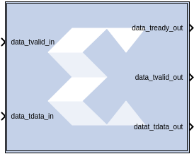
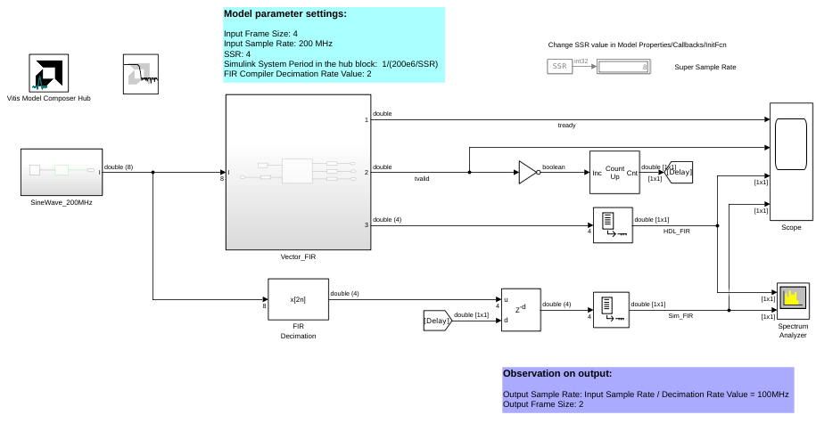
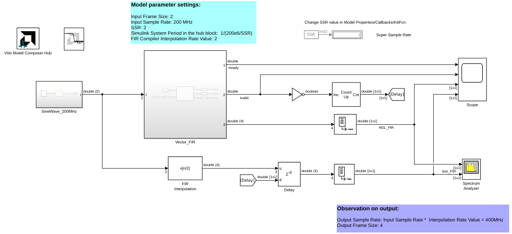

<!-- Library: hdlSSR -->

# Vector FIR

The Vector FIR block supports FIR filtering for vector type inputs.

## Description

This Vector FIR Compiler block provides a way to generate highly
parameterizable, area-efficient, high-performance FIR filters with an
AXI4-Stream-compliant interface.

### AXI Ports that are Unique to this Block

This block exposes the AXI CONFIG channel as a group of separate ports
based on sub-field names. The sub-field ports are described as follows:

Configuration Channel Input Signals:

|                   |                                                                                                                                                                                                                                                                                                                                                                                                                                          |
|-------------------|------------------------------------------------------------------------------------------------------------------------------------------------------------------------------------------------------------------------------------------------------------------------------------------------------------------------------------------------------------------------------------------------------------------------------------------|
| config_tdata_fsel | A sub-field port that represents the fsel field in the Configuration Channel vector. fsel is used to select the active filter set. This port is exposed when the number of coefficient sets is greater than one. Refer to the FIR Compiler LogiCORE IP Product Guide ([PG149](https://docs.xilinx.com/access/sources/framemaker/map?isLatest=true&ft:locale=en-US&url=pg149-fir-compiler)) starting on page 5 for an explanation of the bits in this field. |

## Parameters

### Filter Specification tab  
Parameters specific to the Filter Specification tab are as follows:

#### Filter Coefficients  
##### Coefficient Vector  
Specifies the coefficient vector as a single MATLAB row vector. The
number of taps is inferred from the length of the MATLAB row vector. If
multiple coefficient sets are specified, then each set is appended to
the previous set in the vector. It is possible to enter these
coefficients using the [FDATool](../../UTIL/Xilinx_FDATool_Interface_Block/README.md) block as well.

##### Number of Coefficients Sets  
The number of sets of filter coefficients to be implemented. The value
specified must divide without remainder into the number of coefficients.

##### Use Reloadable Coefficients  
Check to add the coefficient reload ports to the block. The set of data
loaded into the reload channel will not take action until triggered by a
re-configuration synchronization event. Refer to the FIR Compiler LogiCORE IP Product Guide ([PG149](https://docs.xilinx.com/access/sources/framemaker/map?isLatest=true&ft:locale=en-US&url=pg149-fir-compiler))
for a more detailed explanation of the RELOAD Channel interface timing.
This block supports the xlGetReloadOrder function. See the Model
Composer Utility function xlGetReloadOrder for details.

#### Filter Specification  
##### Filter Type  
###### Single_Rate  
The data rate of the input and the output are the same.

###### Interpolation  
The data rate of the output is faster than the input by a factor
specified by the Interpolation Rate value.

###### Decimation  
The data rate of the output is slower than the input by a factor
specified in the Decimation Rate Value.

##### Rate Change Type  
This field is applicable to Interpolation and Decimation filter types.
For Vector FIRs, only an Integer rate change is supported.

##### Interpolation Rate Value  
This field is applicable to all Interpolation filter types. The
value provided in this field defines the up-sampling factor.

##### Decimation Rate Value  
This field is applicable to all Decimation filter
types. The value provided in this field defines the down-sampling factor.

##### Super Sample Rate (SSR)
This configurable GUI parameter is primarily
used to control processing of multiple data samples on every sample
period. This blocks enable 1-D vector support for the primary block
operation.
- If the filter type is Interpolation, the output vector size (SSR value
  on the output side) is equal to the SSR value on the input side
  multiplied by Interpolation Rate Value.
- If the filter type is Decimation, the output vector size is equal to
  the SSR value on the input side divided by Decimation Rate Value.

### Implementation tab  
Parameters specific to the Implementation tab are as follows:

#### Coefficient Options  
##### Coefficient Type  
Specify Signed or Unsigned.

##### Quantization  
Specifies the quantization method to be used for quantizing the
coefficients. This can be set to one of the following:

- Integer_Coefficients
- Quantize_Only
- Maximize_Dynamic_Range
- Normalize_to_Centre_Coefficient

##### Coefficient Width  
Specifies the number of bits used to represent the coefficients.

##### Best Precision Fractional Bits  
When selected, the coefficient fractional width is automatically set to
maximize the precision of the specified filter coefficients.

##### Coefficient Fractional Bits  
Specifies the binary point location in the coefficients datapath options

##### Coefficients Structure  
Specifies the coefficient structure. Depending on the coefficient
  structure, optimizations are made in the core to reduce the amount of
  hardware required to implement a particular filter configuration. The
  selected structure can be any of the following:
- Inferred
- Non-Symmetric
- Symmetric

The vector of coefficients specified must match the structure specified
unless Inferred from coefficients is selected in which case the
structure is determined automatically from these coefficients.

#### Datapath Options  
##### Output Rounding Mode  
Choose one of the following:
- Full_Precision
- Truncate_LSBs
- Non_Symmetric_Rounding_Down
- Non_Symmetric_Rounding_Up
- Symmetric_Rounding_to_Zero
- Symmetric_Rounding_to_Infinity
- Convergent_Rounding_to_Even
- Convergent_Rounding_to_Odd

##### Output Width  
Specify the output width. Edit box activated only if the Rounding mode
is set to a value other than Full_Precision.

### Detailed Implementation tab  
Parameters specific to the Detailed Implementation tab are as follows:

#### Filter Architecture  
The following two filter architectures are supported.
- Systolic_Multiply_Accumulate
- Transpose_Multiply_Accumulate

  **Note**: When selecting the Transpose Multiply-Accumulate architecture,
  these limitations apply:
- Symmetry is not exploited. If the Coefficient Vector specified on
    the Filter Specification tab is detected as symmetric, the FIR
    Compiler 7.2 block parameters dialog box will not allow you to
    select Transpose Multiply Accumulate.
- Multiple interleaved channels are not supported.

#### Optimization Options  
Specifies if the core is required to operate at maximum possible speed
(“Speed” option) or minimum area (“Area” option). The “Area” option is
the recommended default and will normally achieve the best speed and
area for the design, however in certain configurations, the “Speed”
setting might be required to improve performance at the expense of
overall resource usage (this setting normally adds pipeline registers in
critical paths).

##### Goal  
- Area
- Speed
- Custom

##### List  
A comma delimited list that specifies which optimizations are
implemented by the block. The optimizations are as follows.
##### Data_Path_Fanout  
Adds additional pipeline registers on the data memory outputs to
minimize fan-out. Useful when implementing large data width filters
requiring multiple DSP slices per multiply-add unit.

##### Pre-Adder_Pipeline  
Pipelines the pre-adder when implemented using fabric resources. This
may occur when a large coefficient width is specified.

##### Coefficient_Fanout  
Adds additional pipeline registers on the coefficient memory outputs to
minimize fan-out. Useful for Parallel channels or large coefficient
width filters requiring multiple DSP slices per multiply-add unit.

##### Control_Path_Fanout  
Adds additional pipeline registers to control logic when Parallel
channels have been specified.

##### Control_Column_Fanout  
Adds additional pipeline registers to control logic when multiple DSP
columns are required to implement the filter.

##### Control_Broadcast_Fanout  
Adds additional pipeline registers to control logic for fully parallel
(one clock cycle per channel per input sample) symmetric filter
implementations.

##### Control_LUT_Pipeline  
Pipelines the Look-up tables required to implement the control logic for
Advanced Channel sequences.

##### No_BRAM_Read_First_Mode  
Specifies that Block RAM READ-FIRST mode should not be used.

##### Increased speed  
Multiple DSP slice columns are required for non-symmetric filter
implementations.

##### Other  
Miscellaneous optimizations.

**Note**: All optimizations may be specified but are only implemented when
relevant to the core configuration.

#### Memory Options  
The memory type for MAC implementations can either be user-selected or
chosen automatically to suit the best implementation options. Note that
a choice of “Distributed” might result in a shift register
implementation where appropriate to the filter structure. Forcing the
RAM selection to be either Block or Distributed should be used with
caution, as inappropriate use can lead to inefficient resource usage -
the default Automatic mode is recommended for most applications.

##### Data Buffer Type  
Specifies the type of memory used to store data samples.

##### Coefficient Buffer Type  
Specifies the type of memory used to store the coefficients.

##### Input Buffer Type  
Specifies the type of memory to be used to implement the data input
buffer, where present.

##### Output Buffer type  
Specifies the type of memory to be used to implement the data output
buffer, where present.

##### Preference for other storage  
Specifies the type of memory to be used to implement general storage in
the datapath.

#### DSP Slice Column Options  
##### Multi-Column Support  
For device families with DSP slices, implementations of large high speed
filters might require chaining of DSP slice elements across multiple
columns. Where applicable (the feature is only enabled for multi-column
devices), you can select the method of folding the filter structure
across the multiple-columns, which can be Automatic (based on the
selected device for the project) or Custom (you select the length of the
first and subsequent columns).

##### Inter-Column Pipe Length  
Pipeline stages are required to connect between the columns, with the
level of pipelining required being depending on the required system
clock rate, the chosen device and other system-level parameters. The
choice of this parameter is always left for you to specify.

### Interface tab  
#### Data Channel Options  
##### Output TREADY  
This field enables the data_tready port. With this port enabled, the
block will support back-pressure. Without the port, back-pressure is not
supported, but resources are saved and performance is likely to be
higher.

#### Control Options  
##### ACLKEN  
Active-High clock enable. Available for MAC-based FIR implementations.

##### ARESETn (active low)  
Active-low synchronous clear input that always takes priority over
ACLKEN. A minimum ARESETn active pulse of two cycles is required, since
the signal is internally registered for performance. A pulse of one
cycle resets the control and datapath of the core, but the response to
the pulse is not in the cycle immediately following.

Other parameters used by this block are explained in the topic [Common
Options in Block Parameter Dialog
Boxes](../../GEN/common-options/README.md).

## Examples

***Click on the images below to open each model.***

**Decimation Filter:**

<!--
DESCRIPTION:
Model: Vector_FIR_Ex1
Generated: 09-Jan-2026 13:53:15

Vitis Model Composer Configuration:
  Target Device: Versal VCK190 Evaluation Platform (xcvc1902-vsva2197-2MP-e-S)

Vitis Model Composer Blocks:
  - HDL: Constant
  - HDL: Gateway Out
  - HDL: Vector FIR
  - HDL: Vector Real Gateway In
  - HDL: Vector Real Gateway Out
  - HDL: FDATool

Description:
This MATLAB script creates a Vitis Model Composer Simulink model that uses the AI Engine Constant, Gateway Out, Vector FIR, Vector Real Gateway In, Vector Real Gateway Out and FDATool blocks. A 100kHz real input signal is provided to the block,  and results are compared against a Simulink reference implementation.

-->

<!--
MATLAB CREATION SCRIPT:

% create_Vector_FIR_Ex1_model.m
% Auto-generated script to recreate the Vector_FIR_Ex1 Simulink model
% Generated on: 09-Jan-2026 13:53:15

%% Model Configuration
modelName = 'Vector_FIR_Ex1_recreated';

%% Create New Model
if bdIsLoaded(modelName)
    close_system(modelName, 0);
end

new_system(modelName);
open_system(modelName);
fprintf('Created new model: %s\n', modelName);

%% Add Vitis Model Composer Hub Block
hubBlockPath = [modelName '/Vitis Model Composer Hub'];
add_block('vmcUtilities/Vitis Model Composer Hub', hubBlockPath, ...
    'Position', [232 -122 287 -69]);

hubBlk = xmcFindHubBlock(modelName);
vmchub_set_param(hubBlk, modelName, 'SelectHardware', 'Versal VCK190 Evaluation Platform (xcvc1902-vsva2197-2MP-e-S)');

%% Add Top-Level Blocks
add_block('built-in/Constant', [modelName '/Constant7'], ...
    'Position', [965 -115 1000 -95]);
set_param([modelName '/Constant7'], ...
    'Value', 'SSR', ...
    'VectorParams1D', 'on', ...
    'OutMin', '[]', ...
    'OutMax', '[]', ...
    'OutDataTypeStr', 'int32', ...
    'LockScale', 'off', ...
    'SampleTime', '-1', ...
    'FramePeriod', 'inf');
add_block('dspswit3/Counter', [modelName '/Counter'], ...
    'Position', [1025 15 1095 75]);
set_param([modelName '/Counter'], ...
    'Direction', 'Up', ...
    'CountEvent', 'Non-zero sample', ...
    'CounterSize', 'User defined', ...
    'MaxCount', '500', ...
    'InitialCount', '0', ...
    'Output', 'Count', ...
    'HitValue', '32', ...
    'ResetInput', 'off', ...
    'SamplesPerFrame', '1', ...
    'Ts', '1', ...
    'CntDtype', 'double', ...
    'HitDtype', 'Logical');
add_block('built-in/Delay', [modelName '/Delay'], ...
    'Position', [900 210 955 270]);
set_param([modelName '/Delay'], ...
    'DelayLengthSource', 'Input port', ...
    'DelayLength', '2', ...
    'DelayLengthUpperLimit', '1000', ...
    'InitialConditionSource', 'Dialog', ...
    'InitialCondition', '0.0', ...
    'ExternalReset', 'None', ...
    'ShowEnablePort', 'off', ...
    'PreventDirectFeedthrough', 'off', ...
    'DiagnosticForDelayLength', 'None', ...
    'RemoveDelayLengthCheckInGeneratedCode', 'off', ...
    'InputProcessing', 'Elements as channels (sample based)', ...
    'UseCircularBuffer', 'off', ...
    'SampleTime', '-1', ...
    'StateMustResolveToSignalObject', 'off', ...
    'StateStorageClass', 'Auto');
add_block('built-in/Display', [modelName '/Display4'], ...
    'Position', [1035 -115 1110 -95]);
set_param([modelName '/Display4'], ...
    'Format', 'short', ...
    'Decimation', '1', ...
    'Floating', 'off');
add_block('hdlUtilities/FDATool', [modelName '/FDATool'], ...
    'Position', [365 -122 414 -66]);
set_param([modelName '/FDATool'], ...
    'infoedit', 'FDATool', ...
    'ShowPortLabels', '[]', ...
    'has_advanced_control', '0', ...
    'sggui_pos', '-1,-1,-1,-1', ...
    'block_type', 'fdatool', ...
    'sg_icon_stat', '54,56,-1,-1,blue,white,0,07734,right,,[ ],[ ]', ...
    'sg_mask_display', 'fprintf('''',''COMMENT: begin icon graphics''); patch([0 54 54 0 0 ],[0 0 56 56 0 ],[1 1 1 ]); plot([0 54 54 0 0 ],[0 0 56 56 0 ]); patch([11.425 21.54 28.54 35.54 42.54 28.54 18.425 11.425 ],[35.77 35.77 42.77 35.77 42.77 42.77 42.77 35.77 ],[0.839 0.874 0.937 ]); patch([18.425 28.54 21.54 11.425 18.425 ],[28.77 28.77 35.77 35.77 28.77 ],[0.77 0.82 0.91 ]); patch([11.425 21.54 28.54 18.425 11.425 ],[21.77 21.77 28.77 28.77 21.77 ],[0.839 0.874 0.937 ]); patch([18.425 42.54 35.54 28.54 21.54 11.425 18.425 ],[14.77 14.77 21.77 14.77 21.77 21.77 14.77 ],[0.77 0.82 0.91 ]); fprintf('''',''COMMENT: end icon graphics''); fprintf('''',''COMMENT: begin icon text''); fprintf('''',''COMMENT: end icon text'');plot(foox,foo); ');
add_block('dspmlti4/FIR Decimation', [modelName '/FIR Decimation'], ...
    'Position', [570 196 655 254]);
set_param([modelName '/FIR Decimation'], ...
    'FilterSource', 'Dialog parameters', ...
    'h', 'double(xlfda_numerator(strcat(bdroot,''/FDATool'')))', ...
    'D', '2', ...
    'filtStruct', 'Direct form', ...
    'FilterObject', 'FDECIM', ...
    'InputProcessing', 'Columns as channels (frame based)', ...
    'framing', 'Enforce single-rate processing', ...
    'AllowArbitraryInputLength', 'off', ...
    'outputBufInitCond', '0', ...
    'roundingMode', 'Floor', ...
    'overflowMode', 'off', ...
    'firstCoeffMode', 'Binary point scaling', ...
    'firstCoeffWordLength', '16', ...
    'firstCoeffFracLength', '14', ...
    'firstCoeffDataTypeStr', 'fixdt(1,16,14)', ...
    'firstCoeffMin', '[]', ...
    'firstCoeffMax', '[]', ...
    'firstCoeffLastDataTypeStr', 'fixdt(1,16,14)', ...
    'prodOutputMode', 'Binary point scaling', ...
    'prodOutputWordLength', '24', ...
    'prodOutputFracLength', '22', ...
    'prodOutputDataTypeStr', 'fixdt(1,24,22)', ...
    'prodOutputLastDataTypeStr', 'fixdt(1,24,22)', ...
    'accumMode', 'Binary point scaling', ...
    'accumWordLength', '31', ...
    'accumFracLength', '28', ...
    'accumDataTypeStr', 'fixdt(1,31,28)', ...
    'accumLastDataTypeStr', 'fixdt(1,31,28)', ...
    'outputMode', 'Binary point scaling', ...
    'outputWordLength', '31', ...
    'outputFracLength', '28', ...
    'outputDataTypeStr', 'fixdt(1,31,28)', ...
    'outputMin', '[]', ...
    'outputMax', '[]', ...
    'outputLastDataTypeStr', 'fixdt(1,31,28)', ...
    'LockScale', 'off');
add_block('built-in/From', [modelName '/From'], ...
    'Position', [790 241 830 269]);
set_param([modelName '/From'], ...
    'GotoTag', 'Delay', ...
    'IconDisplay', 'Tag');
add_block('built-in/Goto', [modelName '/Goto'], ...
    'Position', [1130 30 1170 60]);
set_param([modelName '/Goto'], ...
    'GotoTag', 'Delay', ...
    'IconDisplay', 'Tag', ...
    'TagVisibility', 'local');
add_block('built-in/Logic', [modelName '/NOT'], ...
    'Position', [925 29 955 61]);
set_param([modelName '/NOT'], ...
    'Operator', 'NOT', ...
    'Inputs', '2', ...
    'IconShape', 'distinctive', ...
    'AllPortsSameDT', 'off', ...
    'OutDataTypeStr', 'boolean', ...
    'SampleTime', '-1');
add_block('built-in/Scope', [modelName '/Scope'], ...
    'Position', [1280 -53 1340 113]);
set_param([modelName '/Scope'], ...
    'OpenAtSimulationStart', 'off', ...
    'DisplayFullPath', 'off', ...
    'NumInputPorts', '4', ...
    'LayoutDimensionsString', '[3 1]', ...
    'SampleTime', '-1', ...
    'FrameBasedProcessingString', 'Elements as channels (sample based)', ...
    'MaximizeAxes', 'Off', ...
    'AxesScaling', 'Manual', ...
    'AxesScalingNumUpdates', '10', ...
    'TimeSpan', 'Auto', ...
    'TimeSpanOverrunAction', 'Wrap', ...
    'TimeUnits', 'None', ...
    'TimeDisplayOffset', '0', ...
    'TimeAxisLabels', 'Bottom displays only', ...
    'ShowTimeAxisLabel', 'off', ...
    'ActiveDisplayString', '1', ...
    'Title', '%<SignalLabel>', ...
    'ShowLegend', 'on', ...
    'ShowGrid', 'on', ...
    'PlotAsMagnitudePhase', 'off', ...
    'ActiveDisplayYMinimum', '-0.125', ...
    'ActiveDisplayYMaximum', '1.125', ...
    'DataLoggingLimitDataPoints', 'off', ...
    'DataLoggingMaxPoints', '5000', ...
    'DataLoggingDecimateData', 'off', ...
    'DataLoggingDecimation', '2', ...
    'DataLogging', 'off', ...
    'DataLoggingVariableName', 'ScopeData', ...
    'DataLoggingSaveFormat', 'Dataset');
add_block('built-in/SpectrumAnalyzer', [modelName '/Spectrum Analyzer'], ...
    'Position', [1290 202 1335 253]);
set_param([modelName '/Spectrum Analyzer'], ...
    'NumInputPorts', '2', ...
    'OpenAtSimulationStart', 'on', ...
    'WindowPosition', '[1438.000000,398.000000,800.000000,500.000000,]', ...
    'InputDomain', 'Time', ...
    'SpectrumType', 'Power', ...
    'ViewType', 'Spectrum', ...
    'Method', 'Filter bank', ...
    'SampleRateSource', 'Inherited', ...
    'SampleRate', '10000', ...
    'PlotAsTwoSidedSpectrum', 'on', ...
    'FrequencyScale', 'Linear', ...
    'PlotType', 'Line', ...
    'AxesScaling', 'Auto', ...
    'AxesScalingNumUpdates', '100', ...
    'FrequencyResolutionMethod', 'RBW', ...
    'RBWSource', 'Auto', ...
    'RBW', '9.76', ...
    'WindowInvariantSamplesPerUpdate', 'off', ...
    'WindowLength', '1024', ...
    'FFTLengthSource', 'Auto', ...
    'FFTLength', '1024', ...
    'FilterSharpness', '0.3', ...
    'FrequencySpan', 'Full', ...
    'Span', '100000000', ...
    'CenterFrequency', '0', ...
    'StartFrequency', '-50000000', ...
    'StopFrequency', '50000000', ...
    'InputUnits', 'dBm', ...
    'FrequencyVectorSource', 'Auto', ...
    'FrequencyVector', '[-5000,5000]', ...
    'Window', 'Hann', ...
    'CustomWindow', 'hann', ...
    'SidelobeAttenuation', '60', ...
    'OverlapPercent', '0', ...
    'AveragingMethod', 'VBW', ...
    'SpectralAverages', '1', ...
    'ForgettingFactor', '0.9', ...
    'VBWSource', 'Auto', ...
    'VBW', '9.76', ...
    'SpectrumUnits', 'dBm', ...
    'FullScaleSource', 'Auto', ...
    'FullScale', '1', ...
    'ReferenceLoad', '1', ...
    'FrequencyOffset', '0', ...
    'SpectrogramChannel', '1', ...
    'TimeResolutionSource', 'Auto', ...
    'TimeResolution', '1e-3', ...
    'TimeSpanSource', 'Auto', ...
    'TimeSpan', '0.1', ...
    'MaximizeAxes', 'Auto', ...
    'PlotNormalTrace', 'on', ...
    'PlotMaxHoldTrace', 'off', ...
    'PlotMinHoldTrace', 'off', ...
    'YLimits', '[-57.02719475,31.35659426]', ...
    'ColorLimits', '[-80,20]', ...
    'Colormap', 'jet', ...
    'ShowGrid', 'on', ...
    'ShowLegend', 'off', ...
    'ShowColorbar', 'on', ...
    'ChannelNames', '[]', ...
    'AxesLayout', 'Vertical');
add_block('built-in/Unbuffer', [modelName '/Unbuffer'], ...
    'Position', [1030 95 1085 145]);
set_param([modelName '/Unbuffer'], ...
    'ic', '0');
add_block('built-in/Unbuffer', [modelName '/Unbuffer1'], ...
    'Position', [1030 215 1080 265]);
set_param([modelName '/Unbuffer1'], ...
    'ic', '0');
add_block('vmcUtilities/Vitis Model Composer Hub', [modelName '/Vitis Model Composer Hub'], ...
    'Position', [232 -122 287 -69]);
set_param([modelName '/Vitis Model Composer Hub'], ...
    'CodeGeneration', 'off', ...
    'SubsystemName', 'Vector_FIR', ...
    'StartColumn', '1', ...
    'NumberOfColumns', '1', ...
    'TargetDirectory', './code_hw_emu', ...
    'exportDesign', 'off', ...
    'analyzeDesign', 'off', ...
    'validateDesignOnHw', 'off', ...
    'ExportType', 'HW Code', ...
    'IpVendor', 'xilinx.com', ...
    'IpLibrary', 'hls', ...
    'IpVersion', '1.0', ...
    'IpHWLanguage', 'Verilog', ...
    'AieCompilerOptions', '{}', ...
    'CreateTestbench', 'off', ...
    'TestbenchStackSize', '10', ...
    'RunRtlSim', 'off', ...
    'RunCSim', 'off', ...
    'RunAieSim', 'on', ...
    'AieSimTimeout', '50000', ...
    'RunAieSimProfiling', 'off', ...
    'LaunchVitisAnalyzer', 'off', ...
    'PlotOutput', 'off', ...
    'GenHwImage', 'off', ...
    'GenLibadfXo', 'on', ...
    'GenHwValidationCode', 'off', ...
    'PlatformType', 'Specify Platform', ...
    'Platform', '/proj/xbuilds/SWIP/2024.1_0306_2227/installs/lin64/Vitis/2024.1/base_platforms/xilinx_vck190_base_202410_1/xilinx_vck190_base_202410_1.xpfm', ...
    'HwSystemType', 'Baremetal', ...
    'HwValidationTarget', 'hw_emu', ...
    'ProjDevice', 'Versal VCK190 Evaluation Platform (xcvc1902-vsva2197-2MP-e-S)', ...
    'SamplePeriod', '-1', ...
    'ClockFrequency', '200', ...
    'DataPathParallelism', '1', ...
    'xilinxfamily', 'versalaicore', ...
    'part', 'xcvc1902', ...
    'speed', '-2MP-e-S', ...
    'package', 'vsva2197', ...
    'directory', './netlist/ip/Vector_FIR/src', ...
    'testbench', 'off', ...
    'incr_netlist', 'off', ...
    'synthesis_tool', 'Vivado', ...
    'clock_wrapper', 'Clock Enables', ...
    'dbl_ovrd', 'According to Block Masks', ...
    'dcm_input_clock_period', '10', ...
    'sysclk_period', '20', ...
    'simulink_period', '1/(200e6/SSR)', ...
    'eval_field', '0', ...
    'LogFileName', '/proj/xsjhdstaff4/abehbood/vmc_examples/gitent_ws/Examples/AIENGINE_plus_PL/AIE_HDL/multirate_filter_chain/code_hw_emu/model_composer.log', ...
    'NThreads', '4');

%% Create SineWave_200MHz Subsystem
add_block('built-in/SubSystem', [modelName '/SineWave_200MHz'], ...
    'Position', [220 12 335 78]);

% Remove default blocks
defaultBlocks = find_system([modelName '/SineWave_200MHz'], 'SearchDepth', 1, 'Type', 'block');
for i = 1:length(defaultBlocks)
    if ~strcmp(defaultBlocks{i}, [modelName '/SineWave_200MHz'])
        delete_block(defaultBlocks{i});
    end
end

add_block('built-in/Reshape', [[modelName '/SineWave_200MHz'] '/Convert 2-D to 1-D'], ...
    'Position', [140 39 200 81]);
set_param([[modelName '/SineWave_200MHz'] '/Convert 2-D to 1-D'], ...
    'OutputDimensionality', '1-D array', ...
    'OutputDimensions', '[1,1]');
add_block('dspsrcs4/Sine Wave', [[modelName '/SineWave_200MHz'] '/Sine Wave'], ...
    'Position', [25 38 70 82]);
set_param([[modelName '/SineWave_200MHz'] '/Sine Wave'], ...
    'Amplitude', '1', ...
    'Frequency', '100e3', ...
    'Phase', '0', ...
    'SampleMode', 'Discrete', ...
    'OutComplex', 'Real', ...
    'CompMethod', 'Trigonometric fcn', ...
    'TableSize', 'Speed', ...
    'SampleTime', '1/200e6', ...
    'SamplesPerFrame', 'SSR', ...
    'ResetState', 'Restart at time zero', ...
    'OutputFrames', 'off', ...
    'additionalParams', 'off', ...
    'allowOverrides', 'on', ...
    'dataType', 'double', ...
    'wordLen', '16', ...
    'udDataType', 'sfix(16)', ...
    'fracBitsMode', 'Best precision', ...
    'numFracBits', '15', ...
    'OutDataTypeStr', 'double', ...
    'LastOutDataTypeStr', 'double');
add_block('built-in/Outport', [[modelName '/SineWave_200MHz'] '/I'], ...
    'Position', [285 53 315 67]);
set_param([[modelName '/SineWave_200MHz'] '/I'], ...
    'Port', '1', ...
    'StorageClass', 'Auto', ...
    'IconDisplay', 'Port number', ...
    'OutputFunctionCall', 'off', ...
    'OutMin', '[]', ...
    'OutMax', '[]', ...
    'OutDataTypeStr', 'Inherit: auto', ...
    'LockScale', 'off', ...
    'BusOutputAsStruct', 'off', ...
    'BusVirtuality', 'inherit', ...
    'DataMode', 'inherit', ...
    'Unit', 'inherit', ...
    'PortDimensions', '-1', ...
    'VarSizeSig', 'Inherit', ...
    'SampleTime', '-1', ...
    'SignalType', 'auto', ...
    'EnsureOutportIsVirtual', 'off', ...
    'OutputWhenDisabled', 'held', ...
    'InitialOutput', '[]', ...
    'MustResolveToSignalObject', 'off', ...
    'OutputWhenUnConnected', 'off', ...
    'OutputWhenUnconnectedValue', '0', ...
    'VectorParamsAs1DForOutWhenUnconnected', 'on');

% Connect blocks in SineWave_200MHz
add_line([modelName '/SineWave_200MHz'], 'Convert 2-D to 1-D/2', 'I/2', 'autorouting', 'on');
add_line([modelName '/SineWave_200MHz'], 'Sine Wave/2', 'Convert 2-D to 1-D/2', 'autorouting', 'on');

%% Create Vector_FIR Subsystem
add_block('built-in/SubSystem', [modelName '/Vector_FIR'], ...
    'Position', [510 -65 715 155]);

% Remove default blocks
defaultBlocks = find_system([modelName '/Vector_FIR'], 'SearchDepth', 1, 'Type', 'block');
for i = 1:length(defaultBlocks)
    if ~strcmp(defaultBlocks{i}, [modelName '/Vector_FIR'])
        delete_block(defaultBlocks{i});
    end
end

add_block('built-in/Inport', [[modelName '/Vector_FIR'] '/I'], ...
    'Position', [-25 123 5 137]);
set_param([[modelName '/Vector_FIR'] '/I'], ...
    'Port', '1', ...
    'IconDisplay', 'Port number', ...
    'OutputFunctionCall', 'off', ...
    'OutMin', '[]', ...
    'OutMax', '[]', ...
    'OutDataTypeStr', 'Inherit: auto', ...
    'LockScale', 'off', ...
    'BusOutputAsStruct', 'off', ...
    'BusVirtuality', 'inherit', ...
    'Unit', 'inherit', ...
    'PortDimensions', '-1', ...
    'VarSizeSig', 'Inherit', ...
    'SampleTime', '-1', ...
    'SignalType', 'auto', ...
    'LatchByDelayingOutsideSignal', 'off', ...
    'LatchInputForFeedbackSignals', 'off', ...
    'Interpolate', 'on', ...
    'DataMode', 'inherit', ...
    'MessageQueueUseDefaultAttributes', 'on', ...
    'MessageQueueCapacity', '1', ...
    'MessageQueueType', 'LIFO', ...
    'MessageQueueOverwriting', 'on');
add_block('hdlBasic/Constant', [[modelName '/Vector_FIR'] '/Constant'], ...
    'Position', [80 47 135 73]);
set_param([[modelName '/Vector_FIR'] '/Constant'], ...
    'const', '1.0', ...
    'gui_display_data_type', 'Boolean', ...
    'arith_type', 'Boolean', ...
    'n_bits', '16', ...
    'bin_pt', '14', ...
    'preci_type', 'Single', ...
    'exp_width', '8', ...
    'frac_width', '24', ...
    'explicit_period', 'on', ...
    'period', '1/(200e6/SSR)');
add_block('hdlBasic/Gateway Out', [[modelName '/Vector_FIR'] '/Gateway Out'], ...
    'Position', [480 40 540 60]);
set_param([[modelName '/Vector_FIR'] '/Gateway Out'], ...
    'inherit_from_input', 'off', ...
    'bool_to_boolean', 'off', ...
    'hdl_port', 'on', ...
    'rows', '1', ...
    'columns', '1', ...
    'UseAsDAC', 'off', ...
    'DACChannel', '''1''', ...
    'interface', 'None', ...
    'automatic_assignment', 'on', ...
    'address_offset', 'hex2dec(''00'')', ...
    'intf_name', '''''', ...
    'intf_description', '''''', ...
    'timing_constraint', 'None', ...
    'locs_specified', 'off', ...
    'LOCs', '{}', ...
    'io_standard', '{}');
add_block('hdlBasic/Gateway Out', [[modelName '/Vector_FIR'] '/Gateway Out1'], ...
    'Position', [480 85 540 105]);
set_param([[modelName '/Vector_FIR'] '/Gateway Out1'], ...
    'inherit_from_input', 'off', ...
    'bool_to_boolean', 'off', ...
    'hdl_port', 'on', ...
    'rows', '1', ...
    'columns', '1', ...
    'UseAsDAC', 'off', ...
    'DACChannel', '''1''', ...
    'interface', 'None', ...
    'automatic_assignment', 'on', ...
    'address_offset', 'hex2dec(''00'')', ...
    'intf_name', '''''', ...
    'intf_description', '''''', ...
    'timing_constraint', 'None', ...
    'locs_specified', 'off', ...
    'LOCs', '{}', ...
    'io_standard', '{}');
add_block('hdlSSR/Vector FIR', [[modelName '/Vector_FIR'] '/Vector FIR'], ...
    'Position', [220 24 395 166]);
set_param([[modelName '/Vector_FIR'] '/Vector FIR'], ...
    'coefficientvector', 'double(xlfda_numerator(strcat(bdroot,''/FDATool'')))', ...
    'coefficient_sets', '1', ...
    'coefficient_reload', 'off', ...
    'filter_type', 'Decimation', ...
    'rate_change_type', 'Integer', ...
    'interpolation_rate', '1', ...
    'decimation_rate', '2', ...
    'sg_ssr', 'SSR', ...
    'coefficient_sign', 'Signed', ...
    'quantization', 'Quantize_Only', ...
    'coefficient_width', '16', ...
    'bestprecision', 'off', ...
    'coefficient_fractional_bits', '14', ...
    'coefficient_structure', 'Inferred', ...
    'output_rounding_mode', 'Full_Precision', ...
    'output_width', '24', ...
    'filter_architecture', 'Systolic_Multiply_Accumulate', ...
    'optimization_goal', 'Area', ...
    'optimization_list', '''None''', ...
    'data_buffer_type', 'Automatic', ...
    'coefficient_buffer_type', 'Automatic', ...
    'input_buffer_type', 'Automatic', ...
    'output_buffer_type', 'Automatic', ...
    'preference_for_other_storage', 'Automatic', ...
    'multi_column_support', 'Automatic', ...
    'columnconfig', '''1''', ...
    'inter_column_pipe_length', '4', ...
    'm_data_has_tready', 'off', ...
    'has_aclken', 'off', ...
    'has_aresetn', 'off', ...
    'reset_data_vector', 'on');
add_block('hdlSSR/Vector Real Gateway In', [[modelName '/Vector_FIR'] '/Vector Real Gateway In'], ...
    'Position', [95 120 155 140]);
set_param([[modelName '/Vector_FIR'] '/Vector Real Gateway In'], ...
    'gui_display_data_type', 'Fixed-point', ...
    'arith_type', 'Signed (2''s comp)', ...
    'n_bits', '16', ...
    'bin_pt', '14', ...
    'preci_type', 'Single', ...
    'exp_width', '8', ...
    'frac_width', '24', ...
    'quantization', 'Round  (unbiased: +/- Inf)', ...
    'overflow', 'Saturate', ...
    'period', '1/(200e6/SSR)', ...
    'sg_ssr', 'SSR', ...
    'UseAsADC', 'off', ...
    'ADCChannel', '''1''', ...
    'interface', 'None', ...
    'automatic_assignment', 'on', ...
    'address_offset', 'hex2dec(''00'')', ...
    'intf_name', '''''', ...
    'intf_description', '''''', ...
    'default_value', '0', ...
    'timing_constraint', 'None', ...
    'locs_specified', 'off', ...
    'LOCs', '{}', ...
    'io_standard', '{}', ...
    'inherit_from_input', 'off');
add_block('hdlSSR/Vector Real Gateway Out', [[modelName '/Vector_FIR'] '/Vector Real Gateway Out'], ...
    'Position', [480 130 540 150]);
set_param([[modelName '/Vector_FIR'] '/Vector Real Gateway Out'], ...
    'inherit_from_input', 'off', ...
    'hdl_port', 'on', ...
    'sg_ssr', 'SSR/2', ...
    'rows', '1', ...
    'columns', '1', ...
    'UseAsDAC', 'off', ...
    'DACChannel', '''1''', ...
    'interface', 'None', ...
    'automatic_assignment', 'on', ...
    'address_offset', 'hex2dec(''00'')', ...
    'intf_name', '''''', ...
    'intf_description', '''''', ...
    'timing_constraint', 'None', ...
    'locs_specified', 'off', ...
    'LOCs', '{}', ...
    'io_standard', '{}');
add_block('built-in/Outport', [[modelName '/Vector_FIR'] '/Out1'], ...
    'Position', [615 43 645 57]);
set_param([[modelName '/Vector_FIR'] '/Out1'], ...
    'Port', '1', ...
    'StorageClass', 'Auto', ...
    'IconDisplay', 'Port number', ...
    'OutputFunctionCall', 'off', ...
    'OutMin', '[]', ...
    'OutMax', '[]', ...
    'OutDataTypeStr', 'Inherit: auto', ...
    'LockScale', 'off', ...
    'BusOutputAsStruct', 'off', ...
    'BusVirtuality', 'inherit', ...
    'DataMode', 'inherit', ...
    'Unit', 'inherit', ...
    'PortDimensions', '-1', ...
    'VarSizeSig', 'Inherit', ...
    'SampleTime', '-1', ...
    'SignalType', 'auto', ...
    'EnsureOutportIsVirtual', 'off', ...
    'OutputWhenDisabled', 'held', ...
    'InitialOutput', '[]', ...
    'MustResolveToSignalObject', 'off', ...
    'OutputWhenUnConnected', 'off', ...
    'OutputWhenUnconnectedValue', '0', ...
    'VectorParamsAs1DForOutWhenUnconnected', 'on');
add_block('built-in/Outport', [[modelName '/Vector_FIR'] '/Out2'], ...
    'Position', [620 88 650 102]);
set_param([[modelName '/Vector_FIR'] '/Out2'], ...
    'Port', '2', ...
    'StorageClass', 'Auto', ...
    'IconDisplay', 'Port number', ...
    'OutputFunctionCall', 'off', ...
    'OutMin', '[]', ...
    'OutMax', '[]', ...
    'OutDataTypeStr', 'Inherit: auto', ...
    'LockScale', 'off', ...
    'BusOutputAsStruct', 'off', ...
    'BusVirtuality', 'inherit', ...
    'DataMode', 'inherit', ...
    'Unit', 'inherit', ...
    'PortDimensions', '-1', ...
    'VarSizeSig', 'Inherit', ...
    'SampleTime', '-1', ...
    'SignalType', 'auto', ...
    'EnsureOutportIsVirtual', 'off', ...
    'OutputWhenDisabled', 'held', ...
    'InitialOutput', '[]', ...
    'MustResolveToSignalObject', 'off', ...
    'OutputWhenUnConnected', 'off', ...
    'OutputWhenUnconnectedValue', '0', ...
    'VectorParamsAs1DForOutWhenUnconnected', 'on');
add_block('built-in/Outport', [[modelName '/Vector_FIR'] '/Out3'], ...
    'Position', [620 133 650 147]);
set_param([[modelName '/Vector_FIR'] '/Out3'], ...
    'Port', '3', ...
    'StorageClass', 'Auto', ...
    'IconDisplay', 'Port number', ...
    'OutputFunctionCall', 'off', ...
    'OutMin', '[]', ...
    'OutMax', '[]', ...
    'OutDataTypeStr', 'Inherit: auto', ...
    'LockScale', 'off', ...
    'BusOutputAsStruct', 'off', ...
    'BusVirtuality', 'inherit', ...
    'DataMode', 'inherit', ...
    'Unit', 'inherit', ...
    'PortDimensions', '-1', ...
    'VarSizeSig', 'Inherit', ...
    'SampleTime', '-1', ...
    'SignalType', 'auto', ...
    'EnsureOutportIsVirtual', 'off', ...
    'OutputWhenDisabled', 'held', ...
    'InitialOutput', '[]', ...
    'MustResolveToSignalObject', 'off', ...
    'OutputWhenUnConnected', 'off', ...
    'OutputWhenUnconnectedValue', '0', ...
    'VectorParamsAs1DForOutWhenUnconnected', 'on');

% Connect blocks in Vector_FIR
add_line([modelName '/Vector_FIR'], 'Gateway Out1/2', 'Out2/2', 'autorouting', 'on');
add_line([modelName '/Vector_FIR'], 'Gateway Out/2', 'Out1/2', 'autorouting', 'on');
add_line([modelName '/Vector_FIR'], 'Vector FIR/3', 'Gateway Out1/2', 'autorouting', 'on');
add_line([modelName '/Vector_FIR'], 'Vector FIR/2', 'Gateway Out/2', 'autorouting', 'on');
add_line([modelName '/Vector_FIR'], 'Vector Real Gateway Out/2', 'Out3/2', 'autorouting', 'on');
add_line([modelName '/Vector_FIR'], 'I/2', 'Vector Real Gateway In/2', 'autorouting', 'on');
add_line([modelName '/Vector_FIR'], 'Constant/2', 'Vector FIR/2', 'autorouting', 'on');
add_line([modelName '/Vector_FIR'], 'Vector FIR/4', 'Vector Real Gateway Out/2', 'autorouting', 'on');
add_line([modelName '/Vector_FIR'], 'Vector Real Gateway In/2', 'Vector FIR/3', 'autorouting', 'on');

%% Connect Top-Level Blocks
add_line(modelName, 'Unbuffer1/2', 'Scope/5', 'autorouting', 'on');
add_line(modelName, 'Unbuffer1/2', 'Spectrum Analyzer/3', 'autorouting', 'on');
add_line(modelName, 'Unbuffer1/2', 'Spectrum Analyzer/3', 'autorouting', 'on');
add_line(modelName, 'From/2', 'Delay/3', 'autorouting', 'on');
add_line(modelName, 'Counter/2', 'Goto/2', 'autorouting', 'on');
add_line(modelName, 'NOT/2', 'Counter/2', 'autorouting', 'on');
add_line(modelName, 'Delay/2', 'Unbuffer1/2', 'autorouting', 'on');
add_line(modelName, 'FIR Decimation/2', 'Delay/2', 'autorouting', 'on');
add_line(modelName, 'Unbuffer/2', 'Spectrum Analyzer/2', 'autorouting', 'on');
add_line(modelName, 'Unbuffer/2', 'Scope/4', 'autorouting', 'on');
add_line(modelName, 'Unbuffer/2', 'Scope/4', 'autorouting', 'on');
add_line(modelName, 'Vector_FIR/3', 'NOT/2', 'autorouting', 'on');
add_line(modelName, 'Vector_FIR/3', 'Scope/3', 'autorouting', 'on');
add_line(modelName, 'Vector_FIR/3', 'Scope/3', 'autorouting', 'on');
add_line(modelName, 'Vector_FIR/2', 'Scope/2', 'autorouting', 'on');
add_line(modelName, 'Constant7/2', 'Display4/2', 'autorouting', 'on');
add_line(modelName, 'Vector_FIR/4', 'Unbuffer/2', 'autorouting', 'on');
add_line(modelName, 'SineWave_200MHz/2', 'FIR Decimation/2', 'autorouting', 'on');
add_line(modelName, 'SineWave_200MHz/2', 'Vector_FIR/2', 'autorouting', 'on');
add_line(modelName, 'SineWave_200MHz/2', 'Vector_FIR/2', 'autorouting', 'on');

%% Save Model
save_system(modelName);
fprintf('\nModel saved: %s.slx\n', modelName);
-->

**Interpolation Filter:**

<!--
DESCRIPTION:
Model: Vector_FIR_Ex2
Generated: 09-Jan-2026 13:53:16

Vitis Model Composer Configuration:
  Target Device: Versal VCK190 Evaluation Platform (xcvc1902-vsva2197-2MP-e-S)

Vitis Model Composer Blocks:
  - HDL: Constant
  - HDL: Gateway Out
  - HDL: Vector FIR
  - HDL: Vector Real Gateway In
  - HDL: Vector Real Gateway Out
  - HDL: FDATool

Description:
This MATLAB script creates a Vitis Model Composer Simulink model that uses the AI Engine Constant, Gateway Out, Vector FIR, Vector Real Gateway In, Vector Real Gateway Out and FDATool blocks. A 50kHz real input signal is provided to the block,  and results are compared against a Simulink reference implementation.

-->

<!--
MATLAB CREATION SCRIPT:

% create_Vector_FIR_Ex2_model.m
% Auto-generated script to recreate the Vector_FIR_Ex2 Simulink model
% Generated on: 09-Jan-2026 13:53:16

%% Model Configuration
modelName = 'Vector_FIR_Ex2_recreated';

%% Create New Model
if bdIsLoaded(modelName)
    close_system(modelName, 0);
end

new_system(modelName);
open_system(modelName);
fprintf('Created new model: %s\n', modelName);

%% Add Vitis Model Composer Hub Block
hubBlockPath = [modelName '/Vitis Model Composer Hub'];
add_block('vmcUtilities/Vitis Model Composer Hub', hubBlockPath, ...
    'Position', [332 -122 387 -69]);

hubBlk = xmcFindHubBlock(modelName);
vmchub_set_param(hubBlk, modelName, 'SelectHardware', 'Versal VCK190 Evaluation Platform (xcvc1902-vsva2197-2MP-e-S)');

%% Add Top-Level Blocks
add_block('built-in/Constant', [modelName '/Constant7'], ...
    'Position', [1050 -115 1085 -95]);
set_param([modelName '/Constant7'], ...
    'Value', 'SSR', ...
    'VectorParams1D', 'on', ...
    'OutMin', '[]', ...
    'OutMax', '[]', ...
    'OutDataTypeStr', 'int32', ...
    'LockScale', 'off', ...
    'SampleTime', '-1', ...
    'FramePeriod', 'inf');
add_block('dspswit3/Counter', [modelName '/Counter'], ...
    'Position', [1120 15 1190 75]);
set_param([modelName '/Counter'], ...
    'Direction', 'Up', ...
    'CountEvent', 'Non-zero sample', ...
    'CounterSize', 'User defined', ...
    'MaxCount', '500', ...
    'InitialCount', '0', ...
    'Output', 'Count', ...
    'HitValue', '32', ...
    'ResetInput', 'off', ...
    'SamplesPerFrame', '1', ...
    'Ts', '1', ...
    'CntDtype', 'double', ...
    'HitDtype', 'Logical');
add_block('built-in/Delay', [modelName '/Delay'], ...
    'Position', [985 215 1040 275]);
set_param([modelName '/Delay'], ...
    'DelayLengthSource', 'Input port', ...
    'DelayLength', '0', ...
    'DelayLengthUpperLimit', '1000', ...
    'InitialConditionSource', 'Dialog', ...
    'InitialCondition', '0.0', ...
    'ExternalReset', 'None', ...
    'ShowEnablePort', 'off', ...
    'PreventDirectFeedthrough', 'off', ...
    'DiagnosticForDelayLength', 'None', ...
    'RemoveDelayLengthCheckInGeneratedCode', 'off', ...
    'InputProcessing', 'Elements as channels (sample based)', ...
    'UseCircularBuffer', 'off', ...
    'SampleTime', '-1', ...
    'StateMustResolveToSignalObject', 'off', ...
    'StateStorageClass', 'Auto');
add_block('built-in/Display', [modelName '/Display4'], ...
    'Position', [1120 -115 1195 -95]);
set_param([modelName '/Display4'], ...
    'Format', 'short', ...
    'Decimation', '1', ...
    'Floating', 'off');
add_block('hdlUtilities/FDATool', [modelName '/FDATool'], ...
    'Position', [450 -122 499 -66]);
set_param([modelName '/FDATool'], ...
    'infoedit', 'FDATool', ...
    'ShowPortLabels', '[]', ...
    'has_advanced_control', '0', ...
    'sggui_pos', '-1,-1,-1,-1', ...
    'block_type', 'fdatool', ...
    'sg_icon_stat', '54,56,-1,-1,blue,white,0,07734,right,,[ ],[ ]', ...
    'sg_mask_display', 'fprintf('''',''COMMENT: begin icon graphics''); patch([0 54 54 0 0 ],[0 0 56 56 0 ],[1 1 1 ]); plot([0 54 54 0 0 ],[0 0 56 56 0 ]); patch([11.425 21.54 28.54 35.54 42.54 28.54 18.425 11.425 ],[35.77 35.77 42.77 35.77 42.77 42.77 42.77 35.77 ],[0.839 0.874 0.937 ]); patch([18.425 28.54 21.54 11.425 18.425 ],[28.77 28.77 35.77 35.77 28.77 ],[0.77 0.82 0.91 ]); patch([11.425 21.54 28.54 18.425 11.425 ],[21.77 21.77 28.77 28.77 21.77 ],[0.839 0.874 0.937 ]); patch([18.425 42.54 35.54 28.54 21.54 11.425 18.425 ],[14.77 14.77 21.77 14.77 21.77 21.77 14.77 ],[0.77 0.82 0.91 ]); fprintf('''',''COMMENT: end icon graphics''); fprintf('''',''COMMENT: begin icon text''); fprintf('''',''COMMENT: end icon text'');plot(foox,foo); ');
add_block('dspmlti4/FIR Interpolation', [modelName '/FIR Interpolation'], ...
    'Position', [710 201 795 259]);
set_param([modelName '/FIR Interpolation'], ...
    'FilterSource', 'Dialog parameters', ...
    'h', 'double(xlfda_numerator(strcat(bdroot,''/FDATool'')))', ...
    'L', '2', ...
    'FilterObject', 'FINTERP', ...
    'InputProcessing', 'Columns as channels (frame based)', ...
    'framing', 'Enforce single-rate processing', ...
    'outputBufInitCond', '0', ...
    'roundingMode', 'Floor', ...
    'overflowMode', 'off', ...
    'firstCoeffMode', 'Binary point scaling', ...
    'firstCoeffWordLength', '16', ...
    'firstCoeffFracLength', '14', ...
    'firstCoeffDataTypeStr', 'fixdt(1,16,14)', ...
    'firstCoeffMin', '[]', ...
    'firstCoeffMax', '[]', ...
    'firstCoeffLastDataTypeStr', 'fixdt(1,16,14)', ...
    'prodOutputMode', 'Inherit via internal rule', ...
    'prodOutputWordLength', '24', ...
    'prodOutputFracLength', '22', ...
    'prodOutputDataTypeStr', 'Inherit: Inherit via internal rule', ...
    'prodOutputLastDataTypeStr', 'Inherit: Inherit via internal rule', ...
    'accumMode', 'Inherit via internal rule', ...
    'accumWordLength', '31', ...
    'accumFracLength', '28', ...
    'accumDataTypeStr', 'Inherit: Inherit via internal rule', ...
    'accumLastDataTypeStr', 'Inherit: Inherit via internal rule', ...
    'outputMode', 'Binary point scaling', ...
    'outputWordLength', '29', ...
    'outputFracLength', '28', ...
    'outputDataTypeStr', 'fixdt(1,29,28)', ...
    'outputMin', '[]', ...
    'outputMax', '[]', ...
    'outputLastDataTypeStr', 'fixdt(1,29,28)', ...
    'LockScale', 'off');
add_block('built-in/From', [modelName '/From'], ...
    'Position', [890 246 930 274]);
set_param([modelName '/From'], ...
    'GotoTag', 'Delay', ...
    'IconDisplay', 'Tag');
add_block('built-in/Goto', [modelName '/Goto'], ...
    'Position', [1260 30 1300 60]);
set_param([modelName '/Goto'], ...
    'GotoTag', 'Delay', ...
    'IconDisplay', 'Tag', ...
    'TagVisibility', 'local');
add_block('built-in/Logic', [modelName '/NOT'], ...
    'Position', [1020 29 1050 61]);
set_param([modelName '/NOT'], ...
    'Operator', 'NOT', ...
    'Inputs', '2', ...
    'IconShape', 'distinctive', ...
    'AllPortsSameDT', 'off', ...
    'OutDataTypeStr', 'boolean', ...
    'SampleTime', '-1');
add_block('built-in/Scope', [modelName '/Scope'], ...
    'Position', [1435 -46 1505 61]);
set_param([modelName '/Scope'], ...
    'OpenAtSimulationStart', 'off', ...
    'DisplayFullPath', 'off', ...
    'NumInputPorts', '4', ...
    'LayoutDimensionsString', '[3 1]', ...
    'SampleTime', '-1', ...
    'FrameBasedProcessingString', 'Elements as channels (sample based)', ...
    'MaximizeAxes', 'Off', ...
    'AxesScaling', 'Manual', ...
    'AxesScalingNumUpdates', '10', ...
    'TimeSpan', 'Auto', ...
    'TimeSpanOverrunAction', 'Wrap', ...
    'TimeUnits', 'None', ...
    'TimeDisplayOffset', '0', ...
    'TimeAxisLabels', 'Bottom displays only', ...
    'ShowTimeAxisLabel', 'off', ...
    'ActiveDisplayString', '1', ...
    'Title', '%<SignalLabel>', ...
    'ShowLegend', 'on', ...
    'ShowGrid', 'on', ...
    'PlotAsMagnitudePhase', 'off', ...
    'ActiveDisplayYMinimum', '-0.125', ...
    'ActiveDisplayYMaximum', '1.125', ...
    'DataLoggingLimitDataPoints', 'off', ...
    'DataLoggingMaxPoints', '5000', ...
    'DataLoggingDecimateData', 'off', ...
    'DataLoggingDecimation', '2', ...
    'DataLogging', 'off', ...
    'DataLoggingVariableName', 'ScopeData', ...
    'DataLoggingSaveFormat', 'Dataset');
add_block('built-in/SpectrumAnalyzer', [modelName '/Spectrum Analyzer'], ...
    'Position', [1445 207 1490 258]);
set_param([modelName '/Spectrum Analyzer'], ...
    'NumInputPorts', '2', ...
    'OpenAtSimulationStart', 'on', ...
    'WindowPosition', '[301.000000,150.000000,800.000000,500.000000,]', ...
    'InputDomain', 'Time', ...
    'SpectrumType', 'Power', ...
    'ViewType', 'Spectrum', ...
    'Method', 'Filter bank', ...
    'SampleRateSource', 'Inherited', ...
    'SampleRate', '10000', ...
    'PlotAsTwoSidedSpectrum', 'on', ...
    'FrequencyScale', 'Linear', ...
    'PlotType', 'Line', ...
    'AxesScaling', 'Auto', ...
    'AxesScalingNumUpdates', '100', ...
    'FrequencyResolutionMethod', 'RBW', ...
    'RBWSource', 'Auto', ...
    'RBW', '9.76', ...
    'WindowInvariantSamplesPerUpdate', 'off', ...
    'WindowLength', '1024', ...
    'FFTLengthSource', 'Auto', ...
    'FFTLength', '1024', ...
    'FilterSharpness', '0.3', ...
    'FrequencySpan', 'Full', ...
    'Span', '100000000', ...
    'CenterFrequency', '0', ...
    'StartFrequency', '-50000000', ...
    'StopFrequency', '50000000', ...
    'InputUnits', 'dBm', ...
    'FrequencyVectorSource', 'Auto', ...
    'FrequencyVector', '[-5000,5000]', ...
    'Window', 'Hann', ...
    'CustomWindow', 'hann', ...
    'SidelobeAttenuation', '60', ...
    'OverlapPercent', '0', ...
    'AveragingMethod', 'VBW', ...
    'SpectralAverages', '1', ...
    'ForgettingFactor', '0.9', ...
    'VBWSource', 'Auto', ...
    'VBW', '9.76', ...
    'SpectrumUnits', 'dBm', ...
    'FullScaleSource', 'Auto', ...
    'FullScale', '1', ...
    'ReferenceLoad', '1', ...
    'FrequencyOffset', '0', ...
    'SpectrogramChannel', '1', ...
    'TimeResolutionSource', 'Auto', ...
    'TimeResolution', '1e-3', ...
    'TimeSpanSource', 'Auto', ...
    'TimeSpan', '0.1', ...
    'MaximizeAxes', 'Auto', ...
    'PlotNormalTrace', 'on', ...
    'PlotMaxHoldTrace', 'off', ...
    'PlotMinHoldTrace', 'off', ...
    'YLimits', '[-62.55256311,30.74261531]', ...
    'ColorLimits', '[-80,20]', ...
    'Colormap', 'jet', ...
    'ShowGrid', 'on', ...
    'ShowLegend', 'off', ...
    'ShowColorbar', 'on', ...
    'ChannelNames', '[]', ...
    'AxesLayout', 'Vertical');
add_block('built-in/Unbuffer', [modelName '/Unbuffer'], ...
    'Position', [1125 95 1180 145]);
set_param([modelName '/Unbuffer'], ...
    'ic', '0');
add_block('built-in/Unbuffer', [modelName '/Unbuffer1'], ...
    'Position', [1125 220 1175 270]);
set_param([modelName '/Unbuffer1'], ...
    'ic', '0');
add_block('vmcUtilities/Vitis Model Composer Hub', [modelName '/Vitis Model Composer Hub'], ...
    'Position', [332 -122 387 -69]);
set_param([modelName '/Vitis Model Composer Hub'], ...
    'CodeGeneration', 'off', ...
    'SubsystemName', 'Vector_FIR', ...
    'StartColumn', '1', ...
    'NumberOfColumns', '1', ...
    'TargetDirectory', './code_hw_emu', ...
    'exportDesign', 'off', ...
    'analyzeDesign', 'off', ...
    'validateDesignOnHw', 'off', ...
    'ExportType', 'HW Code', ...
    'IpVendor', 'xilinx.com', ...
    'IpLibrary', 'hls', ...
    'IpVersion', '1.0', ...
    'IpHWLanguage', 'Verilog', ...
    'AieCompilerOptions', '{}', ...
    'CreateTestbench', 'off', ...
    'TestbenchStackSize', '10', ...
    'RunRtlSim', 'off', ...
    'RunCSim', 'off', ...
    'RunAieSim', 'on', ...
    'AieSimTimeout', '50000', ...
    'RunAieSimProfiling', 'off', ...
    'LaunchVitisAnalyzer', 'off', ...
    'PlotOutput', 'off', ...
    'GenHwImage', 'off', ...
    'GenLibadfXo', 'on', ...
    'GenHwValidationCode', 'off', ...
    'PlatformType', 'Specify Platform', ...
    'Platform', '/proj/xbuilds/SWIP/2024.1_0306_2227/installs/lin64/Vitis/2024.1/base_platforms/xilinx_vck190_base_202410_1/xilinx_vck190_base_202410_1.xpfm', ...
    'HwSystemType', 'Baremetal', ...
    'HwValidationTarget', 'hw_emu', ...
    'ProjDevice', 'Versal VCK190 Evaluation Platform (xcvc1902-vsva2197-2MP-e-S)', ...
    'SamplePeriod', '-1', ...
    'ClockFrequency', '200', ...
    'DataPathParallelism', '1', ...
    'xilinxfamily', 'versalaicore', ...
    'part', 'xcvc1902', ...
    'speed', '-2MP-e-S', ...
    'package', 'vsva2197', ...
    'directory', './netlist/ip/Vector_FIR/src', ...
    'testbench', 'off', ...
    'incr_netlist', 'off', ...
    'synthesis_tool', 'Vivado', ...
    'clock_wrapper', 'Clock Enables', ...
    'dbl_ovrd', 'According to Block Masks', ...
    'dcm_input_clock_period', '10', ...
    'sysclk_period', '10', ...
    'simulink_period', '1/(200e6/SSR)', ...
    'eval_field', '0', ...
    'LogFileName', '/proj/xsjhdstaff4/abehbood/vmc_examples/gitent_ws/Examples/AIENGINE_plus_PL/AIE_HDL/multirate_filter_chain/code_hw_emu/model_composer.log', ...
    'NThreads', '4');

%% Create SineWave_200MHz Subsystem
add_block('built-in/SubSystem', [modelName '/SineWave_200MHz'], ...
    'Position', [380 12 495 78]);

% Remove default blocks
defaultBlocks = find_system([modelName '/SineWave_200MHz'], 'SearchDepth', 1, 'Type', 'block');
for i = 1:length(defaultBlocks)
    if ~strcmp(defaultBlocks{i}, [modelName '/SineWave_200MHz'])
        delete_block(defaultBlocks{i});
    end
end

add_block('built-in/Reshape', [[modelName '/SineWave_200MHz'] '/Convert 2-D to 1-D'], ...
    'Position', [140 39 200 81]);
set_param([[modelName '/SineWave_200MHz'] '/Convert 2-D to 1-D'], ...
    'OutputDimensionality', '1-D array', ...
    'OutputDimensions', '[1,1]');
add_block('dspsrcs4/Sine Wave', [[modelName '/SineWave_200MHz'] '/Sine Wave'], ...
    'Position', [25 38 70 82]);
set_param([[modelName '/SineWave_200MHz'] '/Sine Wave'], ...
    'Amplitude', '1', ...
    'Frequency', '50e3', ...
    'Phase', '0', ...
    'SampleMode', 'Discrete', ...
    'OutComplex', 'Real', ...
    'CompMethod', 'Trigonometric fcn', ...
    'TableSize', 'Speed', ...
    'SampleTime', '1/200e6', ...
    'SamplesPerFrame', 'SSR', ...
    'ResetState', 'Restart at time zero', ...
    'OutputFrames', 'off', ...
    'additionalParams', 'off', ...
    'allowOverrides', 'on', ...
    'dataType', 'double', ...
    'wordLen', '16', ...
    'udDataType', 'sfix(16)', ...
    'fracBitsMode', 'Best precision', ...
    'numFracBits', '15', ...
    'OutDataTypeStr', 'double', ...
    'LastOutDataTypeStr', 'double');
add_block('built-in/Outport', [[modelName '/SineWave_200MHz'] '/I'], ...
    'Position', [285 53 315 67]);
set_param([[modelName '/SineWave_200MHz'] '/I'], ...
    'Port', '1', ...
    'StorageClass', 'Auto', ...
    'IconDisplay', 'Port number', ...
    'OutputFunctionCall', 'off', ...
    'OutMin', '[]', ...
    'OutMax', '[]', ...
    'OutDataTypeStr', 'Inherit: auto', ...
    'LockScale', 'off', ...
    'BusOutputAsStruct', 'off', ...
    'BusVirtuality', 'inherit', ...
    'DataMode', 'inherit', ...
    'Unit', 'inherit', ...
    'PortDimensions', '-1', ...
    'VarSizeSig', 'Inherit', ...
    'SampleTime', '-1', ...
    'SignalType', 'auto', ...
    'EnsureOutportIsVirtual', 'off', ...
    'OutputWhenDisabled', 'held', ...
    'InitialOutput', '[]', ...
    'MustResolveToSignalObject', 'off', ...
    'OutputWhenUnConnected', 'off', ...
    'OutputWhenUnconnectedValue', '0', ...
    'VectorParamsAs1DForOutWhenUnconnected', 'on');

% Connect blocks in SineWave_200MHz
add_line([modelName '/SineWave_200MHz'], 'Convert 2-D to 1-D/2', 'I/2', 'autorouting', 'on');
add_line([modelName '/SineWave_200MHz'], 'Sine Wave/2', 'Convert 2-D to 1-D/2', 'autorouting', 'on');

%% Create Vector_FIR Subsystem
add_block('built-in/SubSystem', [modelName '/Vector_FIR'], ...
    'Position', [650 -65 855 155]);

% Remove default blocks
defaultBlocks = find_system([modelName '/Vector_FIR'], 'SearchDepth', 1, 'Type', 'block');
for i = 1:length(defaultBlocks)
    if ~strcmp(defaultBlocks{i}, [modelName '/Vector_FIR'])
        delete_block(defaultBlocks{i});
    end
end

add_block('built-in/Inport', [[modelName '/Vector_FIR'] '/I'], ...
    'Position', [-25 123 5 137]);
set_param([[modelName '/Vector_FIR'] '/I'], ...
    'Port', '1', ...
    'IconDisplay', 'Port number', ...
    'OutputFunctionCall', 'off', ...
    'OutMin', '[]', ...
    'OutMax', '[]', ...
    'OutDataTypeStr', 'Inherit: auto', ...
    'LockScale', 'off', ...
    'BusOutputAsStruct', 'off', ...
    'BusVirtuality', 'inherit', ...
    'Unit', 'inherit', ...
    'PortDimensions', '-1', ...
    'VarSizeSig', 'Inherit', ...
    'SampleTime', '-1', ...
    'SignalType', 'auto', ...
    'LatchByDelayingOutsideSignal', 'off', ...
    'LatchInputForFeedbackSignals', 'off', ...
    'Interpolate', 'on', ...
    'DataMode', 'inherit', ...
    'MessageQueueUseDefaultAttributes', 'on', ...
    'MessageQueueCapacity', '1', ...
    'MessageQueueType', 'LIFO', ...
    'MessageQueueOverwriting', 'on');
add_block('hdlBasic/Constant', [[modelName '/Vector_FIR'] '/Constant'], ...
    'Position', [80 47 135 73]);
set_param([[modelName '/Vector_FIR'] '/Constant'], ...
    'const', '1.0', ...
    'gui_display_data_type', 'Boolean', ...
    'arith_type', 'Boolean', ...
    'n_bits', '16', ...
    'bin_pt', '14', ...
    'preci_type', 'Single', ...
    'exp_width', '8', ...
    'frac_width', '24', ...
    'explicit_period', 'on', ...
    'period', '1/(200e6/SSR)');
add_block('hdlBasic/Gateway Out', [[modelName '/Vector_FIR'] '/Gateway Out'], ...
    'Position', [480 40 540 60]);
set_param([[modelName '/Vector_FIR'] '/Gateway Out'], ...
    'inherit_from_input', 'off', ...
    'bool_to_boolean', 'off', ...
    'hdl_port', 'on', ...
    'rows', '1', ...
    'columns', '1', ...
    'UseAsDAC', 'off', ...
    'DACChannel', '''1''', ...
    'interface', 'None', ...
    'automatic_assignment', 'on', ...
    'address_offset', 'hex2dec(''00'')', ...
    'intf_name', '''''', ...
    'intf_description', '''''', ...
    'timing_constraint', 'None', ...
    'locs_specified', 'off', ...
    'LOCs', '{}', ...
    'io_standard', '{}');
add_block('hdlBasic/Gateway Out', [[modelName '/Vector_FIR'] '/Gateway Out1'], ...
    'Position', [480 85 540 105]);
set_param([[modelName '/Vector_FIR'] '/Gateway Out1'], ...
    'inherit_from_input', 'off', ...
    'bool_to_boolean', 'off', ...
    'hdl_port', 'on', ...
    'rows', '1', ...
    'columns', '1', ...
    'UseAsDAC', 'off', ...
    'DACChannel', '''1''', ...
    'interface', 'None', ...
    'automatic_assignment', 'on', ...
    'address_offset', 'hex2dec(''00'')', ...
    'intf_name', '''''', ...
    'intf_description', '''''', ...
    'timing_constraint', 'None', ...
    'locs_specified', 'off', ...
    'LOCs', '{}', ...
    'io_standard', '{}');
add_block('hdlSSR/Vector FIR', [[modelName '/Vector_FIR'] '/Vector FIR'], ...
    'Position', [220 24 395 166]);
set_param([[modelName '/Vector_FIR'] '/Vector FIR'], ...
    'coefficientvector', 'double(xlfda_numerator(strcat(bdroot,''/FDATool'')))', ...
    'coefficient_sets', '1', ...
    'coefficient_reload', 'off', ...
    'filter_type', 'Interpolation', ...
    'rate_change_type', 'Integer', ...
    'interpolation_rate', '2', ...
    'decimation_rate', '1', ...
    'sg_ssr', 'SSR', ...
    'coefficient_sign', 'Signed', ...
    'quantization', 'Quantize_Only', ...
    'coefficient_width', '16', ...
    'bestprecision', 'off', ...
    'coefficient_fractional_bits', '14', ...
    'coefficient_structure', 'Inferred', ...
    'output_rounding_mode', 'Full_Precision', ...
    'output_width', '32', ...
    'filter_architecture', 'Systolic_Multiply_Accumulate', ...
    'optimization_goal', 'Area', ...
    'optimization_list', '''None''', ...
    'data_buffer_type', 'Automatic', ...
    'coefficient_buffer_type', 'Automatic', ...
    'input_buffer_type', 'Automatic', ...
    'output_buffer_type', 'Automatic', ...
    'preference_for_other_storage', 'Automatic', ...
    'multi_column_support', 'Automatic', ...
    'columnconfig', '''1''', ...
    'inter_column_pipe_length', '4', ...
    'm_data_has_tready', 'off', ...
    'has_aclken', 'off', ...
    'has_aresetn', 'off', ...
    'reset_data_vector', 'on');
add_block('hdlSSR/Vector Real Gateway In', [[modelName '/Vector_FIR'] '/Vector Real Gateway In'], ...
    'Position', [95 120 155 140]);
set_param([[modelName '/Vector_FIR'] '/Vector Real Gateway In'], ...
    'gui_display_data_type', 'Fixed-point', ...
    'arith_type', 'Signed (2''s comp)', ...
    'n_bits', '16', ...
    'bin_pt', '14', ...
    'preci_type', 'Single', ...
    'exp_width', '8', ...
    'frac_width', '24', ...
    'quantization', 'Round  (unbiased: +/- Inf)', ...
    'overflow', 'Saturate', ...
    'period', '1/(200e6/SSR)', ...
    'sg_ssr', 'SSR', ...
    'UseAsADC', 'off', ...
    'ADCChannel', '''1''', ...
    'interface', 'None', ...
    'automatic_assignment', 'on', ...
    'address_offset', 'hex2dec(''00'')', ...
    'intf_name', '''''', ...
    'intf_description', '''''', ...
    'default_value', '0', ...
    'timing_constraint', 'None', ...
    'locs_specified', 'off', ...
    'LOCs', '{}', ...
    'io_standard', '{}', ...
    'inherit_from_input', 'off');
add_block('hdlSSR/Vector Real Gateway Out', [[modelName '/Vector_FIR'] '/Vector Real Gateway Out'], ...
    'Position', [480 130 540 150]);
set_param([[modelName '/Vector_FIR'] '/Vector Real Gateway Out'], ...
    'inherit_from_input', 'off', ...
    'hdl_port', 'on', ...
    'sg_ssr', 'SSR*2', ...
    'rows', '1', ...
    'columns', '1', ...
    'UseAsDAC', 'off', ...
    'DACChannel', '''1''', ...
    'interface', 'None', ...
    'automatic_assignment', 'on', ...
    'address_offset', 'hex2dec(''00'')', ...
    'intf_name', '''''', ...
    'intf_description', '''''', ...
    'timing_constraint', 'None', ...
    'locs_specified', 'off', ...
    'LOCs', '{}', ...
    'io_standard', '{}');
add_block('built-in/Outport', [[modelName '/Vector_FIR'] '/Out1'], ...
    'Position', [615 43 645 57]);
set_param([[modelName '/Vector_FIR'] '/Out1'], ...
    'Port', '1', ...
    'StorageClass', 'Auto', ...
    'IconDisplay', 'Port number', ...
    'OutputFunctionCall', 'off', ...
    'OutMin', '[]', ...
    'OutMax', '[]', ...
    'OutDataTypeStr', 'Inherit: auto', ...
    'LockScale', 'off', ...
    'BusOutputAsStruct', 'off', ...
    'BusVirtuality', 'inherit', ...
    'DataMode', 'inherit', ...
    'Unit', 'inherit', ...
    'PortDimensions', '-1', ...
    'VarSizeSig', 'Inherit', ...
    'SampleTime', '-1', ...
    'SignalType', 'auto', ...
    'EnsureOutportIsVirtual', 'off', ...
    'OutputWhenDisabled', 'held', ...
    'InitialOutput', '[]', ...
    'MustResolveToSignalObject', 'off', ...
    'OutputWhenUnConnected', 'off', ...
    'OutputWhenUnconnectedValue', '0', ...
    'VectorParamsAs1DForOutWhenUnconnected', 'on');
add_block('built-in/Outport', [[modelName '/Vector_FIR'] '/Out2'], ...
    'Position', [620 88 650 102]);
set_param([[modelName '/Vector_FIR'] '/Out2'], ...
    'Port', '2', ...
    'StorageClass', 'Auto', ...
    'IconDisplay', 'Port number', ...
    'OutputFunctionCall', 'off', ...
    'OutMin', '[]', ...
    'OutMax', '[]', ...
    'OutDataTypeStr', 'Inherit: auto', ...
    'LockScale', 'off', ...
    'BusOutputAsStruct', 'off', ...
    'BusVirtuality', 'inherit', ...
    'DataMode', 'inherit', ...
    'Unit', 'inherit', ...
    'PortDimensions', '-1', ...
    'VarSizeSig', 'Inherit', ...
    'SampleTime', '-1', ...
    'SignalType', 'auto', ...
    'EnsureOutportIsVirtual', 'off', ...
    'OutputWhenDisabled', 'held', ...
    'InitialOutput', '[]', ...
    'MustResolveToSignalObject', 'off', ...
    'OutputWhenUnConnected', 'off', ...
    'OutputWhenUnconnectedValue', '0', ...
    'VectorParamsAs1DForOutWhenUnconnected', 'on');
add_block('built-in/Outport', [[modelName '/Vector_FIR'] '/Out3'], ...
    'Position', [620 133 650 147]);
set_param([[modelName '/Vector_FIR'] '/Out3'], ...
    'Port', '3', ...
    'StorageClass', 'Auto', ...
    'IconDisplay', 'Port number', ...
    'OutputFunctionCall', 'off', ...
    'OutMin', '[]', ...
    'OutMax', '[]', ...
    'OutDataTypeStr', 'Inherit: auto', ...
    'LockScale', 'off', ...
    'BusOutputAsStruct', 'off', ...
    'BusVirtuality', 'inherit', ...
    'DataMode', 'inherit', ...
    'Unit', 'inherit', ...
    'PortDimensions', '-1', ...
    'VarSizeSig', 'Inherit', ...
    'SampleTime', '-1', ...
    'SignalType', 'auto', ...
    'EnsureOutportIsVirtual', 'off', ...
    'OutputWhenDisabled', 'held', ...
    'InitialOutput', '[]', ...
    'MustResolveToSignalObject', 'off', ...
    'OutputWhenUnConnected', 'off', ...
    'OutputWhenUnconnectedValue', '0', ...
    'VectorParamsAs1DForOutWhenUnconnected', 'on');

% Connect blocks in Vector_FIR
add_line([modelName '/Vector_FIR'], 'Gateway Out1/2', 'Out2/2', 'autorouting', 'on');
add_line([modelName '/Vector_FIR'], 'Gateway Out/2', 'Out1/2', 'autorouting', 'on');
add_line([modelName '/Vector_FIR'], 'Vector FIR/3', 'Gateway Out1/2', 'autorouting', 'on');
add_line([modelName '/Vector_FIR'], 'Vector FIR/2', 'Gateway Out/2', 'autorouting', 'on');
add_line([modelName '/Vector_FIR'], 'Vector Real Gateway Out/2', 'Out3/2', 'autorouting', 'on');
add_line([modelName '/Vector_FIR'], 'I/2', 'Vector Real Gateway In/2', 'autorouting', 'on');
add_line([modelName '/Vector_FIR'], 'Constant/2', 'Vector FIR/2', 'autorouting', 'on');
add_line([modelName '/Vector_FIR'], 'Vector FIR/4', 'Vector Real Gateway Out/2', 'autorouting', 'on');
add_line([modelName '/Vector_FIR'], 'Vector Real Gateway In/2', 'Vector FIR/3', 'autorouting', 'on');

%% Connect Top-Level Blocks
add_line(modelName, 'Vector_FIR/2', 'Scope/2', 'autorouting', 'on');
add_line(modelName, 'From/2', 'Delay/3', 'autorouting', 'on');
add_line(modelName, 'Unbuffer1/2', 'Spectrum Analyzer/3', 'autorouting', 'on');
add_line(modelName, 'Unbuffer1/2', 'Scope/5', 'autorouting', 'on');
add_line(modelName, 'Unbuffer1/2', 'Scope/5', 'autorouting', 'on');
add_line(modelName, 'Counter/2', 'Goto/2', 'autorouting', 'on');
add_line(modelName, 'NOT/2', 'Counter/2', 'autorouting', 'on');
add_line(modelName, 'Delay/2', 'Unbuffer1/2', 'autorouting', 'on');
add_line(modelName, 'FIR Interpolation/2', 'Delay/2', 'autorouting', 'on');
add_line(modelName, 'Unbuffer/2', 'Spectrum Analyzer/2', 'autorouting', 'on');
add_line(modelName, 'Unbuffer/2', 'Scope/4', 'autorouting', 'on');
add_line(modelName, 'Unbuffer/2', 'Scope/4', 'autorouting', 'on');
add_line(modelName, 'Vector_FIR/3', 'Scope/3', 'autorouting', 'on');
add_line(modelName, 'Vector_FIR/3', 'NOT/2', 'autorouting', 'on');
add_line(modelName, 'Vector_FIR/3', 'NOT/2', 'autorouting', 'on');
add_line(modelName, 'Constant7/2', 'Display4/2', 'autorouting', 'on');
add_line(modelName, 'Vector_FIR/4', 'Unbuffer/2', 'autorouting', 'on');
add_line(modelName, 'SineWave_200MHz/2', 'Vector_FIR/2', 'autorouting', 'on');
add_line(modelName, 'SineWave_200MHz/2', 'FIR Interpolation/2', 'autorouting', 'on');
add_line(modelName, 'SineWave_200MHz/2', 'FIR Interpolation/2', 'autorouting', 'on');

%% Save Model
save_system(modelName);
fprintf('\nModel saved: %s.slx\n', modelName);
-->

## LogiCORE™ Documentation

FIR Compiler LogiCORE IP Product Guide ([PG149](https://docs.xilinx.com/access/sources/framemaker/map?isLatest=true&ft:locale=en-US&url=pg149-fir-compiler))

--------------
Copyright (C) 2025 Advanced Micro Devices, Inc.
All rights reserved.

SPDX-License-Identifier: MIT
