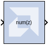
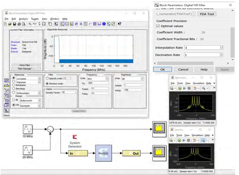

# Digital FIR Filter

The Digital FIR Filter block allows you to generate highly
parameterizable, area-efficient, high-performance single channel FIR
filters.

## Description

The Digital FIR filter block supports single channel, simple rate,
integer decimation, and interpolation and fractional decimation and
interpolation filter types.

To specify the coefficient vector for the FIR Filter generated by this
block, you can either enter the coefficient vector directly into the
Digital FIR Filter Block Parameters dialog box, or open an interface to
the [FDATool](fdatool.html) block and specify the coefficient vector in
that interface.

The Digital FIR Filter block is ideal for generating simple, single
channel FIR filters. If your FIR filter implementation will use more
complicated filter features such as multiple channels or multiple path
core configuration, an AXI4-Stream-compliant interface, or functions
such as reloading co-efficient, channel pattern support, or other
HDL-based GUI parameters, use the [FIR Compiler
7.2](../../HDL/fir_compiler_v7_2/README.md) block in your design instead of the Digital FIR
Filter block.

In the Vivado® design flow, the Digital FIR filter block is inferred as
"LogiCORE™ IP FIR Compiler v7.2" for code generation. Refer to the
document [LogiCORE IP FIR Compiler
v7.2](https://www.xilinx.com/support/documentation/ip_documentation/fir_compiler/v7_2/pg149-fir-compiler.pdf)
for details on this LogicCore IP.

## Parameters

Parameters specific to the Digital FIR Filter block are as
follows.

### Coefficient Vector  
#### Use FDA Tool as Coefficient Source  
If selected,the Coefficient Vector will be determined by the settings in
the Filter Design and Analysis Tool (FDA Tool). To use the FDA Tool as
your coefficient source, you must click the FDATool button and configure
the Block Parameters dialog box that appears, to describe your FIR
filter.

**Note**: Because the FDATool functionality is integrated into the Digital
FIR Filter block itself, you do not have to enter a separate FDATool
block into your design to use the FDATool as your coefficient source.

The FDA Tool is a user interface for designing and analyzing filters
quickly. FDATool enables you to design digital FIR filters by setting
filter specifications, by importing filters from your MATLAB® workspace,
or by adding, moving or deleting poles and zeroes. FDA Tool also
provides tools for analyzing filters, such as magnitude and phase
response and pole-zero plots (see [FDATool](fdatool.html)).

#### Edit Box  
The edit box is enabled for you to specify the Coefficient Vector when
the Use FDA Tool as Coefficient Source option is disabled. The edit box
specifies the vector coefficients of the filter's transfer function.
Filter coefficients must be specified as a single MATLAB row vector.
Filter structure must be Direct Form, and the input must be a scalar.

The number of taps is inferred from the length of the MATLAB row vector.
If multiple coefficient sets are specified, then each set is appended to
the previous set in the vector.

#### FDATool  
This button is enabled if the Use FDA Tool as Coefficient Source option
is enabled. Click this button to open a Block Parameters dialog box for
the FDA Tool, and enter your filter specifications in this dialog box.
To understand how to use this dialog box to describe your FIR filter,
see [FDATool](fdatool.html).

### Coefficient Precision  
#### Optimal Values  
If selected, the Coefficient Width and Coefficient Fractional Bits will
be set automatically to their optimum values. The values are calculated
using the dynamic range of filter response between pass band and stop
band signals. These values ensure the minimum hardware will be used for
the required filter response when the design is implemented in the FPGA or SoC.

#### Coefficient Width  
Specifies the number of bits used to represent the coefficients.

#### Coefficient Fractional Bits  
Specifies the binary point location in the coefficients datapath
options.

#### Interpolation Rate  
Specifies the interpolation rate of the filter. Any value greater than 1
is applicable to all Interpolation filter types and Decimation filter
types for Fractional Rate Change implementations. The value provided in
this field defines the upsampling factor, or P for Fixed Fractional Rate
(P/Q) resampling filter implementations.

* #### Decimation Rate  
  Specifies the decimation rate of the filter. Any value greater than 1 is
applicable to the all Decimation and Interpolation filter types for
Fractional Rate Change implementations. The value provided in this field
defines the downsampling factor, or Q for Fixed Fractional Rate (P/Q)
resampling filter implementations.

## Example

A simple filter design is shown below which uses the Digital FIR Filter
block to implement a single rate low pass filter. Because Use FDA Tool
as Coefficient source is enabled in the block parameters dialog box for
the Digital FIR Filter block, the FDA Tool (invoked by clicking the FDA
Tool button) is used to generate the filter coefficient for the
following specification:

- Fs (sample frequency) = 400 MHz
- Fpass = 11 MHz
- Fstop = 13 MHz
- Apass = 1 dB
- Astop = 120 dB

For Coefficient precision, the Optimal values selection is enabled for
the filter Coefficient Width parameter. Therefore, an optimized filter
coefficient width will be computed automatically, for minimum hardware
usage and better filter response.

## LogiCORE™ Documentation

[LogiCORE IP FIR Compiler
v7.2](https://www.xilinx.com/support/documentation/ip_documentation/fir_compiler/v7_2/pg149-fir-compiler.pdf)

--------------
Copyright (C) 2023 Advanced Micro Devices, Inc. All rights reserved.
SPDX-License-Identifier: MIT
