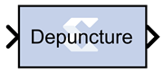
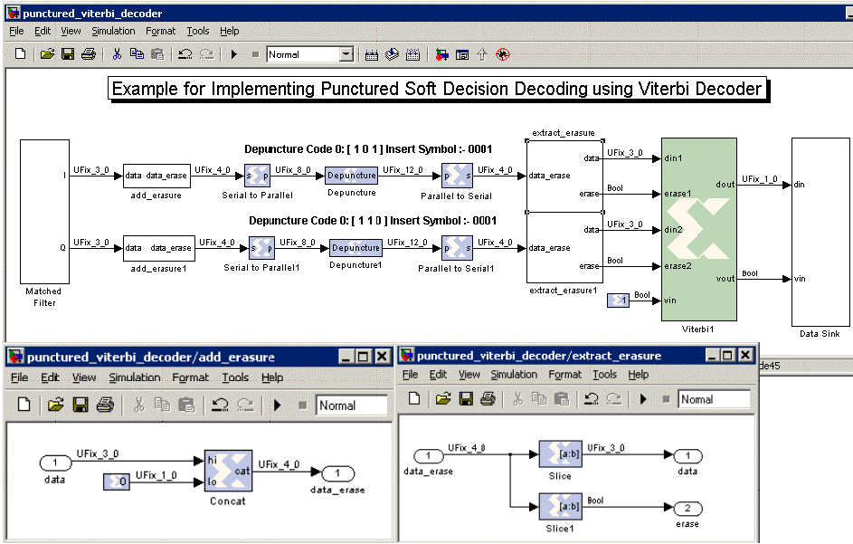
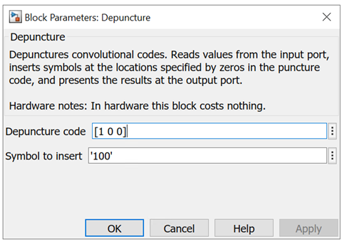

# Depuncture

The Xilinx Depuncture block allows you to insert an arbitrary symbol
into your input data at the location specified by the depuncture code.

The Xilinx Depuncture block accepts data of type `UFixN_0` where N
equals the length of insert string x (the number of ones in the
depuncture code) and produces output data of type `UFixK_0` where K
equals the length of insert string multiplied by the length of the
depuncture code.

The Xilinx Depuncture block can be used to decode a range of punctured
convolution codes. The following diagram illustrates an application of
this block to implement soft decision Viterbi decoding of punctured
convolution codes.

Figure: Soft Decision Viterbi Decoding

  
  

The previous diagram shows a matched filter block connected to a
add_erasure Subsystem which attaches a 0 to the input data to mark it as
a non-erasure signal. The output from the add_erasure subsystem is then
passed to a serial to parallel block. The serial to parallel block
concatenates two continuous soft inputs and presents it as a 8-bit word
to the depuncture block. The depuncture block inserts the symbol '0001'
after the 4-bits from the MSB for code 0 ( \[1 0 1\] ) and 8-bits from
the MSB for code 1 ( \[1 1 0\] ) to form a 12-bit word. The output of
the depuncture block is serialized as 4-bit words using the parallel to
serial block. The extract_erasure Subsystem takes the input 4-bit word
and extracts 3-bits from the MSB to form a soft decision input data word
and 1-bit from the LSB to form the erasure signal for the Viterbi
decoder.

## Block Parameters

The block parameters dialog box can be invoked by double-clicking the
icon in your Simulink® model.

Figure: Block Parameters Dialog Box

Parameters specific to the Xilinx Depuncture block are:

Depuncture code  
Specifies the depuncture pattern for inserting the string to the input.

Symbol to insert  
Specifies the binary word to be inserted in the depuncture code.

Other parameters used by this block are explained in the topic [Common
Options in Block Parameter Dialog
Boxes](common-options-in-block-parameter-dialog-boxes-aa1032308.html).
