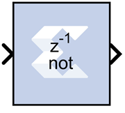

# Inverter

The Xilinx Inverter block calculates the bitwise logical complement of a
fixed-point number. The block is implemented as a synthesizable VHDL
module.

## Block Parameters

The block parameters dialog box can be invoked by double-clicking the
icon in your Simulink® model.

Other parameters used by this block are explained in the topic [Common
Options in Block Parameter Dialog
Boxes](common-options-in-block-parameter-dialog-boxes-aa1032308.html).
