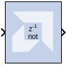

# Inverter

## Description
The Inverter block calculates the bitwise logical complement of a
fixed-point number. The block is implemented as a synthesizable VHDL
module.

## Parameters

Other parameters used by this block are explained in the topic [Common
Options in Block Parameter Dialog
Boxes](../../GEN/common-options/README.md).

--------------
Copyright (C) 2024 Advanced Micro Devices, Inc.
All rights reserved.

SPDX-License-Identifier: MIT
