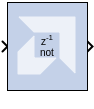

# Inverter

## Description
The Inverter block calculates the bitwise logical complement of a
fixed-point number. The block is implemented as a synthesizable VHDL
module.

## Parameters

Other parameters used by this block are explained in the topic [Common
Options in Block Parameter Dialog
Boxes](../../GEN/common-options/README.md).

<!--
#### Provide enable port
Selecting the Provide Enable Port option activates an optional enable (en) pin on the block. When the enable signal is not asserted the block holds its current state until the enable signal is asserted again or the reset signal is asserted. Reset signal has precedence over the enable signal. The enable signal has to run at a multiple of the block 's sample rate. The signal driving the enable port must be Boolean.
-->

<!--
#### Latency
Many elements in the Xilinx blockset have a latency option. This defines the number of sample periods by which the block's output is delayed. One sample period might correspond to multiple clock cycles in the corresponding FPGA implementation (for example, when the hardware is over-clocked with respect to the Simulink model). Model Composer does not perform extensive pipelining; additional latency is usually implemented as a shift register on the output of the block.
-->

--------------
Copyright (C) 2026 Advanced Micro Devices, Inc.
All rights reserved.

SPDX-License-Identifier: MIT
