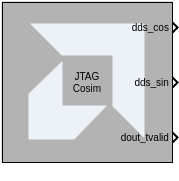

# JTAG Hardware Co-Simulation

This block implements co-simulation of a design on hardware using a JTAG interface to an FPGA evaluation board.

## Description

When you select **Hardware Co-simulation** as the **Export Type** in the Model Composer Hub block, Vitis Model Composer automatically creates a new hardware co-simulation block once it has finished compiling your design into an FPGA bitstream. It also creates a Simulink library to store the hardware co-simulation block. At this point, you can copy the block out of the library and use it in your Model Composer design like any other Simulink or HDL blocks.

The hardware co-simulation block assumes the external interface of the model or Subsystem from which it is derived. The port names on the hardware co-simulation block match the ports names on the original Subsystem. The port types and rates also match the original design.

Hardware co-simulation blocks are used in a Simulink design the same way other blocks are used. During simulation, a hardware co-simulation block interacts with the underlying FPGA board, automating tasks such as device configuration, data transfers, and clocking. A hardware co-simulation block consumes and produces the same types of signals that other Model Composer HDL blocks use. When a value is written to one of the block's input ports, the block sends the corresponding data to the appropriate location in hardware. Similarly, the block retrieves data from hardware when there is an event on an output port.

Hardware co-simulation blocks can be driven by AMD fixed-point signal types, Simulink fixed-point signal types, or Simulink doubles. Output ports assume a signal type that is appropriate for the block they drive. If an output port connects to an HDL block, the output port produces an AMD fixed-point signal. Alternatively, the port produces a Simulink data type when the port drives a Simulink block directly.

When Simulink data types are used as the block signal type, quantization of the input data is handled by rounding, and overflow is handled by saturation.

Like other HDL blocks, hardware co-simulation blocks provide parameter dialog boxes that allow them to be configured with different settings. The parameters that a hardware co-simulation block provides depend on the FPGA board the block is implemented for (that is, different FPGA boards provide their own customized hardware co-simulation blocks).

## Parameters

### Basic tab  
#### Has combinational path
Select this if your circuit has any combinational paths. A combinational path is one in which a change propagates from input to output without any clock event. There is no latch, flip-flop, or register in the path. Enabling this option causes Vitis Model Composer to read the outputs immediately after writing inputs, before clocking the design. This ensures that value changes on combinational paths extending from the hardware co-simulation block into the Simulink Model get propagated correctly.

#### Bitstream file
Specify the FPGA configuration bitstream. By default this field contains the path to the bitstream generated by Model Composer during the last Export triggered from the Vitis Model Composer Hub block.

### Advanced tab
#### Skip device configuration
When selected, the configuration bitstream will not be loaded into the FPGA or SoC. This option can be used if another program is configuring the device (for example, the Vivado Hardware Manager and the Vivado Logic Analyzer).

#### Display Part Information
This option toggles the display of the device part information string (for example, xc7k325tffg900-2 for a Kintex device) in the center of the hardware co-simulation block.

### Cable tab
#### Cable type
Currently, Auto Detect is the only setting for this parameter. Vitis Model Composer will automatically detect the cable type.

--------------
Copyright (C) 2024 Advanced Micro Devices, Inc.
All rights reserved.

SPDX-License-Identifier: MIT
