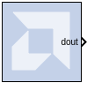

# LFSR

## Description
The LFSR block implements a Linear Feedback Shift Register
(LFSR). This block supports both the Galois and Fibonacci structures
using either the XOR or XNOR gate and allows a re-loadable input to
change the current value of the register at any time. The LFSR output
and re-loadable input can be configured as either serial or parallel
ports.

### Block Interface

| Port Name | Port Description                | Port Type                          |
|-----------|---------------------------------|------------------------------------|
| din       | Data input for re-loadable seed | Optional serial or parallel input  |
| load      | Load signal for din             | Optional boolean input             |
| rst       | Reset signal                    | Optional boolean input             |
| en        | Enable signal                   | Optional boolean input             |
| dout      | Data output of LFSR             | Required serial or parallel output |

As shown in the table above, there can be between 0 and 4 block input
ports and exactly one output port. If the configuration selected
requires 0 inputs, the LFSR is set up to start at a specified initial
seed value and will step through a repeatable sequence of states
determined by the LFSR structure type, gate type, and initial seed.

The optional din and load ports provide the ability to change the
current value of the LFSR at runtime. After the load completes, the LFSR
behaves as with the 0 input case, and starts up a new sequence based
upon the newly loaded seed, and the statically configured LFSR options
for structure and gate type.

The optional rst port will reload the statically specified initial seed
of the LFSR and continue on as before after the rst signal goes low. And
when the optional en port goes low, the LFSR will remain at its current
value with no change until the en port goes high again.

## Parameters

### Basic tab  
Parameters specific to the Basic tab are as follows:

#### Type  
Fibonacci or Galois. This field specifies the structure of the feedback.
Fibonacci has one XOR (or XNOR) gate at the beginning of the register
chain that XORs (or XNORs) the taps together with the result going into
the first register. Galois has one XOR (or XNOR) gate for each tap and
gates the last register in the chains output with the input to the
register at that tap.

#### Gate type  
XOR or XNOR. This field specifies the gate used by the feedback signals.

#### Number of bits in LFSR  
This field specifies the number of registers in the LFSR chain. As a
result, this number specifies the size of the input and output when
selected to be parallel.

#### Feedback polynomial  
This field specifies the tap points of the feedback chain and the value
must be entered in hex with single quotes. The lsb of this polynomial
always must be set to 1 and the msb is an implied 1 and is not specified
in the hex input. Please see the application note titled
[Efficient Shift Registers, LFSR Counters, and Long Pseudo- Random
Sequence
Generators](https://www.xilinx.com/support/documentation/application_notes/xapp052.pdf)
for more information on how to specify this equation and for optimal
settings for the maximum repeating sequence.

#### Initial value  
This field specifies the initial seed value where the LFSR begins its
repeating sequence. The initial value might not be all zeroes when
choosing the XOR gate type and might not be all ones when choosing XNOR,
as those values will stall the LFSR.

### Advanced tab  
Parameters specific to the Advanced tab are as follows:

#### Use reloadable seed value  
This field specifies whether or not an input is needed to reload a
dynamic LFSR seed value at run time.

#### Parallel input  
This field specifies whether the reloadable input seed is shifted in one
bit at a time or if it happens in parallel.

#### Parallel output  
This field specifies whether all of the bits in the LFSR chain are
connected to the output or just the last register in the chain (serial
or parallel).

Other parameters used by this block are explained in the topic [Common
Options in Block Parameter Dialog
Boxes](../../GEN/common-options/README.md).
