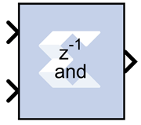

# Logical

The Xilinx Logical block performs bitwise logical operations on
fixed-point numbers. Operands are zero padded and sign extended as
necessary to make binary point positions coincide; then the logical
operation is performed and the result is delivered at the output port.

In hardware this block is implemented as synthesizable VHDL. If you
build a tree of logical gates, this synthesizable implementation is best
as it facilitates logic collapsing in synthesis and mapping.

## Block Parameters

The Block Parameters dialog box can be invoked by double-clicking the
icon in your Simulink® model.

Basic tab  
Parameters specific to the Basic tab are as follows:

Logical function  
Specifies one of the following bitwise logical operators: AND, NAND, OR,
NOR, XOR, XNOR.

Number of inputs  
Specifies the number of inputs (1 - 1024).

Logical Reduction Operation  
When the number of inputs is specified as 1, a unary logical reduction
operation performs a bit-wise operation on the single operand to produce
a single bit result. The first step of the operation applies the logical
operator between the least significant bit of the operand and the next
most significant bit. The second and subsequent steps apply the operator
between the one-bit result of the prior step and the next bit of the
operand using the same logical operator. The logical reduction operator
implements the same functionality as that of the logical reduction
operation in HDLs. The output of the logical reduction operation is
always Boolean.

&nbsp;

Output Type tab  
Parameters specific to the Output Type tab are as follows.

Align binary point  
Specifies that the block must align binary points automatically. If not
selected, all inputs must have the same binary point position.

Other parameters used by this block are explained in the topic [Common
Options in Block Parameter Dialog
Boxes](common-options-in-block-parameter-dialog-boxes-aa1032308.html).
