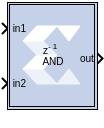

# Vector Logical
The Vector Logical block supports logical operation for vector type
inputs.

## Description

The Vector Logical Block performs bitwise logical operations on
fixed-point numbers. Operands are zero padded and sign extended as
necessary to make binary point positions coincide. The logical operation
is performed and the result is delivered at the output port.

In hardware this block is implemented as synthesizable VHDL. If you
build a tree of logical gates, this synthesizable implementation is best
as it facilitates logic collapsing in synthesis and mapping.

## Parameters
### Basic tab  
Parameters specific to the Basic tab are as follows:

#### Logical function  
Specifies one of the following bitwise logical operators: AND, NAND, OR,
NOR, XOR, XNOR.

#### Number of inputs  
Specifies the number of inputs (1 - 1024).

#### Provide enable port

Selecting the Provide Enable Port option activates an optional enable (en) pin on the block. When the enable signal is not asserted the block holds its current state until the enable signal is asserted again or the reset signal is asserted.

#### Latency

The number of sample periods by which the block's output is delayed.

#### SSR

Use this parameter to control processing of multiple data samples on every sample period.

<!--
#### Precision
The fundamental computational mode in the Xilinx blockset is arbitrary precision fixed-point arithmetic. Most blocks give you the option of choosing the precision, for example, the number of bits and binary point position.
-->

<!--
#### Output Type
Specifies the data type of the output. Can be Boolean, Fixed-point, or Floating-point.
-->

<!--
#### Number of bits
Fixed-point numbers are stored in data types characterized by their word size as specified by Number of bits, Binary point, and Arithmetic type parameters. The maximum number of bits supported is 4096.
-->

<!--
#### Binary point
The binary point is the means by which fixed-point numbers are scaled. The Binary point parameter indicates the number of bits to the right of the binary point (for example, the size of the fraction) for the output port. The binary point position must be between zero and the specified number of bits.
-->

#### Logical Reduction Operation  
When the number of inputs is specified as 1, a unary logical reduction
operation performs a bit-wise operation on the single operand to produce
a single bit result. The first step of the operation applies the logical
operator between the least significant bit of the operand and the next
most significant bit. The second and subsequent steps apply the operator
between the one-bit result of the prior step and the next bit of the
operand using the same logical operator. The logical reduction operator
implements the same functionality as that of the logical reduction
operation in HDLs. The output of the logical reduction operation is
always Boolean.

### Output Type tab  
Parameters specific to the Output Type tab are as follows:

#### Align binary point
Specifies that the block must align binary points
  automatically. If not selected, all inputs must have the same binary
  point position.

Other parameters used by this block are explained in the topic [Common
Options in Block Parameter Dialog
Boxes](../../GEN/common-options/README.md).

--------------
Copyright (C) 2026 Advanced Micro Devices, Inc.
All rights reserved.

SPDX-License-Identifier: MIT
