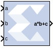

# MultAdd

The Xilinx MultAdd block performs both fixed-point and floating-point
multiply and addition with the a and b inputs used for the
multiplication and the c input for addition or subtraction.

If the MultAdd inputs are floating point, then inputs a,b, and c must be
of the same data type. If the inputs are fixed point, then the port c
binary point must be aligned to the sum of the port a and port b binary
points.

## Block Parameters

The Block Parameters dialog box can be invoked by double-clicking the
icon in your Simulink® model.

Basic tab  
Parameters specific to the Basic tab are as follows.

Operation  
Addition  
Specifies that an addition will be performed after multiplication.

Subtraction  
Specifies that a subtraction will be performed after multiplication.

Addition or subtraction  
Adds a subtract port to the block, which controls whether the operation
following multiplication is addition or subtraction (subtract High =
subtraction, subtract Low = addition).

Optional Ports  
Provide enable port  
Adds an active-High enable port to the block interface.

Latency  
This defines the number of sample periods by which the block's output is
delayed. The latency values you can set depend on whether you are
performing fixed point or floating point arithmetic:

- For fixed point arithmetic, you can only specify a latency of 0 (for
  no latency) or -1 (for maximum/optimal latency). If you have added an
  enable port to the block interface, you can only specify a latency of
  -1 for fixed point arithmetic.
- For floating point arithmetic, you can only specify a latency of 0
  (for no latency) or a positive integer. If you have added an enable
  port to the block interface, you can only specify a positive integer
  for floating point arithmetic.

See the Multiply Adder LogiCORE IP Product Guide
([PG192](https://www.xilinx.com/cgi-bin/docs/ipdoc?c=xbip_multadd;v=latest;d=pg192-multadd.pdf))
for details on latency in the block.

&nbsp;

Output tab  
Parameters specific to the Output tab are as follows.

Precision  
This parameter allows you to specify the output precision for
fixed-point arithmetic. Floating point arithmetic output will always be
Full precision.

Full  
The block uses sufficient precision to represent the result without
error.

User Defined  
If you do not need full precision, this option allows you to specify a
reduced number of total bits and/or fractional bits.

Fixed-point Output Type  
Arithmetic type

Signed (2’s comp)  
The output is a Signed (2’s complement) number.

Unsigned  
The output is an Unsigned number.

Other parameters used by this block are explained in the topic [Common
Options in Block Parameter Dialog
Boxes](common-options-in-block-parameter-dialog-boxes-aa1032308.html).

## LogiCORE™ Documentation

Multiply Adder LogiCORE IP Product Guide
([PG192](https://www.xilinx.com/cgi-bin/docs/ipdoc?c=xbip_multadd;v=latest;d=pg192-multadd.pdf))

Floating-Point Operator LogiCORE IP Product Guide
([PG060](https://www.xilinx.com/cgi-bin/docs/ipdoc?c=floating_point;v=latest;d=pg060-floating-point.pdf))
