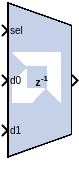

# Mux

## Description
The Mux block implements a multiplexer. The block has one select
input (type unsigned) and a user-configurable number of data bus inputs,
ranging from 2 to 32.

## Parameters

### Basic tab  
#### Number of inputs  
specify a number between 2 and 32.

#### Optional Ports  
Other parameters used by this block are explained in the topic [Common
Options in Block Parameter Dialog
Boxes](../../GEN/common-options/README.md).

### Output tab  
#### Precision  
This parameter allows you to specify the output precision for
fixed-point arithmetic. Floating point arithmetic output will always be
Full precision.

##### Full  
The block uses sufficient precision to represent the result without
error.

##### User Defined  
If you do not need full precision, this option allows you to specify a
reduced number of total bits and/or fractional bits.

#### Fixed-point output type  
##### Arithmetic type  
###### Signed (2’s comp)  
The output is a Signed (2’s complement) number.

###### Unsigned  
The output is an Unsigned number.

###### Number of bits  
Specifies the bit location of the binary point of the output number
where bit zero is the least significant bit.

###### Binary point  
Position of the binary point. in the fixed-point output.

#### Quantization  
Refer to the section Overflow and Quantization in the topic [Common
Options in Block Parameter Dialog
Boxes](../../GEN/common-options/README.md).

#### Overflow  
Refer to the section Overflow and Quantization in the topic [Common
Options in Block Parameter Dialog
Boxes](../../GEN/common-options/README.md).

Parameters used by this block are explained in the topic [Common Options
in Block Parameter Dialog
Boxes](../../GEN/common-options/README.md).

## LogiCORE™ Documentation

Floating-Point Operator LogiCORE IP Product Guide
([PG060](https://docs.xilinx.com/access/sources/ud/document?isLatest=true&url=pg060-floating-point&ft:locale=en-US))

--------------
Copyright (C) 2024 Advanced Micro Devices, Inc.
All rights reserved.
