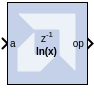

# Natural Logarithm

## Description

The Natural Logarithm block produces the natural logarithm of the
input.

## Parameters

### Basic tab  
Parameters specific to the Basic tab are as follows.

#### Flow Control Options  
##### Blocking  
In this mode, the block waits for data on the input, as indicated by
TREADY, which allows back-pressure.

##### NonBlocking  
In this mode, the block operates every cycle in which the input is
valid, no back-pressure.

### Optional Ports tab  
Parameters specific to the Optional Ports tab are as follows.
#### Input Channel Ports  
##### Has TLAST  
Adds a tlast input port to the block.

##### Has TUSER  
Adds a tuser input port to the block.

#### Control Options  
##### Provide enable port  
Adds an enable port to the block interface.

##### Has Result TREADY  
Adds a TREADY port to the output channel.

#### Exception Signals
##### INVALID_OP  
Adds an output port that serves as an invalid operation flag.

##### DIVIDE_BY_ZERO  
Adds an output port that serves as a divide-by-zero flag.

## LogiCORE™ Documentation

Floating-Point Operator LogiCORE IP Product Guide
([PG060](https://docs.xilinx.com/access/sources/ud/document?isLatest=true&url=pg060-floating-point&ft:locale=en-US))

--------------
Copyright (C) 2024 Advanced Micro Devices, Inc.
All rights reserved.

SPDX-License-Identifier: MIT
