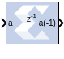

# Negate

## Description
The Negate block computes the arithmetic negation of its input.

## Parameters

### Basic tab  
Parameters specific to the Basic tab are as follows.

#### Precision  
This parameter allows you to specify the output precision for
fixed-point arithmetic. Floating point output always has Full precision.

##### Full  
The block uses sufficient precision to represent the result without
error.

##### User Defined  
If you do not need full precision, this option allows you to specify a
reduced number of total bits and/or fractional bits.

##### Fixed-Point Output Type  
Arithmetic Type

##### Signed (2’s comp)  
The output is a Signed (2’s complement) number.

##### Unsigned  
The output is an Unsigned number.

#### Fixed-point Precision  
##### Number of bits  
Specifies the bit location of the binary point of the output number,
where bit zero is the least significant bit.

##### Binary point  
Position of the binary point in the fixed-point output.

#### Quantization  
Refer to the section Overflow and Quantization in the topic [Common
Options in Block Parameter Dialog
Boxes](../../GEN/common-options/README.md).

#### Overflow  
Refer to the section Overflow and Quantization in the topic [Common
Options in Block Parameter Dialog
Boxes](../../GEN/common-options/README.md).

#### Optional Port  
Provide enable port

#### Latency  
This defines the number of sample periods by which the block's output is
delayed.

Parameters used by this block are explained in the topic [Common Options
in Block Parameter Dialog
Boxes](../../GEN/common-options/README.md).
