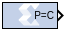
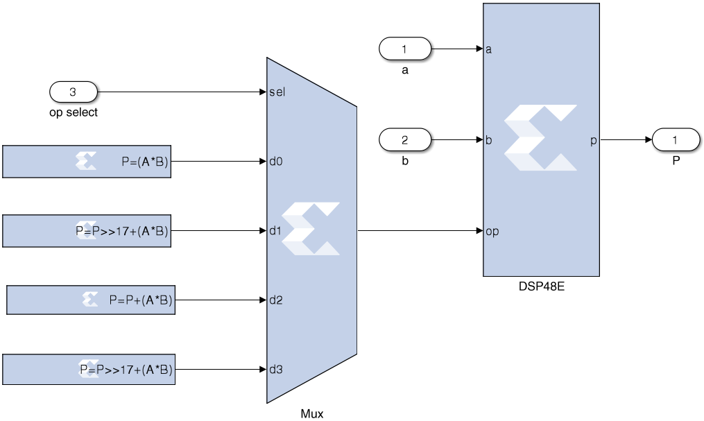

# Opmode

The Opmode block generates a constant that is a DSP48E, DSP48E1,
or DSP48E2 instruction. It is a 15-bit instruction for DSP48E, a 20-bit
instruction for DSP48E1, and a 22-bit instruction for DSP48E2. The
instruction consists of the opmode, carry-in, carry-in select, alumode,
and (for DSP48E1 and DSP48E2) the inmode bits.

## Description

The Opmode block is useful for generating DSP48E, DSP48E1, or DSP48E2
control sequences. The figure below shows an example. The example
implements a 35x35-bit multiplier using a sequence of four instructions
in a DSP48E block. The Opmode blocks supply the desired instructions to
a multiplexer that selects each instruction in the desired sequence.

  
  

## Parameters

### Opmode tab  
Parameters specific to the Opmode tab are as follows.
#### Instruction  
##### Device  
Specifies whether to generate an instruction for the DSP48E, DSP48E1, or
DSP48E2 device.

#### DSP Instruction  
##### Operation  
Displays the instruction that is generated by the block. This
instruction is also displayed on the block in the Simulink model.

##### Operation select  
Selects the instruction.

##### Preadder output  
Allows you to select the equation for the DSP48E1 Preadder.

###### DSP Primitive Configuration  
* Multiplier Output:  
Allows you to select the Multiplier Output of DSP58 to be normal or
negated.

* Preadder/Mult Function:  
Allows you to select the function performed by the DSP48E2
Preadder/Multiplier.

* PREADDINSEL:  
Displays the setting of the PREADDINSEL static control bits that are
part of the instruction generated by the Opmode block. In the DSP48E2
slice, the PREADDDINSEL setting (A or B) selects the input to be added
with the D input in the pre-adder.

* AMULTSEL:  
Displays the setting of the AMULTSEL static control bits that are part
of the instruction generated by the Opmode block. In the DSP48E2 slice,
the AMULTSEL setting (A or AD) selects the input to the 27-bit A input
of the multiplier.

* BMULTSEL:  
Displays the setting of the BMULTSEL static control bits that are part
of the instruction generated by the Opmode block. In the DSP48E2 slice,
the BMULTSEL setting (B or AD) selects the input to the 18-bit B input
of the multiplier.

###### A register configuration  
Allows you to select the A register configuration for the DSP48E2.
Select either A1 or A2.

###### B register configuration  
Allows you to select the B register configuration for the DSP48E1 or
DSP48E2. Select either B1 or B2.

#### Custom Instruction  
**Note**: The Custom Instruction field is activated when you select “Custom”
in the Operation select field.

##### Instruction  
Allows you to select the instruction for the DSP48E, DSP48E1, or
DSP48E2.

##### Z mux  
Specifies the 'Z' source to the add/sub/logic unit to be one of {'0',
'C', 'PCIN', 'P','C', 'PCIN\>\>17',' P\>\>17'}.

##### XY muxes  
Specifies the 'XY' source to the DSP48's adder to be one of {'0','P',
'A:B', 'A\*B', 'C', 'P+C', 'A:B+C' }. 'A:B' implies that A is
concatenated with B to produce a value to be used as an input to the
add/sub/logic unit.

##### W mux  
Specifies the 'W' source to the DSP48E2’s adder to be one of {'0','P',
'RND', 'C' }.

##### Carry input  
Specifies the 'carry' source to the DSP48's add/sub/logic unit to be one
of {'0', '1', 'CIN', 'Round PCIN towards infinity', 'Round PCIN towards
zero', 'Round P towards infinity', 'Round P towards zero', 'Larger
add/sub/acc (parallel operation)', 'Larger add/sub/acc (sequential
operation)', 'Round A\*B'}.

For a description of any of the Custom Instruction options, see the
following manuals:

- DSP48E: Virtex-5 FPGA XtremeDSP Design Considerations
  ([UG193](https://docs.xilinx.com/access/sources/ud/document?isLatest=true&url=ug193&ft:locale=en-US))
- DSP48E1: 7 Series DSP48E1 Slice User Guide
  ([UG479](https://docs.xilinx.com/access/sources/ud/document?isLatest=true&url=ug479_7Series_DSP48E1&ft:locale=en-US))
- DSP48E2: UltraScale Architecture DSP Slice User Guide
  ([UG579](https://docs.xilinx.com/access/sources/ud/document?isLatest=true&url=ug579-ultrascale-dsp&ft:locale=en-US))

## LogiCORE

The Opmode block does not use a LogiCORE.

## DSP48E Control Instruction Format

| Operation select | Notes                                                   |
|------------------|---------------------------------------------------------|
| C + A\*B         |                                                         |
| PCIN + A\*B      |                                                         |
| P + A\*B         |                                                         |
| A\* B            |                                                         |
| C + A:B          |                                                         |
| C - A:B          |                                                         |
| C                |                                                         |
| Custom           | Use equation described in the Custom Instruction Field. |

| Instruction Field Name | Location    | Mnemonic                                  | Notes                                                                                                                        |
|------------------------|-------------|-------------------------------------------|------------------------------------------------------------------------------------------------------------------------------|
| XY muxes               | op\[3:0\]   | 0                                         | 0                                                                                                                            |
|                        |             | P                                         | DSP48 output register                                                                                                        |
|                        |             | A:B                                       | Concat inputs A and B (A is MSB)                                                                                             |
|                        |             | A\*B                                      | Multiplication of inputs A and B                                                                                             |
|                        |             | C                                         | DSP48 input C                                                                                                                |
|                        |             | P+C                                       | DSP48 input C plus P                                                                                                         |
|                        |             | A:B+C                                     | Concat inputs A and B plus C register                                                                                        |
| Z mux                  | op\[6:4     | 0                                         | 0                                                                                                                            |
|                        |             | PCIN                                      | DSP48 cascaded input from PCOUT                                                                                              |
|                        |             | P                                         | DSP48 output register                                                                                                        |
|                        |             | C                                         | DSP48 C input                                                                                                                |
|                        |             | PCIN\>\>17                                | Cascaded input downshifted by 17                                                                                             |
|                        |             | P\>\>17                                   | DSP48 output register downshifted by 17                                                                                      |
| Alumode                | op\[10:7\]  | X+Z                                       | Add                                                                                                                          |
|                        |             | Z-X                                       | Subtract                                                                                                                     |
| Carry input            | op\[14:12\] | 0 or 1                                    | Set carry in to 0 or 1                                                                                                       |
|                        |             | CIN                                       | Select cin as source. This adds a CIN port to the Opmode block whose value is inserted into the mnemonic at bit location 11. |
|                        |             | Round PCIN toward infinity                |                                                                                                                              |
|                        |             | Round PCIN toward zero                    |                                                                                                                              |
|                        |             | Round P toward infinity                   |                                                                                                                              |
|                        |             | Round P toward zero                       |                                                                                                                              |
|                        |             | Larger add/sub/acc (parallel operation)   |                                                                                                                              |
|                        |             | Larger add/sub/acc (sequential operation) |                                                                                                                              |
|                        |             | Round A\*B                                |                                                                                                                              |

## DSP48E1 Control Instruction Format

| Operation select | Notes                                                   |
|------------------|---------------------------------------------------------|
| C + A\*B         |                                                         |
| PCIN + A\*B      |                                                         |
| P + A\*B         |                                                         |
| A\* B            |                                                         |
| C + A:B          |                                                         |
| C - A:B          |                                                         |
| C                |                                                         |
| Custom           | Use equation described in the Custom Instruction Field. |

| Preadder output | Notes |
|-----------------|-------|
| Zero            |       |
| A2              |       |
| A1              |       |
| D + A2          |       |
| D + A1          |       |
| D               |       |
| -A2             |       |
| -A1             |       |
| D - A2          |       |
| D - A1          |       |

| B register configuration | Notes |
|--------------------------|-------|
| B1                       |       |
| B2                       |       |

| Instruction Field Name | Location    | Mnemonic                                  | Notes                                                                                                                        |
|------------------------|-------------|-------------------------------------------|------------------------------------------------------------------------------------------------------------------------------|
| Instruction            |             | X + Z                                     |                                                                                                                              |
|                        |             | X +NOT(Z)                                 |                                                                                                                              |
|                        |             | NOT(X+Z)                                  |                                                                                                                              |
|                        |             | Z - X                                     |                                                                                                                              |
|                        |             | X XOR Z                                   |                                                                                                                              |
|                        |             | X XNOR Z                                  |                                                                                                                              |
|                        |             | X AND Z                                   |                                                                                                                              |
|                        |             | X OR Z                                    |                                                                                                                              |
|                        |             | X AND NOT(Z)                              |                                                                                                                              |
|                        |             | X OR NOT (Z)                              |                                                                                                                              |
|                        |             | X NAND Z                                  |                                                                                                                              |
| Z mux                  | op\[6:4\]   | 0                                         | 0                                                                                                                            |
|                        |             | PCIN                                      | DSP48 cascaded input from PCOUT                                                                                              |
|                        |             | P                                         | DSP48 output register                                                                                                        |
|                        |             | C                                         | DSP48 C input                                                                                                                |
|                        |             | PCIN\>\>17                                | Cascaded input downshifted by 17                                                                                             |
|                        |             | P\>\>17                                   | DSP48 output register downshifted by 17                                                                                      |
| Operand: (Alumode)     | op\[10:7\]  | X+Z                                       | Add                                                                                                                          |
|                        |             | Z-X                                       | Subtract                                                                                                                     |
| XY muxes               | op\[3:0\]   | 0                                         | 0                                                                                                                            |
|                        |             | P                                         | DSP48 output register                                                                                                        |
|                        |             | A:B                                       | Concat inputs A and B (A is MSB)                                                                                             |
|                        |             | A\*B                                      | Multiplication of inputs A and B                                                                                             |
|                        |             | C                                         | DSP48 input C                                                                                                                |
|                        |             | P+C                                       | DSP48 input C plus P                                                                                                         |
|                        |             | A:B+C                                     | Concat inputs A and B plus C register                                                                                        |
| Carry input            | op\[14:12\] | 0 or 1                                    | Set carry in to 0 or 1                                                                                                       |
|                        |             | CIN                                       | Select cin as source. This adds a CIN port to the Opmode block whose value is inserted into the mnemonic at bit location 11. |
|                        |             | Round PCIN toward infinity                |                                                                                                                              |
|                        |             | Round PCIN toward zero                    |                                                                                                                              |
|                        |             | Round P toward infinity                   |                                                                                                                              |
|                        |             | Round P toward zero                       |                                                                                                                              |
|                        |             | Larger add/sub/acc (parallel operation)   |                                                                                                                              |
|                        |             | Larger add/sub/acc (sequential operation) |                                                                                                                              |
|                        |             | Round A\*B                                |                                                                                                                              |

## DSP48E2 Control Instruction Format

| Operation select | Notes                                                   |
|------------------|---------------------------------------------------------|
| C + A\*B         |                                                         |
| PCIN + A\*B      |                                                         |
| P + A\*B         |                                                         |
| A\* B            |                                                         |
| C + A:B          |                                                         |
| C - A:B          |                                                         |
| C                |                                                         |
| Custom           | Use equation described in the Custom Instruction Field. |

| Preadder/Mult Function | Notes |
|------------------------|-------|
| Zero                   |       |
| A\*B                   |       |
| (D+A)\*B               |       |
| (D-A)\*B               |       |
| (D+A)\*\*2             |       |
| (D-A)\*\*2             |       |
| D\*\*2                 |       |
| A\*\*2                 |       |
| -(A\*\*2)              |       |
| (D+A)\*A               |       |
| (D-A)\*A               |       |
| (D+B)\*A               |       |
| (D-B)\*A               |       |
| D\*A                   |       |
| B\*A                   |       |
| -B\*A                  |       |
| (D+B)\*\*2             |       |
| (D-B)\*\*2             |       |
| B\*\*2                 |       |
| -(B\*\*2)              |       |
| (D+B)\*B               |       |
| (D-B)\*B               |       |

| A register configuration | Notes |
|--------------------------|-------|
| A1                       |       |
| A2                       |       |

| B register configuration | Notes |
|--------------------------|-------|
| B1                       |       |
| B2                       |       |

| Instruction Field Name  | Location    | Mnemonic                                  | Notes                                                                                                                        |
|-------------------------|-------------|-------------------------------------------|------------------------------------------------------------------------------------------------------------------------------|
| XY muxes                | op\[3:0\]   | 0                                         | 0                                                                                                                            |
|                         |             | P                                         | DSP48 output register                                                                                                        |
|                         |             | A:B                                       | Concat inputs A and B (A is MSB)                                                                                             |
|                         |             | A\*B                                      | Multiplication of inputs A and B                                                                                             |
|                         |             | C                                         | DSP48 input C                                                                                                                |
|                         |             | P+C                                       | DSP48 input C plus P                                                                                                         |
|                         |             | A:B+C                                     | Concat inputs A and B plus C register                                                                                        |
| Z mux                   | op\[6:4\]   | 0                                         | 0                                                                                                                            |
|                         |             | PCIN                                      | DSP48 cascaded input from PCOUT                                                                                              |
|                         |             | P                                         | DSP48 output register                                                                                                        |
|                         |             | C                                         | DSP48 C input                                                                                                                |
|                         |             | PCIN\>\>17                                | Cascaded input downshifted by 17                                                                                             |
|                         |             | P\>\>17                                   | DSP48 output register downshifted by 17                                                                                      |
| W mux                   | op\[8:7\]   | 0                                         |                                                                                                                              |
|                         |             | P                                         | DSP48 output register                                                                                                        |
|                         |             | RND                                       | Rounding Constant into W mux                                                                                                 |
|                         |             | C                                         | DSP48 input C                                                                                                                |
| ALU mode (Instruction)  | op\[12:9\]  | X + W + Z                                 |                                                                                                                              |
|                         |             | X +W + NOT(Z)                             |                                                                                                                              |
|                         |             | NOT(X + W + Z)                            |                                                                                                                              |
|                         |             | Z - (X+W)                                 |                                                                                                                              |
|                         |             | X XOR Z                                   |                                                                                                                              |
|                         |             | X XNOR Z                                  |                                                                                                                              |
|                         |             | X AND Z                                   |                                                                                                                              |
|                         |             | X OR Z                                    |                                                                                                                              |
|                         |             | X AND NOT(Z)                              |                                                                                                                              |
|                         |             | X OR NOT (Z)                              |                                                                                                                              |
|                         |             | X NAND Z                                  |                                                                                                                              |
|                         |             | X NOR Z                                   |                                                                                                                              |
|                         |             | NOT (X) OR Z                              |                                                                                                                              |
|                         |             | NOT (X) AND Z                             |                                                                                                                              |
| Carry input             | op\[16:13\] | 0 or 1                                    | Set carry in to 0 or 1                                                                                                       |
|                         |             | CIN                                       | Select CIN as source. This adds a CIN port to the Opmode block whose value is inserted into the mnemonic at bit location 11. |
|                         |             | Round PCIN toward infinity                |                                                                                                                              |
|                         |             | Round PCIN toward zero                    |                                                                                                                              |
|                         |             | Round P toward infinity                   |                                                                                                                              |
|                         |             | Round P toward zero                       |                                                                                                                              |
|                         |             | Larger add/sub/acc (parallel operation)   |                                                                                                                              |
|                         |             | Larger add/sub/acc (sequential operation) |                                                                                                                              |
|                         |             | Round A\*B                                |                                                                                                                              |
| Pre-Adder/Mult Function | op\[21:17\] | Zero                                      |                                                                                                                              |
|                         |             | A \* B                                    |                                                                                                                              |
|                         |             | (D + A) \* B                              |                                                                                                                              |
|                         |             | (D - A) \* B                              |                                                                                                                              |
|                         |             | (D + A)\*\*2                              |                                                                                                                              |
|                         |             | (D - A)\*\*2                              |                                                                                                                              |
|                         |             | D\*\*2                                    |                                                                                                                              |
|                         |             | A\*\*2                                    |                                                                                                                              |
|                         |             | -(A\*\*2)                                 |                                                                                                                              |
|                         |             | (D + A) \* A                              |                                                                                                                              |
|                         |             | (D - A) \* A                              |                                                                                                                              |
|                         |             | (D + B) \* A                              |                                                                                                                              |
|                         |             | (D - B) \* A                              |                                                                                                                              |
|                         |             | D \* A                                    |                                                                                                                              |
|                         |             | B \* A                                    |                                                                                                                              |
|                         |             | -B \* A                                   |                                                                                                                              |
|                         |             | (D + B)\*\*2                              |                                                                                                                              |
|                         |             | (D - B)\*\*2                              |                                                                                                                              |
|                         |             | B\*\*2                                    |                                                                                                                              |
|                         |             | -(B\*\*2)                                 |                                                                                                                              |
|                         |             | (D + B) \* B                              |                                                                                                                              |
|                         |             | (D - B) \* B                              |                                                                                                                              |

## DSPCPLX Control Instruction Format

The OpMode block, when configured with a DSPCPLX device, outputs 18-bit
wide data to drive the consolidated control port of the DSPCPLX block.
The DSPCPLX block internally feeds the same setting to respective
individual Real and Imaginary control input ports.

| Operation Select | Notes                                                       |
|------------------|-------------------------------------------------------------|
| A\*B             |                                                             |
| Custom           | Use the equation described in the Custom Instruction Field. |

| Instruction Field Name | Location    | Mnemonic  | Notes                                                                                                                        |
|------------------------|-------------|-----------|------------------------------------------------------------------------------------------------------------------------------|
| XY Muxes               | op\[3:0\]   | A\*B      | Multiplication of inputs A and B                                                                                             |
| Z mux                  | op\[6:4\]   | 0         | 0                                                                                                                            |
|                        |             | PCIN      | DSPCPLX cascaded input from PCOUT                                                                                            |
|                        |             | P         | DSPCPLX output register                                                                                                      |
|                        |             | C         | DSPCPLX C input                                                                                                              |
| W mux                  | op\[8:7\]   | 0         |                                                                                                                              |
|                        |             | RND       | Rounding constant into W mux                                                                                                 |
| ALU mode (Instruction) | op\[12:9\]  | X + W + Z |                                                                                                                              |
| Carry input            | op\[16:13\] | 0 or 1    | Set carry in to 0 or 1                                                                                                       |
|                        |             | CIN       | Select CIN as source. This adds a CIN port to the Opmode block whose value is inserted into the mnemonic at bit location 11. |
| Conjugate A Input      | op\[17\]    | 0 or 1    | Select to complex conjugate the input A value                                                                                |
| Conjugate B Input      | op\[18\]    | 0 or 1    | Select to complex conjugate the input B value                                                                                |

## DSP58 Control Instruction Format

| Operation select | Notes                                                   |
|------------------|---------------------------------------------------------|
| C + A\*B         |                                                         |
| PCIN + A\*B      |                                                         |
| P + A\*B         |                                                         |
| A\* B            |                                                         |
| C + A:B          |                                                         |
| C - A:B          |                                                         |
| C                |                                                         |
| Custom           | Use equation described in the Custom Instruction Field. |

| Preadder/Mult Function | Notes |
|------------------------|-------|
| Zero                   |       |
| ±A\*B                  |       |
| ±(D±A)\*B              |       |
| ±(D±A)\*\*2            |       |
| ±(D)\*\*2              |       |
| ±(A)\*\*2              |       |
| ±(D±A)\*A              |       |
| ±(D±B)\*A              |       |
| ±D\*A                  |       |
| ±(D±B)\*\*2            |       |
| ±(B)\*\*2              |       |
| ±(D±B)\*B              |       |

| A register configuration | Notes |
|--------------------------|-------|
| A1                       |       |
| A2                       |       |

| B register configuration | Notes |
|--------------------------|-------|
| B1                       |       |
| B2                       |       |

| Instruction Field Name  | Location    | Mnemonic                                  | Notes                                                                                                                        |
|-------------------------|-------------|-------------------------------------------|------------------------------------------------------------------------------------------------------------------------------|
| XY muxes                | op\[3:0\]   | 0                                         | 0                                                                                                                            |
|                         |             | P                                         | DSP58 output register                                                                                                        |
|                         |             | A:B                                       | Concat inputs A and B (A is MSB)                                                                                             |
|                         |             | A\*B                                      | Multiplication of inputs A and B                                                                                             |
|                         |             | C                                         | DSP58 input C                                                                                                                |
|                         |             | P+C                                       | DSP58 input C plus P                                                                                                         |
|                         |             | A:B+C                                     | Concat inputs A and B plus C register                                                                                        |
| Z mux                   | op\[6:4\]   | 0                                         | 0                                                                                                                            |
|                         |             | PCIN                                      | DSP58 cascaded input from PCOUT                                                                                              |
|                         |             | P                                         | DSP58 output register                                                                                                        |
|                         |             | C                                         | DSP58 C input                                                                                                                |
|                         |             | PCIN\>\>23                                | Cascaded input downshifted by 23                                                                                             |
|                         |             | P\>\>23                                   | DSP58 output register downshifted by 23                                                                                      |
| W mux                   | op\[8:7\]   | 0                                         |                                                                                                                              |
|                         |             | P                                         | DSP58 output register                                                                                                        |
|                         |             | RND                                       | Rounding Constant into W mux                                                                                                 |
|                         |             | C                                         | DSP58 input C                                                                                                                |
| ALU mode (Instruction)  | op\[12:9\]  | X + W + Z                                 |                                                                                                                              |
|                         |             | X +W + NOT(Z)                             |                                                                                                                              |
|                         |             | NOT(X + W + Z)                            |                                                                                                                              |
|                         |             | Z - (X+W)                                 |                                                                                                                              |
|                         |             | X XOR Z                                   |                                                                                                                              |
|                         |             | X XNOR Z                                  |                                                                                                                              |
|                         |             | X AND Z                                   |                                                                                                                              |
|                         |             | X OR Z                                    |                                                                                                                              |
|                         |             | X AND NOT(Z)                              |                                                                                                                              |
|                         |             | X OR NOT (Z)                              |                                                                                                                              |
|                         |             | X NAND Z                                  |                                                                                                                              |
|                         |             | X NOR Z                                   |                                                                                                                              |
|                         |             | NOT (X) OR Z                              |                                                                                                                              |
|                         |             | NOT (X) AND Z                             |                                                                                                                              |
|                         |             | X xor Y xor Z                             |                                                                                                                              |
| Carry input             | op\[16:13\] | 0 or 1                                    | Set carry in to 0 or 1                                                                                                       |
|                         |             | CIN                                       | Select CIN as source. This adds a CIN port to the Opmode block whose value is inserted into the mnemonic at bit location 11. |
|                         |             | Round PCIN toward infinity                |                                                                                                                              |
|                         |             | Round PCIN toward zero                    |                                                                                                                              |
|                         |             | Round P toward infinity                   |                                                                                                                              |
|                         |             | Round P toward zero                       |                                                                                                                              |
|                         |             | Larger add/sub/acc (parallel operation)   |                                                                                                                              |
|                         |             | Larger add/sub/acc (sequential operation) |                                                                                                                              |
|                         |             | Round A\*B                                |                                                                                                                              |
| Pre-Adder/Mult Function | op\[21:17\] | Zero                                      |                                                                                                                              |
|                         |             | ±A\*B                                     |                                                                                                                              |
|                         |             | ±(D±A)\*B                                 |                                                                                                                              |
|                         |             | ±(D±A)\*\*2                               |                                                                                                                              |
|                         |             | ±(D)\*\*2                                 |                                                                                                                              |
|                         |             | ±(A)\*\*2                                 |                                                                                                                              |
|                         |             | ±(D±A)\*A                                 |                                                                                                                              |
|                         |             | ±(D±B)\*A                                 |                                                                                                                              |
|                         |             | ±D\*A                                     |                                                                                                                              |
|                         |             | ±(D±B)\*\*2                               |                                                                                                                              |
|                         |             | ±(B)\*\*2                                 |                                                                                                                              |
|                         |             | ±(D±B)\*B                                 |                                                                                                                              |
| Negate                  | op\[24:22\] | 0 or 1                                    | Select Negate to negate the Multiplier output                                                                                |

--------------
Copyright (C) 2024 Advanced Micro Devices, Inc.
All rights reserved.
