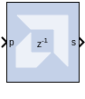
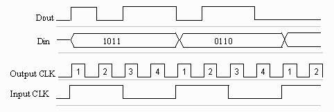

# Parallel to Serial

## Description

The Parallel to Serial block takes an input word and splits it into N
time-multiplexed output words where N is the ratio of number of input
bits to output bits. The order of the output can be either least
significant bit first or most significant bit first.

The following waveform illustrates the block's behavior:

  

This example illustrates the case where the input width is 4, output
word size is 1, and the block is configured to output the most
significant word first.

### Block Interface

The Parallel to Serial block has one input and one output port. The
input port can be any size. The output port size is indicated on the
Block Parameters dialog box.

## Parameters

### Basic tab  
Parameters specific to the Basic tab are as follows.

#### Output order  
Most significant word first or least significant word first.

#### Type  
Signed or unsigned.

#### Number of bits  
Output width. Must divide Number of Input Bits evenly.

#### Binary Point  
Binary point location.

The minimum latency of this block is 0.

Other parameters used by this block are explained in the topic [Common
Options in Block Parameter Dialog
Boxes](../../GEN/common-options/README.md).
