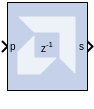
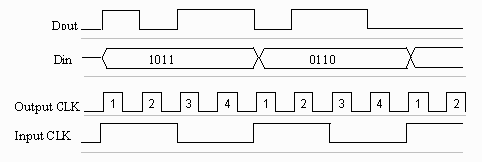

# Parallel to Serial

## Description

The Parallel to Serial block takes an input word and splits it into N
time-multiplexed output words where N is the ratio of number of input
bits to output bits. The order of the output can be either least
significant bit first or most significant bit first.

The following waveform illustrates the block's behavior:

  

This example illustrates the case where the input width is 4, output
word size is 1, and the block is configured to output the most
significant word first.

### Block Interface

The Parallel to Serial block has one input and one output port. The
input port can be any size. The output port size is indicated on the
Block Parameters dialog box.

## Parameters

### Basic tab  
Parameters specific to the Basic tab are as follows.

#### Output order  
Most significant word first or least significant word first.

#### Type  
Signed or unsigned.

#### Number of bits  
Output width. Must divide Number of Input Bits evenly.

#### Binary Point  
Binary point location.

The minimum latency of this block is 0.

Other parameters used by this block are explained in the topic [Common
Options in Block Parameter Dialog
Boxes](../../GEN/common-options/README.md).

<!--
#### Provide reset port
Add a reset port to the block.
-->

<!--
#### Provide enable port
Selecting the Provide Enable Port option activates an optional enable (en) pin on the block. When the enable signal is not asserted the block holds its current state until the enable signal is asserted again or the reset signal is asserted. Reset signal has precedence over the enable signal. The enable signal has to run at a multiple of the block 's sample rate. The signal driving the enable port must be Boolean.
-->

<!--
#### Latency
Many elements in the Xilinx blockset have a latency option. This defines the number of sample periods by which the block's output is delayed. One sample period might correspond to multiple clock cycles in the corresponding FPGA implementation (for example, when the hardware is over-clocked with respect to the Simulink model). Model Composer does not perform extensive pipelining; additional latency is usually implemented as a shift register on the output of the block.
-->

--------------
Copyright (C) 2026 Advanced Micro Devices, Inc.
All rights reserved.

SPDX-License-Identifier: MIT
