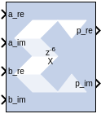

# Product

## Description

The Product block implements a scalar or complex multiplier. It
computes the product of the data on its two input channels, producing
the result on its output channel. For complex multiplication the input
and output have two components: real and imaginary.

The Product block is ideal for generating a simple scalar or complex
multiplier. If your implementation will use more complicated features
such as AXI4 ports or a user-specified precision, use the
[Complex Multiplier 6.0](../../HDL/cmult/README.md) block (if you are
configuring a complex multiplier) or [Mult](../../HDL/mult/README.md) block (if
you are configuring a scalar multiplier) in your design instead of the
Product block.

In the Vivado® design flow, the Product block is inferred as "LogiCORE™
IP Complex Multiplier" (if you have configured the Product block for
complex multiplication) or “LogiCORE IP Multiplier” (if you have
configured the Product block for scalar multiplication) for code
generation. Refer to the [LogiCORE IP Complex Multiplier v6.0 Product
Guide](https://docs.xilinx.com/access/sources/ud/document?isLatest=true&url=pg104-cmpy&ft:locale=en-US)
or the [LogiCORE IP Multiplier v12.0 Product
Guide](https://docs.xilinx.com/access/sources/ud/document?isLatest=true&url=pg108-mult-gen&ft:locale=en-US)
for details about these LogiCORE IP.

## Parameters

Parameters specific to the block are as follows.

Complex Multiplication  
Specifies mode of operation: scalar multiplier (Complex Multiplication
deselected) or complex multiplier (Complex Multiplication selected).

Optimize for  
Specifies whether your design will be optimized for Performance or for
Resources when it is implemented in the Xilinx FPGA or SoC device.

Based on the settings for Complex Multiplication and Optimize for, and
rate and type propagation (from the input data width), the latency value
of the block will be derived automatically for a fully pipelined
circuit. This latency value will be displayed on the block in the
Simulink model.

## LogiCORE™ Documentation

[LogiCORE IP Complex Multiplier
v6.0](https://www.xilinx.com/support/documentation/ip_documentation/cmpy/v6_0/pg104-cmpy.pdf)

[LogiCORE IP Multiplier
v12.0](https://www.xilinx.com/support/documentation/ip_documentation/mult_gen/v12_0/pg108-mult-gen.pdf)
