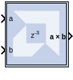

# Vector Real Mult

The Vector Real Multiplier block supports the multiplication feature for
vector type inputs.

Hardware notes: To check for the optimum internal pipeline stages of the
dedicated multiplier select Test for optimum pipelining.

Optimization Goal: For implementation into device fabric (LUTs), the
Speed or Area optimization takes effect only if it is supported by IP
for the particular device family. Otherwise, the results will be
identical regardless of the selection.

## Description

Super Sample Rate (SSR): This configurable GUI parameter is primarily
used to control processing of multiple data samples on every sample
period. This block enables 1-D vector support for the primary block
operation.

The Vector Real Mult block implements a multiplier. It computes the
product of the data on its two input ports, producing the result on its
output port.

## Block Parameters

Open the Block Parameters dialog box by double-clicking the icon in your
Simulink® model.

Basic tab  
Parameters specific to the Basic tab are as follows.

Precision  
This parameter allows you to specify the output precision for
fixed-point arithmetic. Floating-point output always has Full precision.

Full  
The block uses sufficient precision to represent the result without
error.

User Defined  
If you do not need full precision, this option allows you to specify a
reduced number of total bits and/or fractional bits.

User-Defined Precision  
Fixed-point Precision  
Signed (2’s comp)  
The output is a Signed (2’s complement) number.

Unsigned  
The output is an Unsigned number.

Number of bits  
Specifies the bit location of the binary point of the output number,
where bit zero is the least significant bit.

Binary point  
Position of the binary point in the fixed-point output.

Quantization  
Refer to the Overflow and Quantization section in the [Common Options in
Block Parameter Dialog
Boxes](common-options-in-block-parameter-dialog-boxes-aa1032308.html)
topic.

Overflow  
Refer to the Overflow and Quantization section inthe [Common Options in
Block Parameter Dialog
Boxes](common-options-in-block-parameter-dialog-boxes-aa1032308.html)
topic.

Optional Port  
Provide enable port.

Latency  
This defines the number of sample periods by which the block's output is
delayed.

Saturation and Rounding of User Data Types in a Multiplier  
When saturation or rounding is selected on the user data type of a
multiplier, latency is also distributed so as to pipeline the
saturation/rounding logic first, and then additional registers are added
to the core. For example, if a latency of three is selected, and
rounding/saturation is selected, then the first register is placed after
the rounding or saturation logic, and two registers are placed to
pipeline the core. Registers are added to the core until optimum
pipelining is reached and then further registers are placed after the
rounding/saturation logic. However, if the data type you select does not
require additional saturation/rounding logic, then all the registers are
used to pipeline the core.

&nbsp;

Implementation tab  
Parameters specific to the Implementation tab are as follows:
Use behavioral HDL (otherwise use core)  
The block is implemented using behavioral HDL. This gives the downstream
logic synthesis tool maximum freedom to optimize for performance or
area.

Note: For Floating-point operations, the block always uses the
Floating-point Operator core.

Core Parameters  
Optimize for Speed\|Area  
Directs the block to be optimized for either Speed or Area.

Use embedded multipliers  
This field specifies that if possible, use the XtremeDSP slice (DSP48
type embedded multiplier) in the target device.

Test for optimum pipelining  
Checks if the Latency provided is at least equal to the optimum pipeline
length. Latency values that pass this test imply that the core produced
is optimized for speed.

Other parameters used by this block are explained in the topic [Common
Options in Block Parameter Dialog
Boxes](common-options-in-block-parameter-dialog-boxes-aa1032308.html).

## LogiCORE™™ Documentation

Multiplier LogiCORE IP Product Guide
([PG108](https://www.xilinx.com/cgi-bin/docs/ipdoc?c=mult_gen;v=latest;d=pg108-mult-gen.pdf))

Floating-Point Operator LogiCORE IP Product Guide
([PG060](https://www.xilinx.com/cgi-bin/docs/ipdoc?c=floating_point;v=latest;d=pg060-floating-point.pdf))
