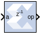

# Reciprocal

## Description
The Reciprocal block performs the reciprocal on the input.
Currently, only the floating-point data type is supported.

## Parameters

### Basic tab  
Parameters specific to the Basic tab are as follows.

#### Flow Control  
##### Blocking  
Selects “Blocking” mode. In this mode, the lack of data on one input
channel does block the execution of an operation if data is received on
another input channel.

##### NonBlocking  
Selects “Non-Blocking” mode. In this mode, the lack of data on one input
channel does not block the execution of an operation if data is received
on another input channel.

### Optional ports  
#### Input Channel Ports  
Has TLAST  
Adds a TLAST port to the Input channel.

##### Has TUSER  
Adds a TUSER port to the Input channel.

##### Provide enable port  
Adds an enable port to the block interface.

##### Has Result TREADY  
Adds a TREADY port to the Result channel.

#### Exception Signals  
##### UNDERFLOW  
Adds an output port that serves as an underflow flag.

##### DIVIDE_BY_ZERO  
Adds an output port that serves as a divide-by-zero flag.

## LogiCORE™ Documentation

Floating-Point Operator LogiCORE IP Product Guide
([PG060](https://docs.xilinx.com/access/sources/ud/document?isLatest=true&url=pg060-floating-point&ft:locale=en-US))

--------------
Copyright (C) 2024 Advanced Micro Devices, Inc.
All rights reserved.
