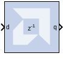

# Register

## Description

The Register block models a D flip-flop-based register, having
latency of one sample period.

### Block Interface

The block has one input port for the data and an optional input reset
port. The initial output value is specified by you in the block
parameters dialog box (below). Data presented at the input will appear
at the output after one sample period. Upon reset, the register assumes
the initial value specified in the parameters dialog box.

The Register block differs from the Xilinx Delay block by providing an
optional reset port and a user specifiable initial value.

## Parameters

### Basic tab  
Parameters specific to the Basic tab are as follows.
#### Initial value  
specifies the initial value in the register.

#### Optional Ports  
Other parameters used by this block are explained in the topic [Common
Options in Block Parameter Dialog
Boxes](../../GEN/common-options/README.md).

## Xilinx LogiCORE

The Register block is implemented as a synthesizable VHDL module. It
does not use a LogiCORE™.

--------------
Copyright (C) 2023 Advanced Micro Devices, Inc. All rights reserved.
SPDX-License-Identifier: MIT
