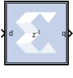

# Vector Register

The Vector Register block supports vector type inputs.

## Description

The Vector Register block models a D flip-flop-based register, having
latency of one sample period.

### Block Interface

The block has one input port for the data and an optional input reset
port. The initial output value is specified by you in the block
parameters dialog box (below). Data presented at the input will appear
at the output after one sample period. Upon reset, the register assumes
the initial value specified in the parameters dialog box.

The Vector Register block differs from the Xilinx Delay block by
providing an optional reset port and a user specifiable initial value.

## Parameters

### Basic Tab  
Parameters specific to the Basic tab are as follows.

#### Initial value  
Specifies the initial value in the register.

#### Optional Ports  
- Provide synchronous reset port.
- Provide enable port.

#### Super Sample Rate (SSR)
This configurable GUI parameter is primarily
used to control processing of multiple data samples on every sample
period. This block enables 1-D vector support for the primary block
operation.

Other parameters used by this block are explained in the topic [Common
Options in Block Parameter Dialog
Boxes](../../GEN/common-options/README.md).

## LogiCORE

The Vector Register block is implemented as a synthesizable VHDL module.
It does not use a Xilinx LogiCORE™.

--------------
Copyright (C) 2023 Advanced Micro Devices, Inc. All rights reserved.
SPDX-License-Identifier: MIT
