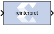

# Reinterpret

The Reinterpret block forces its output to a new type without any
regard for retaining the numerical value represented by the input.

## Description

The binary representation is passed through unchanged, so in hardware
this block consumes no resources. The number of bits in the output will
always be the same as the number of bits in the input.

The block allows for unsigned data to be reinterpreted as signed data,
or, conversely, for signed data to be reinterpreted as unsigned. It also
allows for the reinterpretation of the data's scaling, through the
repositioning of the binary point within the data. The Scale
block provides an analogous capability.

An example of this block's use is as follows: if the input type is 6
bits wide and signed, with 2 fractional bits and the output type is
forced to be unsigned with 0 fractional bits, then an input of -2.0
(1110.00 in binary, two's complement) would be translated into an output
of 56 (111000 in binary).

This block can be particularly useful in applications that combine it
with the Slice block or the Concat block. To illustrate
the block's use, consider the following scenario:

Given two signals, one carrying signed data and the other carrying two
unsigned bits (a UFix_2_0), you should design a system that concatenates
the two bits from the second signal onto the tail (least significant
bits) of the signed signal.

You can do so using two Reinterpret blocks and one Concat block. The
first Reinterpret block is used to force the signed input signal to be
treated as an unsigned value with its binary point at zero. The result
is then fed through the Concat block along with the other signal's
UFix_2_0. The Concat operation is then followed by a second Reinterpret
that forces the output of the Concat block back into a signed
interpretation with the binary point appropriately repositioned.

Though three blocks are required in this construction, the hardware
implementation is realized as simply a bus concatenation, which has no
cost in hardware.

## Parameters

Parameters specific to the block are as follows.

#### Force Arithmetic Type  
When checked, the Output Arithmetic Type parameter can be set and the
output type is forced to the arithmetic type chosen according to the
setting of the Output Arithmetic Type parameter. When unchecked, the
arithmetic type of the output is unchanged from the arithmetic type of
the input.

#### Output Arithmetic Type  
The arithmetic type (unsigned or signed, 2's complement, Floating-point)
to which the output is to be forced.

#### Force Binary Point  
When checked, the Output Binary Point parameter can be set and the
binary point position of the output is forced to the position supplied
in the Output Binary Point parameter. When unchecked, the arithmetic
type of the output is unchanged from the arithmetic type of the input.

#### Output Binary Point  
The position to which the output's binary point is to be forced. The
supplied value must be an integer between zero and the number of bits in
the input (inclusive).

## LogiCORE™ Documentation

LogiCORE IP Floating-Point Operator
v7.1 [(PG060)](https://docs.xilinx.com/access/sources/ud/document?isLatest=true&url=pg060-floating-point&ft:locale=en-US)

--------------
Copyright (C) 2024 Advanced Micro Devices, Inc.
All rights reserved.

SPDX-License-Identifier: MIT
