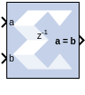

# Relational

## Description

The Relational block implements a comparator.

The supported comparisons are the following:

- equal-to (a = b)
- not-equal-to (a != b)
- less-than (a \< b)
- greater-than (a \> b)
- less-than-or-equal-to (a \<= b)
- greater-than-or-equal-to (a \>= b)
- The output of the block is a `Bool`.

## Block Parameters

The only parameter specific to the Relational block is:

#### Comparison
Specifies the comparison operation computed by the block.

Other parameters used by this block are explained in the topic [Common
Options in Block Parameter Dialog
Boxes](../../GEN/common-options/README.md).

## LogiCORE™ Documentation

[LogiCORE IP Floating-Point Operator
v7.1](https://docs.xilinx.com/access/sources/ud/document?isLatest=true&url=pg060-floating-point&ft:locale=en-US)
