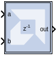

# Vector Relational

## Description

The Vector Relational block implements comparator for vector inputs.

## Parameters

Parameters specific to the Vector Relational block are:

#### Comparison
Specifies the comparison operation computed by the block.

#### Super Sample Rate (SSR)
This configurable GUI parameter is primarily
used to control processing of multiple data samples on every sample
period. This block enables 1-D vector data support for the primary block
operation.

Other parameters used by this block are explained in the topic [Common
Options in Block Parameter Dialog
Boxes](../../GEN/common-options/README.md).

## LogiCORE™ Documentation

[LogiCORE IP Floating-Point Operator
v7.1](https://docs.xilinx.com/access/sources/ud/document?isLatest=true&url=pg060-floating-point&ft:locale=en-US)

--------------
Copyright (C) 2024 Advanced Micro Devices, Inc.
All rights reserved.

SPDX-License-Identifier: MIT
