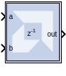

# Vector Relational

## Description

The Vector Relational block implements comparator for vector inputs.

## Parameters

Parameters specific to the Vector Relational block are:

#### Comparison
Specifies the comparison operation computed by the block.

<!--
#### Output Type
Specifies the data type of the output. Can be Boolean, Fixed-point, or Floating-point.
-->

#### Provide enable port

Selecting the Provide Enable Port option activates an optional enable (en) pin on the block. When the enable signal is not asserted the block holds its current state until the enable signal is asserted again or the reset signal is asserted.

#### Latency

The number of sample periods by which the block's output is delayed.

#### SSR

Use this parameter to control processing of multiple data samples on every sample period.

Other parameters used by this block are explained in the topic [Common
Options in Block Parameter Dialog
Boxes](../../GEN/common-options/README.md).

## LogiCORE™ Documentation

[LogiCORE IP Floating-Point Operator
v7.1](https://docs.xilinx.com/access/sources/ud/document?isLatest=true&url=pg060-floating-point&ft:locale=en-US)

--------------
Copyright (C) 2026 Advanced Micro Devices, Inc.
All rights reserved.

SPDX-License-Identifier: MIT
