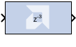

# Requantize

The Requantize block requantizes and scales its input signals.

## Description

The Requantize block requantizes each input sample to a number of
a desired fixed point precision output. For example, a fixed point
signed (two's complement) or unsigned number can be requantized to an
output with lesser or greater number of bits and realign its binary
point precision.

This block also scales its input by a power of two. The power can be
either positive or negative. The scale operation has the effect of
moving the binary point without changing the bits in the container.

The Requantize block is used to requantize and scale its input signals.
If you are only performing one of these operations, but not both, you
can use a different block in the HDL blockset to perform that operation.

To requantize your input without scaling, use the
  [Convert](../../HDL/convert/README.md) block in the HDL blockset.
To scale your input without requantizing, use the [Scale](../../HDL/scale/README.md)
  block in the HDL blockset.

### Quantization

Quantization errors occur when the number of fractional bits is
insufficient to represent the fractional portion of a value. This block
uses symmetric round during quantization for any insufficient input
data.

Round (unbiased: +/- inf) is also known as "Symmetric Round (towards +/-
inf)" or "Symmetric Round (away from zero)". This is similar to the
MATLAB round() function. This method rounds the value to the nearest
desired bit away from zero. When there is a value at the midpoint
between two possible rounded values, the one with the larger magnitude
is selected. For example, to round 01.0110 to a Fix_4_2, this yields
01.10, since 01.0110 is halfway between 01.01 and 01.10, and 01.10 is
further from zero.

### Overflow

Overflow errors occur when a value lies outside the representable range.
In case of data overflow this block saturates the data to the largest
positive/smallest negative value.

## Parameters

Parameters specific to the block are as follows.

#### Scale factor s (scale output by 2^s)  
The scale factor can be a positive or negative integer. The output of
the block is `i*2^k`, where `i` is the input value and `k` is the scale
factor. The effect of scaling is to move the binary point, which in
hardware has no cost (a shift, on the other hand, might add logic).

#### Fixed-point Precision  
##### Number of bits  
Specifies the total number of bits, including the binary point bit
width.

##### Binary point  
Specifies the bit location of the binary point. Bit zero is the Least
Significant Bit.
