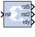
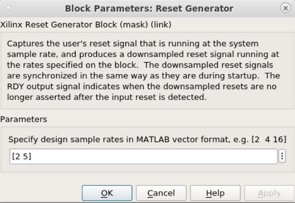

# Reset Generator

The Reset Generator block captures the user's reset signal that is
running at the system sample rate, and produces one or more downsampled
reset signal(s) running at the rates specified on the block.

## Description

The downsampled reset signals are synchronized in the same way as they
are during startup. The RDY output signal indicates when the downsampled
resets are no longer asserted after the input reset is detected.

## Parameters

  

You specify the design sample rates in MATLAB® vector format as shown
above. Any number of outputs can be specified.
