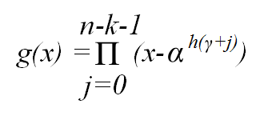

# Reed-Solomon Decoder 9.0

Note: This block goes into the FPGA fabric and is a Licensed Core.
Please visit the Xilinx web site to purchase the appropriate core
license.

The Reed-Solomon (RS) codes are block-based error correcting codes with
a wide range of applications in digital communications and storage.

They are used to correct errors in many systems such as digital storage
devices, wireless/ mobile communications, and digital video
broadcasting.

The Reed-Solomon decoder processes blocks generated by a Reed-Solomon
encoder, attempting to correct errors, and recover information symbols.
The number and type of errors that can be corrected depend on the
characteristics of the code.

Reed-Solomon codes are Bose-Chaudhuri-Hocquenghem (BCH) codes, which in
turn are linear block codes. An (n,k) linear block code is a
k-dimensional sub-space of an n-dimensional vector space over a finite
field. Elements of the field are called symbols. For a Reed-Solomon
code, n ordinarily is `2`^(s)`-1`, where s is the width in bits of each
symbol. When the code is shortened, n is smaller. The decoder handles
both full length and shortened codes. It is also able to handle
erasures, that is, symbols that are known with high probability to
contain errors.

When the decoder processes a block, there are three possibilities:

1.  The information symbols are recovered. This is the case provided
    `2p+r <= n-k`, where `p` is the number of errors, and `r` is the
    number of erasures.
2.  The decoder reports it is unable to recover the information symbols.
3.  The decoder fails to recover the information symbols but does not
    report an error.

The probability of each possibility depends on the code and the nature
of the communications channel. Simulink® provides excellent tools for
modeling channels and estimating these probabilities.

## Block Interface Channels and Pins

This Xilinx Reed-Solomon Decoder block is AXI4 compliant. The following
describes the standard AXI channels and pins on the interface:

input Channel  
input_tvalid  
TVALID for the input channel.

input_tdata_erase  
Added to the channel when you select Erase on the Optional Pins tab. It
indicates the symbol currently presented on data_in should be treated as
an erasure. The signal driving this pin must be `Bool`.

input_tdata_data_in  
Presents blocks of `n` symbols to be decoded. This signal must have type
`UFIX_s_0`, where `s` is the width in bits of each symbol.

input_tlast  
Marks the last symbol of the input block. Only used to generate event
outputs. Can be tied low or high if event outputs are not used.

input_tready  
TREADY for the input channel.

input_tuser_mark_in  
marker bits for tagging data on data_in. Added to the channel when you
select Marker Bits from the Optional Pins tab.

&nbsp;

output Channel  
output_tready  
TREADY for the output channel.

output_tvalid  
TVALID for the output channel.

output_tdata_data_out  
Produces the information and parity symbols resulting from decoding. The
type of data_out is the same as that for `data_in`.

output_tlast  
Goes high when the last symbol of the last block is on tdata_data_out.
output_tlast produces a signal of type `UFIX_1_0`.

output_tuser_mark_out  
mark_in tagging bits delayed by the latency of the LogiCORE™. Added to
the channel when you select Marker Bits on the Optional Pins tab.

output_tdata_info  
Added to the channel when you select Info on the Optional Pins tab. The
signal marks the last information symbol of a block on tdata_data_out.

output_tdata_data_del  
Added to the channel when you select Original Delayed Data on the
Optional Pins tab. The signal marks the last information symbol of a
block on tdata_data_out.

&nbsp;

stat Channel  
stat_tready  
TREADY for the stat channel.

stat_tvalid  
TVALID for the stat channel. You should tie this signal high if the
downstream slave is always able to accept data or if the stat channel is
not used.

stat_tdata_err_cnt  
Presents a value at the time data_out presents the last symbol of the
block. The value is the number of errors that were corrected. `err_cnt`
must have type `UFIX_b_0` where `b` is the number of bits needed to
represent n-k.

stat_tdata_err_found  
presents a value at the time output_tdata_data_out presents the last
symbol of the block. The value 1 if the decoder detected any errors or
erasures during decoding. `err_found` must have type `UFIX_1_0`.

stat_tdata_fail  
Presents a value at the time output_tdata_data_out presents the last
symbol of the block. The value is 1 if the decoder was unable to recover
the information symbols, and 0 otherwise. This signal must be of type
`UFIX_1_0`.

stat_tdata_erase_cnt  
Only available when erasure decoding is enabled. Presents a value at the
time presents the last symbol of the block. The value is the number of
erasures that were corrected This signal must be of type `UFIX_b_0`
where `b` is the number of bits needed to represent n. Added to the
channel when you select Erase from the Optional Pins tab.

stat_tdata_bit_err_1_to_0  
Number of bits received as 1 but corrected to 0. Added to the channel
when you select Error Statistics from the Optional Pins tab. The element
width is the number of binary bits required to represent ((n-k) \*
Symbol_Width).

stat_tdata_bit_err_0_to_1  
Number of bits received as 0 but corrected to 1. Added to the channel
when you select Error Statistics from the Optional Pins tab. The element
width is the number of binary bits required to represent ((n-k) \*
Symbol_Width).

stat_tlast  
Added when Number of Channels parameter is greater than 1. Indicates
that status information for the last channel is present on output_tdata.

&nbsp;

event Channel  
event_s_input_tlast_missing  
This output flag indicates that the input_tlast was not asserted when
expected. You should leave this pin unconnected if it is not required.

event_s_input_tlast_unexpected  
This output flag indicates that the input_tlast was asserted when not
expected. You should leave this pin unconnected if it is not required.

event_s_ctrl_tdata_invalid  
This output flag indicates that values provided on ctrl_tdata were
illegal. The block must be reset if this is asserted. You should leave
this pin unconnected if it is not required.

&nbsp;

ctrl Channel  
This channel is only present when variable block length, number of check
symbols or puncture is selected as a block parameter.

ctrl_tready  
TREADY for the ctrl channel.

ctrl_tvalid_r_in  
TVALID for the ctrl channel.

ctrl_tdata  
This input contains the block length, the number of check symbols and
puncture select, if applicable.

&nbsp;

Other Optional Pins  
aresetn  
Resets the decoder. This pin is added to the block when you specify
Synchronous Reset on the Optional Pins tab. The signal driving rst must
be `Bool`.

aresetn must be asserted high for at least 1 sample period before the
decoder can start decoding code symbols.

aclken  
Carries the clock enable signal for the decoder. The signal driving
aclken must be `Bool`. Added to the block when you select the optional
pin Clock Enable.

## Block Parameters

The Block Parameters dialog box can be invoked by double-clicking the
icon in your Simulink® model.

Attributes 1 tab  
Parameters specific to the Attributes 1 tab are as follows.

Code Block Specification  
Code specification  
Specifies the type of RS Decoder desired. The choices are as follows.

Custom  
Allows you to set all the block parameters.

DVB  
Implements DVB (Digital Video Broadcasting) standard (204, 188)
shortened RS code.

ATSC  
Implements ATSC (Advanced Television Systems Committee) standard
(207, 187) shortened RS code.

G.709  
Implements G.709 Optical Transport Network standard.

CCSDS  
Implements CCSDS (Consultative Committee for Space Data Systems)
standard (255, 223) full length RS code.

IESS-308 (All)  
Implements IESS-308 (INTELSAT Earth Station Standard) specification
(all) shortened RS code.

IESS-308 (126)  
Implements IESS-308 (INTELSAT Earth Station Standard) specification
(126, 112) shortened RS code.

IESS-308 (194)  
Implements IESS-308 specification (194, 178) shortened RS code.

IESS-308 (208)  
Implements IESS-308 specification (208, 192) shortened RS code.

IESS-308 (219)  
Implements IESS-308 specification (219, 201) shortened RS code.

IESS-308 (225)  
Implements IESS-308 specification (225, 205) shortened RS code.

IEEE-802.16  
Implements IEEE-802.16 specification (255, 239) full length RS code.

Symbol width  
Tells the width in bits for symbols in the code. The encoder support
widths from 3 to 12 (default 8).

Field polynomial  
Specifies the polynomial from which the symbol field is derived. It must
be specified as a decimal number. This polynomial must be primitive. A
value of zero indicates the default polynomial should be used. Default
polynomials are listed in the table below.

| Symbol Width | Default Polynomials   | Array Representation |
|--------------|-----------------------|----------------------|
| 3            | x³ + x + 1            | 11                   |
| 4            | x⁴ + x + 1            | 19                   |
| 5            | x⁵ + x2 + 1           | 37                   |
| 6            | x⁶ + x + 1            | 67                   |
| 7            | x⁷ + x³ + 1           | 137                  |
| 8            | x⁸ + x⁴ + x³ + x² + 1 | 285                  |
| 9            | x⁹ + x⁴+ 1            | 529                  |
| 10           | x¹⁰ + x³ + 1          | 1033                 |
| 11           | x¹¹ + x² + 1          | 2053                 |
| 12           | x¹² + x⁶ + x⁴ + x + 1 | 4179                 |

Table 1. Field Polynomials

Scaling Factor (h)  
(represented in the previous formula as h) specifies the scaling factor
for the code. Ordinarily, h is 1, but can be as large as 2^(S) - 1 where
s is the symbol width. The value must be chosen so that α^(h) is
primitive. That is, h must be relatively prime to 2^(S) - 1.

Generator Start  
specifies the first root r of the generator polynomial. The generator
polynomial g(x), is given by:

  

  

where `α` is a primitive element of the symbol field, and the scaling
factor is described below.

Variable Block Length  
When checked, the block is given a `ctrl` input channel.

Symbols Per Block(n)  
Tells the number of symbols in the blocks the encoder produces.
Acceptable numbers range from 3 to 2^(S) -1, where s denotes the symbol
width.

Data Symbols(k)  
Tells the number of information symbols each block contains. Acceptable
values range from max(n - 256, 1) to n - 2.

Variable Check Symbol Options  
Variable Number of Check Symbols (r)  

Define Supported R_IN Values  
If only a subset of the possible values that could be sampled on R_IN is
actually required, then it is possible to reduce the size of the core
slightly. For example, for the Intelsat standard, the R_IN input is 5
bits wide but only requires r values of 14, 16, 18, and 20. The core
size can be slightly reduced by defining only these four values to be
supported. If any other value is sampled on R_IN, the core will not
decode the data correctly.

Number of Supported R_IN Values  
Specify the number of supported R_IN values.

Supported R_IN Definition File  
This is a COE file that defines the R values to be supported. It has the
following format: radix=10; legal_r_vector=14,16,18,20; The number of
elements in the legal_r_vector must equal the specified Number of
Supported R_IN Values.

&nbsp;

Attributes 2 tab  
Implementation  
State Machine  
Self Recovering  
When checked, the block synchronously resets itself if it enters an
illegal state.

Memory Style  
Select between Distributed, Block and Automatic memory choices.

Number Of Channels  
Specifies the number of separate time division multiplexed channels to
be processed by the encoder. The encoder supports up to 128 channels.

Output check symbols  
If selected, then the entire n symbols of each block are output on the
output channel. If not selected, then only the k information symbols are
output.

Puncture Options  
Number of Puncture Patterns  
Specifies how many puncture patterns the LogiCORE needs to handle. It is
set to 0 if puncturing is not required.

Puncture Definition File  
Specifies the pathname of the puncture definition file that is used to
define the puncture patterns.

A relative pathname can be specified for a COE file in the current
working directory. For example, the syntax is \[cwd
‘/ieee802_16d_puncturing.coe’\].

&nbsp;

Optional pins tab  
Clock Enable  
Adds a aclken pin to the block. This signal carries the clock enable and
must be of type Bool.

Info  
Adds the output_tdata_info pin. Marks the last information symbol of a
block on tdata_data_out.

Synchronous Reset  
Adds a aresetn pin to the block. This signal resets the block and must
be of type Bool. The signal must be asserted for at least 2 clock
cycles, however, it does not have to be asserted before the decoder can
start decoding.

Original Delayed Data  
When checked, the block is given a `tdata_data_del` output. Indicates
that a DAT_DEL field is in the output_tdata output.

Erase  
When checked, the block is given an `input_tdata_erase` input pin.

Error Statistics  
adds the following error statistics outputs:

bit_err_0_to_1  
Number of bits received as 1 but corrected to 0.

bit_err_1_to_0  
Number of bits received as 0 but corrected to 1.

Marker Bits  
Adds the following pins to the block:

input_tuser_mark_in  
Carries marker bits for tagging data on `input_tdata_ data_in`.

output_tuser_mark_out  
Mark_in tagging bits delayed by the latency of the LogiCORE.

Number of Marker Bits  
Specifies the number of marker bits.

Other parameters used by this block are explained in the topic [Common
Options in Block Parameter Dialog
Boxes](common-options-in-block-parameter-dialog-boxes-aa1032308.html).

## LogiCORE™ Documentation

Reed-Solomon Decoder LogiCORE IP Product Guide
([PG107](https://www.xilinx.com/cgi-bin/docs/ipdoc?c=rs_decoder;v=latest;d=pg107-rs-decoder.pdf))
