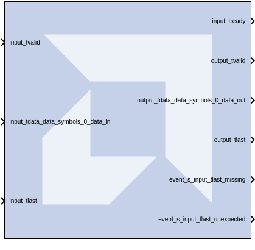
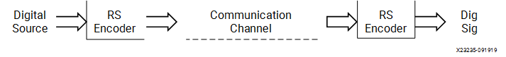
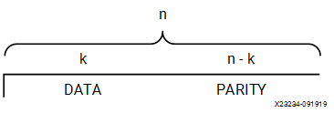

# Reed-Solomon Encoder 9.0

Note: This block goes into the FPGA fabric and is a Licensed Core.
Please visit the Xilinx web site to purchase the appropriate core
license.

The Reed-Solomon (RS) codes are block-based error correcting codes with
a wide range of applications in digital communications and storage. This
block adheres to the AMBA® AXI4-Stream standard.

They are used to correct errors in many systems such as digital storage
devices, wireless or mobile communications, and digital video
broadcasting.

The Reed-Solomon encoder augments data blocks with redundant symbols so
that errors introduced during transmission can be corrected. Errors can
occur for a number of reasons (noise or interference, scratches on a CD,
etc.). The Reed-Solomon decoder attempts to correct errors and recover
the original data. The number and type of errors that can be corrected
depends on the characteristics of the code.

A typical system is shown below:

  

Reed-Solomon codes are Bose-Chaudhuri-Hocquenghem (BCH) codes, which in
turn are linear block codes. An (n, k) linear block code is a
k-dimensional sub space of an n-dimensional vector space over a finite
field. Elements of the field are called symbols. For a Reed-Solomon
code, n ordinarily is 2^(S) -1, where s is the width in bits of each
symbol. When the code is shortened, n is smaller. The encoder handles
both full length and shortened codes.

The encoder is systematic. This means it constructs code blocks of
length n from information blocks of length k by adjoining n-k parity
symbols.

  
  

A Reed-Solomon code is characterized by its field and generator
polynomials. The field polynomial is used to construct the symbol field,
and the generator polynomial is used to calculate parity symbols. The
encoder allows both polynomials to be configured. The generator
polynomial has the form:

g(x)=(x-α^(j))(x-α^(j+1)...(x-α^(i+n-k-1))

where α is a primitive element of the finite field having n + 1
elements.

### Block Interface Channels and Pins

The Reed-Solomon Decoder 8.0 block is AXI4 compliant. The
following describes the standard AXI channels and pins on the interface:

#### input Channel  
##### input_tvalid  
TVALID for the input channel.

##### input_tdata_data_in  
Presents blocks of n symbols to be decoded. This signal must have type
UFIX_s_0, where s is the width in bits of each symbol.

##### input_tlast  
Marks the last symbol of the input block. Only used to generate event
outputs. Can be tied low or high if event outputs are not used.

##### input_tready  
TREADY for the input channel.

##### input_tuser_marker  
Marker bits for tagging data on input_tdata_data_in. Added to the
channel when you select Marker Bits from the Detailed Implementation
tab.

#### output Channel  
##### output_tready  
TREADY for the output channel. Added to the channel when you select
Output TREADY from the Optional Pins tab.

##### output_tvalid  
TVALID for the output channel.

##### output_tdata_data_out  
Produces the information and parity symbols resulting from decoding. The
type of data_out is the same as that for data_in.

##### output_tlast  
Goes high when the last symbol of the last block is on tdata_data_out.
output_tlast produces a signal of type UFIX_1_0.

##### output_tuser_maker  
This pin is available when user selects "Marker Bits" from the Detailed
Implementation tab.

#### event Channel  
##### event_s_input_tlast_missing  
This output flag indicates that the input_tlast was not asserted when
expected. You should leave this pin unconnected if it is not required.

##### event_s_input_tlast_unexpected  
This output flag indicates that the input_tlast was asserted when not
expected. You should leave this pin unconnected if it is not required.

##### event_s_ctrl_tdata_invalid  
This output flag indicates that values provided on ctrl_tdata were
illegal. This pin is available when "Variable Block Length" or "Variable
Number of Check Symbols" are selected on the GUI.

#### ctrl Channel  
This channel is only present when variable block length or number of
check symbols is selected as a block parameter.

##### ctrl_tvalid  
TVALID for the ctrl channel.

##### ctrl_tdata_n_in  
This signal is only present if “Variable Block Length” is selected in
the GUI. This allows the block length to be changed every block. The
ctrl_tdata_n_in signal must have type UFIX_s_0, where s is the width in
bits of each symbol. Unless there is an R_IN field, the number of check
symbols is fixed, so varying n automatically varies k.

##### ctrl_tdata_r_in  
This field is only present if “Variable Number of Check Symbols” is
selected in the GUI. It allows the number of check symbols to be changed
every block. The new block's length, r_block, is set to ctrl_tdata_r_in
sampled. The ctrl_tdata_r_in signal must have type UFIX_p_0, where p is
the number of bits required to represent the parity bits (n-k) in the
default code word, n being the "Symbols Per Block" and k being "Data
Symbols". Selecting this input significantly increases the size of the
core.

#### Other Optional Pins

##### aresetn  
Resets the encoder. This pin is added to the block when you specify
ARESETn on the Detailed Implementation tab. The signal driving ARESETn
must be Bool.

aresetn must be asserted low for at least 2 clock periods and at least 1
sample period before the decoder can start decoding code symbols.

##### aclken  
Carries the clock enable signal for the encoder. The signal driving
aclken must be Bool. Added to the block when you select the optional
pin ACLKEN.

## Parameters

### Attributes  
Parameters specific to the Attributes tab are as follows.

#### Code Block Specification  
##### Code specification  
specifies the encoder type desired. The choices are:

###### Custom  
Allows you to set all the block parameters.

###### DVB  
Implements DVB (Digital Video Broadcasting) standard (204, 188)
shortened RS code.

###### ATSC  
Implements ATSC (Advanced Television Systems Committee) standard
(207, 187) shortened RS code

###### G_709  
Implements G.709 Optical Transport Network standard.

###### ETSI_BRAN  
Implements the ETSI Project standard for Broadband Radio Access Networks
(BRAN).

###### CCSDS  
Implements CCSDS (Consultative Committee for Space Data Systems)
standard (255, 223) full length RS code.

###### ITU_J_83_Annex_B  
Implements International Telecommunication Union (ITU)-J.83 Annex B
specification (128, 122) extended RS code.

###### IESS-308 (126)  
Implements IESS-308 (INTELSAT Earth Station Standard) specification
(126, 112) shortened RS code.

###### IESS-308 (194)  
Implements IESS-308 specification (194, 178) shortened RS code.

###### IESS-308 (208)  
Implements IESS-308 specification (208, 192) shortened RS code.

###### IESS-308 (219)  
Implements IESS-308 specification (219, 201) shortened RS code.

###### IESS-308 (225)  
Implements IESS-308 specification (225, 205) shortened RS code.

##### Variable Number of Check Symbols (r)  
False, true. When checked, the ctrl_tdata_r_in and ctrl_tdata_n_in pins
become available on the block.

##### Variable Block Length  
False, true. When checked, the ctrl_tdata_n_in pin becomes available on
the block.

##### Symbol width  
Tells the width in bits for symbols in the code. The encoder support
widths from 3 to 12 and the default value is 8.

##### Field polynomial  
specifies the polynomial from which the symbol field is derived. It must
be specified as a decimal number. This polynomial must be primitive. A
value of zero indicates the default polynomial should be used. Default
polynomials are listed in the table below.

| Symbol Width | Default Polynomials   | Array Representation |
|--------------|-----------------------|----------------------|
| 3            | x³ + x + 1            | 11                   |
| 4            | x⁴ + x + 1            | 19                   |
| 5            | x⁵ + x2 + 1           | 37                   |
| 6            | x⁶ + x + 1            | 67                   |
| 7            | x⁷ + x³ + 1           | 137                  |
| 8            | x⁸ + x⁴ + x³ + x² + 1 | 285                  |
| 9            | x⁹ + x⁴+ 1            | 529                  |
| 10           | x¹⁰ + x³ + 1          | 1033                 |
| 11           | x¹¹ + x² + 1          | 2053                 |
| 12           | x¹² + x⁶ + x⁴ + x + 1 | 4179                 |

##### Scaling Factor (h)  
(represented in the previous formula as h) specifies the scaling factor
for the code. Ordinarily, h is 1, but can be as large as 2^(S) - 1 where
s is the symbol width. The value must be chosen so that α^(h) is
primitive. That is, h must be relatively prime to 2^(S) - 1.

##### Generator Start  
Specifies the first root r of the generator polynomial. The generator
polynomial g(x), is given by:  

  
where α is a primitive element of the symbol field, and the scaling
factor is described below.

##### Symbols Per Block(n)  
Tells the number of symbols in the blocks the encoder produces.
Acceptable numbers range from 3 to 2^(S) -1, where s denotes the symbol
width.

##### Data Symbols(k)  
Tells the number of information symbols each block contains. Acceptable
values range from max(n - 256, 1) to n - 2.

### Detailed Implementation tab  
#### Implementation  
##### Check Symbol Generator Optimization  
This option is available when "Variable Number of Check Symbols" option
is selected on the GUI.

###### Fixed Architecture  
The check symbol generator is implemented using a highly efficient fixed
architecture.

###### Area  
The check symbol generator implementation is optimized for area and
speed efficiency. The range of input, ctrl_tdata_n_in, is reduced.

###### Flexibility  
The check symbol generator implementation is optimized to maximize the
range of input of ctrl_tdata_n_in.

##### Memory Style  
Select between Distributed, Block and Automatic memory choices. This
option is available only for CCSDS codes.

##### Number Of Channels  
Specifies the number of separate time division multiplexed channels to
be processed by the encoder. The encoder supports up to 128 channels.

#### Optional Pins  
##### ACLKEN  
Adds a aclken pin to the block. This signal carries the clock enable and
must be of type Bool.

##### Output TREADY  
When selected, the output channels will have a TREADY and hence support
the AXI4 handshake protocol with inherent back-pressure.

##### ARESETn  
Adds a aresetn pin to the block. This signal resets the block and must
be of type Bool. aresetn must be asserted low for at least 2 clock
periods and at least 1 sample period before the decoder can start
decoding code symbols.

##### Info bit  
Adds the output_tdata_info pin. Marks the last information symbol of a
block on tdata_data_out.

##### Marker Bits  
Adds the following pins to the block:

###### input_tuser_user  
Carries marker bits for tagging data on input_tdata_ data_in.

###### output_tuser_user  
mark_in tagging bits delayed by the latency of the LogiCORE.

##### Number of Marker Bits  
Specifies the number of marker bits.

Other parameters used by this block are explained in the topic [Common
Options in Block Parameter Dialog
Boxes](../../GEN/common-options/README.md).

## LogiCORE™ Documentation

Reed-Solomon Encoder LogiCORE IP Product Guide
([PG025](https://docs.xilinx.com/access/sources/ud/document?isLatest=true&url=pg025_rs_encoder&ft:locale=en-US))
