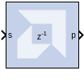
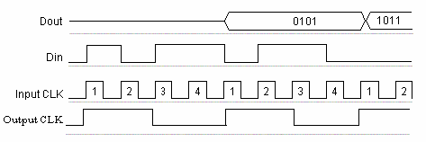

# Serial to Parallel

## Description

The Serial to Parallel block takes a series of inputs of any size and
creates a single output of a specified multiple of that size. The input
series can be ordered either with the most significant word first or the
least significant word first.

The following waveform illustrates the block's behavior:

  

This example illustrates the case where the input width is 1, output
width is 4, word size is 1 bit, and the block is configured for most
significant word first.

### Block Interface

The Serial to Parallel block has one input and one output port. The
input port can be any size. The output port size is indicated on the
Block Parameters dialog box.

## Block Parameters

#### Basic tab  
Parameters specific to the Basic tab are as follows.

#### Input order  
Least or most significant word first.

#### Arithmetic type  
Signed or unsigned output.

#### Number of bits  
Output width which must be a multiple of the number of input bits.

#### Binary point  
Output binary point location

Other parameters used by this block are explained in the topic [Common
Options in Block Parameter Dialog
Boxes](../../GEN/common-options/README.md).

An error is reported when the number of output bits cannot be divided
evenly by the number of input bits. The minimum latency for this block
is zero.

<!--
#### Provide reset port
Add a reset port to the block.
-->

<!--
#### Provide enable port
Selecting the Provide Enable Port option activates an optional enable (en) pin on the block. When the enable signal is not asserted the block holds its current state until the enable signal is asserted again or the reset signal is asserted. Reset signal has precedence over the enable signal. The enable signal has to run at a multiple of the block 's sample rate. The signal driving the enable port must be Boolean.
-->

<!--
#### Latency
Many elements in the Xilinx blockset have a latency option. This defines the number of sample periods by which the block's output is delayed. One sample period might correspond to multiple clock cycles in the corresponding FPGA implementation (for example, when the hardware is over-clocked with respect to the Simulink model). Model Composer does not perform extensive pipelining; additional latency is usually implemented as a shift register on the output of the block.
-->

--------------
Copyright (C) 2026 Advanced Micro Devices, Inc.
All rights reserved.

SPDX-License-Identifier: MIT
