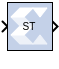

# Sample Time

## Description

The Sample Time block reports the normalized sample period of its input.
A signal's normalized sample period is not equivalent to its Simulink
absolute sample period. In hardware, this block is implemented as a
constant.

--------------
Copyright (C) 2024 Advanced Micro Devices, Inc.
All rights reserved.

SPDX-License-Identifier: MIT
