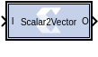

# Scalar2Vector

The Scalar2Vector block converts scalar type input to vector type
output.

## Description

The Scalar2Vector block slices the binary value of the input
scalar based on the Width parameter to produce a vector output. For
example, if the input is 3720 ( binary value 111 010 001 000 ) of type
Ufix_12_0, SSR is 4, and the Width parameter value is 3, then this
block slices the input binary value into 4 groups, each of 3 bits, so
that it produces the output \[0 1 2 7\].

### Data Type Support

The input must be a Boolean or unsigned fixed-point signal. The output
type is normally unsigned with binary point at zero, but can be Boolean
when the Width parameter is 1.

## Block Parameters

#### Width
This parameter defines the number of bits for each element of
output vector. This parameter is decided by:

Width = Input data width (bits)/SSR

This formula must be satisfied when setting up the block parameters.

#### Super Sample Rate (SSR)
This configurable GUI parameter is primarily
used to control the processing of multiple data samples on every sample
period. This block enables 1-D vector support for the primary block
operation.
