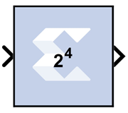

# Scale

The Xilinx Scale block scales its input by a power of two. The power can
be either positive or negative. The block has one input and one output.
The scale operation has the effect of moving the binary point without
changing the bits in the container

## Block Parameters

The block parameters dialog box can be invoked by double-clicking the
icon in your Simulink® model.

The only parameter that is specific to the Scale block is Scale factor
s. It can be a positive or negative integer. The output of the block is
i\*2^k, where i is the input value and k is the scale factor. The effect
of scaling is to move the binary point, which in hardware has no cost (a
shift, on the other hand, might add logic).

Other parameters used by this block are explained in the topic [Common
Options in Block Parameter Dialog
Boxes](common-options-in-block-parameter-dialog-boxes-aa1032308.html).

## Xilinx LogiCORE

The Scale block does not use a Xilinx LogiCORE™.
