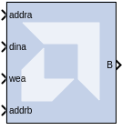
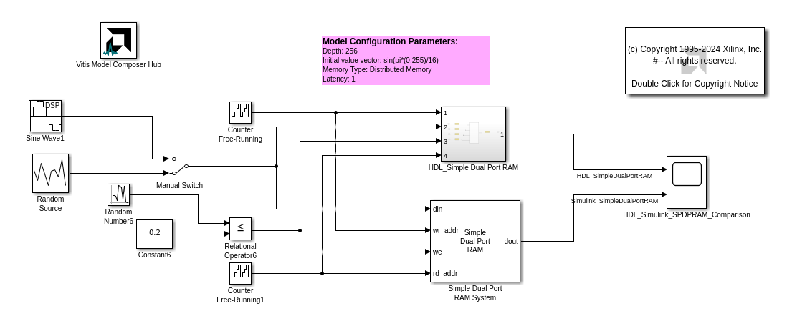
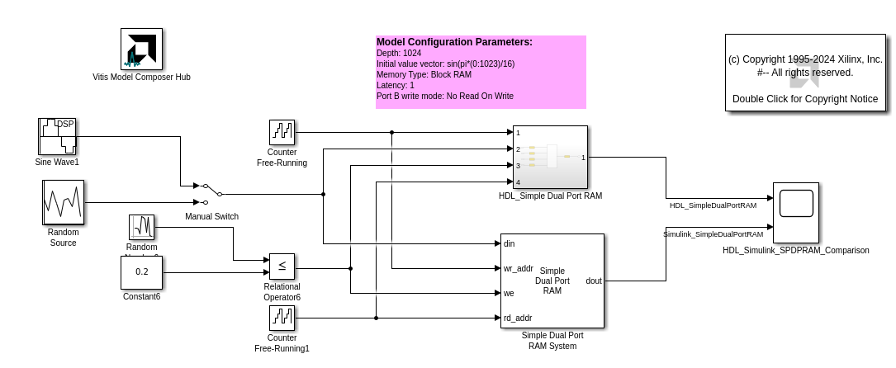

# Simple Dual Port RAM

## Description

The Simple Dual Port RAM block implements a random access memory (RAM), one port has read/write capability while the other port can only read. 
Thus, data can be read simultaneously from both ports, writing can only occur at one port at a time. This is also known as a 1.5 port RAM.

It is similar to the Dual Port RAM, but the Dual Port RAM has both write data output port and a read data output port.

### Block Interface

This block has one output port and four input ports for address (addra and addrb), input data, and write enable (WE)
Optionally, you can also add a port enable for port A and Port B and synchronous reset
signal to port B.

A simple dual-port RAM can be implemented using either distributed memory,
block RAM, or UltraRAM resources in the FPGA.

#### Write Mode

When the Simple Dual Port RAM block is implemented in block RAM, you can set
the write mode for the block in the block parameters dialog box.

The output during a write operation depends on the write mode. When the
WE is 0, the output port has the value at the location specified by the
address line. During a write operation (WE asserted), the data presented
on the input data port is stored in memory at the location selected by
the port's address input. During a write cycle, you can configure the
behavior of data out port B to one of the following choices:

- Read after write
- Read before write
- No read on write

The write modes can be described with the help of the figure below. In
the figure, the memory has been set to an initial value of 5 and the
address bit is specified as 4. When using No read on write mode, the
output is unaffected by the address line and the output is the same as
the last output when the WE was 0. For the other two modes, the output
is obtained from the location specified by the address line, and hence
is the value of the location being written to. This means that the
output can be the old value which corresponds to Read after write.

  

Collision Behavior: The result of simultaneous access to both ports is
described below.

Read-Read Collisions: If both ports read simultaneously from the same
memory cell, the read operation is successful.

Write-Read Collisions: This collision occurs when one port writes and
the other reads from the same memory cell. While the memory contents are
not corrupted, the validity of the output data on the read port depends
on the Write Mode of the write port.

- If the write port is in Read before write mode, the other port can
  reliably read the old memory contents.
- If the write port is in Read after write or No read on write, data on
  the output of the read port is invalid (nan).

You can set the Write Mode of port B using the Advanced tab of the
block parameters dialog box.

## Parameters

### Basic tab  
Parameters specific to the Basic tab are as follows.

#### Depth  
Specifies the number of words in the memory for Port A, which must be a
positive integer. 

#### Initial value vector  
For distributed memory or block RAM, specifies the initial memory
contents. The size and precision of the elements of the initial value
vector are based on the data format specified for Port A. When the
vector is longer than the RAM, the vector's trailing elements are
discarded. When the RAM is longer than the vector, the RAM's trailing
words are set to zero. The initial value vector is saturated and rounded
according to the precision specified on the data port A of RAM.

**Note**: UltraRAM memory is initialized to all 0's during power up or
device reset. If implemented in UltraRAM, the Simple Dual Port RAM block
cannot be initialized to user defined values.

#### Memory Type  
Option to select whether the simple dual-port RAM will be implemented in
Distributed memory, Block RAM, or UltraRAM. 

Depending on your selection for Memory Type, the simple dual-port RAM will be
inferred or implemented in this way when the design is compiled:

  - If the block will be implemented in Distributed memory, the
  Distributed Memory Generator v8.0 LogiCORE IP will be inferred or
  implemented when the design is compiled. This LogiCORE IP is described
  in the Distributed Memory Generator LogiCORE IP Product Guide
  ([PG063](https://docs.xilinx.com/access/sources/ud/document?isLatest=true&url=pg063-dist-mem-gen&ft:locale=en-US)).

  - If the block will be implemented in block RAM or UltraRAM, the
  XPM_MEMORY_TDPRAM (True Dual Port RAM) macro will be inferred or
  implemented when the design is compiled. For information on the
  XPM_MEMORY_TDPRAM Xilinx Parameterized Macro (XPM), refer to
  UltraScale Architecture Libraries Guide
  ([UG974](https://docs.xilinx.com/access/sources/dita/map?Doc_Version=2022.2%20English&url=ug974-vivado-ultrascale-libraries)).

#### Initial value for port B output register  
Specifies the initial value for port B output register. The initial
value is saturated and rounded according to the precision specified on
port B of RAM.

#### Provide synchronous reset port for port B output register  
When selected, allows access to the reset port available on the port B
output register of the Block RAM or UltraRAM. The reset port is
available only when the latency of the Block RAM or UltraRAM is greater
than or equal to 1.

#### Provide enable port for port A  
When selected, allows access to the enable port for port A. The enable
port is available only when the latency of the block is greater than or
equal to 1.

#### Provide enable port for port B  
When selected, allows access to the enable port for port B. The enable
port is available only when the latency of the block is greater than or
equal to 1.

### Advanced tab  
Parameters specific to the Advanced tab are as follows.

#### Write Mode  
When the Simple Dual Port RAM block is implemented in block RAM, specifies
memory behavior for port B when WE is asserted. Supported
modes are: Read after write, Read before write, and No read on write.
Read after write indicates the output value reflects the state of the
memory after the write operation. Read before write indicates the output
value reflects the state of the memory before the write operation. No
read on write indicates that the output value remains unchanged
irrespective of change of address or state of the memory. There are
device specific restrictions on the applicability of these modes. Also
refer to the Write Mode topic above for more information.

Other parameters used by this block are explained in the topic [Common
Options in Block Parameter Dialog
Boxes](../../GEN/common-options/README.md).

## Examples

***Click on the images below to open each model.***

## LogiCORE™ and XPM Documentation

Distributed Memory Generator LogiCORE IP Product Guide
([PG063](https://docs.xilinx.com/access/sources/ud/document?isLatest=true&url=pg063-dist-mem-gen&ft:locale=en-US))
(Distributed Memory)

UltraScale Architecture Memory Resources User Guide
([UG573](https://www.xilinx.com/cgi-bin/docs/ndoc?t=user_guides;d=ug573-ultrascale-memory-resources.pdf)) -
XPM_MEMORY_SDPRAM Macro (UltraRAM)

--------------
Copyright (C) 2024 Advanced Micro Devices, Inc.
All rights reserved.

SPDX-License-Identifier: MIT
