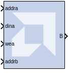
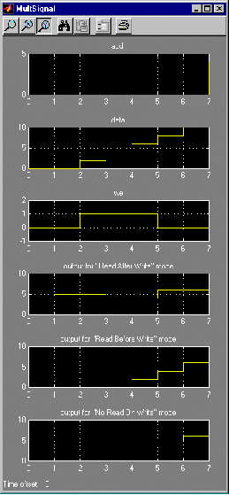
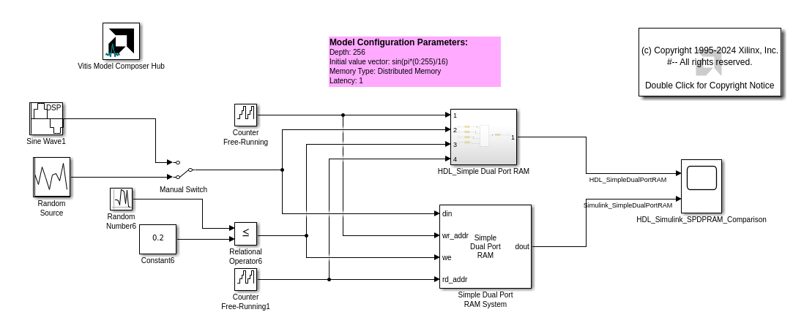
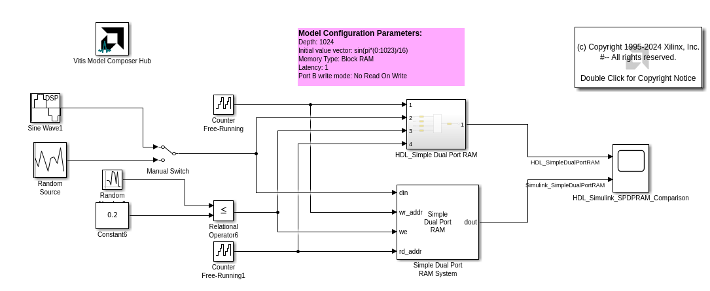

<!-- Library: hdlBasic -->

# Simple Dual Port RAM

## Description

The Simple Dual Port RAM block implements a random access memory (RAM), one port has read/write capability while the other port can only read. 
Thus, data can be read simultaneously from both ports, writing can only occur at one port at a time. This is also known as a 1.5 port RAM.

It is similar to the Dual Port RAM, but the Dual Port RAM has both write data output port and a read data output port.

### Block Interface

This block has one output port and four input ports for address (addra and addrb), input data, and write enable (WE)
Optionally, you can also add a port enable for port A and Port B and synchronous reset
signal to port B.

A simple dual-port RAM can be implemented using either distributed memory,
block RAM, or UltraRAM resources in the FPGA.

#### Write Mode

When the Simple Dual Port RAM block is implemented in block RAM, you can set
the write mode for the block in the block parameters dialog box.

The output during a write operation depends on the write mode. When the
WE is 0, the output port has the value at the location specified by the
address line. During a write operation (WE asserted), the data presented
on the input data port is stored in memory at the location selected by
the port's address input. During a write cycle, you can configure the
behavior of data out port B to one of the following choices:

- Read after write
- Read before write
- No read on write

The write modes can be described with the help of the figure below. In
the figure, the memory has been set to an initial value of 5 and the
address bit is specified as 4. When using No read on write mode, the
output is unaffected by the address line and the output is the same as
the last output when the WE was 0. For the other two modes, the output
is obtained from the location specified by the address line, and hence
is the value of the location being written to. This means that the
output can be the old value which corresponds to Read after write.

  

Collision Behavior: The result of simultaneous access to both ports is
described below.

Read-Read Collisions: If both ports read simultaneously from the same
memory cell, the read operation is successful.

Write-Read Collisions: This collision occurs when one port writes and
the other reads from the same memory cell. While the memory contents are
not corrupted, the validity of the output data on the read port depends
on the Write Mode of the write port.

- If the write port is in Read before write mode, the other port can
  reliably read the old memory contents.
- If the write port is in Read after write or No read on write, data on
  the output of the read port is invalid (nan).

You can set the Write Mode of port B using the Advanced tab of the
block parameters dialog box.

## Parameters

### Basic tab  
Parameters specific to the Basic tab are as follows.

#### Depth  
Specifies the number of words in the memory for Port A, which must be a
positive integer. 

#### Initial value vector  
For distributed memory or block RAM, specifies the initial memory
contents. The size and precision of the elements of the initial value
vector are based on the data format specified for Port A. When the
vector is longer than the RAM, the vector's trailing elements are
discarded. When the RAM is longer than the vector, the RAM's trailing
words are set to zero. The initial value vector is saturated and rounded
according to the precision specified on the data port A of RAM.

**Note**: UltraRAM memory is initialized to all 0's during power up or
device reset. If implemented in UltraRAM, the Simple Dual Port RAM block
cannot be initialized to user defined values.

#### Memory Type  
Option to select whether the simple dual-port RAM will be implemented in
Distributed memory, Block RAM, or UltraRAM. 

Depending on your selection for Memory Type, the simple dual-port RAM will be
inferred or implemented in this way when the design is compiled:

  - If the block will be implemented in Distributed memory, the
  Distributed Memory Generator v8.0 LogiCORE IP will be inferred or
  implemented when the design is compiled. This LogiCORE IP is described
  in the Distributed Memory Generator LogiCORE IP Product Guide
  ([PG063](https://docs.xilinx.com/access/sources/ud/document?isLatest=true&url=pg063-dist-mem-gen&ft:locale=en-US)).

  - If the block will be implemented in block RAM or UltraRAM, the
  XPM_MEMORY_TDPRAM (True Dual Port RAM) macro will be inferred or
  implemented when the design is compiled. For information on the
  XPM_MEMORY_TDPRAM Xilinx Parameterized Macro (XPM), refer to
  UltraScale Architecture Libraries Guide
  ([UG974](https://docs.xilinx.com/access/sources/dita/map?Doc_Version=2022.2%20English&url=ug974-vivado-ultrascale-libraries)).

#### Initial value for port B output register  
Specifies the initial value for port B output register. The initial
value is saturated and rounded according to the precision specified on
port B of RAM.

#### Provide synchronous reset port for port B output register  
When selected, allows access to the reset port available on the port B
output register of the Block RAM or UltraRAM. The reset port is
available only when the latency of the Block RAM or UltraRAM is greater
than or equal to 1.

#### Provide enable port for port A  
When selected, allows access to the enable port for port A. The enable
port is available only when the latency of the block is greater than or
equal to 1.

#### Provide enable port for port B  
When selected, allows access to the enable port for port B. The enable
port is available only when the latency of the block is greater than or
equal to 1.

### Advanced tab  
Parameters specific to the Advanced tab are as follows.

#### Write Mode  
When the Simple Dual Port RAM block is implemented in block RAM, specifies
memory behavior for port B when WE is asserted. Supported
modes are: Read after write, Read before write, and No read on write.
Read after write indicates the output value reflects the state of the
memory after the write operation. Read before write indicates the output
value reflects the state of the memory before the write operation. No
read on write indicates that the output value remains unchanged
irrespective of change of address or state of the memory. There are
device specific restrictions on the applicability of these modes. Also
refer to the Write Mode topic above for more information.

Other parameters used by this block are explained in the topic [Common
Options in Block Parameter Dialog
Boxes](../../GEN/common-options/README.md).

## Examples

***Click on the images below to open each model.***

<!--
DESCRIPTION:
Model: Simple_DualPortRAM_Ex1
Generated: 09-Jan-2026 13:53:07

Vitis Model Composer Configuration:
  Target Device: xcvu9p-fsgd2104-3-e

Vitis Model Composer Blocks:
  - HDL: Gateway In
  - HDL: Gateway Out
  - HDL: Simple Dual Port RAM
  - HDL: Copyright

Description:
This MATLAB script creates a Vitis Model Composer Simulink model that uses the AI Engine Gateway In, Gateway Out, Simple Dual Port RAM and Copyright blocks. A 0Hz real input signal is provided to the block,  and the output is visualized for analysis.

-->

<!--
MATLAB CREATION SCRIPT:

% create_Simple_DualPortRAM_Ex1_model.m
% Auto-generated script to recreate the Simple_DualPortRAM_Ex1 Simulink model
% Generated on: 09-Jan-2026 13:53:07

%% Model Configuration
modelName = 'Simple_DualPortRAM_Ex1_recreated';

%% Create New Model
if bdIsLoaded(modelName)
    close_system(modelName, 0);
end

new_system(modelName);
open_system(modelName);
fprintf('Created new model: %s\n', modelName);

%% Add Vitis Model Composer Hub Block
hubBlockPath = [modelName '/Vitis Model Composer Hub'];
add_block('vmcUtilities/Vitis Model Composer Hub', hubBlockPath, ...
    'Position', [45 94 95 144]);

hubBlk = xmcFindHubBlock(modelName);
vmchub_set_param(hubBlk, modelName, 'SelectHardware', 'xcvu9p-fsgd2104-3-e');

%% Add Top-Level Blocks
add_block('built-in/Constant', [modelName '/Constant6'], ...
    'Position', [45 370 95 410]);
set_param([modelName '/Constant6'], ...
    'Value', '0.2', ...
    'VectorParams1D', 'on', ...
    'OutMin', '[]', ...
    'OutMax', '[]', ...
    'OutDataTypeStr', 'Inherit: Inherit from ''Constant value''', ...
    'LockScale', 'off', ...
    'SampleTime', 'inf', ...
    'FramePeriod', 'inf');
add_block('hdlUtilities/Copyright', [modelName '/Copyright'], ...
    'Position', [777 101 971 194]);
set_param([modelName '/Copyright'], ...
    'copyrighttext', '(c) Copyright 1995-2022 Xilinx, Inc.  (c) Copyright 2022-2026 Advanced Micro Devices, Inc. All rights reserved.  This document  contains proprietary, confidential information that may be used, copied and/or disclosed only as authorized by a valid licensing agreement with Advanced Micro Devices, Inc. This copyright notice must be retained on all authorized copies.   This code is provided "as is". Advanced Micro Devices, Inc. makes, and the end user receives, no warranties or conditions, express, implied, statutory or otherwise, and Advanced Micro Devices, Inc. specifically disclaims any implied warranties of merchantability,  non-infringement, or fitness for a particular purpose. ', ...
    'block_type', 'copyright', ...
    'sg_icon_stat', '199,98,-1,-1,beige,white,0,0,right,', ...
    'sg_mask_display', 'fprintf('''',''COMMENT: begin icon graphics''); patch([0 200 200 0 0 ],[0 0 100 100 0 ],[1 1 1 ]); plot([0 200 200 0 0 ],[0 0 100 100 0 ]); patch([68.85 89.08 103.08 117.08 131.08 103.08 82.85 68.85 ],[65.54 65.54 79.54 65.54 79.54 79.54 79.54 65.54 ],[0.951 0.944 0.902 ]); patch([82.85 103.08 89.08 68.85 82.85 ],[51.54 51.54 65.54 65.54 51.54 ],[0.93 0.92 0.86 ]); patch([68.85 89.08 103.08 82.85 68.85 ],[37.54 37.54 51.54 51.54 37.54 ],[0.951 0.944 0.902 ]); patch([82.85 131.08 117.08 103.08 89.08 68.85 82.85 ],[23.54 23.54 37.54 23.54 37.54 37.54 23.54 ],[0.93 0.92 0.86 ]); fprintf('''',''COMMENT: end icon graphics''); fprintf('''',''COMMENT: begin icon text''); fprintf('''',''COMMENT: end icon text'');disp([''{\fontsize{12pt}(c) Copyright 1995-'' datestr(now, ''yyyy'') '' Xilinx, Inc.}\newline \newline ''],''texmode'',''on''); disp(''{\fontsize{12pt}#-- All rights reserved.}'',''texmode'',''on''); disp(''\newline \newline \newline \newline{\fontsize{12pt}Double Click for Copyright Notice}'',''texmode'',''on''); ');
add_block('built-in/Scope', [modelName '/HDL_Simulink_SPDPRAM_Comparison'], ...
    'Position', [835 281 890 354]);
set_param([modelName '/HDL_Simulink_SPDPRAM_Comparison'], ...
    'OpenAtSimulationStart', 'off', ...
    'DisplayFullPath', 'off', ...
    'NumInputPorts', '2', ...
    'LayoutDimensionsString', '[1 1]', ...
    'SampleTime', '-1', ...
    'FrameBasedProcessingString', 'Elements as channels (sample based)', ...
    'MaximizeAxes', 'Off', ...
    'AxesScaling', 'Manual', ...
    'AxesScalingNumUpdates', '10', ...
    'TimeSpan', 'Auto', ...
    'TimeSpanOverrunAction', 'Wrap', ...
    'TimeUnits', 'None', ...
    'TimeDisplayOffset', '0', ...
    'TimeAxisLabels', 'Bottom displays only', ...
    'ShowTimeAxisLabel', 'off', ...
    'ActiveDisplayString', '1', ...
    'Title', '%<SignalLabel>', ...
    'ShowLegend', 'on', ...
    'ShowGrid', 'on', ...
    'PlotAsMagnitudePhase', 'off', ...
    'ActiveDisplayYMinimum', '-5', ...
    'ActiveDisplayYMaximum', '5', ...
    'DataLoggingLimitDataPoints', 'off', ...
    'DataLoggingMaxPoints', '5000', ...
    'DataLoggingDecimateData', 'on', ...
    'DataLoggingDecimation', '1', ...
    'DataLogging', 'off', ...
    'DataLoggingVariableName', 'ScopeData', ...
    'DataLoggingSaveFormat', 'Structure With Time');
add_block('built-in/ManualSwitch', [modelName '/Manual Switch'], ...
    'Position', [140 277 170 313]);
set_param([modelName '/Manual Switch'], ...
    'varsize', 'off', ...
    'SampleTime', '-1');
add_block('built-in/RandomNumber', [modelName '/Random Number6'], ...
    'Position', [55 320 85 350]);
set_param([modelName '/Random Number6'], ...
    'Mean', '0', ...
    'Variance', '1', ...
    'Seed', '65536', ...
    'SampleTime', '0', ...
    'VectorParams1D', 'on');
add_block('dspobslib/Random Source', [modelName '/Random Source'], ...
    'Position', [-50 278 0 332]);
set_param([modelName '/Random Source'], ...
    'SrcType', 'Uniform', ...
    'NormMethod', 'Ziggurat', ...
    'CltLength', '12', ...
    'MinVal', '0', ...
    'MaxVal', '1', ...
    'MeanVal', '0', ...
    'VarVal', '1', ...
    'RepMode', 'Specify seed', ...
    'rawSeed', '1', ...
    'IsInherit', 'off', ...
    'SampMode', 'Discrete', ...
    'SampTime', '1', ...
    'SampFrame', '1', ...
    'DataType', 'Double', ...
    'OutComplex', 'Real', ...
    'OutputFrames', 'on');
add_block('built-in/RelationalOperator', [modelName '/Relational Operator6'], ...
    'Position', [225 367 255 398]);
set_param([modelName '/Relational Operator6'], ...
    'Operator', '<=', ...
    'InputSameDT', 'on', ...
    'OutDataTypeStr', 'Inherit: Logical (see Configuration Parameters: Optimization)', ...
    'ZeroCross', 'on', ...
    'SampleTime', '-1', ...
    'RndMeth', 'Nearest');
add_block('hdlsllib/HDL RAMs/Simple Dual Port RAM System', [modelName '/Simple Dual Port RAM System'], ...
    'Position', [505 343 630 457]);
set_param([modelName '/Simple Dual Port RAM System'], ...
    'RAMType', 'Simple dual port', ...
    'AsyncRead', 'off', ...
    'WriteOutputValue', 'New data', ...
    'RAMInitialValue', 'sin(pi*(0:255)/16)', ...
    'allowBusInputs', 'off', ...
    'WritesHaveOutput', 'on', ...
    'NumReads', '0', ...
    'NumWrites', '1', ...
    'ModelRAMDelay', 'on', ...
    'VectorAccess', 'Parallel');
add_block('dspsrcs4/Sine Wave', [modelName '/Sine Wave1'], ...
    'Position', [-55 203 -10 247]);
set_param([modelName '/Sine Wave1'], ...
    'Amplitude', '1', ...
    'Frequency', '0.15', ...
    'Phase', '0', ...
    'SampleMode', 'Discrete', ...
    'OutComplex', 'Real', ...
    'CompMethod', 'Trigonometric fcn', ...
    'TableSize', 'Speed', ...
    'SampleTime', '1', ...
    'SamplesPerFrame', '1', ...
    'ResetState', 'Restart at time zero', ...
    'OutputFrames', 'off', ...
    'additionalParams', 'off', ...
    'allowOverrides', 'on', ...
    'dataType', 'double', ...
    'wordLen', '16', ...
    'udDataType', 'sfix(16)', ...
    'fracBitsMode', 'Best precision', ...
    'numFracBits', '15', ...
    'OutDataTypeStr', 'double', ...
    'LastOutDataTypeStr', 'double');
add_block('vmcUtilities/Vitis Model Composer Hub', [modelName '/Vitis Model Composer Hub'], ...
    'Position', [45 94 95 144]);
set_param([modelName '/Vitis Model Composer Hub'], ...
    'CodeGeneration', 'off', ...
    'SubsystemName', 'HDL_Simple Dual Port RAM', ...
    'StartColumn', '1', ...
    'NumberOfColumns', '1', ...
    'TargetDirectory', './code', ...
    'exportDesign', 'off', ...
    'analyzeDesign', 'off', ...
    'validateDesignOnHw', 'off', ...
    'ExportType', 'System Generator', ...
    'IpVendor', 'xilinx.com', ...
    'IpLibrary', 'hls', ...
    'IpVersion', '1.0', ...
    'IpHWLanguage', 'Verilog', ...
    'AieCompilerOptions', '{}', ...
    'CreateTestbench', 'off', ...
    'TestbenchStackSize', '10', ...
    'RunRtlSim', 'off', ...
    'RunCSim', 'off', ...
    'RunAieSim', 'off', ...
    'AieSimTimeout', '50000', ...
    'RunAieSimProfiling', 'off', ...
    'LaunchVitisAnalyzer', 'off', ...
    'PlotOutput', 'off', ...
    'GenHwImage', 'off', ...
    'GenLibadfXo', 'on', ...
    'GenHwValidationCode', 'off', ...
    'PlatformType', 'Not Specified', ...
    'HwSystemType', 'Baremetal', ...
    'HwValidationTarget', 'hw', ...
    'ProjDevice', 'xcvu9p-fsgd2104-3-e', ...
    'SamplePeriod', '-1', ...
    'ClockFrequency', '200', ...
    'DataPathParallelism', '1', ...
    'xilinxfamily', 'virtexuplus', ...
    'part', 'xcvu9p', ...
    'speed', '-3-e', ...
    'package', 'fsgd2104', ...
    'directory', './netlist/ip/HDL_Simple_Dual_Port_RAM/src', ...
    'testbench', 'off', ...
    'incr_netlist', 'off', ...
    'synthesis_tool', 'Vivado', ...
    'clock_wrapper', 'Clock Enables', ...
    'dbl_ovrd', 'According to Block Masks', ...
    'dcm_input_clock_period', '10', ...
    'sysclk_period', '10', ...
    'simulink_period', '1', ...
    'eval_field', '0', ...
    'LogFileName', '''''', ...
    'NThreads', '4');

%% Create Counter
Free-Running Subsystem
add_block('built-in/SubSystem', [modelName '/Counter
Free-Running'], ...
    'Position', [225 205 255 235]);

% Remove default blocks
defaultBlocks = find_system([modelName '/Counter
Free-Running'], 'SearchDepth', 1, 'Type', 'block');
for i = 1:length(defaultBlocks)
    if ~strcmp(defaultBlocks{i}, [modelName '/Counter
Free-Running'])
        delete_block(defaultBlocks{i});
    end
end

%% Create Counter
Free-Running1 Subsystem
add_block('built-in/SubSystem', [modelName '/Counter
Free-Running1'], ...
    'Position', [225 430 255 460]);

% Remove default blocks
defaultBlocks = find_system([modelName '/Counter
Free-Running1'], 'SearchDepth', 1, 'Type', 'block');
for i = 1:length(defaultBlocks)
    if ~strcmp(defaultBlocks{i}, [modelName '/Counter
Free-Running1'])
        delete_block(defaultBlocks{i});
    end
end

%% Create HDL_Simple Dual Port RAM Subsystem
add_block('built-in/SubSystem', [modelName '/HDL_Simple Dual Port RAM'], ...
    'Position', [520 212 610 288]);

% Remove default blocks
defaultBlocks = find_system([modelName '/HDL_Simple Dual Port RAM'], 'SearchDepth', 1, 'Type', 'block');
for i = 1:length(defaultBlocks)
    if ~strcmp(defaultBlocks{i}, [modelName '/HDL_Simple Dual Port RAM'])
        delete_block(defaultBlocks{i});
    end
end

add_block('built-in/Inport', [[modelName '/HDL_Simple Dual Port RAM'] '/In1'], ...
    'Position', [95 78 125 92]);
set_param([[modelName '/HDL_Simple Dual Port RAM'] '/In1'], ...
    'Port', '1', ...
    'IconDisplay', 'Port number', ...
    'OutputFunctionCall', 'off', ...
    'OutMin', '[]', ...
    'OutMax', '[]', ...
    'OutDataTypeStr', 'Inherit: auto', ...
    'LockScale', 'off', ...
    'BusOutputAsStruct', 'off', ...
    'BusVirtuality', 'inherit', ...
    'Unit', 'inherit', ...
    'PortDimensions', '-1', ...
    'VarSizeSig', 'Inherit', ...
    'SampleTime', '-1', ...
    'SignalType', 'auto', ...
    'LatchByDelayingOutsideSignal', 'off', ...
    'LatchInputForFeedbackSignals', 'off', ...
    'Interpolate', 'on', ...
    'DataMode', 'inherit', ...
    'MessageQueueUseDefaultAttributes', 'on', ...
    'MessageQueueCapacity', '1', ...
    'MessageQueueType', 'LIFO', ...
    'MessageQueueOverwriting', 'on');
add_block('built-in/Inport', [[modelName '/HDL_Simple Dual Port RAM'] '/In2'], ...
    'Position', [100 143 130 157]);
set_param([[modelName '/HDL_Simple Dual Port RAM'] '/In2'], ...
    'Port', '2', ...
    'IconDisplay', 'Port number', ...
    'OutputFunctionCall', 'off', ...
    'OutMin', '[]', ...
    'OutMax', '[]', ...
    'OutDataTypeStr', 'Inherit: auto', ...
    'LockScale', 'off', ...
    'BusOutputAsStruct', 'off', ...
    'BusVirtuality', 'inherit', ...
    'Unit', 'inherit', ...
    'PortDimensions', '-1', ...
    'VarSizeSig', 'Inherit', ...
    'SampleTime', '-1', ...
    'SignalType', 'auto', ...
    'LatchByDelayingOutsideSignal', 'off', ...
    'LatchInputForFeedbackSignals', 'off', ...
    'Interpolate', 'on', ...
    'DataMode', 'inherit', ...
    'MessageQueueUseDefaultAttributes', 'on', ...
    'MessageQueueCapacity', '1', ...
    'MessageQueueType', 'LIFO', ...
    'MessageQueueOverwriting', 'on');
add_block('built-in/Inport', [[modelName '/HDL_Simple Dual Port RAM'] '/In3'], ...
    'Position', [100 208 130 222]);
set_param([[modelName '/HDL_Simple Dual Port RAM'] '/In3'], ...
    'Port', '3', ...
    'IconDisplay', 'Port number', ...
    'OutputFunctionCall', 'off', ...
    'OutMin', '[]', ...
    'OutMax', '[]', ...
    'OutDataTypeStr', 'Inherit: auto', ...
    'LockScale', 'off', ...
    'BusOutputAsStruct', 'off', ...
    'BusVirtuality', 'inherit', ...
    'Unit', 'inherit', ...
    'PortDimensions', '-1', ...
    'VarSizeSig', 'Inherit', ...
    'SampleTime', '-1', ...
    'SignalType', 'auto', ...
    'LatchByDelayingOutsideSignal', 'off', ...
    'LatchInputForFeedbackSignals', 'off', ...
    'Interpolate', 'on', ...
    'DataMode', 'inherit', ...
    'MessageQueueUseDefaultAttributes', 'on', ...
    'MessageQueueCapacity', '1', ...
    'MessageQueueType', 'LIFO', ...
    'MessageQueueOverwriting', 'on');
add_block('built-in/Inport', [[modelName '/HDL_Simple Dual Port RAM'] '/In4'], ...
    'Position', [100 273 130 287]);
set_param([[modelName '/HDL_Simple Dual Port RAM'] '/In4'], ...
    'Port', '4', ...
    'IconDisplay', 'Port number', ...
    'OutputFunctionCall', 'off', ...
    'OutMin', '[]', ...
    'OutMax', '[]', ...
    'OutDataTypeStr', 'Inherit: auto', ...
    'LockScale', 'off', ...
    'BusOutputAsStruct', 'off', ...
    'BusVirtuality', 'inherit', ...
    'Unit', 'inherit', ...
    'PortDimensions', '-1', ...
    'VarSizeSig', 'Inherit', ...
    'SampleTime', '-1', ...
    'SignalType', 'auto', ...
    'LatchByDelayingOutsideSignal', 'off', ...
    'LatchInputForFeedbackSignals', 'off', ...
    'Interpolate', 'on', ...
    'DataMode', 'inherit', ...
    'MessageQueueUseDefaultAttributes', 'on', ...
    'MessageQueueCapacity', '1', ...
    'MessageQueueType', 'LIFO', ...
    'MessageQueueOverwriting', 'on');
add_block('hdlBasic/Simple Dual Port RAM', [[modelName '/HDL_Simple Dual Port RAM'] '/Simple Dual Port RAM'], ...
    'Position', [380 53 490 312]);
set_param([[modelName '/HDL_Simple Dual Port RAM'] '/Simple Dual Port RAM'], ...
    'depth', '256', ...
    'initVector', 'sin(pi*(0:255)/16)', ...
    'distributed_mem', 'Distributed memory', ...
    'init_b', '0', ...
    'rst_b', 'off', ...
    'en_a', 'off', ...
    'en_b', 'off', ...
    'latency', '1', ...
    'write_mode_B', 'Read After Write');
add_block('hdlBasic/Gateway In', [[modelName '/HDL_Simple Dual Port RAM'] '/addr'], ...
    'Position', [190 74 245 96]);
set_param([[modelName '/HDL_Simple Dual Port RAM'] '/addr'], ...
    'gui_display_data_type', 'Fixed-point', ...
    'arith_type', 'Unsigned', ...
    'n_bits', '8', ...
    'bin_pt', '0', ...
    'preci_type', 'Single', ...
    'exp_width', '8', ...
    'frac_width', '24', ...
    'rows', '1', ...
    'columns', '1', ...
    'quantization', 'Round  (unbiased: +/- Inf)', ...
    'overflow', 'Saturate', ...
    'period', '1', ...
    'UseAsADC', 'off', ...
    'ADCChannel', '''1''', ...
    'interface', 'None', ...
    'automatic_assignment', 'on', ...
    'address_offset', 'hex2dec(''00'')', ...
    'intf_name', '''''', ...
    'intf_description', '''''', ...
    'default_value', '0', ...
    'timing_constraint', 'None', ...
    'locs_specified', 'off', ...
    'LOCs', '{}', ...
    'io_standard', '{}', ...
    'inherit_from_input', 'off');
add_block('hdlBasic/Gateway In', [[modelName '/HDL_Simple Dual Port RAM'] '/addr1'], ...
    'Position', [190 269 245 291]);
set_param([[modelName '/HDL_Simple Dual Port RAM'] '/addr1'], ...
    'gui_display_data_type', 'Fixed-point', ...
    'arith_type', 'Unsigned', ...
    'n_bits', '8', ...
    'bin_pt', '0', ...
    'preci_type', 'Single', ...
    'exp_width', '8', ...
    'frac_width', '24', ...
    'rows', '1', ...
    'columns', '1', ...
    'quantization', 'Round  (unbiased: +/- Inf)', ...
    'overflow', 'Saturate', ...
    'period', '1', ...
    'UseAsADC', 'off', ...
    'ADCChannel', '''1''', ...
    'interface', 'None', ...
    'automatic_assignment', 'on', ...
    'address_offset', 'hex2dec(''00'')', ...
    'intf_name', '''''', ...
    'intf_description', '''''', ...
    'default_value', '0', ...
    'timing_constraint', 'None', ...
    'locs_specified', 'off', ...
    'LOCs', '{}', ...
    'io_standard', '{}', ...
    'inherit_from_input', 'off');
add_block('hdlBasic/Gateway Out', [[modelName '/HDL_Simple Dual Port RAM'] '/doutB'], ...
    'Position', [570 174 625 196]);
set_param([[modelName '/HDL_Simple Dual Port RAM'] '/doutB'], ...
    'inherit_from_input', 'off', ...
    'bool_to_boolean', 'off', ...
    'hdl_port', 'on', ...
    'rows', '1', ...
    'columns', '1', ...
    'UseAsDAC', 'off', ...
    'DACChannel', '''1''', ...
    'interface', 'None', ...
    'automatic_assignment', 'on', ...
    'address_offset', 'hex2dec(''00'')', ...
    'intf_name', '''''', ...
    'intf_description', '''''', ...
    'timing_constraint', 'None', ...
    'locs_specified', 'off', ...
    'LOCs', '{}', ...
    'io_standard', '{}');
add_block('hdlBasic/Gateway In', [[modelName '/HDL_Simple Dual Port RAM'] '/sine'], ...
    'Position', [190 139 245 161]);
set_param([[modelName '/HDL_Simple Dual Port RAM'] '/sine'], ...
    'gui_display_data_type', 'Fixed-point', ...
    'arith_type', 'Signed (2''s comp)', ...
    'n_bits', '8', ...
    'bin_pt', '6', ...
    'preci_type', 'Single', ...
    'exp_width', '8', ...
    'frac_width', '24', ...
    'rows', '1', ...
    'columns', '1', ...
    'quantization', 'Round  (unbiased: +/- Inf)', ...
    'overflow', 'Saturate', ...
    'period', '1', ...
    'UseAsADC', 'off', ...
    'ADCChannel', '''1''', ...
    'interface', 'None', ...
    'automatic_assignment', 'on', ...
    'address_offset', 'hex2dec(''00'')', ...
    'intf_name', '''''', ...
    'intf_description', '''''', ...
    'default_value', '0', ...
    'timing_constraint', 'None', ...
    'locs_specified', 'off', ...
    'LOCs', '{}', ...
    'io_standard', '{}', ...
    'inherit_from_input', 'off');
add_block('hdlBasic/Gateway In', [[modelName '/HDL_Simple Dual Port RAM'] '/we'], ...
    'Position', [190 204 245 226]);
set_param([[modelName '/HDL_Simple Dual Port RAM'] '/we'], ...
    'gui_display_data_type', 'Boolean', ...
    'arith_type', 'Boolean', ...
    'n_bits', '1', ...
    'bin_pt', '0', ...
    'preci_type', 'Single', ...
    'exp_width', '8', ...
    'frac_width', '24', ...
    'rows', '1', ...
    'columns', '1', ...
    'quantization', 'Round  (unbiased: +/- Inf)', ...
    'overflow', 'Saturate', ...
    'period', '1', ...
    'UseAsADC', 'off', ...
    'ADCChannel', '''1''', ...
    'interface', 'None', ...
    'automatic_assignment', 'on', ...
    'address_offset', 'hex2dec(''00'')', ...
    'intf_name', '''''', ...
    'intf_description', '''''', ...
    'default_value', '0', ...
    'timing_constraint', 'None', ...
    'locs_specified', 'off', ...
    'LOCs', '{}', ...
    'io_standard', '{}', ...
    'inherit_from_input', 'off');
add_block('built-in/Outport', [[modelName '/HDL_Simple Dual Port RAM'] '/Out2'], ...
    'Position', [720 178 750 192]);
set_param([[modelName '/HDL_Simple Dual Port RAM'] '/Out2'], ...
    'Port', '1', ...
    'StorageClass', 'Auto', ...
    'IconDisplay', 'Port number', ...
    'OutputFunctionCall', 'off', ...
    'OutMin', '[]', ...
    'OutMax', '[]', ...
    'OutDataTypeStr', 'Inherit: auto', ...
    'LockScale', 'off', ...
    'BusOutputAsStruct', 'off', ...
    'BusVirtuality', 'inherit', ...
    'DataMode', 'inherit', ...
    'Unit', 'inherit', ...
    'PortDimensions', '-1', ...
    'VarSizeSig', 'Inherit', ...
    'SampleTime', '-1', ...
    'SignalType', 'auto', ...
    'EnsureOutportIsVirtual', 'off', ...
    'OutputWhenDisabled', 'held', ...
    'InitialOutput', '[]', ...
    'MustResolveToSignalObject', 'off', ...
    'OutputWhenUnConnected', 'off', ...
    'OutputWhenUnconnectedValue', '0', ...
    'VectorParamsAs1DForOutWhenUnconnected', 'on');

% Connect blocks in HDL_Simple Dual Port RAM
add_line([modelName '/HDL_Simple Dual Port RAM'], 'sine/2', 'Simple Dual Port RAM/3', 'autorouting', 'on');
add_line([modelName '/HDL_Simple Dual Port RAM'], 'we/2', 'Simple Dual Port RAM/4', 'autorouting', 'on');
add_line([modelName '/HDL_Simple Dual Port RAM'], 'addr1/2', 'Simple Dual Port RAM/5', 'autorouting', 'on');
add_line([modelName '/HDL_Simple Dual Port RAM'], 'In3/2', 'we/2', 'autorouting', 'on');
add_line([modelName '/HDL_Simple Dual Port RAM'], 'In1/2', 'addr/2', 'autorouting', 'on');
add_line([modelName '/HDL_Simple Dual Port RAM'], 'doutB/2', 'Out2/2', 'autorouting', 'on');
add_line([modelName '/HDL_Simple Dual Port RAM'], 'In4/2', 'addr1/2', 'autorouting', 'on');
add_line([modelName '/HDL_Simple Dual Port RAM'], 'In2/2', 'sine/2', 'autorouting', 'on');
add_line([modelName '/HDL_Simple Dual Port RAM'], 'addr/2', 'Simple Dual Port RAM/2', 'autorouting', 'on');
add_line([modelName '/HDL_Simple Dual Port RAM'], 'Simple Dual Port RAM/2', 'doutB/2', 'autorouting', 'on');

%% Connect Top-Level Blocks
add_line(modelName, 'Random Source/2', 'Manual Switch/3', 'autorouting', 'on');
add_line(modelName, 'Manual Switch/2', 'HDL_Simple Dual Port RAM/3', 'autorouting', 'on');
add_line(modelName, 'Manual Switch/2', 'Simple Dual Port RAM System/2', 'autorouting', 'on');
add_line(modelName, 'Manual Switch/2', 'Simple Dual Port RAM System/2', 'autorouting', 'on');
add_line(modelName, 'Sine Wave1/2', 'Manual Switch/2', 'autorouting', 'on');
add_line(modelName, 'Simple Dual Port RAM System/2', 'HDL_Simulink_SPDPRAM_Comparison/3', 'autorouting', 'on');
add_line(modelName, 'Counter Free-Running1/2', 'Simple Dual Port RAM System/5', 'autorouting', 'on');
add_line(modelName, 'Counter Free-Running1/2', 'HDL_Simple Dual Port RAM/5', 'autorouting', 'on');
add_line(modelName, 'Counter Free-Running1/2', 'HDL_Simple Dual Port RAM/5', 'autorouting', 'on');
add_line(modelName, 'Counter Free-Running/2', 'HDL_Simple Dual Port RAM/2', 'autorouting', 'on');
add_line(modelName, 'Counter Free-Running/2', 'Simple Dual Port RAM System/3', 'autorouting', 'on');
add_line(modelName, 'Counter Free-Running/2', 'Simple Dual Port RAM System/3', 'autorouting', 'on');
add_line(modelName, 'Relational Operator6/2', 'HDL_Simple Dual Port RAM/4', 'autorouting', 'on');
add_line(modelName, 'Relational Operator6/2', 'Simple Dual Port RAM System/4', 'autorouting', 'on');
add_line(modelName, 'Relational Operator6/2', 'Simple Dual Port RAM System/4', 'autorouting', 'on');
add_line(modelName, 'Constant6/2', 'Relational Operator6/3', 'autorouting', 'on');
add_line(modelName, 'HDL_Simple Dual Port RAM/2', 'HDL_Simulink_SPDPRAM_Comparison/2', 'autorouting', 'on');
add_line(modelName, 'Random Number6/2', 'Relational Operator6/2', 'autorouting', 'on');

%% Save Model
save_system(modelName);
fprintf('\nModel saved: %s.slx\n', modelName);
-->

<!--
DESCRIPTION:
Model: Simple_DualPortRAM_Ex2
Generated: 09-Jan-2026 13:53:07

Vitis Model Composer Configuration:
  Target Device: xcvu9p-fsgd2104-3-e

Vitis Model Composer Blocks:
  - HDL: Gateway In
  - HDL: Gateway Out
  - HDL: Simple Dual Port RAM
  - HDL: Copyright

Description:
This MATLAB script creates a Vitis Model Composer Simulink model that uses the AI Engine Gateway In, Gateway Out, Simple Dual Port RAM and Copyright blocks. A 0Hz real input signal is provided to the block,  and the output is visualized for analysis.

-->

<!--
MATLAB CREATION SCRIPT:

% create_Simple_DualPortRAM_Ex2_model.m
% Auto-generated script to recreate the Simple_DualPortRAM_Ex2 Simulink model
% Generated on: 09-Jan-2026 13:53:07

%% Model Configuration
modelName = 'Simple_DualPortRAM_Ex2_recreated';

%% Create New Model
if bdIsLoaded(modelName)
    close_system(modelName, 0);
end

new_system(modelName);
open_system(modelName);
fprintf('Created new model: %s\n', modelName);

%% Add Vitis Model Composer Hub Block
hubBlockPath = [modelName '/Vitis Model Composer Hub'];
add_block('vmcUtilities/Vitis Model Composer Hub', hubBlockPath, ...
    'Position', [45 94 95 144]);

hubBlk = xmcFindHubBlock(modelName);
vmchub_set_param(hubBlk, modelName, 'SelectHardware', 'xcvu9p-fsgd2104-3-e');

%% Add Top-Level Blocks
add_block('built-in/Constant', [modelName '/Constant6'], ...
    'Position', [45 370 95 410]);
set_param([modelName '/Constant6'], ...
    'Value', '0.2', ...
    'VectorParams1D', 'on', ...
    'OutMin', '[]', ...
    'OutMax', '[]', ...
    'OutDataTypeStr', 'Inherit: Inherit from ''Constant value''', ...
    'LockScale', 'off', ...
    'SampleTime', 'inf', ...
    'FramePeriod', 'inf');
add_block('hdlUtilities/Copyright', [modelName '/Copyright'], ...
    'Position', [777 101 971 194]);
set_param([modelName '/Copyright'], ...
    'copyrighttext', '(c) Copyright 1995-2022 Xilinx, Inc.  (c) Copyright 2022-2026 Advanced Micro Devices, Inc. All rights reserved.  This document  contains proprietary, confidential information that may be used, copied and/or disclosed only as authorized by a valid licensing agreement with Advanced Micro Devices, Inc. This copyright notice must be retained on all authorized copies.   This code is provided "as is". Advanced Micro Devices, Inc. makes, and the end user receives, no warranties or conditions, express, implied, statutory or otherwise, and Advanced Micro Devices, Inc. specifically disclaims any implied warranties of merchantability,  non-infringement, or fitness for a particular purpose. ', ...
    'block_type', 'copyright', ...
    'sg_icon_stat', '199,98,-1,-1,beige,white,0,0,right,', ...
    'sg_mask_display', 'fprintf('''',''COMMENT: begin icon graphics''); patch([0 200 200 0 0 ],[0 0 100 100 0 ],[1 1 1 ]); plot([0 200 200 0 0 ],[0 0 100 100 0 ]); patch([68.85 89.08 103.08 117.08 131.08 103.08 82.85 68.85 ],[65.54 65.54 79.54 65.54 79.54 79.54 79.54 65.54 ],[0.951 0.944 0.902 ]); patch([82.85 103.08 89.08 68.85 82.85 ],[51.54 51.54 65.54 65.54 51.54 ],[0.93 0.92 0.86 ]); patch([68.85 89.08 103.08 82.85 68.85 ],[37.54 37.54 51.54 51.54 37.54 ],[0.951 0.944 0.902 ]); patch([82.85 131.08 117.08 103.08 89.08 68.85 82.85 ],[23.54 23.54 37.54 23.54 37.54 37.54 23.54 ],[0.93 0.92 0.86 ]); fprintf('''',''COMMENT: end icon graphics''); fprintf('''',''COMMENT: begin icon text''); fprintf('''',''COMMENT: end icon text'');disp([''{\fontsize{12pt}(c) Copyright 1995-'' datestr(now, ''yyyy'') '' Xilinx, Inc.}\newline \newline ''],''texmode'',''on''); disp(''{\fontsize{12pt}#-- All rights reserved.}'',''texmode'',''on''); disp(''\newline \newline \newline \newline{\fontsize{12pt}Double Click for Copyright Notice}'',''texmode'',''on''); ');
add_block('built-in/Scope', [modelName '/HDL_Simulink_SPDPRAM_Comparison'], ...
    'Position', [835 281 890 354]);
set_param([modelName '/HDL_Simulink_SPDPRAM_Comparison'], ...
    'OpenAtSimulationStart', 'off', ...
    'DisplayFullPath', 'off', ...
    'NumInputPorts', '2', ...
    'LayoutDimensionsString', '[1 1]', ...
    'SampleTime', '-1', ...
    'FrameBasedProcessingString', 'Elements as channels (sample based)', ...
    'MaximizeAxes', 'Off', ...
    'AxesScaling', 'Manual', ...
    'AxesScalingNumUpdates', '10', ...
    'TimeSpan', 'Auto', ...
    'TimeSpanOverrunAction', 'Wrap', ...
    'TimeUnits', 'None', ...
    'TimeDisplayOffset', '0', ...
    'TimeAxisLabels', 'Bottom displays only', ...
    'ShowTimeAxisLabel', 'off', ...
    'ActiveDisplayString', '1', ...
    'Title', '%<SignalLabel>', ...
    'ShowLegend', 'on', ...
    'ShowGrid', 'on', ...
    'PlotAsMagnitudePhase', 'off', ...
    'ActiveDisplayYMinimum', '-5', ...
    'ActiveDisplayYMaximum', '5', ...
    'DataLoggingLimitDataPoints', 'off', ...
    'DataLoggingMaxPoints', '5000', ...
    'DataLoggingDecimateData', 'on', ...
    'DataLoggingDecimation', '1', ...
    'DataLogging', 'off', ...
    'DataLoggingVariableName', 'ScopeData', ...
    'DataLoggingSaveFormat', 'Structure With Time');
add_block('built-in/ManualSwitch', [modelName '/Manual Switch'], ...
    'Position', [140 277 170 313]);
set_param([modelName '/Manual Switch'], ...
    'varsize', 'off', ...
    'SampleTime', '-1');
add_block('built-in/RandomNumber', [modelName '/Random Number6'], ...
    'Position', [55 320 85 350]);
set_param([modelName '/Random Number6'], ...
    'Mean', '0', ...
    'Variance', '1', ...
    'Seed', '65536', ...
    'SampleTime', '0', ...
    'VectorParams1D', 'on');
add_block('dspobslib/Random Source', [modelName '/Random Source'], ...
    'Position', [-50 278 0 332]);
set_param([modelName '/Random Source'], ...
    'SrcType', 'Uniform', ...
    'NormMethod', 'Ziggurat', ...
    'CltLength', '12', ...
    'MinVal', '0', ...
    'MaxVal', '1', ...
    'MeanVal', '0', ...
    'VarVal', '1', ...
    'RepMode', 'Specify seed', ...
    'rawSeed', '1', ...
    'IsInherit', 'off', ...
    'SampMode', 'Discrete', ...
    'SampTime', '1', ...
    'SampFrame', '1', ...
    'DataType', 'Double', ...
    'OutComplex', 'Real', ...
    'OutputFrames', 'on');
add_block('built-in/RelationalOperator', [modelName '/Relational Operator6'], ...
    'Position', [225 367 255 398]);
set_param([modelName '/Relational Operator6'], ...
    'Operator', '<=', ...
    'InputSameDT', 'on', ...
    'OutDataTypeStr', 'Inherit: Logical (see Configuration Parameters: Optimization)', ...
    'ZeroCross', 'on', ...
    'SampleTime', '-1', ...
    'RndMeth', 'Nearest');
add_block('hdlsllib/HDL RAMs/Simple Dual Port RAM System', [modelName '/Simple Dual Port RAM System'], ...
    'Position', [505 343 630 457]);
set_param([modelName '/Simple Dual Port RAM System'], ...
    'RAMType', 'Simple dual port', ...
    'AsyncRead', 'off', ...
    'WriteOutputValue', 'New data', ...
    'RAMInitialValue', 'sin(pi*(0:1023)/16)', ...
    'allowBusInputs', 'off', ...
    'WritesHaveOutput', 'on', ...
    'NumReads', '0', ...
    'NumWrites', '1', ...
    'ModelRAMDelay', 'on', ...
    'VectorAccess', 'Parallel');
add_block('dspsrcs4/Sine Wave', [modelName '/Sine Wave1'], ...
    'Position', [-55 203 -10 247]);
set_param([modelName '/Sine Wave1'], ...
    'Amplitude', '1', ...
    'Frequency', '0.15', ...
    'Phase', '0', ...
    'SampleMode', 'Discrete', ...
    'OutComplex', 'Real', ...
    'CompMethod', 'Trigonometric fcn', ...
    'TableSize', 'Speed', ...
    'SampleTime', '1', ...
    'SamplesPerFrame', '1', ...
    'ResetState', 'Restart at time zero', ...
    'OutputFrames', 'off', ...
    'additionalParams', 'off', ...
    'allowOverrides', 'on', ...
    'dataType', 'double', ...
    'wordLen', '16', ...
    'udDataType', 'sfix(16)', ...
    'fracBitsMode', 'Best precision', ...
    'numFracBits', '15', ...
    'OutDataTypeStr', 'double', ...
    'LastOutDataTypeStr', 'double');
add_block('vmcUtilities/Vitis Model Composer Hub', [modelName '/Vitis Model Composer Hub'], ...
    'Position', [45 94 95 144]);
set_param([modelName '/Vitis Model Composer Hub'], ...
    'CodeGeneration', 'off', ...
    'SubsystemName', 'HDL_Simple Dual Port RAM', ...
    'StartColumn', '1', ...
    'NumberOfColumns', '1', ...
    'TargetDirectory', './code', ...
    'exportDesign', 'off', ...
    'analyzeDesign', 'off', ...
    'validateDesignOnHw', 'off', ...
    'ExportType', 'System Generator', ...
    'IpVendor', 'xilinx.com', ...
    'IpLibrary', 'hls', ...
    'IpVersion', '1.0', ...
    'IpHWLanguage', 'Verilog', ...
    'AieCompilerOptions', '{}', ...
    'CreateTestbench', 'off', ...
    'TestbenchStackSize', '10', ...
    'RunRtlSim', 'off', ...
    'RunCSim', 'off', ...
    'RunAieSim', 'off', ...
    'AieSimTimeout', '50000', ...
    'RunAieSimProfiling', 'off', ...
    'LaunchVitisAnalyzer', 'off', ...
    'PlotOutput', 'off', ...
    'GenHwImage', 'off', ...
    'GenLibadfXo', 'on', ...
    'GenHwValidationCode', 'off', ...
    'PlatformType', 'Not Specified', ...
    'HwSystemType', 'Baremetal', ...
    'HwValidationTarget', 'hw', ...
    'ProjDevice', 'xcvu9p-fsgd2104-3-e', ...
    'SamplePeriod', '-1', ...
    'ClockFrequency', '200', ...
    'DataPathParallelism', '1', ...
    'xilinxfamily', 'virtexuplus', ...
    'part', 'xcvu9p', ...
    'speed', '-3-e', ...
    'package', 'fsgd2104', ...
    'directory', './netlist/ip/HDL_Simple_Dual_Port_RAM/src', ...
    'testbench', 'off', ...
    'incr_netlist', 'off', ...
    'synthesis_tool', 'Vivado', ...
    'clock_wrapper', 'Clock Enables', ...
    'dbl_ovrd', 'According to Block Masks', ...
    'dcm_input_clock_period', '10', ...
    'sysclk_period', '10', ...
    'simulink_period', '1', ...
    'eval_field', '0', ...
    'LogFileName', '''''', ...
    'NThreads', '4');

%% Create Counter
Free-Running Subsystem
add_block('built-in/SubSystem', [modelName '/Counter
Free-Running'], ...
    'Position', [225 205 255 235]);

% Remove default blocks
defaultBlocks = find_system([modelName '/Counter
Free-Running'], 'SearchDepth', 1, 'Type', 'block');
for i = 1:length(defaultBlocks)
    if ~strcmp(defaultBlocks{i}, [modelName '/Counter
Free-Running'])
        delete_block(defaultBlocks{i});
    end
end

%% Create Counter
Free-Running1 Subsystem
add_block('built-in/SubSystem', [modelName '/Counter
Free-Running1'], ...
    'Position', [225 430 255 460]);

% Remove default blocks
defaultBlocks = find_system([modelName '/Counter
Free-Running1'], 'SearchDepth', 1, 'Type', 'block');
for i = 1:length(defaultBlocks)
    if ~strcmp(defaultBlocks{i}, [modelName '/Counter
Free-Running1'])
        delete_block(defaultBlocks{i});
    end
end

%% Create HDL_Simple Dual Port RAM Subsystem
add_block('built-in/SubSystem', [modelName '/HDL_Simple Dual Port RAM'], ...
    'Position', [520 212 610 288]);

% Remove default blocks
defaultBlocks = find_system([modelName '/HDL_Simple Dual Port RAM'], 'SearchDepth', 1, 'Type', 'block');
for i = 1:length(defaultBlocks)
    if ~strcmp(defaultBlocks{i}, [modelName '/HDL_Simple Dual Port RAM'])
        delete_block(defaultBlocks{i});
    end
end

add_block('built-in/Inport', [[modelName '/HDL_Simple Dual Port RAM'] '/In1'], ...
    'Position', [90 83 120 97]);
set_param([[modelName '/HDL_Simple Dual Port RAM'] '/In1'], ...
    'Port', '1', ...
    'IconDisplay', 'Port number', ...
    'OutputFunctionCall', 'off', ...
    'OutMin', '[]', ...
    'OutMax', '[]', ...
    'OutDataTypeStr', 'Inherit: auto', ...
    'LockScale', 'off', ...
    'BusOutputAsStruct', 'off', ...
    'BusVirtuality', 'inherit', ...
    'Unit', 'inherit', ...
    'PortDimensions', '-1', ...
    'VarSizeSig', 'Inherit', ...
    'SampleTime', '-1', ...
    'SignalType', 'auto', ...
    'LatchByDelayingOutsideSignal', 'off', ...
    'LatchInputForFeedbackSignals', 'off', ...
    'Interpolate', 'on', ...
    'DataMode', 'inherit', ...
    'MessageQueueUseDefaultAttributes', 'on', ...
    'MessageQueueCapacity', '1', ...
    'MessageQueueType', 'LIFO', ...
    'MessageQueueOverwriting', 'on');
add_block('built-in/Inport', [[modelName '/HDL_Simple Dual Port RAM'] '/In2'], ...
    'Position', [95 148 125 162]);
set_param([[modelName '/HDL_Simple Dual Port RAM'] '/In2'], ...
    'Port', '2', ...
    'IconDisplay', 'Port number', ...
    'OutputFunctionCall', 'off', ...
    'OutMin', '[]', ...
    'OutMax', '[]', ...
    'OutDataTypeStr', 'Inherit: auto', ...
    'LockScale', 'off', ...
    'BusOutputAsStruct', 'off', ...
    'BusVirtuality', 'inherit', ...
    'Unit', 'inherit', ...
    'PortDimensions', '-1', ...
    'VarSizeSig', 'Inherit', ...
    'SampleTime', '-1', ...
    'SignalType', 'auto', ...
    'LatchByDelayingOutsideSignal', 'off', ...
    'LatchInputForFeedbackSignals', 'off', ...
    'Interpolate', 'on', ...
    'DataMode', 'inherit', ...
    'MessageQueueUseDefaultAttributes', 'on', ...
    'MessageQueueCapacity', '1', ...
    'MessageQueueType', 'LIFO', ...
    'MessageQueueOverwriting', 'on');
add_block('built-in/Inport', [[modelName '/HDL_Simple Dual Port RAM'] '/In3'], ...
    'Position', [95 213 125 227]);
set_param([[modelName '/HDL_Simple Dual Port RAM'] '/In3'], ...
    'Port', '3', ...
    'IconDisplay', 'Port number', ...
    'OutputFunctionCall', 'off', ...
    'OutMin', '[]', ...
    'OutMax', '[]', ...
    'OutDataTypeStr', 'Inherit: auto', ...
    'LockScale', 'off', ...
    'BusOutputAsStruct', 'off', ...
    'BusVirtuality', 'inherit', ...
    'Unit', 'inherit', ...
    'PortDimensions', '-1', ...
    'VarSizeSig', 'Inherit', ...
    'SampleTime', '-1', ...
    'SignalType', 'auto', ...
    'LatchByDelayingOutsideSignal', 'off', ...
    'LatchInputForFeedbackSignals', 'off', ...
    'Interpolate', 'on', ...
    'DataMode', 'inherit', ...
    'MessageQueueUseDefaultAttributes', 'on', ...
    'MessageQueueCapacity', '1', ...
    'MessageQueueType', 'LIFO', ...
    'MessageQueueOverwriting', 'on');
add_block('built-in/Inport', [[modelName '/HDL_Simple Dual Port RAM'] '/In4'], ...
    'Position', [95 278 125 292]);
set_param([[modelName '/HDL_Simple Dual Port RAM'] '/In4'], ...
    'Port', '4', ...
    'IconDisplay', 'Port number', ...
    'OutputFunctionCall', 'off', ...
    'OutMin', '[]', ...
    'OutMax', '[]', ...
    'OutDataTypeStr', 'Inherit: auto', ...
    'LockScale', 'off', ...
    'BusOutputAsStruct', 'off', ...
    'BusVirtuality', 'inherit', ...
    'Unit', 'inherit', ...
    'PortDimensions', '-1', ...
    'VarSizeSig', 'Inherit', ...
    'SampleTime', '-1', ...
    'SignalType', 'auto', ...
    'LatchByDelayingOutsideSignal', 'off', ...
    'LatchInputForFeedbackSignals', 'off', ...
    'Interpolate', 'on', ...
    'DataMode', 'inherit', ...
    'MessageQueueUseDefaultAttributes', 'on', ...
    'MessageQueueCapacity', '1', ...
    'MessageQueueType', 'LIFO', ...
    'MessageQueueOverwriting', 'on');
add_block('hdlBasic/Simple Dual Port RAM', [[modelName '/HDL_Simple Dual Port RAM'] '/Simple Dual Port RAM'], ...
    'Position', [380 57 490 318]);
set_param([[modelName '/HDL_Simple Dual Port RAM'] '/Simple Dual Port RAM'], ...
    'depth', '1024', ...
    'initVector', 'sin(pi*(0:1023)/16)', ...
    'distributed_mem', 'Block RAM', ...
    'init_b', '0', ...
    'rst_b', 'off', ...
    'en_a', 'off', ...
    'en_b', 'off', ...
    'latency', '1', ...
    'write_mode_B', 'No Read On Write');
add_block('hdlBasic/Gateway In', [[modelName '/HDL_Simple Dual Port RAM'] '/addr'], ...
    'Position', [185 79 240 101]);
set_param([[modelName '/HDL_Simple Dual Port RAM'] '/addr'], ...
    'gui_display_data_type', 'Fixed-point', ...
    'arith_type', 'Unsigned', ...
    'n_bits', '10', ...
    'bin_pt', '0', ...
    'preci_type', 'Single', ...
    'exp_width', '8', ...
    'frac_width', '24', ...
    'rows', '1', ...
    'columns', '1', ...
    'quantization', 'Round  (unbiased: +/- Inf)', ...
    'overflow', 'Saturate', ...
    'period', '1', ...
    'UseAsADC', 'off', ...
    'ADCChannel', '''1''', ...
    'interface', 'None', ...
    'automatic_assignment', 'on', ...
    'address_offset', 'hex2dec(''00'')', ...
    'intf_name', '''''', ...
    'intf_description', '''''', ...
    'default_value', '0', ...
    'timing_constraint', 'None', ...
    'locs_specified', 'off', ...
    'LOCs', '{}', ...
    'io_standard', '{}', ...
    'inherit_from_input', 'off');
add_block('hdlBasic/Gateway In', [[modelName '/HDL_Simple Dual Port RAM'] '/addr1'], ...
    'Position', [185 274 240 296]);
set_param([[modelName '/HDL_Simple Dual Port RAM'] '/addr1'], ...
    'gui_display_data_type', 'Fixed-point', ...
    'arith_type', 'Unsigned', ...
    'n_bits', '10', ...
    'bin_pt', '0', ...
    'preci_type', 'Single', ...
    'exp_width', '8', ...
    'frac_width', '24', ...
    'rows', '1', ...
    'columns', '1', ...
    'quantization', 'Round  (unbiased: +/- Inf)', ...
    'overflow', 'Saturate', ...
    'period', '1', ...
    'UseAsADC', 'off', ...
    'ADCChannel', '''1''', ...
    'interface', 'None', ...
    'automatic_assignment', 'on', ...
    'address_offset', 'hex2dec(''00'')', ...
    'intf_name', '''''', ...
    'intf_description', '''''', ...
    'default_value', '0', ...
    'timing_constraint', 'None', ...
    'locs_specified', 'off', ...
    'LOCs', '{}', ...
    'io_standard', '{}', ...
    'inherit_from_input', 'off');
add_block('hdlBasic/Gateway Out', [[modelName '/HDL_Simple Dual Port RAM'] '/doutB'], ...
    'Position', [575 179 630 201]);
set_param([[modelName '/HDL_Simple Dual Port RAM'] '/doutB'], ...
    'inherit_from_input', 'off', ...
    'bool_to_boolean', 'off', ...
    'hdl_port', 'on', ...
    'rows', '1', ...
    'columns', '1', ...
    'UseAsDAC', 'off', ...
    'DACChannel', '''1''', ...
    'interface', 'None', ...
    'automatic_assignment', 'on', ...
    'address_offset', 'hex2dec(''00'')', ...
    'intf_name', '''''', ...
    'intf_description', '''''', ...
    'timing_constraint', 'None', ...
    'locs_specified', 'off', ...
    'LOCs', '{}', ...
    'io_standard', '{}');
add_block('hdlBasic/Gateway In', [[modelName '/HDL_Simple Dual Port RAM'] '/sine'], ...
    'Position', [185 144 240 166]);
set_param([[modelName '/HDL_Simple Dual Port RAM'] '/sine'], ...
    'gui_display_data_type', 'Fixed-point', ...
    'arith_type', 'Signed (2''s comp)', ...
    'n_bits', '8', ...
    'bin_pt', '6', ...
    'preci_type', 'Single', ...
    'exp_width', '8', ...
    'frac_width', '24', ...
    'rows', '1', ...
    'columns', '1', ...
    'quantization', 'Round  (unbiased: +/- Inf)', ...
    'overflow', 'Saturate', ...
    'period', '1', ...
    'UseAsADC', 'off', ...
    'ADCChannel', '''1''', ...
    'interface', 'None', ...
    'automatic_assignment', 'on', ...
    'address_offset', 'hex2dec(''00'')', ...
    'intf_name', '''''', ...
    'intf_description', '''''', ...
    'default_value', '0', ...
    'timing_constraint', 'None', ...
    'locs_specified', 'off', ...
    'LOCs', '{}', ...
    'io_standard', '{}', ...
    'inherit_from_input', 'off');
add_block('hdlBasic/Gateway In', [[modelName '/HDL_Simple Dual Port RAM'] '/we'], ...
    'Position', [185 209 240 231]);
set_param([[modelName '/HDL_Simple Dual Port RAM'] '/we'], ...
    'gui_display_data_type', 'Boolean', ...
    'arith_type', 'Boolean', ...
    'n_bits', '1', ...
    'bin_pt', '0', ...
    'preci_type', 'Single', ...
    'exp_width', '8', ...
    'frac_width', '24', ...
    'rows', '1', ...
    'columns', '1', ...
    'quantization', 'Round  (unbiased: +/- Inf)', ...
    'overflow', 'Saturate', ...
    'period', '1', ...
    'UseAsADC', 'off', ...
    'ADCChannel', '''1''', ...
    'interface', 'None', ...
    'automatic_assignment', 'on', ...
    'address_offset', 'hex2dec(''00'')', ...
    'intf_name', '''''', ...
    'intf_description', '''''', ...
    'default_value', '0', ...
    'timing_constraint', 'None', ...
    'locs_specified', 'off', ...
    'LOCs', '{}', ...
    'io_standard', '{}', ...
    'inherit_from_input', 'off');
add_block('built-in/Outport', [[modelName '/HDL_Simple Dual Port RAM'] '/Out2'], ...
    'Position', [720 183 750 197]);
set_param([[modelName '/HDL_Simple Dual Port RAM'] '/Out2'], ...
    'Port', '1', ...
    'StorageClass', 'Auto', ...
    'IconDisplay', 'Port number', ...
    'OutputFunctionCall', 'off', ...
    'OutMin', '[]', ...
    'OutMax', '[]', ...
    'OutDataTypeStr', 'Inherit: auto', ...
    'LockScale', 'off', ...
    'BusOutputAsStruct', 'off', ...
    'BusVirtuality', 'inherit', ...
    'DataMode', 'inherit', ...
    'Unit', 'inherit', ...
    'PortDimensions', '-1', ...
    'VarSizeSig', 'Inherit', ...
    'SampleTime', '-1', ...
    'SignalType', 'auto', ...
    'EnsureOutportIsVirtual', 'off', ...
    'OutputWhenDisabled', 'held', ...
    'InitialOutput', '[]', ...
    'MustResolveToSignalObject', 'off', ...
    'OutputWhenUnConnected', 'off', ...
    'OutputWhenUnconnectedValue', '0', ...
    'VectorParamsAs1DForOutWhenUnconnected', 'on');

% Connect blocks in HDL_Simple Dual Port RAM
add_line([modelName '/HDL_Simple Dual Port RAM'], 'sine/2', 'Simple Dual Port RAM/3', 'autorouting', 'on');
add_line([modelName '/HDL_Simple Dual Port RAM'], 'we/2', 'Simple Dual Port RAM/4', 'autorouting', 'on');
add_line([modelName '/HDL_Simple Dual Port RAM'], 'addr1/2', 'Simple Dual Port RAM/5', 'autorouting', 'on');
add_line([modelName '/HDL_Simple Dual Port RAM'], 'In3/2', 'we/2', 'autorouting', 'on');
add_line([modelName '/HDL_Simple Dual Port RAM'], 'In1/2', 'addr/2', 'autorouting', 'on');
add_line([modelName '/HDL_Simple Dual Port RAM'], 'doutB/2', 'Out2/2', 'autorouting', 'on');
add_line([modelName '/HDL_Simple Dual Port RAM'], 'In4/2', 'addr1/2', 'autorouting', 'on');
add_line([modelName '/HDL_Simple Dual Port RAM'], 'In2/2', 'sine/2', 'autorouting', 'on');
add_line([modelName '/HDL_Simple Dual Port RAM'], 'addr/2', 'Simple Dual Port RAM/2', 'autorouting', 'on');
add_line([modelName '/HDL_Simple Dual Port RAM'], 'Simple Dual Port RAM/2', 'doutB/2', 'autorouting', 'on');

%% Connect Top-Level Blocks
add_line(modelName, 'Random Source/2', 'Manual Switch/3', 'autorouting', 'on');
add_line(modelName, 'Manual Switch/2', 'HDL_Simple Dual Port RAM/3', 'autorouting', 'on');
add_line(modelName, 'Manual Switch/2', 'Simple Dual Port RAM System/2', 'autorouting', 'on');
add_line(modelName, 'Manual Switch/2', 'Simple Dual Port RAM System/2', 'autorouting', 'on');
add_line(modelName, 'Sine Wave1/2', 'Manual Switch/2', 'autorouting', 'on');
add_line(modelName, 'Simple Dual Port RAM System/2', 'HDL_Simulink_SPDPRAM_Comparison/3', 'autorouting', 'on');
add_line(modelName, 'Counter Free-Running1/2', 'Simple Dual Port RAM System/5', 'autorouting', 'on');
add_line(modelName, 'Counter Free-Running1/2', 'HDL_Simple Dual Port RAM/5', 'autorouting', 'on');
add_line(modelName, 'Counter Free-Running1/2', 'HDL_Simple Dual Port RAM/5', 'autorouting', 'on');
add_line(modelName, 'Counter Free-Running/2', 'HDL_Simple Dual Port RAM/2', 'autorouting', 'on');
add_line(modelName, 'Counter Free-Running/2', 'Simple Dual Port RAM System/3', 'autorouting', 'on');
add_line(modelName, 'Counter Free-Running/2', 'Simple Dual Port RAM System/3', 'autorouting', 'on');
add_line(modelName, 'Relational Operator6/2', 'HDL_Simple Dual Port RAM/4', 'autorouting', 'on');
add_line(modelName, 'Relational Operator6/2', 'Simple Dual Port RAM System/4', 'autorouting', 'on');
add_line(modelName, 'Relational Operator6/2', 'Simple Dual Port RAM System/4', 'autorouting', 'on');
add_line(modelName, 'Constant6/2', 'Relational Operator6/3', 'autorouting', 'on');
add_line(modelName, 'HDL_Simple Dual Port RAM/2', 'HDL_Simulink_SPDPRAM_Comparison/2', 'autorouting', 'on');
add_line(modelName, 'Random Number6/2', 'Relational Operator6/2', 'autorouting', 'on');

%% Save Model
save_system(modelName);
fprintf('\nModel saved: %s.slx\n', modelName);
-->

## LogiCORE™ and XPM Documentation

Distributed Memory Generator LogiCORE IP Product Guide
([PG063](https://docs.xilinx.com/access/sources/ud/document?isLatest=true&url=pg063-dist-mem-gen&ft:locale=en-US))
(Distributed Memory)

UltraScale Architecture Memory Resources User Guide
([UG573](https://www.xilinx.com/cgi-bin/docs/ndoc?t=user_guides;d=ug573-ultrascale-memory-resources.pdf)) -
XPM_MEMORY_SDPRAM Macro (UltraRAM)

--------------
Copyright (C) 2025 Advanced Micro Devices, Inc.
All rights reserved.

SPDX-License-Identifier: MIT
