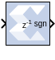

# Threshold

## Description

The Threshold block tests the sign of the input number. If the
input number is negative, the output of the block is -1; otherwise, the
output is 1. The output is a signed fixed-point integer that is 2 bits
long. The block has one input and one output.

## Parameters

Parameters used by this block are explained in the topic [Common Options
in Block Parameter Dialog
Boxes](../../GEN/common-options/README.md).

The block parameters do not control the output data type because the
output is always a signed fixed-point integer that is 2 bits long.

##  LogiCORE

The Threshold block does not use a LogiCORE™.
