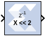

# Shift

The Xilinx Shift block performs a left or right shift on the input
signal. The result will have the same fixed-point container as that of
the input.

## Block Parameters

Parameters specific to the Shift block are:

- Shift direction: Specifies a direction, Left or Right. The Right shift
  moves the input toward the least significant bit within its container,
  with appropriate sign extension. Bits shifted out of the container are
  discarded. The Left shift moves the input toward the most significant
  bit within its container with zero padding of the least significant
  bits. Bits shifted out of the container are discarded.
- Number of bits: Specifies how many bits are shifted. If the number is
  negative, direction selected with Shift direction is reversed.

Other parameters used by this block are explained in the topic [Common
Options in Block Parameter Dialog
Boxes](common-options-in-block-parameter-dialog-boxes-aa1032308.html).

## Xilinx LogiCORE

The Shift block does not use a Xilinx LogiCORE™™.
