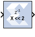

# Shift

## Description

The Shift block performs a left or right shift on the input
signal. The result will have the same fixed-point container as that of
the input.

## Parameters

Parameters specific to the Shift block are:

- Shift direction: Specifies a direction, Left or Right. The Right shift
  moves the input toward the least significant bit within its container,
  with appropriate sign extension. Bits shifted out of the container are
  discarded. The Left shift moves the input toward the most significant
  bit within its container with zero padding of the least significant
  bits. Bits shifted out of the container are discarded.
- Number of bits: Specifies how many bits are shifted. If the number is
  negative, direction selected with Shift direction is reversed.

Other parameters used by this block are explained in the topic [Common
Options in Block Parameter Dialog
Boxes](../../GEN/common-options/README.md).

<!--
#### Number of bits
Fixed-point numbers are stored in data types characterized by their word size as specified by Number of bits, Binary point, and Arithmetic type parameters. The maximum number of bits supported is 4096.
-->

<!--
#### Provide enable port
Selecting the Provide Enable Port option activates an optional enable (en) pin on the block. When the enable signal is not asserted the block holds its current state until the enable signal is asserted again or the reset signal is asserted. Reset signal has precedence over the enable signal. The enable signal has to run at a multiple of the block 's sample rate. The signal driving the enable port must be Boolean.
-->

<!--
#### Latency
Many elements in the Xilinx blockset have a latency option. This defines the number of sample periods by which the block's output is delayed. One sample period might correspond to multiple clock cycles in the corresponding FPGA implementation (for example, when the hardware is over-clocked with respect to the Simulink model). Model Composer does not perform extensive pipelining; additional latency is usually implemented as a shift register on the output of the block.
-->

<!--
#### Precision
The fundamental computational mode in the Xilinx blockset is arbitrary precision fixed-point arithmetic. Most blocks give you the option of choosing the precision, for example, the number of bits and binary point position.
-->

<!--
#### Output type
Specifies the data type of the output. Can be Boolean, Fixed-point, or Floating-point.
-->

<!--
#### Binary point
The binary point is the means by which fixed-point numbers are scaled. The Binary point parameter indicates the number of bits to the right of the binary point (for example, the size of the fraction) for the output port. The binary point position must be between zero and the specified number of bits.
-->

<!--
#### Quantization
Quantization errors occur when the number of fractional bits is insufficient to represent the fractional portion of a value. The options are to Truncate (for example, to discard bits to the right of the least significant representable bit), or to Round(unbiased: +/- inf) or Round (unbiased: even values).
-->

<!--
#### Overflow
Overflow errors occur when a value lies outside the representable range. For overflow the options are to Saturate to the largest positive/smallest negative value, to Wrap (for example, to discard bits to the left of the most significant representable bit), or to Flag as error (an overflow as a Simulink error) during simulation. Flag as error is a simulation only feature. The hardware generated is the same as when Wrap is selected.
-->

## LogiCORE

The Shift block does not use a LogiCORE™.

--------------
Copyright (C) 2026 Advanced Micro Devices, Inc.
All rights reserved.

SPDX-License-Identifier: MIT
