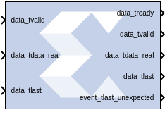
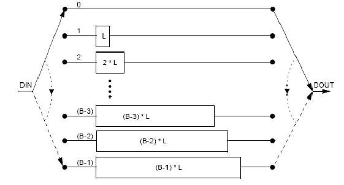
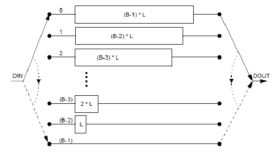
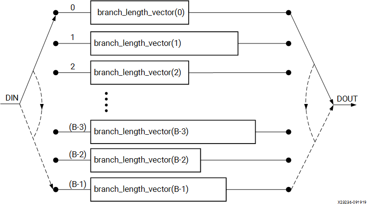

# Interleaver/De-interleaver 8.0

  

Note: This block goes into the FPGA fabric and is a Licensed Core.
Please visit the Xilinx web site to purchase the appropriate core
license.

## Description
The Interleaver Deinterleaver block implements an interleaver or
a deinterleaver using an AXI4-compliant block interface. An interleaver
is a device that rearranges the order of a sequence of input symbols.
The term symbol is used to describe a collection of bits. In some
applications, a symbol is a single bit. In others, a symbol is a bus.

The classic use of interleaving is to randomize the location of errors
introduced in signal transmission. Interleaving spreads a burst of
errors out so that error correction circuits have a better chance of
correcting the data.

If a particular interleaver is used at the transmit end of a channel,
the inverse of that interleaver must be used at the receive end to
recover the original data. The inverse interleaver is referred to as a
de-interleaver.

Two types of interleaver/de-interleavers can be generated with this
LogiCORE™: Forney Convolutional and Rectangular Block. Although they
both perform the general interleaving function of rearranging symbols,
the way in which the symbols are rearranged and their methods of
operation are entirely different. For very large interleavers, it might
be preferable to store the data symbols in external memory. The core
provides an option to store data symbols in internal FPGA RAM or in
external RAM.

### Forney Convolutional Operation

The figure below, shows the operation of a Forney Convolutional
Interleaver. The core operates as a series of delay line shift
registers. Input symbols are presented to the input commutator arm on
DIN. Output symbols are extracted from the output commutator arm on
DOUT. DIN and DOUT are fields in the AXI Data Input and Data Output
channels, respectively. Output symbols are extracted from the output
commutator arm on DOUT. Both commutator arms start at branch 0 and
advance to the next branch after the next rising clock edge. After the
last branch (B-1) has been reached, the commutator arms both rotate back
to branch 0 and the process is repeated.
  
  

In the figure above, the branches increase in length by a uniform
amount, L. The core allows interleavers to be specified in this way, or
the branch lengths can be passed in using a file, allowing each branch
to be any length.

Although branch 0 appears to be a zero-delay connection, there will
still be a delay of a number of clock cycles between DIN and DOUT
because of the fundamental latency of the core. For clarity, this is not
illustrated in the figure.

The only difference between an interleaver and a de-interleaver is that
branch 0 is the longest in the de-interleaver and the branch length is
decremented by L rather than incremented. Branch (B-1) has length 0.
This is illustrated in the figure below:

  
  

If a file is used to specify the branch lengths, as shown below, it is
arbitrary whether the resulting core is called an interleaver or
de-interleaver. All that matters is that one must be the inverse of the
other. If a file is used, each branch length is individually
controllable. This is illustrated in the figure below. For the file
syntax, please consult the LogiCORE product specification.

  
  

The reset pin (aresetn) sets the commutator arms to branch 0, but does
not clear the branches of data.

### Configuration Swapping

It is possible for the core to store a number of pre-defined
configurations. Each configuration can have a different number of
branches and branch length constant. It is even possible for each
configuration to have every individual branch length defined by file.

The configuration can be changed at any time by sending a new CONFIG_SEL
value on the AXI Control Channel. This value takes effect when the next
block starts. The core assumes all configurations are either for an
interleaver or de-interleaver, depending on what was selected in the
GUI. It is possible to switch between interleaving and de-interleaving
by defining the individual branch lengths for every branch of each
configuration. The details for each configuration are specified in a COE
file.

For details, please consult the Configuration Swapping section of the
Interleaver/De-Interleaver LogiCORE IP Product Guide
([PG049](https://www.xilinx.com/cgi-bin/docs/ipdoc?c=sid;v=latest;d=pg049-sid.pdf)).

### Rectangular Block Operation

The Rectangular Block Interleaver works by writing the input data
symbols into a rectangular memory array in a certain order and then
reading them out in a different, mixed-up order. The input symbols must
be grouped into blocks. Unlike the Convolutional Interleaver, where
symbols can be continuously input, the Rectangular Block Interleaver
inputs one block of symbols and then outputs that same block with the
symbols rearranged. No new inputs can be accepted while the interleaved
symbols from the previous block are being output.

The rectangular memory array is composed of a number of rows and columns
as shown in the following table.

| Row\Column |  0  |  1  | ... | (C-2) | (C-1) |
|:----------:|:---:|:---:|:---:|:-----:|:-----:|
|     0      |     |     |     |       |       |
|     1      |     |     |     |       |       |
|     ..     |     |     |     |       |       |
|   (R-2)    |     |     |     |       |       |
|   (R-1)    |     |     |     |       |       |

The Rectangular Block Interleaver operates as follows:

1.  All the input symbols in an entire block are written row-wise, left
    to right, starting with the top row.
2.  Inter-row permutations are performed if required.
3.  Inter-column permutations are performed if required.
4.  The entire block is read column-wise, top to bottom, starting with
    the left column.

The Rectangular Block De-interleaver operates in the reverse way:

1.  All the input symbols in an entire block are written column-wise,
    top to bottom, starting with the left column.
2.  Inter-row permutations are performed if required.
3.  Inter-column permutations are performed if required.
4.  The entire block is read row-wise, left to right, starting with the
    top row.

Refer to the Interleaver/De-Interleaver LogiCORE IP Product Guide
([PG049](https://docs.xilinx.com/access/sources/ud/document?isLatest=true&url=pg049-sid&ft:locale=en-US))
for examples and more detailed information on the Rectangular Block
Interleaver.

### AXI Interface

The AXI SID v7.1 has the following interfaces:

- A non AXI-channel interface for ACLK, ACLKEN and ARESETn

- A non AXI-channel interface for external memory (if enabled)

- A non AXI-channel interface for miscellaneous events
  - event_tlast_unexpected
  - event_tlast_missing (available only in Rectangular mode)
  - event_halted (optional, available when Master channel TREADY is
    enabled)
  - event_col_valid (optional)
  - event_col_sel_valid (optional)
  - event_row_valid (optional)
  - event_row_sel_valid (optional)
  - event_block_size_valid (optional)

- An AXI slave channel to receive configuration information
  (s_axis_ctrl) consisting of:

  - s_axis_ctrl_tvalid
  - s_axis_ctrl_tready
  - s_axis_ctrl_tdata

  The control channel is only enabled when the core is configured in
  such a way to require it.

- An AXI slave channel to receive the data to be interleaved
  (s_axis_data) consisting of:
  - s_axis_data_tvalid (This is the equivalent of ND pin of SID v6.0
    block; No longer optional)
  - s_axis_data_tready
  - s_axis_data_tdata
  - s_axis_data_tlast

- An AXI master channel to send the data that has been interleaved
  (m_axis_data) consisting of:
  - m_axis_data_tvalid
  - m_axis_data_tready
  - m_axis_data_tdata
  - m_axis_data_tuser
  - m_axis_data_tlast

### AXI Ports that are Unique to this Block

This HDL block exposes the AXI Control and Data channels as a group of
separate ports based on the following sub-field names.

Note: Refer to the document [LogiCORE IP Interleaver/De-interleaver
v8.0](https://docs.xilinx.com/access/sources/ud/document?isLatest=true&url=pg049-sid&ft:locale=en-US)
for an explanation of the bits in the specified sub-field name.

### Control Channel Input Signals  
#### s_axis_ctrl_tdata_config_sel  
A sub-field port that represents the CONFIG_SEL field in the Control
Channel vector. Available when in Forney mode and Number of
configurations is greater than one.

#### s_axis_ctrl_tdata_row  
A sub-field port that represents the ROW field in the Control Channel
vector. Available when in Rectangular mode and Row type is Variable.

#### s_axis_ctrl_tdata_row_sel  
A sub-field port that represents the ROW_SEL field in the Control
Channel vector. Available when in Rectangular mode and Row type is
Selectable.

#### s_axis_ctrl_tdata_col  
A sub-field port that represents the COL field in the Control Channel
vector. Available when in Rectangular mode and Column type is Variable.

#### s_axis_ctrl_tdata_col_sel  
A sub-field port that represents the COL_SEL field in the Control
Channel vector. Available when in Rectangular mode and Column type is
Selectable.

#### s_axis_ctrl_tdata_block_size  
A sub-field port that represents the COL field in the Control Channel
vector. Available when in Rectangular mode and Block Size type is
Variable.

### DATA Channel Input Signals  
s_axis_data_tdata_din  
Represents the DIN field of the Input Data Channel.

#### DATA Channel Output Signals  
m_axis_data_tdata_dout  
Represents the DOUT field of the Output Data Channel.

#### TUSER Channel Output Signals  
m_axis_data_tuser_fdo  
Represents the FDO field of the Output TUSER Channel. Available when in
Forney mode and Optional FDO pin has been selected on the GUI.

#### m_axis_data_tuser_rdy  
Represents the RDY field of the Output TUSER Channel. Available when in
Forney mode and Optional RDY pin has been selected on the GUI.

#### m_axis_data_tuser_block_start  
Represents the BLOCK_START field of the Output TUSER Channel. Available
when in Rectangular mode and Optional BLOCK_START pin has been selected
on the GUI.

#### m_axis_data_tuser_block_end  
Represents the BLOCK_END field of the Output TUSER Channel. Available
when in Rectangular mode and Optional BLOCK_END pin has been selected on
the GUI.

## Parameters

### Basic tab  
Parameters specific to the Basic Parameters tab are as follows.

#### Memory Style  
Select Distributed if all the Block Memories are required elsewhere in
the design; select Block to use Block Memory where ever possible; select
Automatic and let Model Composer use the most appropriate style of
memory for each case, based on the required memory depth.

#### Symbol Width  
This is the number of bits in the symbols to be processed.

#### Type  
Select Forney Convolutional or Rectangular Block.

#### Mode  
Select Interleaver or Deinterleaver

#### Symbol memory  
Specifies whether or not the data symbols are stored in Internal FPGA
RAM or in External RAM.

### Forney tab  
Parameters specific to the Forney Parameters tab are as follows.

#### Dimensions  
##### Number of branches  
1 to 256 (inclusive)

#### Architecture  
##### ROM-based  
Look-up table ROMs are used to compute some of the internal results in
the block.

##### Logic-based  
Logic circuits are used to compute some of the internal results in the
block.

Which option is best depends on the other core parameters. You should
try both options to determine the best results. This parameter has no
effect on the block behavior.

#### Configurations  
##### Number of configurations  
If greater than 1, the block is generated with CONFIG_SEL and NEW_CONFIG
inputs. The parameters for each configuration are defined in a COE file.
The number of parameters defined must exactly match the number of
configurations specified.

#### Length of Branches  
Branch length descriptions for Forney SID.

##### constant_difference_between_consecutive_branches  
Specified by the Value parameter.

##### use_coe_file_to_define_branch_lengths  
Location of file is specified by the COE File parameter.

##### coe_file_defines_individual_branch_lengths_for_every_branch_in_each_configuration  
Location of file is specified by the COE File parameter.

##### coe_file_defines_branch_length_constant_for_each_configuration  
Location of file is specified by the COE File parameter.

##### Value  
1 to MAX (inclusive). MAX depends on the number of branches and size of
block input. Branch length must be an array of either length one or
number of branches. If the array size is one, the value is used as a
constant difference between consecutive branches. Otherwise, each branch
has a unique length.

##### COE File  
The branch lengths are specified from a file

### Rectangular Parameters \#1 Tab  
Parameters specific to the Rectangular Parameters \#1 tab are as
follows.

#### Number of Rows  
##### Value  
This parameter is relevant only when the Constant row type is selected.
The number of rows is fixed at this value.

#### Row Port Width  
This parameter is relevant only when the Variable row type is selected.
It sets the width of the ROW input bus. The smallest possible value
should be used to keep the underlying LogiCORE as small as possible.

##### Minimum Number of Rows  
This parameter is relevant only when the Variable row type is selected.
In this case, the core has to potentially cope with a wide range of
possible values for the number of rows. If the smallest value that will
actually occur is known, then the amount of logic in the LogiCORE can
sometimes be reduced. The largest possible value should be used for this
parameter to keep the core as small as possible.

##### Number of Values  
This parameter is relevant only when you select the Selectable row type.
This parameter defines how many valid selection values have been defined
in the COE file. You should only add the number of select values you
need.

##### Row Type  
###### Constant  
The number of rows is always equal to the Row Constant Value parameter.

###### Variable  
The number of rows is sampled from the ROW input at the start of each
new block. Row permutations are not supported for the variable row type.

###### Selectable  
ROW_SEL is sampled at the start of each new block. This value is then
used to select from one of the possible values for the number of rows
provided in the COE file.

#### Number of Columns  
##### Value  
This parameter is relevant only when you select the Constant column type
is selected. The number of columns is fixed at this value.

##### COL Port Width  
This parameter is relevant only when you select the Variable column
type. It sets the width of the COL input bus. The smallest possible
value should be used to keep the underlying LogiCORE™ as small as
possible.

##### Minimum Number of Columns  
This parameter is relevant only when you select the Variable column type
is selected. In this case, the core has to potentially cope with a wide
range of possible values for the number of columns. If the smallest
value that will actually occur is known, then the amount of logic in the
LogiCORE can sometimes be reduced. The largest possible value should be
used for this parameter to keep the core as small as possible.

##### Number of Values  
This parameter is relevant only when you select the Selectable column
type. This parameter defines how many valid selection values have been
defined in the COE file. You should only add the number of select values
you need.

##### Column Type  
###### Constant  
The number of columns is always equal to the Column Constant Value
parameter.

###### Variable  
The number of columns is sampled from the `COL` input at the start of
each new block. Column permutations are not supported for the variable
column type.

###### Selectable  
COL_SEL is sampled at the start of each new block. This value is then
used to select from one of the possible values for the number of columns
provided in the COE file.

### Rectangular Parameters \#2 Tab  
Parameters specific to the Rectangular Parameters \#2 tab are as
follows.

#### Permutations Configuration  
##### Row permutations  
###### None  
This tells Model Composer that row permutations are not to be performed.

###### Use COE file  
This tells Model Composer that a row permute vector exists in the COE
file, and that row permutations are to be performed. Remember this is
possible only for un-pruned interleaver/deinterleavers.

##### Column permutations  
###### None  
This tells Model Composer that column permutations are not to be
performed

###### Use COE file  
This tells Model Composer that a column permute vector exists in the
`COE` file, and that column permutations are to be performed. Remember
this is possible only for un-pruned interleaver/deinterleavers.

##### COE File  
Specify the pathname to the `COE` file.

#### Block Size  
##### Value  
This parameter is relevant only when you select the Constant block size
type. The block size is fixed at this value.

##### BLOCK_SIZE Port Width  
This parameter is relevant only if the Variable block size type is
selected. It sets the width of the BLOCK_SIZE input bus. The smallest
possible value should be used to keep the core as small as possible.

##### Block Size Type  
###### Constant  
The block size never changes. The block can be pruned (block size \< row
\* col). The block size must be chosen so that the last symbol is on the
last row. An un-pruned interleaver will use a smaller quantity of FPGA
resources than a pruned one, so pruning should be used only if
necessary.

###### Rows\*Columns  
If the number of rows and columns is constant, selecting this option has
the same effect as setting the block size type to constant and entering
a value of rows \* columns for the block size.

If the number of rows or columns is not constant, selecting this option
means the core will calculate the block size automatically whenever a
new row or column value is sampled. Pruning is impossible with this
block size type.

###### Variable  
Block size is sampled from the BLOCK_SIZE input at the beginning of
every block. The value sampled on BLOCK_SIZE must be such that the last
symbol falls on the last row, as previously described.

If the block size is already available external to the core, selecting
this option is usually more efficient than selecting “rows \* columns”
for the block size type. Row and column permutations are not supported
for the Variable block size type.

### Port Parameters \#1 tab  
Parameters specific to the Port Parameters tab are as follows.

#### Control Signals  
##### ACLKEN  
When ACLKEN is de-asserted (Low), all the synchronous inputs are ignored
and the block remains in its current state.

##### ARESETn (Active-Low)  
The Active-Low synchronous clear input always takes priority over
ACLKEN.

#### Status Signals  
##### COL_VALID  
This optional output is available when a variable number of columns is
selected. If an illegal value is sampled on the `s_axis_ctrl_tdata_col`
input, `event_col_valid` will go Low a predefined number of clock cycles
later.

##### COL_SEL_VALID  
This optional output (`event_col_sel_valid`) is available when a
selectable number of columns is chosen. The event pins are
`event_col_valid`, `event_col_sel_valid`, `event_row_valid`,
`event_row_sel_valid`, `event_block_size_valid` (in the same order as in
the options on the GUI).

##### ROW_VALID  
This optional output is available when a selectable number of rows is
chosen.

##### ROW_SEL_VALID  
This optional output is available when a selectable number of rows is
chosen.

##### BLOCK_SIZE_VALID  
This optional output is available when the block size is not constant,
that is, if the block size type is either Variable or equal to Rows \*
Columns.

### Port Parameters \#2 tab  
Parameters specific to the Port Parameters \#2 tab are as follows.

#### Data Output Channel Options  
##### TREADY  
TREADY for the Data Input Channel. Used by the Symbol
Interleaver/De-interleaver to signal that it is ready to accept data.

##### FDO  
Adds a data_tuser_fdo (First Data Out) output port.

##### RDY  
Adds a data_tuser_rdy output port.

##### BLOCK_START  
Adds a data_tuser_block_start output port.

##### BLOCK_END  
Adds a data_tuser_block_end output port.

#### Pipelining  
##### Pipelining  
Pipelines the underlying LogiCORE for Minimum, Medium, or Maximum
performance.

Other parameters used by this block are explained in the topic [Common
Options in Block Parameter Dialog
Boxes](../../GEN/common-options/README.md).

## LogiCORE™ Documentation

[LogiCORE IP Interleaver/De-interleaver
v8.0](https://docs.xilinx.com/access/sources/ud/document?isLatest=true&url=pg049-sid&ft:locale=en-US)

--------------
Copyright (C) 2024 Advanced Micro Devices, Inc.
All rights reserved.
