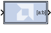
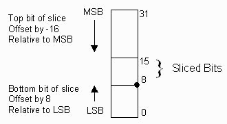

# Vector Slice

The Vector Slice block supports vector type inputs.

Extracts a given range of bits from each sample of input vector and
presents it at the output. The output type is ordinarily unsigned with
binary point at zero, but can be Boolean when the slice is one bit wide.

Hardware notes: In hardware this block costs nothing.

## Description

Super Sample Rate (SSR): This configurable GUI parameter is primarily
used to control processing of multiple data samples on every sample
period. This block enables 1-D vector support for the primary block
operation.

The Vector Slice block allows you to slice off a sequence of bits from
your input data and create a new data value. This value is presented as
the output from the block. The output data type is unsigned with its
binary point at zero.

The block provides several mechanisms by which the sequence of bits can
be specified. If the input type is known at the time of
parameterization, the various mechanisms do not offer any gain in
functionality. If, however, a Vector Slice block is used in a design
where the input data width, or binary point position are subject to
change, the variety of mechanisms becomes useful. The block can be
configured, for example, always to extract only the top bit of the
input, or only the integral bits, or only the first three fractional
bits. The following diagram illustrates how to extract all but the top
16 and bottom 8 bits of the input.

Figure: Extracting Top 16 and Bottom 8 Bits

  
  

## Block Parameters

Open the Block Parameters dialog box by double-clicking the icon in your
Simulink® model.

Parameters specific to the block are as follows.

Width of slice (Number of bits)  
Specifies the number of bits to extract.

Boolean output  
Tells whether single bit slices should be type Boolean.

Specify range as  
(Two bit locations \| Upper bit location + width \|Lower bit location +
width). Allows you to specify either the bit locations of both
end-points of the slice, or one end-point along with number of bits to
be taken in the slice.

Offset of top bit  
Specifies the offset for the ending bit position from the LSB, MSBm. or
binary point.

Offset of bottom bit  
Specifies the offset for the ending bit position from the LSB, MSBm, or
binary point.

Relative to  
Specifies the bit slice position relative to the MSB, LSB, or binary
point of the top or the bottom of the slice.

Other parameters used by this block are explained in the topic [Common
Options in Block Parameter Dialog
Boxes](common-options-in-block-parameter-dialog-boxes-aa1032308.html).
