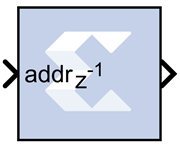

# ROM

The Xilinx ROM block is a single port read-only memory (ROM).

Values are stored by word and all words have the same arithmetic type,
width, and binary point position. Each word is associated with exactly
one address. An address can be any unsigned fixed-point integer from 0
to d-1, where d denotes the ROM depth (number of words). The memory
contents are specified through a block parameter. The block has one
input port for the memory address and one output port for data out. The
address port must be an unsigned fixed-point integer. The block has two
possible Xilinx LogiCORE™™ implementations, using either distributed or
block memory.

## Block Parameters

The Block Parameters dialog box can be invoked by double-clicking the
icon in your Simulink® model.

Basic tab  
Parameters specific to the Basic tab are as follows.
Depth  
Specifies the number of words stored; must be a positive integer.

Initial value vector  
Specifies the initial value. When the vector is longer than the ROM
depth, the vector's trailing elements are discarded. When the ROM is
deeper than the vector length, the ROM's trailing words are set to zero.
The initial value vector is saturated or rounded according to the data
precision specified for the ROM.

Memory Type  
Specifies whether the ROM will be implemented using Distributed ROM or
Block ROM. Depending on your selection, the ROM will be inferred or
implemented as follows when the design is compiled:

- If the block will be implemented in Distributed memory, the
  Distributed Memory Generator v8.0 LogiCORE IP will be inferred or
  implemented when the design is compiled. This is described in
  Distributed Memory Generator LogiCORE IP Product Guide
  ([PG063](https://www.xilinx.com/cgi-bin/docs/ipdoc?c=dist_mem_gen;v=latest;d=pg063-dist-mem-gen.pdf)).
- If the block will be implemented in block RAM, the XPM_MEMORY_SPROM
  (Single Port ROM) macro will be inferred or implemented when the
  design is compiled. For information on the XPM_MEMORY_SPROM Xilinx
  Parameterized Macro (XPM), refer to UltraScale Architecture Libraries
  Guide
  ([UG974](https://docs.xilinx.com/access/sources/dita/map?Doc_Version=2022.2%20English&url=ug974-vivado-ultrascale-libraries)).

Optional Ports  
Provide reset port for output register  
When selected, allows access to the reset port available on the output
register of the Block ROM. The reset port is available only when the
latency of the Block ROM is set to 1.

Initial value for output register  
Specifies the initial value for output register. The initial value is
saturated and rounded according to the data precision specified for the
ROM.

&nbsp;

Output tab  
Parameters specific to the Output tab are as follows.

Output Type  
Specify the data type of the output.

- Boolean
- Fixed-point
- Floating-point

Arithmetic Type  
If the Output Type is specified as Fixed-point, you can select Signed
(2’s comp) or Unsigned as the Arithmetic Type.

Fixed-point Precision  
Number of bits  
Specifies the bit location of the binary point of the output number,
where bit zero is the least significant bit.

Binary point  
Position of the binary point. in the fixed-point output.

Floating-point Precision  
Single  
Specifies single precision (32 bits).

Double  
Specifies double precision (64 bits).

Custom  
Activates the field below so you can specify the Exponent width and the
Fraction width.

Exponent width  
Specify the exponent width.

Fraction width  
Specify the fraction width.

Other parameters used by this block are explained in the topic [Common
Options in Block Parameter Dialog
Boxes](common-options-in-block-parameter-dialog-boxes-aa1032308.html).

## LogiCORE™ Documentation

Distributed Memory Generator LogiCORE IP Product Guide
([PG063](https://www.xilinx.com/cgi-bin/docs/ipdoc?c=dist_mem_gen;v=latest;d=pg063-dist-mem-gen.pdf))

UltraScale Architecture Memory Resources User Guide
([UG573](https://www.xilinx.com/cgi-bin/docs/ndoc?t=user_guides;d=ug573-ultrascale-memory-resources.pdf)) -
XPM_MEMORY_SPROM Macro (UltraRAM)

For the block memory, the address width must be equal to ceil(log2(d))
where d denotes the memory depth. The maximum width of data words in the
block memory depends on the depth specified; the maximum depth is
depends on the device family targeted. The tables below provide the
maximum data word width for a given block memory depth.
