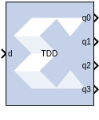
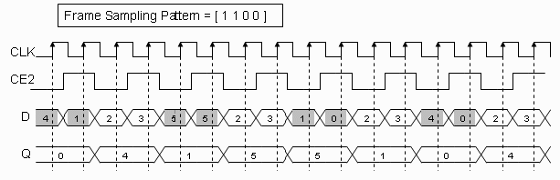

# Time Division Demultiplexer

The Time Division Demultiplexer block accepts input serially and
presents it to multiple outputs at a slower rate.

## Description
### Block Interface

The block has one data input port and a user-configurable number of data
outputs, ranging from 1 to 32. The data output ports have the same
arithmetic type and precision as the input data port. The time division
demultiplexer block also has optional input-valid port (vin) and
output-valid port (vout). Both the valid ports are of type Bool.

For single channel implementation, the time division demultiplexer block
has one data input and output port. Optional data valid input and output
ports are also allowed. The length of the frame sampling pattern
establishes the length of the input data frame. The position of 1
indicates the input value to be downsampled and the number of 1's
correspond to the downsampling factor. The behavior of the demultiplexer
block in single channel mode can best be illustrated with the help of
the figure below. Based on the frame sampling pattern entered, the first
and second input values of every input data frame are sampled and
presented to the output at the rate of 2.

  

For single channel implementation, the number of values to be sampled
from a data frame should evenly divide the size of the input frame.
Every input data frame value can also be qualified by using the optional
valid port.

## Parameters

Parameters specific to this block are as follows.

#### Frame sampling pattern  
Specifies the size of the serial input data frame. The frame sampling
pattern must be a MATLAB® vector containing only 1's and 0's.

#### Implementation  
Specifies the demultiplexer behavior to be either in single or multiple
channel mode. The behaviors of these modes are explained above.

#### Provide Valid Port  
When selected, the demultiplexer has optional input and output valid
ports (vin / vout). The vin port allows to qualify every input data
value as part of the serial input data frame. The vout port marks the
state of the output ports as valid or not.

Parameters used by this block are explained in the topic [Common Options
in Block Parameter Dialog
Boxes](../../GEN/common-options/README.md).

--------------
Copyright (C) 2023 Advanced Micro Devices, Inc. All rights reserved.
SPDX-License-Identifier: MIT
