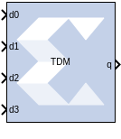

# Time Division Multiplexer

The Xilinx Time Division Multiplexer block multiplexes values presented
at input ports into a single faster rate output stream.

## Block Interface

The block has two to 32 input ports and one output port. All input ports
must have the same arithmetic type, precision, and rate. The output port
has the same arithmetic type and precision as the inputs. The block has
optional ports vin and vout that specify when input and output
respectively are valid. Both valid ports are of type Bool.

## Block Parameters

The block parameters dialog box can be invoked by double-clicking the
icon in your Simulink® model.

Parameters specific to the block are as follows.

Number of inputs  
Specifies the number of inputs (2 to 32).

Provide valid port  
When selected, the multiplexer is augmented with input and output valid
ports named vin and vout respectively. When the vin port indicates that
input values are invalid, the vout port indicates the corresponding
output frame is invalid.

Optimization Parameter  
The Time Division Multiplexer block logic can be implemented in fabric
(optimizing for resource usage) or in DSP48E1/DSP48E2 primitives
(optimizing for speed). The default is Resource.

Resource  
Use combinatorial fabric (general interconnect) to implement the Time
Division Multiplexer in the Xilinx device.

Speed  
Use DSP48 primitives to implement the Time Division Multiplexer in the
Xilinx device.

Parameters used by this block are explained in the topic [Common Options
in Block Parameter Dialog
Boxes](common-options-in-block-parameter-dialog-boxes-aa1032308.html).
