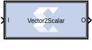

# Vector2Scalar

The Vector2Scalar block converts vector type input to scalar type
output.

## Description

The Vector2Scalar block does the bit level concatenation of all the
elements of the input vector to produce a scalar output.

For example, if the input vector is \[0 1 2 7\] of type Ufix_3_0, and
the SSR parameter is 4, it produces Scalar output 3720 of type
Ufix_12_0, whose binary value is 111 010 001 000. This value
represents input vector when you split it into four groups each of 3
bits.

### Data Type Support

- The inputs must be Boolean or unsigned fixed-point signal.
- All inputs must have binary set to 0.

## Parameters

#### Super Sample Rate (SSR)
This configurable GUI parameter is primarily
used to control processing of multiple data samples on every sample
period. This block enables 1-D vector support for the primary block
operation.
